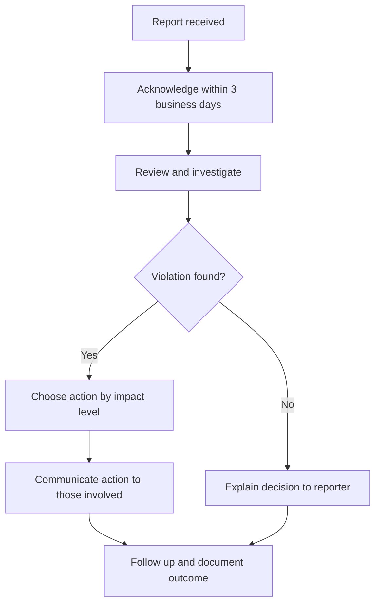

# Code of Conduct

This Code of Conduct defines the standards of behavior we expect from everyone who participates in the vsclaude community. It exists so that contributors, users, and maintainers can collaborate on a cozy, beautiful, purpose-built IDE without fear of harassment, exclusion, or hostility. The document is adapted from the [Contributor Covenant](https://www.contributor-covenant.org), version 2.1, with additions that reflect our specific values: vsclaude is built to be **cozy, inclusive, and accessible**, and our community should feel the same way.

## Table of Contents

- [Our Pledge](#our-pledge)
- [Our Values](#our-values)
- [Our Standards](#our-standards)
- [Scope](#scope)
- [Enforcement Responsibilities](#enforcement-responsibilities)
- [Reporting](#reporting)
- [What Happens After You Report](#what-happens-after-you-report)
- [Enforcement Guidelines](#enforcement-guidelines)
- [Accessibility Commitment](#accessibility-commitment)
- [Appeals](#appeals)
- [Privacy and Confidentiality](#privacy-and-confidentiality)
- [Attribution](#attribution)

## Our Pledge

We as members, contributors, and leaders pledge to make participation in the vsclaude community a harassment-free experience for everyone, regardless of age, body size, visible or invisible disability, ethnicity, sex characteristics, gender identity and expression, level of experience, education, socioeconomic status, nationality, personal appearance, race, caste, color, religion, or sexual identity and orientation.

We pledge to act and interact in ways that contribute to an open, welcoming, diverse, inclusive, and healthy community.

## Our Values

vsclaude is a project about making the invisible visible: a developer watches their AI agent work through living pixel-art animation instead of scrolling walls of text. The same spirit guides how we treat each other. Three product pillars carry over directly into community conduct.

| Value | What it means for the product | What it means for the community |
| --- | --- | --- |
| **Cozy** | The IDE feels warm, alive, and unintimidating. | We assume good faith, welcome newcomers, and keep discussions kind even when we disagree on technical direction. |
| **Inclusive** | Anyone can bring their own key and any model, technical or not. | We make room for contributors of every background and experience level. A first pull request is as valued as a thousandth. |
| **Accessible** | A non-technical person can follow along through plain-language captions. | We communicate clearly, avoid unnecessary jargon, and accommodate access needs in our tools, docs, and conversations. |

These are not decorative slogans. Just as every animation in vsclaude is bound to a real event, every value here is bound to real behavior we expect and enforce.

## Our Standards

Examples of behavior that contributes to a positive environment for our community include:

- Demonstrating empathy and kindness toward other people.
- Being respectful of differing opinions, viewpoints, and experiences.
- Giving and gracefully accepting constructive feedback.
- Accepting responsibility and apologizing to those affected by our mistakes, and learning from the experience.
- Focusing on what is best not just for us as individuals, but for the overall community.
- Using welcoming and inclusive language.
- Helping newcomers find their footing, whether they are filing a first issue, asking a question, or proposing a first design.
- Writing documentation, captions, and error messages that a non-technical person can understand.

Examples of unacceptable behavior include:

- The use of sexualized language or imagery, and sexual attention or advances of any kind.
- Trolling, insulting or derogatory comments, and personal or political attacks.
- Public or private harassment.
- Publishing others' private information, such as a physical or email address, without their explicit permission.
- Dismissing or belittling contributors because of their experience level, the model or provider they use, or the platform they build on.
- Sustained disruption of discussions, issues, pull requests, or community spaces.
- Other conduct which could reasonably be considered inappropriate in a professional setting.

## Scope

This Code of Conduct applies within all community spaces, and also applies when an individual is officially representing the community in public spaces. Examples of representing our community include:

- Using an official email address.
- Posting via an official social media account.
- Acting as an appointed representative at an online or offline event.

Community spaces include, but are not limited to:

| Space | Examples |
| --- | --- |
| Code collaboration | GitHub issues, pull requests, discussions, and code review comments |
| Real-time chat | Any official Discord, Matrix, or Slack the project operates |
| Events | Conference talks, meetups, and workshops where vsclaude is represented |
| Public channels | Social media accounts and blog posts published under the project name |

## Enforcement Responsibilities

Community leaders are responsible for clarifying and enforcing our standards of acceptable behavior and will take appropriate and fair corrective action in response to any behavior that they deem inappropriate, threatening, offensive, or harmful.

Community leaders have the right and responsibility to remove, edit, or reject comments, commits, code, wiki edits, issues, and other contributions that are not aligned to this Code of Conduct, and will communicate reasons for moderation decisions when appropriate.

## Reporting

If you experience or witness unacceptable behavior, or have any other concerns, please report it to the community leaders responsible for enforcement.

> **Enforcement contact:** open a [GitHub private security advisory](https://github.com/AnwarDebes/vsclaude/security/advisories/new) (it is private end to end and reaches the maintainer), or use GitHub's **Report content** on the offending item. A dedicated moderation address will be added once a project domain is provisioned.

When you file a report, including the following details helps us act quickly and fairly. None of these are required, and you should share only what you are comfortable sharing.

```text
Reporter:        (your name or handle, or "anonymous")
Date and time:   (when the incident happened, with time zone if known)
Where:           (GitHub issue link, chat channel, event, etc.)
People involved: (handles or names, if known)
What happened:   (a factual description; quote messages where possible)
Evidence:        (links, screenshots, logs)
Impact:          (how it affected you or others)
Desired outcome: (optional; what resolution you are hoping for)
```

All complaints will be reviewed and investigated promptly and fairly. All community leaders are obligated to respect the privacy and security of the reporter of any incident. We aim to acknowledge every report within **three business days**.

## What Happens After You Report

We want the process to feel predictable and safe. Here is the path a report follows.



Throughout this process, the reporter's identity is kept confidential to the extent possible. We will never share who made a report with the person being reported without the reporter's explicit consent.

## Enforcement Guidelines

Community leaders will follow these Community Impact Guidelines in determining the consequences for any action they deem in violation of this Code of Conduct.

### 1. Correction

**Community Impact:** Use of inappropriate language or other behavior deemed unprofessional or unwelcome in the community.

**Consequence:** A private, written warning from community leaders, providing clarity around the nature of the violation and an explanation of why the behavior was inappropriate. A public apology may be requested.

### 2. Warning

**Community Impact:** A violation through a single incident or series of actions.

**Consequence:** A warning with consequences for continued behavior. No interaction with the people involved, including unsolicited interaction with those enforcing the Code of Conduct, for a specified period of time. This includes avoiding interactions in community spaces as well as external channels like social media. Violating these terms may lead to a temporary or permanent ban.

### 3. Temporary Ban

**Community Impact:** A serious violation of community standards, including sustained inappropriate behavior.

**Consequence:** A temporary ban from any sort of interaction or public communication with the community for a specified period of time. No public or private interaction with the people involved, including unsolicited interaction with those enforcing the Code of Conduct, is allowed during this period. Violating these terms may lead to a permanent ban.

### 4. Permanent Ban

**Community Impact:** Demonstrating a pattern of violation of community standards, including sustained inappropriate behavior, harassment of an individual, or aggression toward or disparagement of classes of individuals.

**Consequence:** A permanent ban from any sort of public interaction within the community.

### Summary Table

| Level | Trigger | Typical consequence |
| --- | --- | --- |
| 1. Correction | Minor, usually unintentional | Private written warning |
| 2. Warning | Single or repeated violation | Warning plus a no-contact period |
| 3. Temporary Ban | Serious or sustained violation | Time-limited ban from all spaces |
| 4. Permanent Ban | Pattern of violations or harassment | Permanent removal from the community |

Community leaders apply judgment. The table above describes typical outcomes, not a rigid formula. Severe behavior may move directly to a higher level.

## Accessibility Commitment

Accessibility is one of vsclaude's product pillars, and we hold the community to the same standard. When you participate, please help keep our shared spaces usable by everyone.

- **Describe images.** Add alt text to screenshots in issues and pull requests, and describe Pixie animations or recordings in words so people who cannot see them can follow along.
- **Avoid color-only meaning.** Do not rely on color alone to convey state in diagrams, screenshots, or comments. Pair it with text or shape.
- **Write captions and labels in plain language.** Mirror the product rule that a non-technical person should be able to follow along.
- **Respect access needs.** If a contributor requests an accommodation, such as transcripts for a video call or extra time on a review, work with them in good faith.
- **Report accessibility barriers.** Barriers in our docs, tooling, or community spaces can be reported the same way as any other concern, and we treat them seriously.

If meeting any of these guidelines is a barrier for you, that is not a violation. Tell us and we will help.

## Appeals

If you believe an enforcement decision was made in error, or that the consequence does not fit the situation, you may appeal.

1. Send an appeal to the enforcement contact within **30 days** of the decision.
2. Include the original report or decision reference, and explain why you believe the outcome should change.
3. Where possible, an appeal is reviewed by a community leader who was not involved in the original decision, to keep the review fair.
4. The appeal decision is communicated in writing, and that decision is final.

## Privacy and Confidentiality

We treat reports and the data they contain with care.

- Reports are shared only with the community leaders who need them to investigate and respond.
- We retain enforcement records only as long as needed to maintain consistency and protect the community.
- We do not publish the identities of reporters or the details of private reports.
- If we publish any statement about an incident, we do so in a way that does not expose private information.

## Attribution

This Code of Conduct is adapted from the [Contributor Covenant](https://www.contributor-covenant.org), version 2.1, available at [https://www.contributor-covenant.org/version/2/1/code_of_conduct.html](https://www.contributor-covenant.org/version/2/1/code_of_conduct.html).

Community Impact Guidelines were inspired by [Mozilla's code of conduct enforcement ladder](https://github.com/mozilla/diversity).

For answers to common questions about this Code of Conduct, see the FAQ at [https://www.contributor-covenant.org/faq](https://www.contributor-covenant.org/faq). Translations are available at [https://www.contributor-covenant.org/translations](https://www.contributor-covenant.org/translations).

The values, accessibility commitment, reporting workflow, appeals process, and privacy section are additions specific to the vsclaude project. They reflect our pledge to keep this community cozy, inclusive, and accessible, the same way we build the product.
