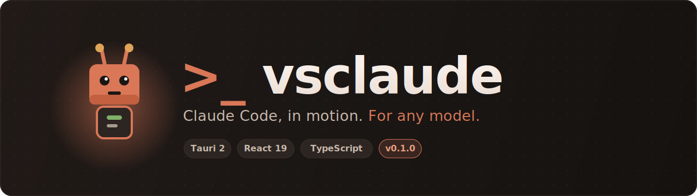

<div align="center">



<h1>vsclaude</h1>

<strong>Claude Code, in motion. For any model.</strong>

<p>A cozy, beautiful IDE where you <em>watch</em> your AI coding agent work through living pixel-art animation, instead of scrolling walls of text.</p>

<p>
  
  
  
  
  
</p>

<p>
  <a href="#the-soul-claude-code-in-motion">The soul</a>
  &nbsp;&middot;&nbsp;
  <a href="#meet-pixie">Meet Pixie</a>
  &nbsp;&middot;&nbsp;
  <a href="#the-swarm-view">Swarm view</a>
  &nbsp;&middot;&nbsp;
  <a href="#quickstart">Quickstart</a>
  &nbsp;&middot;&nbsp;
  <a href="#architecture">Architecture</a>
  &nbsp;&middot;&nbsp;
  <a href="./specs">Specs</a>
</p>

</div>

---

## What is vsclaude

Using an AI agent today means reading a fast-scrolling transcript of tool calls
and diffs. It is powerful, but illegible. You cannot tell at a glance whether the
agent is thinking, searching, writing, stuck, or done. A person who does not code
has no chance.

vsclaude replaces the wall of text with a truthful visual language. The agent's
real activity is captured as a stream of normalized events. Those events drive
**Pixie**, an animated pixel-art companion who performs the work: reading, typing,
searching, debugging, building, celebrating, getting puzzled. Around Pixie,
lightweight visualizations show the meaningful detail (which file, which query,
which command) without forcing anyone to read raw logs.

It runs **Claude Code** as a first-class citizen today, with **Codex**, **Gemini**,
and **local models** designed to plug into the same unified experience through one
normalized event pipeline. Bring your own key.

## The soul: "Claude Code in motion"

Three rules govern the motion layer. They are sacred:

1. **Every animation is bound to a real event.** Nothing is decorative theater.
   If Pixie is typing, the agent is writing a file, and you can see which one.
2. **Meaning is always preserved and always recoverable.** One click always drills
   into the exact underlying detail: the tool name, the inputs, the diff, the
   command, the raw output. We make the truth beautiful, we never hide it.
3. **A non-technical person must be able to follow along.** Plain-language captions
   ("Pixie is reading 12 files to understand your project") accompany the motion.

The clean idea that makes all of this possible: **every provider is normalized
into a single `AgentEvent` stream, and everything visual consumes only
`AgentEvent`.** Swap the provider, the whole experience just works.

```ts
import { createAgentEvent, EVENT_TO_STATE } from '@vsclaude/contracts';

const event = createAgentEvent({
  id: 'evt-1',
  sessionId: 's-1',
  agentId: 'root',
  ts: Date.now(),
  type: 'file_edit',
  provider: 'claude-code',
  payload: { path: 'src/auth/login.ts', additions: 12, deletions: 3 },
  caption: 'Writing the login form.',
});

EVENT_TO_STATE[event.type]; // 'typing'  ->  Pixie starts typing
```

## Meet Pixie

Pixie is a small pixel-art companion: a friendly boxy robot with antennae and warm
eyes, rendered in soft terracotta-on-charcoal pixels. Pixie is expressive, never
annoying, always honest. Each state traces back to a real event.

| Pixie is | when the agent | caption |
| --- | --- | --- |
| reading | reads a file | "Reading auth.ts." |
| typing | writes or edits a file | "Writing the login form." |
| searching | runs a search | "Searching for 'useAuth'." |
| running | runs a command | "Running the tests." |
| spawning | delegates to a sub-agent | "Calling in a helper for tests." |
| waiting | needs your permission | "Need your OK to run this." |
| success | finishes cleanly | "Done! All tests pass." |
| confused | hits an unresolved error | "Hmm, that didn't work. Trying another way." |

See [docs/pixie-states.md](./docs/pixie-states.md) for the full cast, and
[specs/MASCOT_SYSTEM.md](./specs/MASCOT_SYSTEM.md) for the engineering detail.

## The swarm view

When you run an agent in orchestration mode, vsclaude turns delegation into a
scene. A warm little workshop: the orchestrator Pixie sits at a central desk; as
it delegates, worker Pixies appear at their own stations, each labeled with its
task, each performing its own live state. Soft threads show the delegation. Click
any Pixie to zoom into that agent's full activity. A timeline scrubber replays the
whole collaboration. This is the screenshot that sells the product. See
[specs/SWARM_SPEC.md](./specs/SWARM_SPEC.md).

## Feature set

_This describes what vsclaude is designed to be. For exactly what ships in this
beta versus what is still on the roadmap, see [Project status](#project-status)._

- **IDE core**: file explorer, Monaco editing, tabs, a multi-panel layout, a
  keyboard-first command palette, global search, an integrated terminal.
- **Agent experience**: conversation panel, plan mode as Pixie's animated
  checklist, gorgeous diff review, a tool-call inspector, a token and cost
  dashboard, and (planned) permission controls, a context manager, checkpoints and
  time-travel, and an MCP server manager.
- **Providers**: Claude Code ships today; Codex, Gemini, and Ollama are planned
  through the same adapter contract. Bring your own key, stored in the OS keychain,
  with per-project provider and model selection.
- **Cozy and accessible**: a warm default theme, reduced-motion mode, color-blind
  safe palettes, full keyboard control, and a narrated event stream so people who
  cannot see the animation still get the whole story.
- **Open and extensible**: a documented plugin SDK for companions, themes,
  visualizations, providers, and panels.

## Architecture

A Rust core (Tauri) owns the privileged work; a React renderer owns the
experience; a single event schema connects them.

```
            providers (claude-code, codex, gemini, ollama)
                              |
                     normalize to AgentEvent
                              |
   +--------------------------+--------------------------+
   |            |             |            |             |
 motion       swarm         chat        editor        timeline
 (Pixie)   (workshop)   (conversation)  (Monaco)    (activity)
   |            |             |            |             |
   +--------------------------+--------------------------+
                              |
                      core-shell (layout)
                              |
                  Tauri Rust core (PTY, fs, keychain)
```

| Layer | Packages |
| --- | --- |
| Contracts (frozen) | [`contracts`](./packages/contracts) |
| Design | [`design-system`](./packages/design-system) |
| Shell and editing | [`core-shell`](./packages/core-shell), [`editor`](./packages/editor), [`terminal`](./packages/terminal) |
| Agent runtime | [`agent-runtime`](./packages/agent-runtime), [`providers`](./packages/providers) |
| The soul | [`motion`](./packages/motion), [`swarm`](./packages/swarm), [`chat`](./packages/chat) |
| Workflow | [`git`](./packages/git), [`persistence`](./packages/persistence), [`plugin-sdk`](./packages/plugin-sdk) |
| App | [`apps/desktop`](./apps/desktop) (Tauri + React) |

Full design in [specs/ARCHITECTURE.md](./specs/ARCHITECTURE.md).

## Quickstart

Prerequisites: **Node 20+**, **pnpm 9+**, and (for the native build) the
**Rust toolchain** plus your platform's Tauri requirements. See
[specs/BUILD_AND_DISTRIBUTION.md](./specs/BUILD_AND_DISTRIBUTION.md).

```bash
# install
pnpm install

# build the frozen contracts and all packages
pnpm build:packages

# run the unit tests (every package is tested)
pnpm test

# launch the renderer in the browser (no Rust needed)
pnpm dev

# launch the full native desktop app (needs the Rust toolchain)
pnpm tauri:dev
```

The first run plays a scripted demo session so you can meet Pixie immediately.
Connect a provider and the very same view renders a real run, no changes.

To build the native installers:

```bash
# produces the native executable plus a .msi and a setup .exe (Windows),
# a .dmg (macOS), and an .AppImage and .deb (Linux)
pnpm tauri:build
```

See [BUILD.md](./BUILD.md) for packaging, signing, and the release pipeline.

## Project status

vsclaude now runs as a **real native desktop IDE**. The frozen `AgentEvent`
contract and every package (the event-to-motion mapper, the Claude Code stream
parser, the agent-tree reducer, the timeline builder, the swarm helpers, and
more) are built, typed, and tested. On top of them the app ships:

- a multi-panel IDE shell with a **Monaco** editor, an **xterm** terminal on a
  real Rust PTY, the swarm view, the conversation timeline, a token dashboard,
  and a narrated accessibility stream,
- a **live Claude Code provider** (the Rust core spawns the CLI and streams it),
  with a recorded demo as the fallback,
- a **git diff review and commit** flow,
- **open-folder workspaces** with a file tree, project-wide search, and source control,
- a command palette, five presentation modes, runtime theming,
- **Storybook** with a story for every component and Pixie state,
- **Playwright** end-to-end tests, and a three-OS **installer pipeline**.

Native `vsclaude.exe`, a WiX `.msi`, and an NSIS setup `.exe` build and run today.
Remaining: signed release builds (your certificates), signature-verified
auto-update, the Rive Pixie artboard, and the Phase B agent features (permission
engine, MCP manager, checkpoints). See [ROADMAP.md](./ROADMAP.md)
and [PROGRESS.md](./PROGRESS.md).

## Documentation

- [Specifications](./specs) - the full contract every module is built against
- [Getting started](./docs/getting-started.md)
- [Pixie states guide](./docs/pixie-states.md)
- [Agent actions catalog](./docs/agent-actions.md) - the 200 behaviors Pixie performs
- [Architecture overview](./docs/architecture-overview.md)
- [FAQ](./docs/faq.md)

## Contributing

vsclaude is built to be the editor everyone reaches for, and that takes a
community. See [CONTRIBUTING.md](./CONTRIBUTING.md), the
[code of conduct](./CODE_OF_CONDUCT.md), and the [specs](./specs). The one rule
above all others: the animation never lies.

## License

[MIT](./LICENSE) (c) 2026.

<div align="center"><sub>Made with care. The truth, made beautiful.</sub></div>
