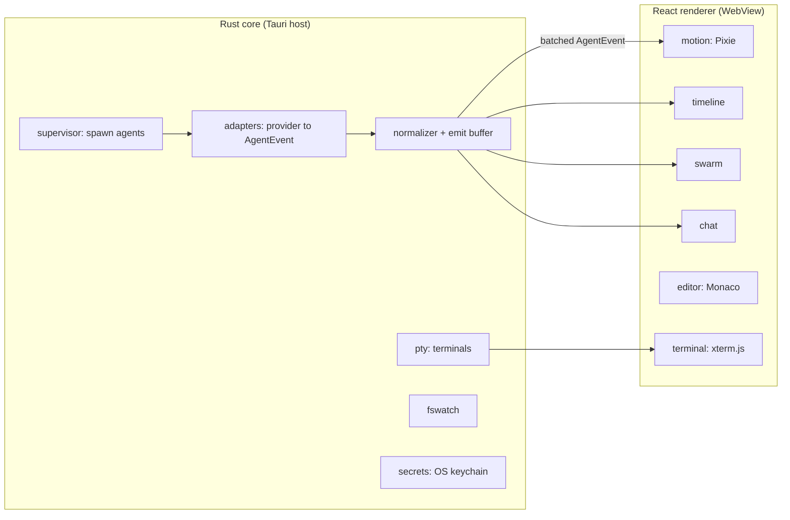

# Architecture Overview

This is the friendly on-ramp to how vsclaude is built. It is written for new contributors and curious users who want a mental model of the system before diving into code. It is deliberately lighter than the full design contract: it explains the one idea that holds everything together (the `AgentEvent` stream), shows where every piece of code lives, and gives you a route to navigate the repository. When you need exact contracts, threading rules, backpressure behavior, or the IPC type pipeline, follow the links into [specs/ARCHITECTURE.md](../specs/ARCHITECTURE.md) and its siblings.

## Table of contents

- [What vsclaude is](#what-vsclaude-is)
- [The one big idea: AgentEvent](#the-one-big-idea-agentevent)
- [The three motion rules](#the-three-motion-rules)
- [Two halves: Rust core and React renderer](#two-halves-rust-core-and-react-renderer)
- [The journey of one event](#the-journey-of-one-event)
- [Package map](#package-map)
- [How Pixie comes alive](#how-pixie-comes-alive)
- [Navigating the codebase](#navigating-the-codebase)
- [Tech stack at a glance](#tech-stack-at-a-glance)
- [Mental models that keep you out of trouble](#mental-models-that-keep-you-out-of-trouble)
- [Where to go next](#where-to-go-next)

## What vsclaude is

vsclaude is a cozy, purpose-built desktop IDE where you watch your AI coding agent work through living pixel-art animation instead of scrolling walls of text. A pixel-art companion named Pixie acts out exactly what the agent is doing in real time. When Pixie types, the agent is writing a file, and you can see which one. When Pixie spawns helpers, the agent launched sub-agents. Nothing on screen is decorative theater.

It runs Claude Code as a first-class citizen and treats Codex, Gemini, and local models (Ollama) as equal participants behind one unified experience. You bring your own key. The tagline captures it: "Claude Code, in motion. For any model."

## The one big idea: AgentEvent

Every provider speaks a different dialect. Claude Code streams JSON blocks, Codex has its own shape, Gemini another, Ollama another. If the UI tried to understand all of them, every view would be a tangle of provider-specific branches. vsclaude refuses that.

Instead there is exactly one shared vocabulary. Every provider is reduced by a thin adapter into a single normalized stream of `AgentEvent` objects, and every pixel the user sees is a function of that stream. This single normalization point is the heart of the architecture.

```ts
// packages/contracts/src/agent-event.ts  (frozen, versioned)
export type AgentEventType =
  | 'session_start' | 'session_end'
  | 'thinking' | 'message'
  | 'tool_call' | 'tool_result'
  | 'file_read' | 'file_edit' | 'file_create' | 'file_delete'
  | 'command_run' | 'command_output'
  | 'search' | 'web_fetch' | 'git_action'
  | 'subagent_spawned' | 'subagent_finished'
  | 'todo_update' | 'permission_request' | 'token_usage'
  | 'error' | 'complete';

export interface AgentEvent {
  id: string;
  sessionId: string;
  agentId: string;
  parentAgentId?: string;
  ts: number;
  type: AgentEventType;
  provider: 'claude-code' | 'codex' | 'gemini' | 'ollama' | string;
  schemaVersion: number;
  tool?: { name: string; input: unknown };
  payload?: Record<string, unknown>;
  caption?: string;
  raw?: unknown;
}
```

Three fields matter for every contributor to internalize:

| Field | Why it exists |
| --- | --- |
| `type` | The normalized verb. Views and the motion mapper switch on this and nothing else. |
| `caption` | A plain-language sentence produced by the adapter, never invented by the UI. This is what a non-technical person reads. |
| `raw` | The untouched provider payload. This is what makes meaning recoverable: one click reaches the exact tool input, diff, command, or output. |

If you remember one thing from this document: the renderer consumes only `AgentEvent` (plus raw terminal bytes). It never reaches into a provider's native shape. That is the firewall that keeps the whole product maintainable.

## The three motion rules

These are not style guidelines. They are enforced by the architecture, and every feature you build must respect them.

1. **Every animation is bound to a real event.** The motion mapper has no input other than `AgentEvent`. It physically cannot animate something that did not happen.
2. **Meaning is always preserved and always recoverable.** Every event carries its structured `tool`, `payload`, `caption`, and `raw`. One click in any view drills to the underlying detail.
3. **A non-technical person can follow along.** Every motion-driving event carries a plain-language `caption` from the adapter, so the captions track reality automatically.

When you are tempted to add a flourish "just because it looks nice," stop. If it is not bound to an event, it does not ship.

## Two halves: Rust core and React renderer

vsclaude is a Tauri 2.x application. It splits cleanly into two processes that share no memory and talk only over typed IPC.



The Rust core owns everything that touches the operating system. The React renderer owns everything visual. The dividing line is strict.

| Concern | Owner |
| --- | --- |
| Spawn and supervise agent CLI processes | Rust core |
| PTY allocation and terminal I/O | Rust core |
| Stream parsing and adapter normalization | Rust core |
| Filesystem watching | Rust core |
| Secret storage (API keys, OS keychain) | Rust core |
| Auto-update and event fan-out to the UI | Rust core |
| Pixie rendering and motion mapping | Renderer |
| Monaco editor and xterm.js surface | Renderer |
| Timeline, swarm, chat views | Renderer |
| App and motion state (Zustand, Jotai) | Renderer |

The guiding principle is that the renderer is a deterministic projection. Given the same ordered `AgentEvent` sequence, the renderer always reaches the same visual state. That is why the UI is replayable and testable from a recorded event log with no live agent running. For the authoritative ownership table and the reasons behind each row, see [specs/ARCHITECTURE.md, process model](../specs/ARCHITECTURE.md#2-process-model-rust-core-vs-react-renderer).

## The journey of one event

Follow a single action from the agent all the way to a pixel. Imagine Claude Code edits `src/app.ts`.

```text
1. Claude Code child process emits a JSON block on stdout.
2. Rust reader thread frames the line (handles partial chunks).
3. The claude-code adapter maps the block to:
     { type: 'file_edit', tool: { name: 'Edit', input: {...} },
       caption: 'Editing src/app.ts', raw: <original block> }
4. The normalizer stamps id, ts, sessionId, agentId, schemaVersion
   and pushes it into the emit buffer.
5. A frame-aligned flusher (every ~16 ms) batches events and emits
   one 'agent-event' message over the Tauri channel.
6. The renderer ingest hook appends the whole batch to the event log
   in one Zustand update (one React render per batch, not per event).
7. The motion mapper reads the latest motion-relevant event and sets
   Pixie's Rive inputs: state = 'typing', mood, intensity.
8. Pixie types. The timeline shows a row. Click it to see the diff.
```

Two design choices in that path are worth flagging now because you will meet them everywhere:

- **Batching at the IPC boundary.** Events cross the process boundary once per display frame, not once per event. This is the single biggest source of smoothness. See [specs/ARCHITECTURE.md, threading and backpressure](../specs/ARCHITECTURE.md#10-threading-and-backpressure).
- **Coalescing in the motion mapper.** If 200 `command_output` events arrive in one frame, Pixie shows one `running` state at high intensity, not 200 transitions. Intensity reflects how much is happening.

## Package map

The monorepo uses pnpm workspaces. Packages live under `packages/*` and the Tauri app under `apps/desktop`. The split exists so a failure in one package cannot take down the whole app.

```text
vsclaude/
  apps/
    desktop/                 Tauri app shell (Rust core + React entry)
      src-tauri/             Rust: supervisor, pty, adapters, normalizer,
                             bridge (ipc), fswatch, secrets
      src/                   React entry, layout, wiring
  packages/
    contracts/               Frozen AgentEvent + IPC payload types (source of truth)
    ipc/                     Typed invoke/listen wrappers (renderer side)
    motion/                  Motion mapper, Pixie Rive binding, sprite fallback
    timeline/                Timeline view + selectors
    swarm/                   Swarm graph view (DOM + PixiJS fallback)
    chat/                    Chat panel view
    editor/                  Monaco integration
    terminal/                xterm.js integration
    state/                   Zustand stores + Jotai motion atoms
    ui/                      Design system (Tailwind v4 tokens, primitives)
```

A few orientation notes:

| Package | What you go there to do |
| --- | --- |
| `contracts` | Change the event or IPC shape. This is frozen and versioned; changes ripple everywhere, so tread carefully. |
| `ipc` | Add a new typed command or event subscription between renderer and core. |
| `motion` | Map a new `AgentEvent` type to a Pixie state, or tune mood and intensity. |
| `timeline` / `swarm` / `chat` | Build a view. Each is a pure projection over the in-memory event log. |
| `state` | Own a piece of renderer state. The event log itself lives here as the single source of truth. |
| `ui` | Add a design-system primitive or token. Views compose these, they do not invent ad hoc styles. |

The Rust crates inside `src-tauri` mirror the same responsibilities: `supervisor`, `pty`, `adapter` (one submodule per provider), `normalizer`, `bridge`, `fswatch`, `secrets`. Each exposes a narrow interface and returns `Result`, so a fault in one crate surfaces as a typed error rather than a process abort.

## How Pixie comes alive

Pixie is a Rive state machine. The motion mapper is a pure function from `AgentEvent` to a small set of Rive inputs (`state`, `mood`, `intensity`, `targetX`, `targetY`), plus a tiny scheduler that handles entry and exit blends. Every `AgentEvent` type has a home state.

| Event | Pixie state |
| --- | --- |
| `session_start` | greeting |
| (no activity) | idle, then sleeping after long idle |
| `thinking` | thinking |
| `todo_update` | planning |
| `file_read` | reading |
| `file_edit` / `file_create` | typing |
| `search` | searching |
| `web_fetch` | web |
| `command_run` | running |
| `error` during a run | debugging |
| long build | building |
| `git_action` | git |
| `subagent_spawned` | spawning |
| `permission_request` | waiting |
| `complete` | success |
| unresolved error | confused |

Moods (calm, focused, excited, struggling) layer on top, and intensity scales with how much is happening at once. When a provider spawns a sub-agent (for Claude Code, the Task tool), that becomes a `subagent_spawned` event, and the swarm view comes alive automatically because the swarm is just a selector over the event log:

```ts
// Swarm graph is derived, not stored. Same data, one source of truth.
const selectSwarm = (events: AgentEvent[]): SwarmGraph => {
  const nodes = new Map<string, SwarmNode>();
  const edges: SwarmEdge[] = [];
  for (const e of events) {
    if (!nodes.has(e.agentId)) nodes.set(e.agentId, makeNode(e.agentId));
    if (e.type === 'subagent_spawned' && e.parentAgentId) {
      edges.push({ from: e.parentAgentId, to: e.agentId });
    }
    if (e.type === 'subagent_finished') markDone(nodes, e.agentId);
  }
  return { nodes: [...nodes.values()], edges };
};
```

If Rive fails to load, the sprite-sheet fallback animator takes over with the same state inputs, so Pixie keeps acting out reality. For the full state catalog and input mapping, see [specs/MOTION.md](../specs/MOTION.md).

## Navigating the codebase

A practical reading order for your first day:

1. **Start with the contract.** Read `packages/contracts/src/agent-event.ts`. Everything else is downstream of it.
2. **Read one adapter.** Open the Claude Code adapter under `apps/desktop/src-tauri` (the `adapter::claude` submodule). Watch how a raw provider block becomes an `AgentEvent` with a `caption` and preserved `raw`.
3. **Follow the IPC.** Read `packages/ipc` to see how the renderer subscribes to the `agent-event` channel and invokes commands.
4. **Read the ingest and the log.** In `packages/state`, find where a batch of events is appended to the event log in one update.
5. **Pick one view.** `packages/timeline` is the gentlest. See how it is a pure selector over the log, and how a click drills to `raw`.
6. **Then the motion mapper.** `packages/motion` ties the event stream to Pixie.

A quick map of common tasks to starting points:

| You want to | Start in |
| --- | --- |
| Add support for a new provider | a new `adapter::<provider>` submodule in `src-tauri`, output `AgentEvent` |
| Add a new event type | `packages/contracts` first, then adapters, then `packages/motion` |
| Add a new view | a new package under `packages/*`, consume the event log via selectors |
| Change how Pixie reacts | `packages/motion` |
| Add a renderer-to-core command | `packages/ipc` plus a handler in the Rust `bridge` crate |
| Adjust styling or tokens | `packages/ui` |

## Tech stack at a glance

These choices are locked. Build against them, do not reintroduce alternatives.

| Layer | Choice |
| --- | --- |
| Desktop shell | Tauri 2.x with a Rust core (process and PTY lifecycle, fs watching, OS keychain, IPC, auto-update). Electron is fallback only. |
| Frontend | React 19 + TypeScript strict, Vite |
| App state | Zustand (Jotai allowed for fine-grained motion atoms) |
| Async / cached data | TanStack Query |
| Editor | Monaco |
| Terminal | xterm.js with the WebGL renderer, wired to a real PTY in Rust |
| Styling | Tailwind CSS v4 with token-driven CSS variables |
| Motion | Rive (primary) with a sprite-sheet fallback, Motion (Framer Motion) for UI transitions, GSAP for timeline choreography, Lottie for tiny accents, PixiJS for the swarm canvas if the DOM stalls, Tone.js optional sound (off by default) |
| Monorepo | pnpm workspaces (`packages/*`, `apps/desktop`) |
| Quality | ESLint + Prettier + TypeScript strict, Vitest, Playwright, cargo test, Storybook (every Pixie state), Changesets |

Building the desktop app requires the Rust toolchain as a setup prerequisite: rustup plus cargo plus a platform linker (MSVC build tools on Windows). See the contributor setup guide for exact steps.

## Mental models that keep you out of trouble

A short list of the invariants you will be measured against in review. Internalize these and most design questions answer themselves.

- **The renderer consumes only `AgentEvent` and PTY bytes.** No provider-specific logic in any view. Anything provider-specific lives in an adapter and is normalized away.
- **Every motion transition traces to exactly one `AgentEvent`.** No purely decorative animation.
- **Every event carries `raw` and structured detail.** One click recovers full meaning, always.
- **Every motion-driving event carries a `caption` from the adapter.** The UI never invents captions.
- **Secrets live in the OS keychain.** They enter only the child process environment and never cross an event channel.
- **The event log is the single renderer source of truth.** Views are pure projections. If you find yourself caching derived state in two places, stop and use a selector.
- **The contract is a firewall.** Because every visual consumer depends only on `AgentEvent`, a breaking change in a provider CLI is contained entirely within its adapter. The blast radius of a provider change is exactly one package.

Things that are explicitly out of scope at this layer: provider-specific UI affordances, persisting full session history to a database, and multi-window or multi-machine sync. If your idea needs one of those, it belongs in a separate spec, not in a view.

## Where to go next

This overview is the map. The specs are the territory.

- [specs/ARCHITECTURE.md](../specs/ARCHITECTURE.md): the full system design, IPC bridge contract, process and PTY lifecycle, threading, backpressure, and failure isolation.
- [specs/MOTION.md](../specs/MOTION.md): the complete Pixie state catalog and motion input mapping.
- [specs/PROVIDERS.md](../specs/PROVIDERS.md): the provider adapter contract and how to add a new one.
- [specs/IPC.md](../specs/IPC.md): the IPC type generation pipeline that keeps renderer and core types in sync.
- [packages/contracts/src/agent-event.ts](../packages/contracts/src/agent-event.ts): the frozen `AgentEvent` source of truth.

Welcome aboard. Read the contract, follow one event end to end, and the rest of the system will make sense.
