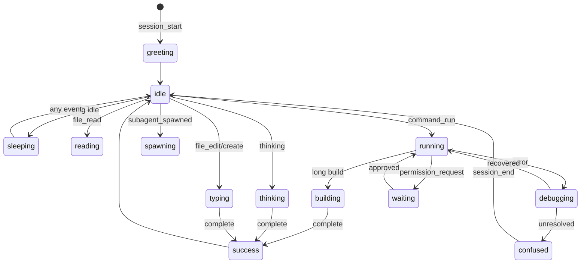

# Pixie States Guide

Pixie is the pixel-art companion who acts out exactly what your AI coding agent is doing, in real time, bound to real events. This guide is the single source of truth for every Pixie state: what triggers it, what it means, the plain-language caption a viewer sees, and the mood and intensity layers that bring it to life. It is written for two audiences at once. Engineers implementing the motion module will find the precise event bindings and Rive inputs they build against. Non-technical viewers will find a friendly map for reading the screen without knowing a single line of code. Every state here obeys the three sacred motion rules: it is bound to a real [AgentEvent](../packages/contracts/src/agent-event.ts), its meaning is always one click from the underlying detail, and it always carries a plain-language caption.

## Table of Contents

- [How to Read Pixie](#how-to-read-pixie)
- [The Rive Inputs Model](#the-rive-inputs-model)
- [The Complete States Table](#the-complete-states-table)
- [State Reference](#state-reference)
- [Moods: The Emotional Layer](#moods-the-emotional-layer)
- [Intensity: How Much Is Happening](#intensity-how-much-is-happening)
- [Captions: Plain Language by Construction](#captions-plain-language-by-construction)
- [The Event to State Mapping](#the-event-to-state-mapping)
- [Transition Choreography](#transition-choreography)
- [For Non-Technical Viewers](#for-non-technical-viewers)
- [Implementation Notes](#implementation-notes)
- [Accessibility](#accessibility)
- [Testing Every State](#testing-every-state)

## How to Read Pixie

Pixie has one job: make the agent's work legible at a glance. When you look at Pixie, you are looking at a faithful, animated read of the live event stream. Three signals stack together to tell the whole story.

1. **State** answers *what is the agent doing right now*. Reading a file, typing an edit, running a command, waiting for your approval. There are eighteen states, each a distinct Rive animation.
2. **Mood** answers *how is it going*. Calm, focused, excited, or struggling. Mood is a layer painted on top of any state, so a struggling read looks different from a calm read.
3. **Intensity** answers *how much is happening*. A single quiet file read sits low. A burst of ten edits across a refactor pushes intensity high, and Pixie moves faster and brighter.

You never have to guess. If Pixie types, the agent is writing a real file, and one click reveals which file and the exact diff. That is rule two: meaning is always preserved and always recoverable.

## The Rive Inputs Model

Pixie is a single Rive state machine driven by four inputs. The motion layer sets these inputs from the normalized `AgentEvent` stream and never from anything else. This keeps Pixie truthful by construction: there is no path to animate something that did not happen.

```ts
// The only inputs the Rive state machine exposes.
interface PixieInputs {
  state: PixieState;          // enum number input, drives the active animation
  mood: PixieMood;            // layered blend: calm | focused | excited | struggling
  intensity: number;          // 0..1, scales speed, glow, and particle density
  targetX: number;            // 0..1, where Pixie looks or moves horizontally
  targetY: number;            // 0..1, where Pixie looks or moves vertically
}

type PixieState =
  | 'greeting' | 'idle' | 'sleeping' | 'thinking' | 'planning'
  | 'reading' | 'typing' | 'searching' | 'web' | 'running'
  | 'debugging' | 'building' | 'git' | 'spawning' | 'waiting'
  | 'success' | 'confused';

type PixieMood = 'calm' | 'focused' | 'excited' | 'struggling';
```

Every state has three blend regions inside the state machine: an **entry** blend (how Pixie arrives), an **idle** loop (the steady animation while the state holds), and an **exit** blend (how Pixie leaves toward the next state). The orchestrator only ever sets inputs; Rive handles the blending. The `targetX` and `targetY` inputs let Pixie glance toward the file tree, the terminal, or the swarm view so attention reads naturally.

## The Complete States Table

This table is the contract. Each row maps a real `AgentEventType` (or condition) to a state, the default mood, the intensity baseline, and the canonical plain-language caption template. Captions use `{ }` placeholders filled from the event payload.

| State | Trigger event | Default mood | Intensity baseline | Caption template |
| --- | --- | --- | --- | --- |
| `greeting` | `session_start` | excited | 0.6 | "Pixie is here. Starting a new session." |
| `idle` | no activity (short gap) | calm | 0.1 | "Waiting for the next step." |
| `sleeping` | long idle (timeout) | calm | 0.0 | "Nothing happening. Pixie is resting." |
| `thinking` | `thinking` | focused | 0.4 | "Thinking through the problem." |
| `planning` | `todo_update` | focused | 0.5 | "Making a plan: {todoCount} steps." |
| `reading` | `file_read` | focused | 0.4 | "Reading {fileName}." |
| `typing` | `file_edit`, `file_create` | focused | 0.6 | "Writing changes to {fileName}." |
| `searching` | `search` | focused | 0.5 | "Searching for \"{query}\"." |
| `web` | `web_fetch` | focused | 0.5 | "Fetching {host} from the web." |
| `running` | `command_run` | focused | 0.6 | "Running: {commandShort}." |
| `debugging` | `error` during a run | struggling | 0.7 | "Hit a problem while running. Looking into it." |
| `building` | long-running build | focused | 0.7 | "Building the project. This can take a moment." |
| `git` | `git_action` | focused | 0.5 | "Git: {gitAction}." |
| `spawning` | `subagent_spawned` | excited | 0.8 | "Calling in help: {subagentName} joins." |
| `waiting` | `permission_request` | calm | 0.3 | "Needs your OK to continue." |
| `success` | `complete` | excited | 0.9 | "Done. Task complete." |
| `confused` | unresolved error | struggling | 0.6 | "Stuck on an error. Pixie needs a hand." |

Note that `idle` and `sleeping` are derived from the absence of events plus timers, not from a single event type. `debugging` and `building` are refinements of `running` based on context (an error during the run, or a recognized long build), so the adapter and orchestrator share responsibility for choosing them.

## State Reference

Each state below lists the event binding, what the viewer sees, the recoverable detail behind one click, and engineering notes.

### greeting

- **Bound to:** `session_start`.
- **Viewer sees:** Pixie pops in with a wave and a small sparkle. Bright and brief.
- **One click reveals:** session id, provider (`claude-code`, `codex`, `gemini`, `ollama`), model, and start timestamp.
- **Notes:** Hold for roughly 1.2 seconds, then fall to `idle` if no further event arrives. Mood is `excited`; intensity eases from 0.6 down to the idle baseline on exit.

### idle

- **Bound to:** a short quiet gap with no incoming events (default 3 seconds).
- **Viewer sees:** gentle breathing loop, occasional blink, calm.
- **One click reveals:** the last completed event and a hint that the agent is between steps.
- **Notes:** This is the default resting state during active sessions. Any new event preempts it immediately.

### sleeping

- **Bound to:** a long quiet gap (default 90 seconds of no events).
- **Viewer sees:** Pixie curls up, a soft "z" floats off. Intensity at 0.
- **One click reveals:** how long the session has been quiet and the last event.
- **Notes:** Wakes to `greeting`-lite or directly to the relevant state on the next event. Use a low-cost loop here to save GPU when nothing is happening.

### thinking

- **Bound to:** `thinking`.
- **Viewer sees:** Pixie taps a temple, small thought bubbles cycle. Focused.
- **One click reveals:** the reasoning text block from `payload`, when the provider exposes it, otherwise a neutral "the agent is reasoning" note.
- **Notes:** Intensity should track streaming cadence: faster token flow nudges intensity up within the 0.3 to 0.5 band.

### planning

- **Bound to:** `todo_update`.
- **Viewer sees:** Pixie pins a tiny checklist to a board. Items appear as the plan grows.
- **One click reveals:** the full to-do list with statuses (pending, in progress, done).
- **Notes:** Caption fills `{todoCount}` from the payload. When items complete later, this state can flash a quick check without a full re-entry.

### reading

- **Bound to:** `file_read`.
- **Viewer sees:** Pixie holds an open book or scroll and scans it. `targetX/targetY` point toward the file in the tree.
- **One click reveals:** the file path and the exact lines or range that were read.
- **Notes:** Rapid sequential reads should coalesce visually rather than re-entering per file; bump intensity instead.

### typing

- **Bound to:** `file_edit`, `file_create`.
- **Viewer sees:** Pixie types fast at a tiny keyboard, characters fly. The signature state.
- **One click reveals:** the file path and the precise diff (added and removed lines).
- **Notes:** `file_create` may add a small "new file" spark. This is the most-seen working state; keep it crisp and readable at high intensity.

### searching

- **Bound to:** `search`.
- **Viewer sees:** Pixie sweeps a magnifying glass across the scene.
- **One click reveals:** the query string and matched results count or paths.
- **Notes:** Caption fills `{query}`. Truncate long queries in the caption but keep the full text in the detail panel.

### web

- **Bound to:** `web_fetch`.
- **Viewer sees:** Pixie reaches toward a small globe, a signal pulse travels out and back.
- **One click reveals:** the URL, the host, and a summary or status of the fetched content.
- **Notes:** Caption fills `{host}` to avoid leaking long URLs into the plain-language line.

### running

- **Bound to:** `command_run`.
- **Viewer sees:** Pixie pulls a lever or presses a big button; a terminal glow appears.
- **One click reveals:** the full command, the working directory, and streaming `command_output`.
- **Notes:** Caption fills `{commandShort}` (first token plus an ellipsis). The live state may pivot to `debugging` or `building` as output arrives.

### debugging

- **Bound to:** an `error` event observed during an active `command_run`.
- **Viewer sees:** Pixie frowns, pokes at sparks with a tiny wrench. Mood `struggling`.
- **One click reveals:** the error text, exit code, and the failing command or output excerpt.
- **Notes:** This is recoverable: if the agent fixes the issue and continues, transition back to `running` or onward. If it cannot, escalate to `confused`.

### building

- **Bound to:** a `command_run` recognized as a long-running build (heuristic on command and duration).
- **Viewer sees:** Pixie hammers at a small structure that grows; a progress shimmer loops.
- **One click reveals:** the build command and live output, with elapsed time.
- **Notes:** Use this to set viewer expectations during slow steps so the session does not feel stalled. Falls to `success` or `debugging` based on the result.

### git

- **Bound to:** `git_action`.
- **Viewer sees:** Pixie manipulates a small branching tree of commits.
- **One click reveals:** the git operation, affected files, and command output.
- **Notes:** Caption fills `{gitAction}` (for example "commit", "branch", "diff"). Keep this read-only in presentation; Pixie reports what the agent did, it does not perform git itself.

### spawning

- **Bound to:** `subagent_spawned`.
- **Viewer sees:** Pixie splits off a smaller helper sprite that drifts toward the swarm view. Bright and energetic.
- **One click reveals:** the sub-agent id, its assigned task, and a link into the swarm view.
- **Notes:** This is the moment the swarm comes alive. The Task tool spawning a sub-agent maps directly here. A matching `subagent_finished` later retires the helper.

### waiting

- **Bound to:** `permission_request`.
- **Viewer sees:** Pixie stands by a small gate, looks toward the viewer, taps a foot patiently. Calm, not alarmed.
- **One click reveals:** the exact action awaiting approval (tool name, inputs, target path or command).
- **Notes:** This state must be unmissable but not stressful. Pair it with the approval prompt in the UI. Intensity stays low (0.3) so it reads as a calm pause, not a panic.

### success

- **Bound to:** `complete`.
- **Viewer sees:** Pixie cheers, confetti or a small firework. The reward beat.
- **One click reveals:** a summary of the completed task and the final event chain.
- **Notes:** Highest intensity (0.9), excited mood. Hold briefly, then settle to `idle`. This is the only celebratory state; do not overuse it.

### confused

- **Bound to:** an unresolved error (an `error` the agent did not recover from, or `session_end` after failure).
- **Viewer sees:** Pixie scratches its head, a question mark hovers. Mood `struggling`.
- **One click reveals:** the unresolved error, the last few events, and suggested next actions.
- **Notes:** This is the honest "I am stuck" state. Never hide failure behind a cheerful animation; that would violate truthfulness.

## Moods: The Emotional Layer

Mood is a blend layered on top of any state. It does not change *what* Pixie is doing, only *how it feels*. The orchestrator derives mood from event context so the emotional read stays truthful.

| Mood | When it applies | Visual effect |
| --- | --- | --- |
| `calm` | quiet states, waiting, low intensity | soft palette, slow easing, relaxed posture |
| `focused` | normal productive work (read, type, search, run) | steady palette, crisp motion, attentive eyes |
| `excited` | session start, spawning help, success | warm bright accents, bouncy easing, sparkle |
| `struggling` | errors, debugging, confusion | cooler desaturated palette, tense posture, slower recovery |

```ts
function deriveMood(event: AgentEvent, ctx: SessionContext): PixieMood {
  if (event.type === 'error' || event.type === 'session_end' && ctx.failed) {
    return 'struggling';
  }
  if (event.type === 'session_start'
      || event.type === 'subagent_spawned'
      || event.type === 'complete') {
    return 'excited';
  }
  if (ctx.idleMs > ctx.sleepThresholdMs || event.type === 'permission_request') {
    return 'calm';
  }
  return 'focused';
}
```

Mood transitions ease over roughly 400 ms so the emotional shift reads as a feeling, not a jump cut.

## Intensity: How Much Is Happening

Intensity is a single value from 0 to 1 that scales Pixie's speed, glow, and particle density. It reflects throughput, not importance. A flurry of edits during a large refactor pushes intensity high even though each individual edit is routine.

The orchestrator computes intensity from the recent event rate, smoothed so it does not flicker.

```ts
// Exponential moving average of events-per-second, clamped to 0..1.
function computeIntensity(prev: number, eventsLastSecond: number): number {
  const target = Math.min(eventsLastSecond / 8, 1); // 8+ events/sec reads as full
  const alpha = 0.3;                                 // smoothing factor
  return prev + alpha * (target - prev);
}
```

Each state defines a baseline intensity (see the states table). The computed value modulates around that baseline so a busy `typing` burst looks busier than a single quiet edit, without ever leaving the band that keeps the state legible.

## Captions: Plain Language by Construction

Every state emits a caption in plain English. This is rule three: a non-technical person must be able to follow along. Captions are generated from the event, never hand-authored per session, so they cannot drift from the truth.

Rules for caption generation:

- One short sentence. No jargon in the default line. Technical detail lives behind the click, not in the caption.
- Fill placeholders from the payload: `{fileName}`, `{query}`, `{host}`, `{commandShort}`, `{todoCount}`, `{gitAction}`, `{subagentName}`.
- Truncate long values in the caption (file paths shorten to the base name, URLs shorten to the host) while the full value stays recoverable in the detail panel.
- Never invent a caption for an event that did not happen.

```ts
function captionFor(event: AgentEvent): string {
  switch (event.type) {
    case 'file_read':  return `Reading ${base(event.payload?.path)}.`;
    case 'file_edit':
    case 'file_create': return `Writing changes to ${base(event.payload?.path)}.`;
    case 'command_run': return `Running: ${short(event.payload?.command)}.`;
    case 'search':      return `Searching for "${truncate(event.payload?.query, 40)}".`;
    case 'web_fetch':   return `Fetching ${host(event.payload?.url)} from the web.`;
    case 'permission_request': return 'Needs your OK to continue.';
    case 'complete':    return 'Done. Task complete.';
    default:            return event.caption ?? 'Working.';
  }
}
```

If a provider already supplies a `caption` on the `AgentEvent`, prefer it, since the adapter had richer context. Fall back to the generated template otherwise.

## The Event to State Mapping

This is the canonical reducer the orchestrator uses. It is pure: given the current context and the next event, it returns the next state. Derived states (`idle`, `sleeping`, `debugging`, `building`) depend on context as well as the event type.

```ts
function nextState(event: AgentEvent, ctx: SessionContext): PixieState {
  switch (event.type) {
    case 'session_start':      return 'greeting';
    case 'session_end':        return ctx.failed ? 'confused' : 'idle';
    case 'thinking':           return 'thinking';
    case 'todo_update':        return 'planning';
    case 'file_read':          return 'reading';
    case 'file_edit':
    case 'file_create':
    case 'file_delete':        return 'typing';
    case 'search':             return 'searching';
    case 'web_fetch':          return 'web';
    case 'command_run':        return ctx.isLongBuild ? 'building' : 'running';
    case 'command_output':     return ctx.state;            // stay, update intensity
    case 'git_action':         return 'git';
    case 'subagent_spawned':   return 'spawning';
    case 'subagent_finished':  return ctx.state;            // retire helper, keep state
    case 'permission_request': return 'waiting';
    case 'complete':           return 'success';
    case 'error':
      return ctx.state === 'running' || ctx.state === 'building'
        ? 'debugging'
        : 'confused';
    case 'tool_call':
    case 'tool_result':
    case 'message':
    case 'token_usage':        return ctx.state;            // metadata, no state change
    default:                   return ctx.state;
  }
}
```

A few deliberate choices:

- `file_delete` shares the `typing` state. Deletes are edits; a small "remove" accent on the sprite distinguishes them without a new state.
- `command_output`, `token_usage`, `message`, `tool_call`, and `tool_result` do not change the state. They update intensity, captions, or the detail panel only. This keeps Pixie from twitching on metadata noise.
- `idle` and `sleeping` are produced by a timer, not the reducer above. When no event arrives for `idleThresholdMs`, the orchestrator sets `idle`; after `sleepThresholdMs`, it sets `sleeping`.

## Transition Choreography

States never hard-cut. Each transition runs exit blend, then entry blend, choreographed so the motion reads as one continuous performance. GSAP drives the timeline; Rive handles the per-state blends.



Practical timings to implement against:

- Entry and exit blends: 200 to 350 ms each.
- Mood crossfade: roughly 400 ms, independent of state transitions.
- `greeting` hold: about 1.2 s. `success` hold: about 1.5 s before settling.
- Idle timer: 3 s to `idle`. Sleep timer: 90 s to `sleeping`. Both are configurable.

## For Non-Technical Viewers

You do not need to know how to code to read this screen. Pixie is a little character who shows you what your AI assistant is doing, moment to moment. Here is the whole vocabulary in one glance.

| When you see Pixie ... | The assistant is ... |
| --- | --- |
| waving and sparkling | starting up and getting ready |
| breathing quietly | waiting between steps, nothing wrong |
| curled up asleep with a "z" | resting because nothing has happened for a while |
| tapping its head, thought bubbles | thinking through the problem |
| pinning a checklist | making a plan with steps |
| reading a book or scroll | looking at a file |
| typing fast at a keyboard | writing or changing a file |
| sweeping a magnifying glass | searching for something |
| reaching for a globe | looking something up on the web |
| pulling a lever, terminal glow | running a command |
| frowning with a wrench, sparks | hit a snag and is working on it |
| hammering a growing structure | building the project (this can take a while) |
| arranging a branching tree | doing version control (git) work |
| splitting off a helper | bringing in extra help for a bigger task |
| standing by a gate, looking at you | waiting for your approval to continue |
| cheering with confetti | finished, all done |
| scratching its head, question mark | stuck and needs your help |

Two promises hold no matter what. First, Pixie never pretends. If it cheers, the work really finished. If it looks stuck, it really is stuck. Second, you can always see the details. Click Pixie or any moment in the timeline and you will see exactly what happened: the file, the command, the result. Nothing is hidden behind the animation.

If Pixie is **waiting at the gate**, that is your cue. The assistant paused on purpose and needs a yes or no from you before it touches something sensitive.

## Implementation Notes

- **Single source of inputs.** Only the orchestrator writes `PixieInputs`, and it derives every value from `AgentEvent`. No component sets a Pixie state directly. This guarantees the first motion rule: every animation is bound to a real event.
- **Coalescing.** High-frequency events (rapid reads, streaming output) update intensity and captions but should not re-enter the state each time. Re-entry on every event causes visual jitter and wastes GPU.
- **Fallback animator.** When Rive is unavailable, a sprite-sheet fallback covers the same eighteen states with the same names. The orchestrator is renderer-agnostic; it sets the same inputs either way.
- **Swarm handoff.** On `spawning`, the helper sprite is owned by the swarm canvas (PixiJS when the DOM stalls). Pixie hands off `subagentId` and continues with the parent agent's stream.
- **Determinism.** `nextState` and `deriveMood` are pure functions. Given the same event and context they always return the same result, which makes them trivially testable and replayable from a recorded event log.
- **targetX / targetY.** Point Pixie's gaze at the relevant UI region: the file tree for reads and edits, the terminal for runs, the swarm view for spawns. Compute target coordinates from the focused panel layout, normalized to 0..1.

## Accessibility

- **Captions are not optional.** The plain-language caption is the accessible text equivalent of every animation and is exposed to screen readers via an `aria-live="polite"` region. State changes announce the new caption.
- **Reduced motion.** When the OS requests reduced motion, Pixie holds calmer poses, drops particles, and relies on the caption and a static state badge instead of large movement. Intensity is capped low.
- **Color is never the only signal.** Mood uses palette plus posture plus caption tone, so a viewer who cannot distinguish the palette still reads the state from shape and text.
- **Waiting is unmissable.** The `waiting` state pairs the animation with a focusable approval control, so keyboard and screen-reader users reach the decision without relying on the visual cue.

## Testing Every State

Every Pixie state has a Storybook story and a snapshot, per the project quality tooling. The harness feeds synthetic `AgentEvent` objects through the real orchestrator so stories exercise the true mapping, not a mock.

```ts
// vitest: the reducer is pure, so assertions are direct.
import { nextState } from './orchestrator';

it('maps file_edit to typing', () => {
  const ctx = makeContext({ state: 'idle' });
  expect(nextState(fakeEvent('file_edit'), ctx)).toBe('typing');
});

it('an error during a run becomes debugging, not confused', () => {
  const ctx = makeContext({ state: 'running' });
  expect(nextState(fakeEvent('error'), ctx)).toBe('debugging');
});

it('an error with no active run becomes confused', () => {
  const ctx = makeContext({ state: 'thinking' });
  expect(nextState(fakeEvent('error'), ctx)).toBe('confused');
});
```

A golden replay test runs a recorded session's full event log through the orchestrator and asserts the exact sequence of states, moods, and captions. This catches regressions in choreography and guarantees that what the viewer sees always matches what the agent did.

## Related Specs

- [Architecture](./ARCHITECTURE.md)
- [Agent Event Contract](../packages/contracts/src/agent-event.ts)
- [Swarm View](./SWARM.md)
- [Provider Adapters](./ADAPTERS.md)
