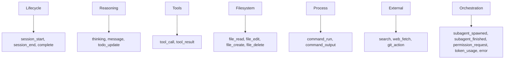
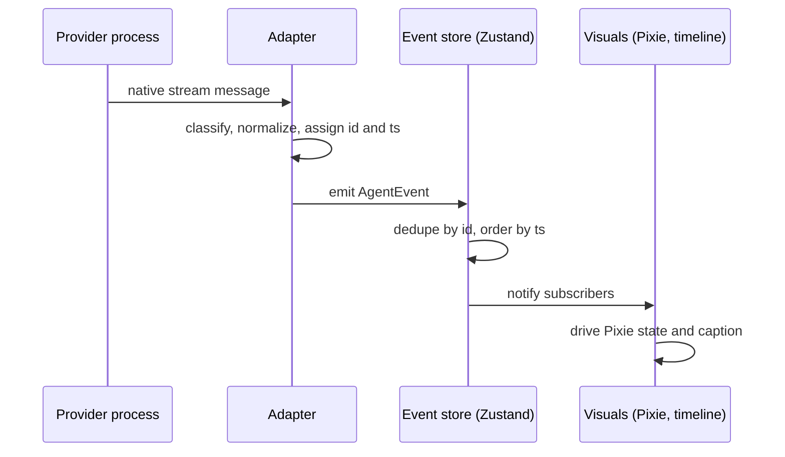

# Agent Event Schema

The `AgentEvent` is the single source of truth that the entire vsclaude experience consumes. Every provider (Claude Code, Codex, Gemini, Ollama, and anything added later) normalizes its native output into one ordered stream of `AgentEvent` objects. The editor timeline, the plain-language captions, the Pixie state machine, the swarm view, and the drill-down inspector all read from this stream and nothing else. This document is the normative contract for that schema: every event type, its trigger, its payload shape, the lifecycle, versioning and migration rules, the adapter interface every provider must implement, and the guarantees around ordering, deduplication, id generation, and raw preservation. If you are building an adapter or a visual consumer, this is the document you build against.

## Table of contents

- [Design principles](#design-principles)
- [The core interface](#the-core-interface)
- [Event types overview](#event-types-overview)
- [Normative payload table](#normative-payload-table)
- [Per-type triggers, payloads, and examples](#per-type-triggers-payloads-and-examples)
- [Event lifecycle](#event-lifecycle)
- [Schema versioning and migration](#schema-versioning-and-migration)
- [The adapter contract](#the-adapter-contract)
- [Ordering, deduplication, and id generation](#ordering-deduplication-and-id-generation)
- [Raw preservation and drill-down](#raw-preservation-and-drill-down)
- [Mapping events to Pixie states](#mapping-events-to-pixie-states)
- [Validation and testing](#validation-and-testing)

## Design principles

Three product rules govern this schema and override convenience:

1. **Bound to reality.** Every event represents something that actually happened in the agent process. There are no synthetic, decorative, or speculative events. If a consumer renders motion, an event triggered it.
2. **Meaning is recoverable.** Every event carries enough structured data to drive a plain-language caption, plus a `raw` field that preserves the exact provider payload so one click always reaches the underlying truth (tool name, inputs, diff, command, raw output).
3. **Plain language by construction.** Every event can produce a human caption a non-technical person understands. The `caption` field is either filled by the adapter or derived deterministically by the captioner from the typed payload.

A corollary: the visual layer is forbidden from reading `raw`. Visuals consume only typed fields (`type`, `tool`, `payload`, `caption`). `raw` exists solely for the drill-down inspector. This keeps the rendering surface provider agnostic.

## The core interface

The contract lives at `packages/contracts/src/agent-event.ts` and is frozen and versioned. Adapters and consumers import it. It is never edited in place in a breaking way; see [Schema versioning and migration](#schema-versioning-and-migration).

```ts
// packages/contracts/src/agent-event.ts  (frozen, versioned)
export type AgentEventType =
  | 'session_start' | 'session_end'
  | 'thinking' | 'message'
  | 'tool_call' | 'tool_result'
  | 'file_read' | 'file_edit' | 'file_create' | 'file_delete'
  | 'command_run' | 'command_output'
  | 'search' | 'web_fetch' | 'git_action'
  | 'subagent_spawned' | 'subagent_finished'
  | 'todo_update' | 'permission_request' | 'token_usage'
  | 'error' | 'complete';

export interface AgentEvent {
  id: string;
  sessionId: string;
  agentId: string;
  parentAgentId?: string;
  ts: number;
  type: AgentEventType;
  provider: 'claude-code' | 'codex' | 'gemini' | 'ollama' | string;
  schemaVersion: number;
  tool?: { name: string; input: unknown };
  payload?: Record<string, unknown>;
  caption?: string;
  raw?: unknown;
}

export const CURRENT_SCHEMA_VERSION = 1 as const;
```

Field semantics:

| Field | Required | Meaning |
|---|---|---|
| `id` | yes | Globally unique, stable, deterministic where possible. Used for dedupe and React keys. See [id generation](#ordering-deduplication-and-id-generation). |
| `sessionId` | yes | Identifies one top-level agent run. Stable across all events of that run. |
| `agentId` | yes | Identifies the specific agent emitting the event. The root agent and each sub-agent have distinct `agentId` values. |
| `parentAgentId` | no | Present on sub-agent events. Links a sub-agent to the agent that spawned it. Absent on the root agent. |
| `ts` | yes | Epoch milliseconds when the adapter observed the event. Monotonic per `agentId`; see [ordering](#ordering-deduplication-and-id-generation). |
| `type` | yes | One of `AgentEventType`. Consumers must treat unknown types as a no-op, never a crash (forward compatibility). |
| `provider` | yes | The adapter that produced the event. Open string so new providers do not require a contract bump. |
| `schemaVersion` | yes | The schema version this event conforms to. Currently `1`. |
| `tool` | when applicable | The structured tool descriptor for `tool_call` and `tool_result`. `input` is unknown shaped because tools vary. |
| `payload` | when applicable | Typed, provider-agnostic structured data. Shapes are normative per type; see the table below. |
| `caption` | recommended | Plain-language one-line description. If absent, the captioner derives one from `type` and `payload`. |
| `raw` | recommended | The exact provider message that produced this event, untouched. Drives drill-down. Never read by visuals. |

## Event types overview

Events fall into seven families. The family is a documentation grouping, not a field.



The filesystem, process, and external families are semantic refinements. An adapter that can recognize a file edit emits `file_edit` rather than a generic `tool_call`, because the typed event drives a more precise caption and a more precise Pixie state. When an adapter cannot classify a tool, it falls back to the generic `tool_call` and `tool_result` pair, which always works.

## Normative payload table

This table is the contract for `payload` and `tool` per event type. Adapters must populate the listed fields when the information is available. Optional fields are marked `?`. Visual consumers may rely on these fields existing for the listed types. Fields not listed here may still appear under `payload`, but consumers must not depend on them.

| Type | `tool` | Normative `payload` fields |
|---|---|---|
| `session_start` | no | `cwd: string`, `model?: string`, `providerVersion?: string`, `permissionMode?: string` |
| `session_end` | no | `reason: 'complete' \| 'aborted' \| 'error'`, `durationMs?: number` |
| `thinking` | no | `text?: string`, `summary?: string` |
| `message` | no | `text: string`, `role: 'assistant' \| 'user'` |
| `tool_call` | yes (`name`, `input`) | `callId: string`, `displayName?: string` |
| `tool_result` | yes (`name`, `input?`) | `callId: string`, `ok: boolean`, `summary?: string`, `durationMs?: number` |
| `file_read` | optional | `path: string`, `bytes?: number`, `lineRange?: [number, number]` |
| `file_edit` | optional | `path: string`, `additions?: number`, `deletions?: number`, `diff?: string` |
| `file_create` | optional | `path: string`, `bytes?: number` |
| `file_delete` | optional | `path: string` |
| `command_run` | optional | `command: string`, `cwd?: string`, `pid?: number` |
| `command_output` | no | `command?: string`, `chunk: string`, `stream: 'stdout' \| 'stderr'`, `exitCode?: number` |
| `search` | optional | `query: string`, `scope: 'code' \| 'web' \| 'files'`, `matchCount?: number` |
| `web_fetch` | optional | `url: string`, `status?: number`, `title?: string`, `bytes?: number` |
| `git_action` | optional | `action: 'commit' \| 'branch' \| 'checkout' \| 'merge' \| 'push' \| 'pull' \| 'status' \| 'diff' \| string`, `summary?: string` |
| `subagent_spawned` | optional | `childAgentId: string`, `task: string`, `subagentType?: string` |
| `subagent_finished` | no | `childAgentId: string`, `ok: boolean`, `summary?: string`, `durationMs?: number` |
| `todo_update` | no | `todos: Array<{ id: string; text: string; status: 'pending' \| 'in_progress' \| 'completed' }>` |
| `permission_request` | optional | `requestId: string`, `action: string`, `target?: string`, `risk?: 'low' \| 'medium' \| 'high'` |
| `token_usage` | no | `inputTokens: number`, `outputTokens: number`, `cacheReadTokens?: number`, `totalTokens?: number`, `costUsd?: number` |
| `error` | no | `message: string`, `phase?: 'tool' \| 'command' \| 'network' \| 'parse' \| 'internal'`, `recoverable: boolean` |
| `complete` | no | `summary?: string`, `durationMs?: number`, `success: boolean` |

A small TypeScript helper makes payloads checkable at the adapter boundary:

```ts
// packages/contracts/src/payloads.ts
export interface FileEditPayload {
  path: string;
  additions?: number;
  deletions?: number;
  diff?: string;
}

export interface CommandRunPayload {
  command: string;
  cwd?: string;
  pid?: number;
}

export interface SubagentSpawnedPayload {
  childAgentId: string;
  task: string;
  subagentType?: string;
}

export interface TokenUsagePayload {
  inputTokens: number;
  outputTokens: number;
  cacheReadTokens?: number;
  totalTokens?: number;
  costUsd?: number;
}
```

Adapters cast their constructed `payload` through these interfaces before emitting, which catches missing required fields at compile time in TypeScript adapters.

## Per-type triggers, payloads, and examples

Each entry below gives the trigger (what real thing causes the event) and one example JSON object. Examples elide `raw` for brevity except where the drill-down shape matters.

### session_start

Trigger: the adapter has launched the agent process and confirmed it is alive (first valid stream message, or process spawn plus handshake).

```json
{
  "id": "evt_01HZX...A1",
  "sessionId": "sess_8f2c",
  "agentId": "root",
  "ts": 1718960000000,
  "type": "session_start",
  "provider": "claude-code",
  "schemaVersion": 1,
  "payload": { "cwd": "/home/dev/vsclaude", "model": "claude-sonnet", "permissionMode": "default" },
  "caption": "Pixie is starting up in vsclaude."
}
```

### session_end

Trigger: the agent process exited or the session was aborted. Always the last event for a `sessionId` unless a `complete` event already closed it; a session may emit both `complete` (logical success) and `session_end` (process exit).

```json
{
  "id": "evt_01HZX...Z9", "sessionId": "sess_8f2c", "agentId": "root",
  "ts": 1718960300000, "type": "session_end", "provider": "claude-code",
  "schemaVersion": 1,
  "payload": { "reason": "complete", "durationMs": 300000 },
  "caption": "Session finished."
}
```

### thinking

Trigger: the model emitted reasoning or extended-thinking content. `text` may be truncated by the adapter for size; `summary` is the short form used in captions.

```json
{
  "id": "evt_t1", "sessionId": "sess_8f2c", "agentId": "root", "ts": 1718960002000,
  "type": "thinking", "provider": "claude-code", "schemaVersion": 1,
  "payload": { "summary": "Deciding where to add the retry logic" },
  "caption": "Pixie is thinking it through."
}
```

### message

Trigger: an assistant or user message block. `role` distinguishes the two. Visuals show assistant messages in the timeline; user messages anchor the conversation.

```json
{
  "id": "evt_m1", "sessionId": "sess_8f2c", "agentId": "root", "ts": 1718960003000,
  "type": "message", "provider": "claude-code", "schemaVersion": 1,
  "payload": { "role": "assistant", "text": "I'll add a reconnect loop to the websocket client." },
  "caption": "Pixie: I'll add a reconnect loop to the websocket client."
}
```

### tool_call and tool_result

Trigger: the agent invoked a tool (`tool_call`) and the tool returned (`tool_result`). These are paired by `callId`. The adapter emits the specific event (`file_edit`, `command_run`, and similar) when it can classify the tool, and additionally or instead emits the generic pair when it cannot. Consumers correlate a result to its call via `payload.callId`.

```json
{
  "id": "evt_c1", "sessionId": "sess_8f2c", "agentId": "root", "ts": 1718960004000,
  "type": "tool_call", "provider": "claude-code", "schemaVersion": 1,
  "tool": { "name": "Bash", "input": { "command": "pnpm test" } },
  "payload": { "callId": "call_77", "displayName": "Run tests" },
  "caption": "Pixie is running a tool: Run tests."
}
```

```json
{
  "id": "evt_r1", "sessionId": "sess_8f2c", "agentId": "root", "ts": 1718960009000,
  "type": "tool_result", "provider": "claude-code", "schemaVersion": 1,
  "tool": { "name": "Bash" },
  "payload": { "callId": "call_77", "ok": true, "summary": "42 passed", "durationMs": 5000 },
  "caption": "Tests passed: 42 passed."
}
```

### file_read, file_edit, file_create, file_delete

Trigger: the agent read, modified, created, or removed a file. The adapter detects these from the tool name and inputs (for Claude Code: `Read`, `Edit`, `Write`, and file-removing commands). `diff` on `file_edit` is the unified diff used by the drill-down inspector.

```json
{
  "id": "evt_e1", "sessionId": "sess_8f2c", "agentId": "root", "ts": 1718960010000,
  "type": "file_edit", "provider": "claude-code", "schemaVersion": 1,
  "tool": { "name": "Edit", "input": { "file_path": "src/ws.ts" } },
  "payload": {
    "path": "src/ws.ts", "additions": 12, "deletions": 3,
    "diff": "@@ -10,3 +10,12 @@\n+  reconnect();"
  },
  "caption": "Pixie edited src/ws.ts (+12, -3)."
}
```

### command_run and command_output

Trigger: the agent started a shell command (`command_run`), and the process streamed output (`command_output`, one event per chunk or per coalesced flush). The terminating `command_output` carries `exitCode`.

```json
{
  "id": "evt_cmd1", "sessionId": "sess_8f2c", "agentId": "root", "ts": 1718960011000,
  "type": "command_run", "provider": "claude-code", "schemaVersion": 1,
  "tool": { "name": "Bash", "input": { "command": "pnpm build" } },
  "payload": { "command": "pnpm build", "cwd": "/home/dev/vsclaude" },
  "caption": "Pixie is running: pnpm build."
}
```

```json
{
  "id": "evt_out9", "sessionId": "sess_8f2c", "agentId": "root", "ts": 1718960025000,
  "type": "command_output", "provider": "claude-code", "schemaVersion": 1,
  "payload": { "command": "pnpm build", "chunk": "build succeeded\n", "stream": "stdout", "exitCode": 0 },
  "caption": "Build succeeded."
}
```

### search

Trigger: a code, file, or web search tool ran. `scope` selects the right caption and Pixie state. `matchCount` is filled on completion when known.

```json
{
  "id": "evt_s1", "sessionId": "sess_8f2c", "agentId": "root", "ts": 1718960006000,
  "type": "search", "provider": "claude-code", "schemaVersion": 1,
  "tool": { "name": "Grep", "input": { "pattern": "reconnect" } },
  "payload": { "query": "reconnect", "scope": "code", "matchCount": 4 },
  "caption": "Pixie searched the code for \"reconnect\" (4 matches)."
}
```

### web_fetch

Trigger: the agent fetched a URL.

```json
{
  "id": "evt_w1", "sessionId": "sess_8f2c", "agentId": "root", "ts": 1718960007000,
  "type": "web_fetch", "provider": "claude-code", "schemaVersion": 1,
  "payload": { "url": "https://tauri.app/v2/", "status": 200, "title": "Tauri 2.0", "bytes": 18234 },
  "caption": "Pixie read a page: Tauri 2.0."
}
```

### git_action

Trigger: the agent performed a git operation, detected from a `git` command or a dedicated git tool. `action` is a known verb where possible, open string otherwise.

```json
{
  "id": "evt_g1", "sessionId": "sess_8f2c", "agentId": "root", "ts": 1718960030000,
  "type": "git_action", "provider": "claude-code", "schemaVersion": 1,
  "payload": { "action": "status", "summary": "3 files changed" },
  "caption": "Pixie checked git status: 3 files changed."
}
```

### subagent_spawned and subagent_finished

Trigger: the agent launched a sub-agent (for Claude Code, the `Task` tool), and that sub-agent later returned. The spawned event sets `childAgentId`; all events from the child carry that value as their `agentId` and the parent as `parentAgentId`. This is what brings the swarm view alive automatically.

```json
{
  "id": "evt_sp1", "sessionId": "sess_8f2c", "agentId": "root", "ts": 1718960040000,
  "type": "subagent_spawned", "provider": "claude-code", "schemaVersion": 1,
  "tool": { "name": "Task", "input": { "description": "Audit auth flow" } },
  "payload": { "childAgentId": "agent_a2", "task": "Audit the auth flow", "subagentType": "reviewer" },
  "caption": "Pixie sent a helper to audit the auth flow."
}
```

```json
{
  "id": "evt_sf1", "sessionId": "sess_8f2c", "agentId": "root", "ts": 1718960090000,
  "type": "subagent_finished", "provider": "claude-code", "schemaVersion": 1,
  "payload": { "childAgentId": "agent_a2", "ok": true, "summary": "No issues found", "durationMs": 50000 },
  "caption": "The helper finished: no issues found."
}
```

### todo_update

Trigger: the agent updated its plan or task list. Drives the planning Pixie state and the plan panel.

```json
{
  "id": "evt_p1", "sessionId": "sess_8f2c", "agentId": "root", "ts": 1718960001500,
  "type": "todo_update", "provider": "claude-code", "schemaVersion": 1,
  "payload": { "todos": [
    { "id": "1", "text": "Add reconnect loop", "status": "in_progress" },
    { "id": "2", "text": "Write a test", "status": "pending" }
  ] },
  "caption": "Pixie updated the plan (1 in progress, 1 to do)."
}
```

### permission_request

Trigger: the agent needs explicit user approval before continuing (a gated action). The session pauses on the waiting Pixie state until the user responds. The response is handled out of band by the adapter and surfaces as the next event (the action proceeding or an `error`).

```json
{
  "id": "evt_perm1", "sessionId": "sess_8f2c", "agentId": "root", "ts": 1718960012000,
  "type": "permission_request", "provider": "claude-code", "schemaVersion": 1,
  "payload": { "requestId": "perm_5", "action": "run command", "target": "rm build/", "risk": "high" },
  "caption": "Pixie is waiting for your approval to run: rm build/."
}
```

### token_usage

Trigger: the provider reported token accounting, typically at message boundaries and at completion. Never blocks; purely informational for the usage meter.

```json
{
  "id": "evt_tok1", "sessionId": "sess_8f2c", "agentId": "root", "ts": 1718960100000,
  "type": "token_usage", "provider": "claude-code", "schemaVersion": 1,
  "payload": { "inputTokens": 12000, "outputTokens": 800, "cacheReadTokens": 9000, "totalTokens": 12800, "costUsd": 0.042 }
}
```

### error

Trigger: something failed. `recoverable` tells the UI whether the agent continued (struggling mood) or stopped (confused state). `phase` classifies the failure.

```json
{
  "id": "evt_err1", "sessionId": "sess_8f2c", "agentId": "root", "ts": 1718960026000,
  "type": "error", "provider": "claude-code", "schemaVersion": 1,
  "payload": { "message": "TypeError: cannot read property 'send'", "phase": "command", "recoverable": true },
  "caption": "Pixie hit an error and is working around it."
}
```

### complete

Trigger: the agent finished its task successfully at the logical level (distinct from process exit). Triggers the success Pixie state.

```json
{
  "id": "evt_done", "sessionId": "sess_8f2c", "agentId": "root", "ts": 1718960299000,
  "type": "complete", "provider": "claude-code", "schemaVersion": 1,
  "payload": { "summary": "Added reconnect loop and tests", "durationMs": 299000, "success": true },
  "caption": "Done: added reconnect loop and tests."
}
```

## Event lifecycle

Every session follows a predictable arc. The diagram shows the canonical shape; tools, files, and reasoning events interleave freely in the middle.



Lifecycle rules:

1. A session opens with exactly one `session_start` and closes with exactly one `session_end`. A `complete` event may precede `session_end` and represents logical success; `session_end` represents process teardown.
2. `tool_call` and `tool_result` are paired by `payload.callId`. A result without a preceding call is tolerated (the call may have been classified as a specific event instead) but should be rare.
3. `subagent_spawned` always precedes any event whose `agentId` equals the spawned `childAgentId`. A `subagent_finished` closes that child. Child events carry `parentAgentId`.
4. `command_run` precedes the `command_output` events for the same command. The final `command_output` for a command carries `exitCode`.
5. Consumers must tolerate truncation: a session can end abruptly with no `complete` and only `session_end` with `reason: 'aborted'` or `'error'`. The UI must resolve Pixie to a stable state in that case.

## Schema versioning and migration

`schemaVersion` is an integer on every event. The current value is `1`, exported as `CURRENT_SCHEMA_VERSION`. The schema evolves under these rules:

- **Additive changes are not version bumps.** Adding a new optional `payload` field, a new `AgentEventType`, or a new `provider` string is backward compatible and does not change `schemaVersion`. Consumers already ignore unknown types and unknown fields.
- **Breaking changes bump the version.** Removing a field, renaming a field, changing a field type, or changing the meaning of an existing field requires incrementing `schemaVersion` and shipping a migrator.
- **Consumers branch on version.** A consumer reads `schemaVersion` and routes through the appropriate decoder. The event store normalizes everything to the current version on ingest so downstream code only ever sees the latest shape.

The migration registry is a chain of pure functions, each upgrading one version to the next:

```ts
// packages/contracts/src/migrate.ts
import type { AgentEvent } from './agent-event';

type Migrator = (e: AgentEvent) => AgentEvent;

const migrations: Record<number, Migrator> = {
  // 1 -> 2 would live here when v2 ships, e.g. renaming a field
  // 1: (e) => ({ ...e, schemaVersion: 2, payload: rename(e.payload) }),
};

export function migrateToCurrent(event: AgentEvent, current: number): AgentEvent {
  let e = event;
  while (e.schemaVersion < current) {
    const step = migrations[e.schemaVersion];
    if (!step) throw new Error(`No migrator from v${e.schemaVersion}`);
    e = step(e);
  }
  return e;
}
```

Migrators must be pure, total, and never read `raw`. Persisted session logs store events at their original version plus the original `raw`, so re-migration is always possible if a migrator is later corrected. Each migrator ships with a fixture test that pins input and expected output.

## The adapter contract

Every provider implements one interface. The adapter owns the provider process or SDK, parses native output, and yields `AgentEvent` objects. It is the only place provider specifics live; everything above it is provider agnostic.

```ts
// packages/contracts/src/adapter.ts
import type { AgentEvent } from './agent-event';

export interface SessionConfig {
  sessionId: string;
  cwd: string;
  prompt: string;
  model?: string;
  permissionMode?: 'default' | 'acceptEdits' | 'plan' | 'bypass';
  env?: Record<string, string>;
}

export interface AdapterContext {
  /** Stable id generator the host provides so ids are consistent across adapters. */
  newId: () => string;
  /** Monotonic clock in epoch ms; host controlled for testability. */
  now: () => number;
  /** Signal raised when the host wants the session to stop. */
  signal: AbortSignal;
}

export interface ProviderAdapter {
  /** Open string identifier, e.g. 'claude-code'. */
  readonly provider: string;

  /**
   * Start a session and yield normalized events until the session ends or
   * the abort signal fires. Must yield exactly one session_start first and
   * one session_end last. Must never throw for provider-level failures;
   * emit an `error` event instead and continue or end cleanly.
   */
  run(config: SessionConfig, ctx: AdapterContext): AsyncIterable<AgentEvent>;

  /** Optional: resolve a pending permission_request out of band. */
  respondToPermission?(requestId: string, decision: 'allow' | 'deny'): Promise<void>;
}
```

Adapter obligations (normative):

1. **Normalize fully.** Map every native concept to the closest typed event. Use the generic `tool_call` and `tool_result` pair only when classification fails.
2. **Preserve raw.** Attach the exact native message to `raw` on every emitted event. Never mutate it.
3. **Use host id and clock.** Call `ctx.newId()` and `ctx.now()` so ids and timestamps are consistent and testable; do not invent your own.
4. **Never throw across the boundary.** Provider crashes become `error` events plus a terminal `session_end` with `reason: 'error'`.
5. **Honor the abort signal.** On `ctx.signal.aborted`, tear down the process and emit `session_end` with `reason: 'aborted'`.
6. **Set sub-agent linkage.** Emit `subagent_spawned` before any child event, and stamp `agentId` and `parentAgentId` correctly on child events.
7. **Caption where it adds value.** Prefer to fill `caption` from provider context; otherwise leave it for the captioner.

The Claude Code adapter, as a reference, runs the agent in streaming mode (`claude -p --output-format stream-json --verbose`, or the Claude Agent SDK), reads newline-delimited JSON, and maps each block: assistant text to `message`, thinking blocks to `thinking`, tool-use blocks to `tool_call` (further classified to `file_edit`, `command_run`, `search`, and similar), tool-result blocks to `tool_result`, `Task` tool use to `subagent_spawned`, and the terminal result to `complete`.

## Ordering, deduplication, and id generation

These guarantees let the visual layer treat the stream as a reliable, replayable log.

**Id generation.** Ids are produced by `ctx.newId()`, which the host implements as a ULID (a lexicographically sortable, time-prefixed unique id). ULIDs give three properties at once: global uniqueness, natural sort order matching emission order, and stable React keys. Where an event corresponds to a deterministic provider artifact (for example a provider message id), the adapter may derive a stable id from it so replays produce identical ids; otherwise a fresh ULID is used.

```ts
// host implementation sketch
import { ulid } from 'ulid';
export const newId = () => `evt_${ulid()}`;
```

**Ordering.** Within a single `agentId`, events are totally ordered by `ts`, and `ts` is monotonic non-decreasing (the host clock never goes backward, and ties keep arrival order). Across different `agentId` values (root and sub-agents), there is no global total order; the swarm view orders each agent independently and the timeline interleaves by `ts`. Consumers must not assume cross-agent causal ordering beyond the `subagent_spawned` precedence rule.

**Deduplication.** The event store is idempotent on `id`. If the same `id` arrives twice (for example after a stream reconnect that replays a tail), the second is dropped. This makes reconnection safe: an adapter may resend a recent window without corrupting state, as long as ids are stable across the resend. Adapters that cannot guarantee stable ids on replay must instead resume cleanly and not resend.

```ts
// store ingest (Zustand slice sketch)
function ingest(event: AgentEvent) {
  const normalized = migrateToCurrent(event, CURRENT_SCHEMA_VERSION);
  if (seen.has(normalized.id)) return;        // dedupe
  seen.add(normalized.id);
  insertOrdered(byAgent[normalized.agentId], normalized); // order by ts
  notify(normalized);
}
```

## Raw preservation and drill-down

The `raw` field is the contract that satisfies the second sacred motion rule: meaning is always recoverable. It holds the exact provider message that produced the event, with no normalization applied. The drill-down inspector renders `raw` (and the typed `tool.input`, `payload.diff`, `payload.command`, and `payload.chunk` fields) so one click from any animated beat reaches the underlying truth.

Rules for `raw`:

- Visual consumers (Pixie, captions, timeline, swarm) must never read `raw`. They read only `type`, `tool`, `payload`, and `caption`. This keeps rendering provider agnostic.
- `raw` is preserved verbatim in persisted session logs so migrators can be corrected and replays reproduced.
- `raw` may be large (full command output, full file contents). The store keeps `raw` outside the hot reactive path: it is loaded lazily by the inspector, not held in the slice that drives renders, so large payloads never cause re-renders or memory pressure on the animation loop.

```ts
// drill-down read path
function openInspector(eventId: string) {
  const event = store.getEvent(eventId); // typed fields, cheap
  const raw = store.loadRaw(eventId);     // lazy, may hit disk for big payloads
  renderInspector({ event, raw });
}
```

## Mapping events to Pixie states

The visual layer maps event types to Pixie states. This table is the default mapping; the full state machine and mood and intensity logic live in the [Pixie spec](./PIXIE_STATE_MACHINE.md).

| Event type | Pixie state | Notes |
|---|---|---|
| `session_start` | greeting | Entry blend on session open. |
| `thinking` | thinking | Mood focused. |
| `todo_update` | planning | Shows the plan panel. |
| `file_read` | reading | Caption names the file. |
| `file_edit`, `file_create` | typing | Pixie types; caption names the file. |
| `file_delete` | typing | Distinct caption verb. |
| `search` | searching | `scope` refines the caption. |
| `web_fetch` | web | Caption names the page. |
| `command_run` | running | Long builds escalate to building. |
| `error` (during run) | debugging | Mood struggling if recoverable. |
| `git_action` | git | Caption names the action. |
| `subagent_spawned` | spawning | Drives swarm view entry. |
| `permission_request` | waiting | Session pauses until response. |
| `complete` | success | Celebratory exit blend. |
| `error` (unrecoverable) | confused | Terminal stuck state. |
| no activity | idle, then sleeping | Time-based, not event driven. |

Intensity is a function of recent event rate per agent: a burst of `command_output` and `file_edit` events raises intensity, which the Rive state machine consumes as the `intensity` input.

## Validation and testing

The contract package ships a runtime validator and a fixture corpus so adapters and consumers can be tested in isolation.

- **Schema validation.** A Zod schema mirrors the TypeScript types and the normative payload table. Adapters run their output through it in development and in CI. Production ingest validates in a fast path and routes invalid events to an `error` event rather than crashing.
- **Golden fixtures.** Each provider ships recorded native sessions plus the expected `AgentEvent[]` output. Adapter tests assert the mapping is exact (with `id` and `ts` injected from a deterministic `AdapterContext`).
- **Conformance suite.** A shared `runAdapterConformance(adapter)` harness asserts the obligations: one `session_start` first, one `session_end` last, `callId` pairing, sub-agent precedence, abort handling, and no thrown exceptions.
- **Property tests.** Ingest is fuzzed with reordered and duplicated events to prove dedupe and per-agent ordering hold.

```ts
// example conformance assertion
test('emits exactly one session_start first', async () => {
  const events = await collect(adapter.run(cfg, deterministicCtx()));
  expect(events[0].type).toBe('session_start');
  expect(events.filter(e => e.type === 'session_start')).toHaveLength(1);
});
```

For the surrounding system, see [Architecture](./ARCHITECTURE.md), the provider adapters in [Adapters](./ADAPTERS.md), and the visual binding in [Pixie state machine](./PIXIE_STATE_MACHINE.md).
