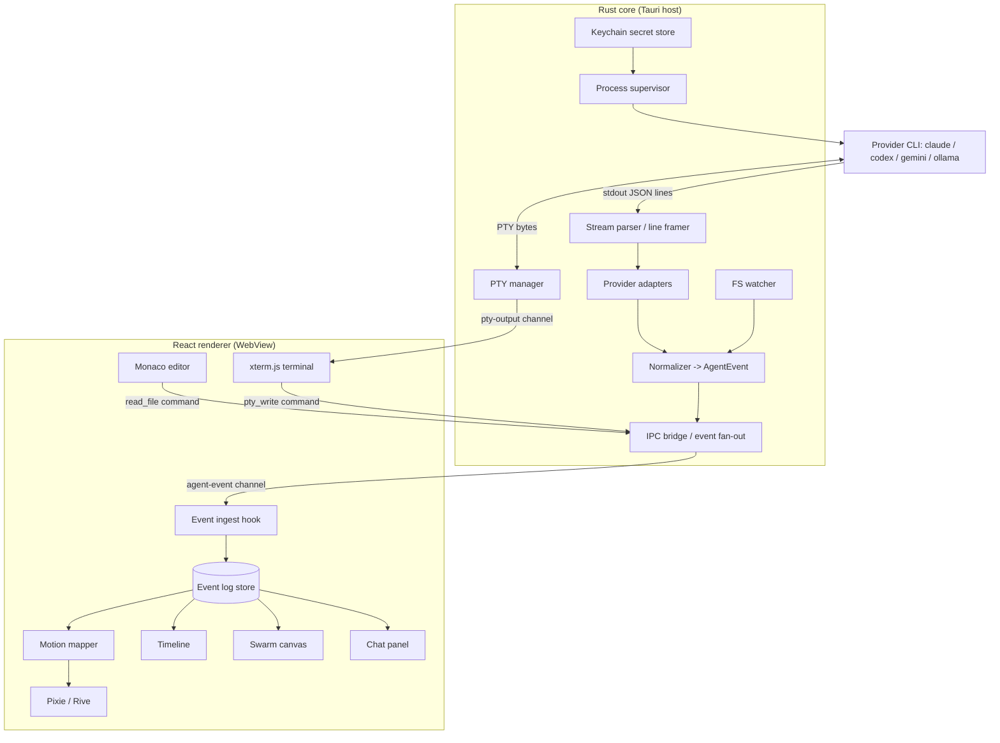
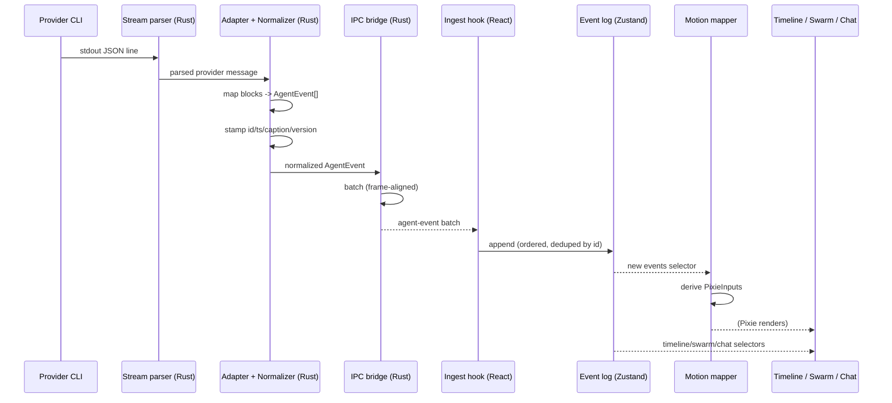
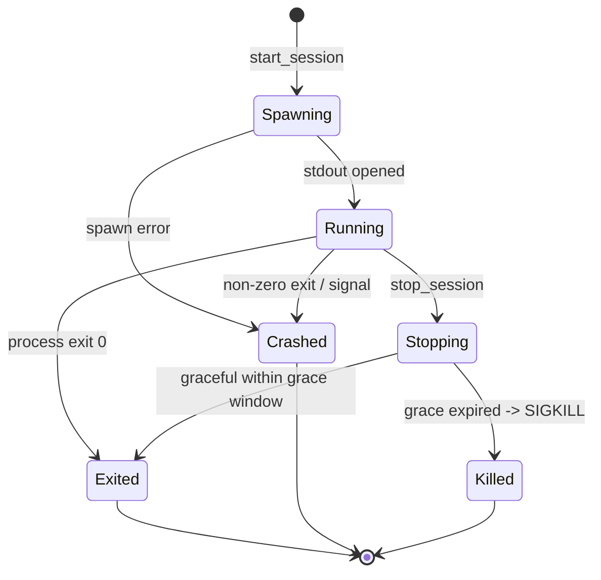
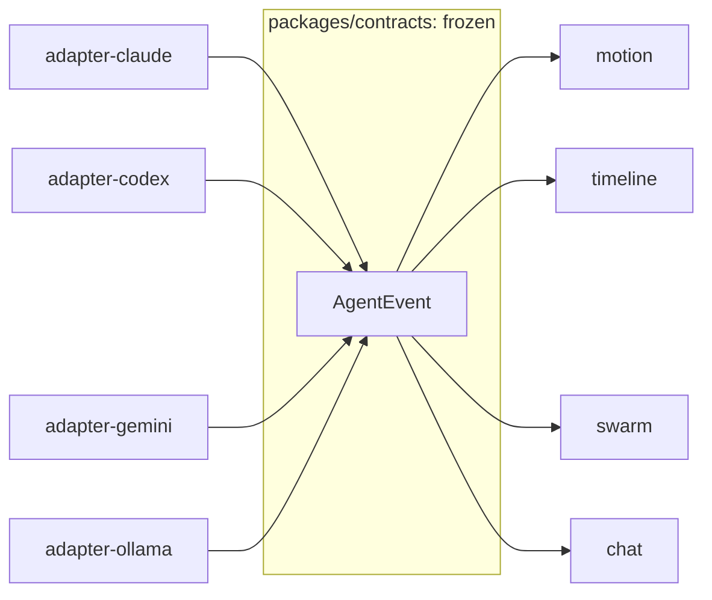

# Architecture

This document is the end to end system design for vsclaude, the cozy pixel-art IDE where a developer watches an AI coding agent work through living animation bound to real events. It defines the split between the Tauri Rust core and the React renderer, the full `AgentEvent` pipeline from a provider process through its adapter to the normalized stream and every visual consumer (motion mapper, timeline, swarm, chat), the IPC bridge contract, process and PTY lifecycle, filesystem watching, state ownership across Zustand stores, threading and backpressure for high-frequency event streams, and failure isolation between packages. It is a contract other engineers build against, not an overview.

## Table of contents

- [1. System overview](#1-system-overview)
- [2. Process model: Rust core vs React renderer](#2-process-model-rust-core-vs-react-renderer)
- [3. Component diagram](#3-component-diagram)
- [4. The AgentEvent pipeline](#4-the-agentevent-pipeline)
- [5. Data-flow diagram](#5-data-flow-diagram)
- [6. IPC bridge design](#6-ipc-bridge-design)
- [7. Process and PTY lifecycle](#7-process-and-pty-lifecycle)
- [8. Filesystem watching](#8-filesystem-watching)
- [9. State ownership: Zustand stores](#9-state-ownership-zustand-stores)
- [10. Threading and backpressure](#10-threading-and-backpressure)
- [11. Failure isolation between packages](#11-failure-isolation-between-packages)
- [12. Package and module map](#12-package-and-module-map)
- [13. Invariants and non-goals](#13-invariants-and-non-goals)

## 1. System overview

vsclaude is a Tauri 2.x desktop application. A Rust core owns everything that touches the operating system: spawning agent processes, driving pseudo-terminals, watching the filesystem, storing secrets in the OS keychain, and bridging all of this to the UI over a typed IPC channel. A React 19 renderer owns everything visual: the Rive-driven Pixie companion, the Monaco editor, the xterm.js terminal surface, the timeline, the sub-agent swarm canvas, and the chat panel.

The two halves communicate through exactly one shared vocabulary: the frozen [`AgentEvent`](../packages/contracts/src/agent-event.ts) contract. Every provider (Claude Code, Codex, Gemini, Ollama) is reduced by a thin adapter to a stream of `AgentEvent` objects, and every pixel the user sees is a function of that stream. This single normalization point is what lets one motion system, one timeline, and one swarm view serve all providers without per-provider branches in the UI.

Three motion rules constrain the whole design and are enforced architecturally, not by convention:

1. **Every animation is bound to a real event.** The motion mapper has no input other than `AgentEvent`. It cannot animate something that did not happen.
2. **Meaning is always recoverable.** Every event carries its `raw` provider payload and its structured `tool`, `payload`, and `caption`. One click in any view drills to the exact tool name, input, diff, command, or raw output.
3. **A non-technical person can follow along.** Every event that drives motion also carries a plain-language `caption`, produced by the adapter, never invented by the UI.

## 2. Process model: Rust core vs React renderer

Tauri runs the Rust core as the host process and the React app inside a system WebView. They share no memory. All cross-boundary traffic is serialized IPC. The table below is the authoritative ownership split. If a responsibility is not listed on the Rust side, the renderer must not attempt it (no direct `fs`, no child process spawning, no raw sockets from JavaScript).

| Concern | Owner | Notes |
| --- | --- | --- |
| Spawn and supervise agent CLI processes | Rust core | One supervised child per session, plus sub-agent children |
| PTY allocation and I/O | Rust core | `portable-pty`, byte streams, resize, signals |
| Stream parsing (stdout JSON lines) | Rust core | Line framing and partial-chunk buffering live here |
| Provider adapter normalization | Rust core | Adapter trait per provider, emits `AgentEvent` |
| Filesystem watching | Rust core | `notify` crate, debounced, scoped to workspace |
| Secret storage (API keys) | Rust core | OS keychain via `keyring`, never crosses IPC in plaintext after store |
| Auto-update | Rust core | Tauri updater |
| Event fan-out to UI | Rust core | Tauri event channel, batched |
| Rive / Pixie rendering | Renderer | State machine inputs `state`, `mood`, `intensity`, `targetX`, `targetY` |
| Motion mapping (`AgentEvent` to Pixie state) | Renderer | Pure function plus a small scheduler |
| Monaco editor | Renderer | Reads file contents through an IPC command |
| Terminal surface (xterm.js) | Renderer | WebGL renderer, bytes proxied from the Rust PTY |
| Timeline, swarm, chat | Renderer | Pure consumers of the in-memory event log |
| App and motion state | Renderer | Zustand stores, Jotai atoms for fine-grained motion |

The guiding principle: the renderer is a deterministic projection of state that the core produces. Given the same ordered `AgentEvent` sequence, the renderer always reaches the same visual state. This makes the UI replayable and testable from recorded event logs with no live process.

## 3. Component diagram



## 4. The AgentEvent pipeline

The pipeline is a linear chain with one fan-out at the end. Each stage has a single responsibility and a typed boundary on both sides.

### 4.1 Stages

1. **Provider process.** The supervisor spawns the agent. For Claude Code the invocation is streaming mode: `claude -p "<prompt>" --output-format stream-json --verbose`, or the Claude Agent SDK in equivalent streaming mode. stdout is a sequence of newline-delimited JSON objects.
2. **Stream parser / line framer.** Reads stdout in chunks, buffers partial lines, and emits one complete JSON value per provider message. It never blocks on a slow consumer; framing happens on the reader thread.
3. **Provider adapter.** Implements a `ProviderAdapter` trait. It takes one provider message and returns zero or more normalized events. This is the only place provider-specific knowledge lives. The Claude Code adapter maps each content block: a thinking block to `thinking`, a text block to `message`, a `tool_use` block to `tool_call` plus a specialized event (`file_edit`, `command_run`, `search`, and so on), and a `tool_result` block to `tool_result`. The `Task` tool that spawns a sub-agent maps to `subagent_spawned`, which is what makes the swarm view come alive with no extra wiring.
4. **Normalizer.** Stamps the cross-cutting fields every event must carry: `id`, `sessionId`, `agentId`, optional `parentAgentId`, `ts`, `provider`, `schemaVersion`, and a plain-language `caption`. The normalizer guarantees the contract shape regardless of provider. Filesystem watcher events also enter here so file changes from the workspace are first-class.
5. **IPC bridge / fan-out.** Batches normalized events and pushes them to the renderer over the `agent-event` channel.
6. **Renderer consumers.** The ingest hook appends to the in-memory event log store. From the log, four independent consumers project state: the **motion mapper** (drives Pixie), the **timeline** (chronological narrative), the **swarm** (one node per `agentId`, edges from `parentAgentId`), and the **chat** (messages, tool calls, results rendered as conversation).

### 4.2 The frozen contract

The contract is versioned and frozen. Adapters target a `schemaVersion`; the renderer refuses unknown major versions.

```ts
// packages/contracts/src/agent-event.ts  (frozen, versioned)
export type AgentEventType =
  | 'session_start' | 'session_end'
  | 'thinking' | 'message'
  | 'tool_call' | 'tool_result'
  | 'file_read' | 'file_edit' | 'file_create' | 'file_delete'
  | 'command_run' | 'command_output'
  | 'search' | 'web_fetch' | 'git_action'
  | 'subagent_spawned' | 'subagent_finished'
  | 'todo_update' | 'permission_request' | 'token_usage'
  | 'error' | 'complete';

export interface AgentEvent {
  id: string;
  sessionId: string;
  agentId: string;
  parentAgentId?: string;
  ts: number;
  type: AgentEventType;
  provider: 'claude-code' | 'codex' | 'gemini' | 'ollama' | string;
  schemaVersion: number;
  tool?: { name: string; input: unknown };
  payload?: Record<string, unknown>;
  caption?: string;
  raw?: unknown;
}
```

### 4.3 Event type to consumer matrix

This table is the wiring reference. It says which consumer reacts to which event type and which Pixie state the motion mapper selects. See the full state catalog in [Motion](./MOTION.md).

| Event type | Pixie state | Timeline | Swarm | Chat |
| --- | --- | --- | --- | --- |
| `session_start` | greeting | start marker | create root node | session banner |
| `thinking` | thinking | thought row | pulse node | thinking bubble |
| `message` | (mood only) | message row | quiet | message |
| `tool_call` | per tool below | tool row | activity tick | tool call card |
| `tool_result` | (resolve) | result row | quiet | result card |
| `file_read` | reading | row + path | quiet | path chip |
| `file_edit` / `file_create` | typing | row + diff link | quiet | diff card |
| `file_delete` | typing | row + path | quiet | path chip |
| `command_run` | running | row + command | quiet | command card |
| `command_output` | running or debugging | output row | quiet | output stream |
| `search` | searching | row + query | quiet | query chip |
| `web_fetch` | web | row + url | quiet | url chip |
| `git_action` | git | row | quiet | git card |
| `subagent_spawned` | spawning | row | add child node + edge | spawn notice |
| `subagent_finished` | (resolve) | row | mark node done | finish notice |
| `todo_update` | planning | plan row | quiet | checklist |
| `permission_request` | waiting | gated row | halo node | approve prompt |
| `token_usage` | (intensity) | meter | quiet | usage chip |
| `error` | debugging or confused | error row | flag node | error card |
| `complete` | success | end marker | mark root done | done banner |

The motion mapper is a pure function `AgentEvent -> Partial<PixieInputs>` plus a small scheduler that handles dwell time, entry and exit blends, and intensity derived from event arrival rate. Because it is pure, it is unit tested with recorded event sequences and snapshotted in Storybook for every state.

## 5. Data-flow diagram



Ordering guarantee: events are appended to the log in the order the Rust core emits them, and the core emits them in the order it parses them per stream. The `id` is monotonic per session, so the ingest hook can dedupe and detect gaps. The renderer never reorders; it only projects.

## 6. IPC bridge design

The bridge has two directions. **Commands** are request/response calls invoked by the renderer (`invoke`). **Event channels** are push streams from the core to the renderer (Tauri `emit` and `listen`). All payloads are typed in the shared contracts package so the Rust `serde` structs and the TypeScript types stay in lockstep; a build step generates the TS types from the Rust definitions to keep them from drifting.

### 6.1 Commands (renderer to core)

| Command | Input | Returns | Purpose |
| --- | --- | --- | --- |
| `start_session` | `{ provider, cwd, prompt, model? }` | `{ sessionId }` | Spawn an agent session |
| `stop_session` | `{ sessionId }` | `void` | Graceful stop, then kill |
| `send_input` | `{ sessionId, text }` | `void` | Feed stdin to the agent |
| `respond_permission` | `{ sessionId, requestId, decision }` | `void` | Approve or deny a `permission_request` |
| `pty_write` | `{ sessionId, bytes }` | `void` | Write to the terminal PTY |
| `pty_resize` | `{ sessionId, cols, rows }` | `void` | Resize the PTY |
| `read_file` | `{ path }` | `{ content, encoding }` | Monaco file load (scoped to workspace) |
| `store_secret` | `{ provider, key }` | `void` | Save an API key to the keychain |
| `has_secret` | `{ provider }` | `boolean` | Check presence without revealing value |
| `replay_log` | `{ path }` | `{ sessionId }` | Re-emit a recorded event log for debugging |

### 6.2 Event channels (core to renderer)

| Channel | Payload | Notes |
| --- | --- | --- |
| `agent-event` | `AgentEvent[]` (batch) | Primary normalized stream, frame-batched |
| `pty-output` | `{ sessionId, bytes }` | Raw terminal bytes, separate from events |
| `session-status` | `{ sessionId, status }` | spawning / running / exited / crashed |
| `fs-change` | `{ paths }` | Coalesced workspace changes for editor refresh |
| `core-error` | `{ scope, message }` | Non-fatal core warnings surfaced to UI |

Channel separation is deliberate. The `agent-event` channel must stay clean and low-jitter for motion. High-volume raw PTY bytes ride their own channel so a noisy build log never starves Pixie. Secrets never travel on any channel after `store_secret` returns; the core injects them into the child process environment at spawn time.

```ts
// packages/ipc/src/client.ts (renderer side, typed wrapper)
import { invoke } from '@tauri-apps/api/core';
import { listen } from '@tauri-apps/api/event';
import type { AgentEvent } from '@vsclaude/contracts';

export const startSession = (args: StartSessionArgs) =>
  invoke<{ sessionId: string }>('start_session', { args });

export const onAgentEvents = (cb: (batch: AgentEvent[]) => void) =>
  listen<AgentEvent[]>('agent-event', (e) => cb(e.payload));
```

## 7. Process and PTY lifecycle

Each session owns one supervised root process. Sub-agents spawned by the agent (for example via the Claude Code `Task` tool) are observed through events rather than spawned by us directly; the agent CLI manages its own children, and we represent them as nodes keyed by `agentId`. The supervisor we run manages the single CLI invocation per session.



Lifecycle rules:

- **Spawn.** The supervisor resolves the provider binary, injects the API key from the keychain into the child environment, sets `cwd` to the workspace, and allocates a PTY if the provider needs a TTY (interactive providers) or pipes if it emits clean JSON to stdout. For Claude Code stream mode, stdout is a pipe (JSON lines) and the PTY is used only for the interactive terminal pane.
- **Read threads.** A dedicated reader thread per stream (stdout, stderr) feeds the framer. These threads never touch the adapter directly; they hand framed messages to a bounded channel consumed by the normalizer task.
- **Stop.** `stop_session` sends a graceful termination (SIGINT, then SIGTERM) and starts a grace timer (default 5 seconds). If the process is still alive when the timer fires, the supervisor sends SIGKILL. The session transitions to `Exited` or `Killed` and emits a `session-status` and a synthetic `complete` or `error` event so the UI resolves Pixie out of any active state.
- **Crash.** A non-zero exit or a killing signal produces a `Crashed` status and an `error` event with the captured stderr tail in `payload`. Pixie moves to `confused` if the error is unresolved.
- **Cleanup.** On any terminal state the supervisor closes the PTY, joins reader threads, and removes the session from the registry. No orphaned file descriptors, no zombie processes. On app shutdown, all sessions are stopped with the same grace path.

## 8. Filesystem watching

The Rust core watches the active workspace with the `notify` crate. The watcher exists for two reasons: to refresh Monaco when files change on disk outside the agent, and to corroborate agent-reported edits (truthful by construction). It is scoped to the workspace root and respects ignore rules (`.gitignore`, `node_modules`, `target`, build output) to avoid drowning in noise.

- **Debounce and coalesce.** Raw OS events are debounced (default 150 ms) and coalesced per path so a single save does not produce a storm.
- **Two outputs.** Coalesced changes go to the renderer on the `fs-change` channel for editor refresh, and, when a change correlates to an agent file operation in flight, the normalizer enriches the corresponding `file_edit` or `file_create` event so the timeline diff link reflects on-disk truth.
- **Bounded queue.** The watcher feeds a bounded queue. If the queue is full (mass change such as a branch switch), it drops to a single coarse "workspace changed" signal rather than emitting thousands of path events. The editor reloads affected open buffers on that signal.

## 9. State ownership: Zustand stores

All renderer state lives in a small number of Zustand stores with clear ownership. Fine-grained motion values that change every frame use Jotai atoms so they do not trigger store-wide subscriber churn. TanStack Query owns async, cached, server-like reads (file contents, secret presence checks) so the stores hold only live, app-owned state.

| Store | Owns | Key state | Updated by |
| --- | --- | --- | --- |
| `sessionStore` | Sessions and their status | `sessions: Record<id, SessionMeta>`, `activeSessionId` | `session-status`, commands |
| `eventLogStore` | The ordered event log | `events: AgentEvent[]`, `byAgent: Map<agentId, idx[]>` | `agent-event` ingest |
| `swarmStore` | Derived agent graph | `nodes`, `edges`, per-node status | selector over event log |
| `pixieStore` | Current Pixie target state | `state`, `mood`, target intent | motion mapper |
| `uiStore` | Layout and panels | open panels, focus, theme | user actions |
| `permissionStore` | Pending permission requests | `pending: Record<requestId, req>` | `permission_request` events |

Jotai motion atoms (separate from `pixieStore`): `intensityAtom`, `targetXAtom`, `targetYAtom`. These are written by the scheduler at animation cadence and read only by the Rive binding component, so per-frame writes never re-render the timeline, swarm, or chat.

The event log is the single source of truth in the renderer. Swarm, timeline, and chat are pure selectors over it. This guarantees that drilling from any view reaches the same underlying `AgentEvent`, satisfying the recoverability rule.

```ts
// Selector example: build the swarm graph from the event log
const selectSwarm = (events: AgentEvent[]): SwarmGraph => {
  const nodes = new Map<string, SwarmNode>();
  const edges: SwarmEdge[] = [];
  for (const e of events) {
    if (!nodes.has(e.agentId)) nodes.set(e.agentId, makeNode(e.agentId));
    if (e.type === 'subagent_spawned' && e.parentAgentId) {
      edges.push({ from: e.parentAgentId, to: e.agentId });
    }
    if (e.type === 'subagent_finished') markDone(nodes, e.agentId);
  }
  return { nodes: [...nodes.values()], edges };
};
```

## 10. Threading and backpressure

High-frequency streams (a verbose agent, a chatty build) can produce thousands of messages per second. The design keeps the UI at a stable frame rate by enforcing bounded queues at every hop and by batching at the IPC boundary.

### 10.1 Rust side

- **Reader threads** (one per stream) do only framing and push to a bounded `crossbeam` channel. If the channel is full they block the reader, which applies natural OS-level backpressure on the child via pipe buffers. This is intentional: we would rather slow the firehose than lose ordering or blow up memory.
- **Normalizer task** (async, single per session) drains the channel, runs the adapter, stamps fields, and pushes `AgentEvent` into the **emit buffer**.
- **Emit buffer** is a bounded ring per session. A frame-aligned flusher (every 16 ms, roughly one display frame) drains the buffer and emits one `agent-event` batch. Batching collapses bursts into one IPC crossing, which is the single biggest jitter reducer.
- **PTY bytes** ride a separate path with their own bounded buffer and their own flusher so terminal volume never delays the event channel.

### 10.2 Renderer side

- The ingest hook appends a whole batch in one store update, so React renders once per batch, not once per event.
- The motion mapper coalesces: within a flush window it considers only the latest motion-relevant event plus an aggregate intensity. If 200 `command_output` events arrive in one frame, Pixie shows one `running` state at high intensity, not 200 transitions.
- If the renderer falls behind (visibility lost, GPU stall), the core detects backpressure via the emit buffer filling and switches that session to a **coarse mode**: it summarizes runs of same-type events into periodic synthetic events (for example one `command_output` summary per 100 ms) until the renderer catches up. Detail is never lost because the full log is still recoverable from the recorded raw stream on disk.
- PixiJS is the escape hatch for the swarm: if DOM-based swarm rendering stalls past a budget, the swarm view switches to a PixiJS canvas renderer with the same data, keeping the UI responsive.

| Hop | Mechanism | Bound | Overflow behavior |
| --- | --- | --- | --- |
| Child stdout to reader | OS pipe | OS buffer | Child blocks (desired) |
| Reader to normalizer | crossbeam channel | N messages | Reader blocks |
| Normalizer to emit buffer | ring buffer | M events | Coarse-mode summarization |
| Core to renderer | Tauri batch emit | per 16 ms frame | Coalesced into one batch |
| Renderer ingest to motion | coalesce window | latest + intensity | Drop intermediate transitions |

## 11. Failure isolation between packages

The monorepo is split so a failure in one package cannot take down the whole app. Boundaries are enforced by error boundaries (React), `Result` types and panic catching (Rust), and the IPC contract.

- **Adapter isolation.** Each provider adapter is fallible by type. A malformed provider message produces a `core-error` plus a synthetic `error` `AgentEvent`, never a panic that kills the session loop. Unknown block types degrade to a generic `message` event with the raw payload preserved, so meaning is still recoverable.
- **Session isolation.** Sessions are independent supervisor entries. A crash or hang in one session never blocks another; each has its own threads, channels, and emit buffer.
- **Renderer view isolation.** Each major view (Pixie, timeline, swarm, chat, editor, terminal) is wrapped in its own React error boundary. If the swarm renderer throws, the timeline and chat keep working and the swarm shows a recoverable fallback with a retry. The Rive canvas has its own boundary plus the sprite-sheet fallback animator: if Rive fails to load or errors, Pixie continues as sprites with the same state inputs.
- **IPC isolation.** A failed command rejects its promise with a typed error; it never crashes the renderer. A dropped event channel triggers re-subscription and a gap check against `id` monotonicity; gaps are backfilled from the core's in-memory ring or flagged.
- **Contract as firewall.** Because every visual consumer depends only on `AgentEvent` and never on a provider's raw shape, a breaking change in a provider CLI is contained entirely within its adapter. The blast radius of a provider change is exactly one package.



## 12. Package and module map

```text
vsclaude/
  apps/
    desktop/                 Tauri app shell (Rust core + React entry)
      src-tauri/             Rust: supervisor, pty, adapters, normalizer, ipc, fs-watch, keychain
      src/                   React entry, layout, wiring
  packages/
    contracts/               Frozen AgentEvent + IPC payload types (source of truth)
    ipc/                     Typed invoke/listen wrappers (renderer)
    motion/                  Motion mapper, Pixie binding, sprite fallback
    timeline/                Timeline view + selectors
    swarm/                   Swarm graph view (DOM + PixiJS fallback)
    chat/                    Chat panel view
    editor/                  Monaco integration
    terminal/                xterm.js integration
    state/                   Zustand stores + Jotai motion atoms
    ui/                      Design system (Tailwind v4 tokens, primitives)
```

Rust crate boundaries inside `src-tauri` mirror the responsibilities: `supervisor`, `pty`, `adapter` (with a submodule per provider), `normalizer`, `bridge`, `fswatch`, `secrets`. Each exposes a narrow interface and returns `Result`, so a fault in one crate surfaces as a typed error rather than a process abort.

## 13. Invariants and non-goals

**Invariants (must always hold):**

- The renderer consumes only `AgentEvent` and PTY bytes. No provider-specific logic in any view.
- Every motion transition traces to exactly one `AgentEvent`. No purely decorative animation.
- Every event carries `raw` and structured detail so one click recovers full meaning.
- Every motion-driving event carries a plain-language `caption` from the adapter.
- Secrets live in the OS keychain and enter only the child process environment. They never cross an event channel.
- The event log is the single renderer source of truth; all views are pure projections.
- `npm`/`pnpm` build and type checks pass; the contract types are generated, not hand-synced.

**Non-goals (explicitly out of scope here):**

- Provider-specific UI affordances. Anything provider-specific lives in its adapter and is normalized away.
- Persisting full session history to a database. Recorded raw logs on disk plus the in-memory log are sufficient for replay; durable storage is a separate spec.
- Multi-window or multi-machine sync. Single window, single host for now.

For the motion state catalog and Pixie input mapping see [Motion](./MOTION.md). For the provider adapter contract see [Providers](./PROVIDERS.md). For the IPC type generation pipeline see [IPC](./IPC.md).
