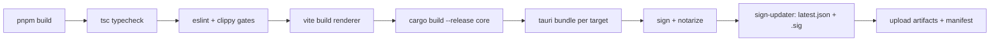
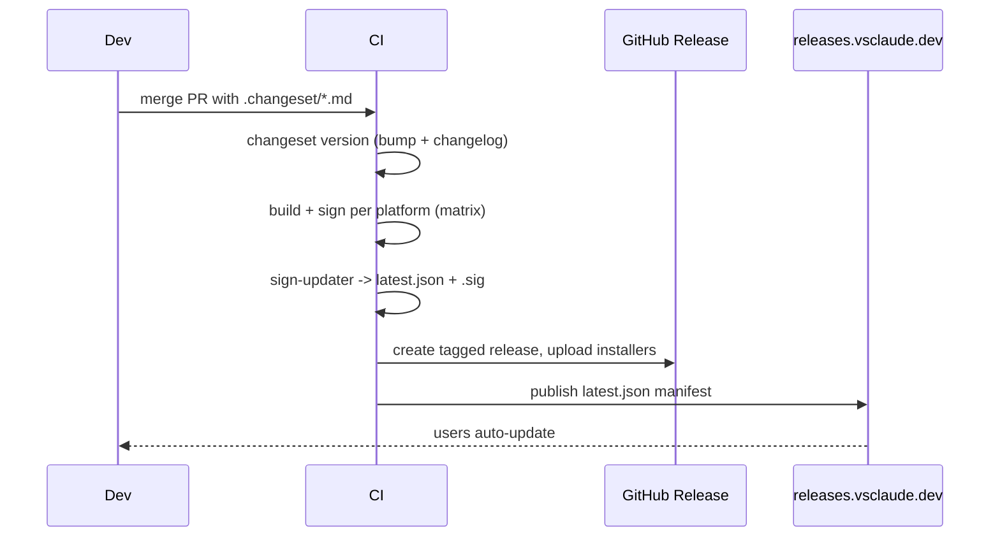

# BUILD_AND_DISTRIBUTION

This document is the canonical guide for building vsclaude from source and shipping it to users. It covers the local developer setup (including the Rust toolchain prerequisite), the pnpm script surface, the cross-platform installer matrix (macOS notarized `.dmg`, Windows `.msi` and NSIS `.exe`, Linux `.AppImage` and `.deb`), code signing and notarization, the one-line install script, auto-update via the Tauri updater, and the full release process driven by Changesets. It is a contract the release engineer and any contributor build against, not a tutorial. vsclaude is a Tauri 2.x app: a Rust core plus a React 19 renderer, packaged into a single signed desktop binary per platform.

## Table of contents

- [1. Goals and invariants](#1-goals-and-invariants)
- [2. Repository layout](#2-repository-layout)
- [3. Prerequisites](#3-prerequisites)
- [4. From clone to running app](#4-from-clone-to-running-app)
- [5. The pnpm script surface](#5-the-pnpm-script-surface)
- [6. Build pipeline overview](#6-build-pipeline-overview)
- [7. Installer matrix](#7-installer-matrix)
- [8. Code signing and notarization](#8-code-signing-and-notarization)
- [9. One-line install script](#9-one-line-install-script)
- [10. Auto-update with the Tauri updater](#10-auto-update-with-the-tauri-updater)
- [11. Release process with Changesets](#11-release-process-with-changesets)
- [12. CI pipeline](#12-ci-pipeline)
- [13. Versioning, channels, and rollback](#13-versioning-channels-and-rollback)
- [14. Troubleshooting](#14-troubleshooting)

## 1. Goals and invariants

1. **Effortless install.** A non-technical user downloads one signed file per platform, double-clicks, and runs. No terminal, no manual dependency install, no Gatekeeper or SmartScreen scare screens on signed builds.
2. **One source of truth for version.** The version lives in `apps/desktop/src-tauri/tauri.conf.json` and is propagated by Changesets. No file drifts.
3. **Reproducible builds.** Given a tag, CI produces byte-stable installers from a clean checkout with pinned toolchains. Local builds match CI.
4. **Signed and verifiable everywhere.** Every shipped artifact is signed for its platform, and every auto-update payload carries a detached signature the updater verifies before applying.
5. **No secrets in the repo.** Signing identities, notarization credentials, and the updater private key live only in CI secrets and developer keychains. See [Permissions and Safety](./PERMISSIONS_AND_SAFETY.md) for the secret-handling rules.

## 2. Repository layout

The relevant build surfaces in the pnpm monorepo:

```text
vsclaude/
  apps/
    desktop/                  Tauri app (the only thing that ships)
      package.json            front-end build scripts, @tauri-apps/cli
      src/                    React 19 renderer (Vite)
      vite.config.ts
      src-tauri/
        Cargo.toml            Rust core crate
        tauri.conf.json       bundle, updater, signing config
        build.rs
        src/                  Rust core (process/PTY/IPC/keychain)
        icons/                generated app icons per platform
        capabilities/         Tauri capability ACLs
  packages/
    contracts/                frozen AgentEvent schema (consumed by core + UI)
    motion/  swarm/  ui/  ... library packages
  scripts/
    install.sh                the one-line installer (hosted at get.vsclaude.dev)
    notarize.mjs              macOS notarization helper
    sign-updater.mjs          signs update artifacts + generates latest.json
  .changeset/                 pending changesets
  pnpm-workspace.yaml
  package.json                root scripts, Changesets, Turbo (optional)
```

Only `apps/desktop` produces a shippable binary. Everything under `packages/*` is a workspace dependency compiled into the renderer bundle or the Rust core.

## 3. Prerequisites

vsclaude requires both a JavaScript toolchain and a native Rust toolchain, because Tauri compiles a Rust host binary and links against platform WebView and crypto libraries.

| Tool | Minimum version | Purpose | Install |
| --- | --- | --- | --- |
| Node.js | 20 LTS (22 recommended) | Renderer build, scripts | nvm, fnm, or official installer |
| pnpm | 9.x | Workspace package manager | `corepack enable && corepack prepare pnpm@latest --activate` |
| Rust | stable 1.80+ via rustup | Tauri Rust core | see below |
| Tauri CLI | 2.x | Build and dev orchestration | provided by `@tauri-apps/cli` devDependency |

### 3.1 The Rust toolchain (required on every platform)

Install rustup, which provides `cargo`, `rustc`, and target management. This is a hard prerequisite: without it `pnpm tauri build` fails at the linking stage.

```bash
# macOS / Linux
curl --proto '=https' --tlsv1.2 -sSf https://sh.rustup.rs | sh
source "$HOME/.cargo/env"
rustc --version   # expect 1.80.0 or newer
```

```powershell
# Windows: download and run rustup-init.exe from https://rustup.rs
# It will prompt to install the MSVC toolchain if missing.
rustc --version
```

### 3.2 Platform-specific native dependencies

These provide the C linker, the system WebView, and crypto headers that Tauri links against.

| Platform | Required packages | Command |
| --- | --- | --- |
| macOS | Xcode Command Line Tools (clang, codesign) | `xcode-select --install` |
| Windows | MSVC C++ build tools + Windows 10/11 SDK; WebView2 runtime (preinstalled on Win11) | install "Desktop development with C++" via Visual Studio Build Tools |
| Linux (Debian/Ubuntu) | `build-essential`, WebKitGTK, and friends | see block below |

```bash
# Linux (Debian/Ubuntu) build dependencies for Tauri 2.x
sudo apt update
sudo apt install -y \
  build-essential curl wget file \
  libwebkit2gtk-4.1-dev \
  libssl-dev \
  libayatana-appindicator3-dev \
  librsvg2-dev \
  patchelf
```

> Windows note: the MSVC build tools are mandatory. The GNU toolchain (`-gnu` targets) is not supported for vsclaude because the WebView2 and updater bindings assume the MSVC ABI.

## 4. From clone to running app

The complete path from a fresh machine to a running dev window:

```bash
# 1. Clone
git clone https://github.com/vsclaude/vsclaude.git
cd vsclaude

# 2. Enable pnpm via corepack (one time per machine)
corepack enable

# 3. Install the Rust toolchain if you have not already (section 3.1)
#    rustc --version  -> must print 1.80+

# 4. Install JS dependencies for the whole workspace
pnpm install

# 5. Run the desktop app in dev mode (Vite HMR + Rust core with hot reload)
pnpm dev
```

`pnpm dev` proxies to `pnpm --filter @vsclaude/desktop tauri dev`, which:

1. starts the Vite dev server for the renderer on a local port,
2. compiles the Rust core in debug mode (first build is slow; later builds are incremental),
3. launches the native window pointed at the Vite server with hot reload on both sides.

To produce installers locally instead:

```bash
pnpm build          # type-check + build the renderer bundle, then bundle Tauri
# artifacts land in apps/desktop/src-tauri/target/release/bundle/
```

## 5. The pnpm script surface

Root `package.json` defines the orchestration scripts. Library packages are built through the workspace filter graph.

| Script | What it does |
| --- | --- |
| `pnpm dev` | Run the desktop app in dev mode (renderer HMR + Rust hot reload). |
| `pnpm build` | Type-check, lint-gate, build renderer, then `tauri build` for the host OS. |
| `pnpm build:debug` | Same as `build` but a debug Rust profile and devtools enabled. |
| `pnpm test` | Vitest unit suite across packages. |
| `pnpm test:e2e` | Playwright end-to-end against a built binary. |
| `pnpm test:rust` | `cargo test` in `src-tauri`. |
| `pnpm lint` | ESLint + Prettier check + `cargo clippy`. |
| `pnpm typecheck` | `tsc --noEmit` across the workspace. |
| `pnpm storybook` | Component and Pixie-state stories. |
| `pnpm changeset` | Open the Changesets prompt to record a version bump. |
| `pnpm version-packages` | Apply pending changesets, bump versions, update changelogs. |
| `pnpm release` | Build, sign, and publish artifacts (CI only; see section 11). |

Representative root script wiring:

```json
{
  "scripts": {
    "dev": "pnpm --filter @vsclaude/desktop tauri dev",
    "build": "pnpm typecheck && pnpm lint && pnpm --filter @vsclaude/desktop tauri build",
    "test": "vitest run",
    "test:rust": "cargo test --manifest-path apps/desktop/src-tauri/Cargo.toml",
    "lint": "eslint . && prettier --check . && cargo clippy --manifest-path apps/desktop/src-tauri/Cargo.toml -- -D warnings",
    "typecheck": "tsc --noEmit -p tsconfig.json",
    "changeset": "changeset",
    "version-packages": "changeset version && pnpm install --lockfile-only",
    "release": "node scripts/release.mjs"
  }
}
```

## 6. Build pipeline overview



The renderer bundle is produced by Vite into `apps/desktop/dist`, the Rust core is compiled in release mode, and Tauri's bundler stitches them into a platform installer. Signing and updater-manifest generation are post-bundle steps. Each stage is a gate: a failed type-check or clippy warning stops the build before any artifact is produced.

## 7. Installer matrix

`tauri.conf.json` declares the bundle targets per platform. The matrix below is the shipped set.

| Platform | Format | Extension | Signed by | Auto-update target |
| --- | --- | --- | --- | --- |
| macOS (Apple Silicon + Intel) | Disk image | `.dmg` | Apple Developer ID, notarized + stapled | `.app.tar.gz` + `.sig` |
| Windows | Windows Installer | `.msi` | Authenticode (EV or OV) | `.msi` + `.sig` |
| Windows | NSIS installer | `.exe` | Authenticode | `.nsis.zip` + `.sig` |
| Linux | Portable bundle | `.AppImage` | GPG detached + updater key | `.AppImage` + `.sig` |
| Linux | Debian package | `.deb` | repo GPG signature | not auto-updated (use apt) |

Notes:

- macOS ships a **universal** binary (`aarch64` + `x86_64` merged) so one `.dmg` covers all Macs.
- The `.deb` is installed through the system package manager and updates through apt, so it is intentionally excluded from the in-app Tauri updater. Users who want in-app auto-update should use the `.AppImage`.
- Windows ships both `.msi` (for managed/enterprise deployment via Group Policy) and the NSIS `.exe` (the default friendly installer for individuals).

Relevant bundle config:

```jsonc
// apps/desktop/src-tauri/tauri.conf.json (excerpt)
{
  "bundle": {
    "active": true,
    "targets": ["dmg", "msi", "nsis", "appimage", "deb"],
    "identifier": "dev.vsclaude.app",
    "macOS": {
      "minimumSystemVersion": "11.0",
      "signingIdentity": "Developer ID Application: vsclaude (TEAMID)",
      "entitlements": "entitlements.plist"
    },
    "windows": {
      "certificateThumbprint": null,
      "digestAlgorithm": "sha256",
      "timestampUrl": "http://timestamp.digicert.com"
    },
    "linux": {
      "deb": { "depends": ["libwebkit2gtk-4.1-0", "libayatana-appindicator3-1"] }
    }
  }
}
```

## 8. Code signing and notarization

Signing is mandatory for every shipped artifact. Unsigned builds are for local development only and must never reach the release channel.

### 8.1 macOS

1. Sign the `.app` with a **Developer ID Application** certificate (`codesign`, hardened runtime, `entitlements.plist`).
2. Submit the `.dmg` to Apple notarization (`notarytool`).
3. Staple the notarization ticket so the app launches offline without a Gatekeeper round trip.

Credentials supplied via environment (set in CI secrets, never committed):

```bash
APPLE_CERTIFICATE            # base64 .p12 of the Developer ID cert
APPLE_CERTIFICATE_PASSWORD
APPLE_SIGNING_IDENTITY       # "Developer ID Application: ... (TEAMID)"
APPLE_ID                     # Apple account email for notarization
APPLE_PASSWORD               # app-specific password
APPLE_TEAM_ID
```

Tauri runs notarization automatically when these are present. `scripts/notarize.mjs` is the fallback for manual or re-notarization runs.

### 8.2 Windows

Sign `.msi` and `.exe` with Authenticode using an OV or EV code-signing certificate and a timestamp server (so signatures stay valid after the cert expires). EV certificates clear Microsoft SmartScreen reputation immediately; OV builds reputation over time.

```bash
WINDOWS_CERTIFICATE          # base64 .pfx
WINDOWS_CERTIFICATE_PASSWORD
```

### 8.3 Linux

`.AppImage` carries a GPG-signed update payload (the updater signature, section 10). The `.deb` is signed at the apt-repository level with the project's release GPG key so `apt` can verify provenance.

### 8.4 Updater signing key (all platforms)

Separate from OS code signing, the Tauri updater uses its own minisign keypair. The **private** key signs every update artifact; the **public** key is embedded in the app. The private key lives only in CI:

```bash
TAURI_SIGNING_PRIVATE_KEY
TAURI_SIGNING_PRIVATE_KEY_PASSWORD
```

> The updater key is the single most sensitive secret in the project. Anyone holding it can push a signed malicious update to every user. Store it in a hardware-backed secret manager, rotate on suspected exposure, and restrict CI access to release workflows only.

## 9. One-line install script

For developers and Linux/macOS power users, `scripts/install.sh` is hosted at `https://get.vsclaude.dev` and detects OS plus architecture, downloads the correct signed artifact from the latest GitHub release, verifies its checksum, and installs it.

```bash
curl -fsSL https://get.vsclaude.dev | sh
```

Behavior contract:

1. Detect `uname -s` (Darwin/Linux) and `uname -m` (arm64/x86_64). Windows users are redirected to the `.exe` download page.
2. Resolve the latest stable release tag via the GitHub releases API (honor `VSCLAUDE_VERSION` env override for pinning).
3. Download the matching artifact and its `.sha256`, then verify the checksum before touching the install location.
4. On macOS: mount the `.dmg`, copy `vsclaude.app` into `/Applications`, unmount.
5. On Linux: place the `.AppImage` in `~/.local/bin/vsclaude`, `chmod +x`, and write a `.desktop` entry.
6. Print the installed version and exit non-zero on any verification failure.

The script is POSIX `sh`, idempotent, and never requires `sudo` for the per-user install path. Always read a piped install script before running it; the source is in the repo for audit.

## 10. Auto-update with the Tauri updater

vsclaude updates itself through the Tauri updater plugin. The app periodically checks a static manifest, and if a newer signed version exists, it downloads, verifies the signature against the embedded public key, and applies the update on next launch.

### 10.1 Configuration

```jsonc
// apps/desktop/src-tauri/tauri.conf.json (excerpt)
{
  "plugins": {
    "updater": {
      "active": true,
      "endpoints": [
        "https://releases.vsclaude.dev/{{target}}/{{arch}}/{{current_version}}"
      ],
      "dialog": false,
      "pubkey": "dW50cnVzdGVkIGNvbW1lbnQ6...PUBLIC_MINISIGN_KEY..."
    }
  }
}
```

`dialog` is `false` because vsclaude drives the update UX in the renderer (a Pixie-led prompt), not the default OS dialog. The endpoint template lets the server return per-target, per-arch manifests.

### 10.2 The manifest

The server responds with a `latest.json` describing the newest build and a per-platform detached signature:

```json
{
  "version": "1.4.0",
  "notes": "Swarm view performance, Gemini adapter fixes.",
  "pub_date": "2026-06-21T12:00:00Z",
  "platforms": {
    "darwin-universal": {
      "signature": "dW50cnVzdGVkIGNvbW1lbnQ6...",
      "url": "https://releases.vsclaude.dev/1.4.0/vsclaude_universal.app.tar.gz"
    },
    "windows-x86_64": {
      "signature": "dW50cnVzdGVkIGNvbW1lbnQ6...",
      "url": "https://releases.vsclaude.dev/1.4.0/vsclaude_x64_en-US.msi"
    },
    "linux-x86_64": {
      "signature": "dW50cnVzdGVkIGNvbW1lbnQ6...",
      "url": "https://releases.vsclaude.dev/1.4.0/vsclaude_amd64.AppImage"
    }
  }
}
```

### 10.3 Update flow in the renderer

```ts
import { check } from '@tauri-apps/plugin-updater';
import { relaunch } from '@tauri-apps/plugin-process';

export async function checkForUpdate(onProgress: (pct: number) => void) {
  const update = await check();
  if (!update) return { status: 'up-to-date' as const };

  let downloaded = 0;
  let total = 0;
  await update.downloadAndInstall((event) => {
    if (event.event === 'Started') total = event.data.contentLength ?? 0;
    if (event.event === 'Progress') {
      downloaded += event.data.chunkLength;
      if (total > 0) onProgress(downloaded / total);
    }
  });
  // Signature was verified by the core against the embedded pubkey before install.
  await relaunch();
  return { status: 'installed' as const, version: update.version };
}
```

The signature check happens in the Rust core before the payload is written to disk. A failed verification aborts the update and surfaces an `error` AgentEvent rather than silently retrying. The renderer never applies an update the core has not validated.

## 11. Release process with Changesets

Versioning is driven by [Changesets](https://github.com/changesets/changesets). Every user-facing change ships with a changeset describing the bump.

### 11.1 Author a change

```bash
pnpm changeset
# select affected packages, choose patch/minor/major, write a summary
# commits a markdown file under .changeset/
```

### 11.2 Cut a release



The release job runs only on the default branch and only when pending changesets exist:

1. `changeset version` consumes `.changeset/*.md`, bumps `tauri.conf.json` and package versions, and writes changelogs.
2. The platform matrix builds and signs all installers.
3. `scripts/sign-updater.mjs` produces the detached `.sig` files and assembles `latest.json`.
4. CI creates a GitHub Release tagged `v<version>`, attaches the installers and checksums, and publishes the manifest to the CDN.
5. The CDN swap of `latest.json` is the atomic "go live" moment for auto-update.

### 11.3 Version source of truth

The semantic version flows from changesets into `tauri.conf.json` `version`, which Tauri stamps into every installer and into `current_version` for the updater. No other file declares the app version independently.

## 12. CI pipeline

CI uses a platform matrix because Tauri installers must be built on their target OS (macOS for `.dmg`, Windows for `.msi`/`.exe`, Linux for `.AppImage`/`.deb`).

| Job | Runner | Produces |
| --- | --- | --- |
| `lint-test` | ubuntu-latest | type-check, ESLint, clippy, Vitest, cargo test |
| `build-macos` | macos-14 (arm64) | universal `.dmg`, notarized + stapled |
| `build-windows` | windows-latest | signed `.msi` and NSIS `.exe` |
| `build-linux` | ubuntu-22.04 | `.AppImage`, `.deb` |
| `release` | ubuntu-latest | GitHub Release, manifest publish |

Caching guidelines: cache the Cargo registry and `target` directory keyed on `Cargo.lock`, and the pnpm store keyed on `pnpm-lock.yaml`. Pin the Rust toolchain with a `rust-toolchain.toml` so CI and local builds use the same compiler.

```toml
# rust-toolchain.toml
[toolchain]
channel = "1.80.0"
components = ["clippy", "rustfmt"]
targets = ["aarch64-apple-darwin", "x86_64-apple-darwin"]
```

## 13. Versioning, channels, and rollback

- **Channels.** `stable` and `beta`. Beta builds publish to a separate manifest endpoint (`releases.vsclaude.dev/beta/...`) and are opt-in from Settings. Pre-1.0 the version carries a `-beta.N` suffix that Changesets manages.
- **Rollback.** Because auto-update is just a static `latest.json`, rollback is repointing the manifest to the previous version's artifacts. Keep at least the last three releases' artifacts hot on the CDN so a rollback never 404s. Never delete an artifact that an older `latest.json` referenced.
- **Forced minimum version.** The manifest may include a `minimum_version` the app honors to block known-broken builds from skipping a critical fix.
- **Compatibility.** The `schemaVersion` on [`AgentEvent`](../packages/contracts/src/agent-event.ts) is independent of the app version. A renderer must tolerate persisted sessions from one schema major behind; see [Sessions](./SESSIONS_SPEC.md).

## 14. Troubleshooting

| Symptom | Likely cause | Fix |
| --- | --- | --- |
| `linker 'cc' not found` (Linux) | missing `build-essential` | `sudo apt install build-essential` |
| `error: linker 'link.exe' not found` (Windows) | MSVC build tools absent | install "Desktop development with C++" |
| `failed to run custom build command for webkit2gtk` | missing `libwebkit2gtk-4.1-dev` | install the Linux deps block (section 3.2) |
| `xcrun: error: invalid active developer path` (macOS) | Command Line Tools missing | `xcode-select --install` |
| Notarization stuck "In Progress" | Apple queue or invalid entitlements | `notarytool log <id>` to read rejection reason |
| Updater says "signature did not match" | wrong `pubkey` or artifact re-signed after manifest | regenerate `latest.json` from the signed artifact, never edit it by hand |
| SmartScreen warning on Windows | OV cert without reputation yet | ship more signed builds, or use an EV certificate |
| `app is damaged and can't be opened` (macOS) | unsigned or unstapled build downloaded | ship only notarized + stapled `.dmg` |
| First Rust build extremely slow | cold Cargo cache | expected once; subsequent incremental builds are fast |

## Related specs

- [Architecture](./ARCHITECTURE.md): the Rust core and renderer split that this build wraps.
- [Tech Stack](./TECH_STACK.md): why Tauri, pnpm, and Changesets are the locked choices here.
- [Permissions and Safety](./PERMISSIONS_AND_SAFETY.md): secret handling for signing and updater keys.
- [Settings, Themes, Persistence](./SETTINGS_THEMES_PERSISTENCE.md): the update-channel toggle surfaced to users.
- [Testing Strategy](./TESTING_STRATEGY.md): the gates CI runs before any artifact is built.
