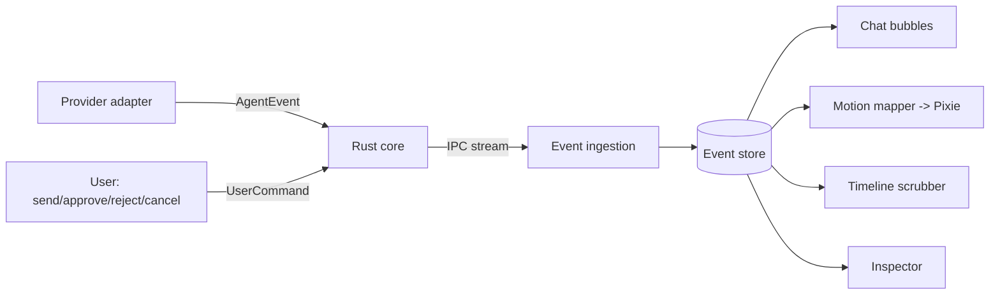

# Chat and Interaction Spec

This spec defines the human-facing interaction surface of vsclaude: the conversation panel where a developer talks to their agent in natural language, plan mode rendered as Pixie's animated checklist, the diff review UI for approving or rejecting changes, and the tool-call inspector for full drill-down into any `AgentEvent`. It also defines the synchronization contract that keeps chat, motion, and the timeline reading from the same source of truth. Everything here consumes only the frozen `AgentEvent` stream (see [Architecture](./ARCHITECTURE.md) and the [Event Schema](./EVENT_SCHEMA.md)). No component invents data, and every visible element drills back to its underlying event in one click, honoring the three motion rules: bound to a real event, meaning always recoverable, and plain-language captions for non-technical viewers.

## Table of contents

1. [Scope and principles](#scope-and-principles)
2. [Layout and surfaces](#layout-and-surfaces)
3. [State model](#state-model)
4. [Conversation panel](#conversation-panel)
5. [Plan mode (animated checklist)](#plan-mode-animated-checklist)
6. [Diff review UI](#diff-review-ui)
7. [Tool-call inspector](#tool-call-inspector)
8. [Sync: chat, motion, and timeline](#sync-chat-motion-and-timeline)
9. [Permissions and approvals](#permissions-and-approvals)
10. [Accessibility](#accessibility)
11. [Performance budgets](#performance-budgets)
12. [Testing](#testing)
13. [Open questions](#open-questions)

## Scope and principles

This module owns the right rail and center column of the workspace: chat input and history, the plan checklist, diff review, and the inspector drawer. It does not own the Pixie stage (see [Motion Spec](./MOTION_SPEC.md)) or the swarm view (see [Swarm Spec](./SWARM_SPEC.md)), but it shares one selection and timeline state with both.

Three invariants govern every pixel:

1. **Bound to a real event.** Every chat bubble, checklist row, diff, and inspector field maps to one or more `AgentEvent`s by `id`. There is no decorative content. If you see it, you can find the event that produced it.
2. **Meaning is recoverable.** A single click on any rendered artifact opens the tool-call inspector at the exact event, exposing tool name, raw input, raw output, and the original provider payload.
3. **Plain-language captions.** Every event carries a `caption` (or the adapter synthesizes one). Captions are the default reading layer. Technical detail is one interaction away, never in your face.

## Layout and surfaces

```
+-------------------------------------------------------------------------+
|  Top bar: session, provider, model, token usage, run/stop               |
+----------------+--------------------------------------+-----------------+
|                |                                      |                 |
|  Pixie stage   |   Center: Monaco editor / Diff /     |  Conversation   |
|  (Rive)        |   Terminal (xterm.js)                |  panel (chat)   |
|                |                                      |                 |
|                |                                      |  Plan checklist |
+----------------+--------------------------------------+-----------------+
|  Timeline scrubber (full AgentEvent stream, all agents)                 |
+-------------------------------------------------------------------------+
|  Tool-call inspector drawer (slides up over center+right when open)     |
+-------------------------------------------------------------------------+
```

| Surface | Component | Source data | Drill target |
| --- | --- | --- | --- |
| Conversation panel | `<ConversationPanel>` | `message`, `thinking`, `error`, `complete` events | Inspector on any bubble |
| Plan checklist | `<PlanChecklist>` | `todo_update` events | Inspector on row, diff on completed file rows |
| Diff review | `<DiffReview>` | `file_edit`, `file_create`, `file_delete` events | Inspector, file in editor |
| Tool inspector | `<ToolInspector>` | any `AgentEvent` | n/a (terminal drill-down) |
| Timeline | `<TimelineScrubber>` | full event stream | selects event everywhere |

All four surfaces are pure consumers of the event store. None of them calls a provider directly. Input from the user (chat send, approve, reject) flows back through a single command channel described in [Sync](#sync-chat-motion-and-timeline).

## State model

State lives in two Zustand stores plus TanStack Query for any cached async reads. Fine-grained motion values (current Pixie target, intensity) use Jotai atoms so motion can update at 60fps without re-rendering chat.

```ts
// packages/state/src/interaction-store.ts
import { create } from 'zustand';
import type { AgentEvent } from '@vsclaude/contracts';

export type ChatComposerMode = 'chat' | 'plan';

export interface PendingApproval {
  eventId: string;             // the permission_request or file_edit event
  kind: 'permission' | 'diff';
  createdAt: number;
}

export interface InteractionState {
  // selection is shared by chat, motion highlight, timeline, and inspector
  selectedEventId: string | null;
  inspectorOpen: boolean;
  composerMode: ChatComposerMode;
  follow: boolean;             // true = auto-scroll to live; false = user scrubbed back
  pendingApprovals: PendingApproval[];

  select(eventId: string | null): void;
  openInspector(eventId: string): void;
  closeInspector(): void;
  setFollow(follow: boolean): void;
  setComposerMode(mode: ChatComposerMode): void;
  enqueueApproval(a: PendingApproval): void;
  resolveApproval(eventId: string): void;
}
```

```ts
// packages/state/src/event-store.ts
export interface EventStoreState {
  byId: Map<string, AgentEvent>;
  order: string[];                 // append-only event ids in ts order
  bySession: Map<string, string[]>;
  byAgent: Map<string, string[]>;  // for swarm and subagent threads
  cursor: number;                  // index into order at the timeline playhead
  ingest(event: AgentEvent): void; // idempotent on event.id
  rangeFor(agentId: string): AgentEvent[];
}
```

The event store is append-only and idempotent. Re-ingesting an event with the same `id` is a no-op, which makes reconnection and replay safe. Everything visual derives from `byId` plus `order`; the playhead `cursor` decides what is "now" when the user scrubs back in time.

## Conversation panel

The conversation panel is the natural-language surface. It renders a vertical thread of bubbles derived from events, plus a composer.

### Bubble taxonomy

| Bubble | Built from | Visual | Caption source |
| --- | --- | --- | --- |
| User message | local send + echoed `message` (role user) | right-aligned | user text |
| Agent message | `message` (role assistant) | left-aligned, markdown | `caption` or text |
| Thinking | `thinking` | collapsed gray "reasoning" chip, expandable | "Pixie is thinking" |
| Activity pill | `tool_call`, `file_*`, `command_run`, `search`, `web_fetch`, `git_action` | inline pill with icon + caption | event `caption` |
| Error | `error` | red bubble with retry affordance | `caption` |
| Done | `complete` | subtle success divider | "Done" |

Tool activity does not flood the thread as raw JSON. Each tool event collapses into a one-line **activity pill** carrying the plain-language caption and an icon matched to its event type. The pill is clickable and opens the inspector. Consecutive pills of the same type coalesce into a count badge ("Edited 4 files") with a disclosure that expands them.

```ts
// packages/ui/src/chat/buildBubbles.ts
export type Bubble =
  | { kind: 'user'; eventId: string; text: string }
  | { kind: 'assistant'; eventId: string; markdown: string }
  | { kind: 'thinking'; eventId: string; preview: string }
  | { kind: 'activity'; eventIds: string[]; icon: string; caption: string }
  | { kind: 'error'; eventId: string; caption: string; retryable: boolean }
  | { kind: 'done'; eventId: string };

export function buildBubbles(events: AgentEvent[]): Bubble[] {
  // 1. map each event to a primitive bubble
  // 2. coalesce runs of same-type activity events into one activity bubble
  // 3. fold thinking blocks into collapsed previews
  // never drop an event: every eventId remains reachable from some bubble
}
```

The folding function must be lossless. Every input `eventId` appears in exactly one output bubble's `eventId`/`eventIds`, so the inspector can always be reached. A unit test asserts this set equality (see [Testing](#testing)).

### Composer

The composer is a Monaco-backed multiline input (so paste, code blocks, and slash commands feel native) with:

- **Mode toggle**: `chat` versus `plan`. Plan mode prefixes the request so the adapter asks the agent to produce a `todo_update` plan before editing. The toggle sets `composerMode` and is reflected in Pixie's mood (planning leans `focused`).
- **Send**: emits a `UserCommand` of kind `send` (see [Sync](#sync-chat-motion-and-timeline)). Disabled while a `permission_request` is pending unless the message is an approval.
- **Stop**: visible only while the session is streaming; emits `cancel`.
- **Attachments**: file references resolved against the workspace, surfaced as chips.

Keyboard: `Enter` sends, `Shift+Enter` newline, `Cmd/Ctrl+Enter` sends in plan mode, `Esc` blurs and returns focus to the thread for keyboard navigation.

## Plan mode (animated checklist)

When the agent emits `todo_update`, the right rail renders `<PlanChecklist>`: Pixie's plan made visible. This is the literal animated checklist promised by the product. Each `todo_update` carries the full current list in `payload.todos`; the checklist diffs against the previous list to animate transitions rather than replacing the DOM.

```ts
// shape carried in todo_update payload (normalized by every adapter)
export interface TodoItem {
  id: string;
  title: string;                        // plain language, caption-grade
  status: 'pending' | 'in_progress' | 'done' | 'blocked';
  relatedEventIds?: string[];           // file_edit, command_run, etc.
}
export interface TodoUpdatePayload { todos: TodoItem[]; }
```

### Render and motion mapping

| Status | Row visual | Pixie reaction |
| --- | --- | --- |
| `pending` | dimmed, hollow checkbox | none |
| `in_progress` | highlighted, pulsing dot, spinner | `planning` then the state of the active tool (`typing`, `running`) |
| `done` | checkmark draw-on, strike-through fade | brief `success` micro-blend |
| `blocked` | amber marker, reason on hover | `confused` or `waiting` |

Transitions use GSAP timelines so the checkmark draws, the row settles, and Pixie's micro-success blend fire on the same beat. The checklist subscribes to a Jotai atom `activeTodoIdAtom` so the active row glows in step with Pixie without re-rendering the whole list.

```ts
// packages/ui/src/plan/diffTodos.ts
export interface TodoTransition {
  added: TodoItem[];
  removed: string[];
  statusChanged: { id: string; from: TodoItem['status']; to: TodoItem['status'] }[];
}
export function diffTodos(prev: TodoItem[], next: TodoItem[]): TodoTransition { /* ... */ }
```

Each row is clickable: clicking selects the `todo_update` event (inspector) and, if the row has `relatedEventIds`, offers a "show changes" affordance that opens the diff review filtered to those files. A `done` row that produced edits links straight into [Diff review](#diff-review).

## Diff review UI

When `file_edit`, `file_create`, or `file_delete` events arrive, `<DiffReview>` presents the change for human approval. If the active provider/policy is auto-approve, the diff still renders as a reviewable record but does not block. If policy is gated, the event also produces a `pending` entry in `pendingApprovals` and Pixie enters `waiting`.

### Diff data contract

The adapter must populate `payload` for file change events with enough to render a diff without re-reading disk:

```ts
export interface FileEditPayload {
  path: string;
  language?: string;            // for Monaco syntax in the diff
  before?: string;             // omitted for file_create
  after?: string;              // omitted for file_delete
  hunks?: DiffHunk[];          // optional precomputed unified hunks
  truncated?: boolean;         // true if before/after were clipped for size
}
export interface DiffHunk {
  oldStart: number; oldLines: number;
  newStart: number; newLines: number;
  lines: { type: 'add' | 'del' | 'ctx'; text: string }[];
}
```

If `hunks` are absent, the client computes them from `before`/`after` with a worker-thread diff so the UI thread never stalls. For very large files, `truncated` is honored: the inspector exposes a "open full file" action that reads from the Rust filesystem bridge on demand.

### Views

- **Side-by-side**: Monaco `DiffEditor`, original left, proposed right. Default on wide layouts.
- **Inline**: unified diff for narrow layouts and for quick scanning.
- A segmented control toggles the two; the choice persists per workspace.

### Approve / reject

```ts
export type DiffDecision =
  | { kind: 'approve'; eventId: string }
  | { kind: 'reject'; eventId: string; reason?: string }
  | { kind: 'approve_all'; eventIds: string[] };
```

- **Approve** emits a `UserCommand` of kind `approve` referencing the event id. The Rust core applies the write (or signals the provider to proceed) and the resolution clears the `pendingApprovals` entry.
- **Reject** emits `reject` with an optional reason that is fed back to the agent as a `message`, so the agent can adapt. Pixie blends from `waiting` to `thinking`.
- **Approve all** batches a multi-file change set into one command. Each file row still records its own decision in the event store for auditability.

Per-hunk approval is a v2 affordance; v1 approves at file granularity. The UI must structure hunks so that per-hunk selection can be added without a data migration (hence `DiffHunk[]` from day one).

## Tool-call inspector

The inspector is the universal drill-down. Rule 2 (meaning recoverable) lives or dies here: any rendered artifact in the entire app opens this drawer at the exact `AgentEvent`. It is provider-agnostic because it reads the normalized event plus the untouched `raw` payload.

### Tabs

| Tab | Content | Source field |
| --- | --- | --- |
| Summary | type, caption, timestamp, agent, provider, schema version | top-level `AgentEvent` fields |
| Input | tool name and pretty-printed input | `tool.name`, `tool.input` |
| Output | normalized result (text, diff, table) | `payload` |
| Raw | original provider block, read-only, copyable | `raw` |
| Context | parent agent, related todo, neighboring events | derived from store |

```ts
// packages/ui/src/inspector/ToolInspector.tsx
interface ToolInspectorProps { eventId: string; }
// reads from event-store by id; renders tab set above.
// 'Raw' is always present and always shows event.raw verbatim, never reformatted
// beyond JSON pretty-print, so the technical truth is never lost.
```

Behaviors:

- **Copy** buttons on Input, Output, and Raw copy verbatim text (JSON for structured fields).
- **Jump to source**: for file events, opens the file in Monaco at the changed range. For command events, focuses the terminal scrolled to that command's output (`command_output` events are linked by a shared correlation id in `payload.correlationId`).
- **Prev / next event**: step through the stream without closing, keeping the timeline playhead in sync.
- **Permalink**: copies a deep link `vsclaude://session/{sessionId}/event/{id}` that reopens the inspector at that event.

The inspector renders even for unknown/forward-compatible event types: if `type` is not recognized (a newer `schemaVersion`), Summary and Raw still render, so the app degrades gracefully instead of crashing. This is required by the forward-compatibility clause in the [Event Schema](./EVENT_SCHEMA.md).

## Sync: chat, motion, and timeline

This is the heart of the module. Chat, the Pixie stage, the swarm, and the timeline must always agree on two things: **what is the current event** and **are we live or scrubbing**. They agree because they share one store and one selection, and because there is exactly one ingestion path and one command path.



### One ingestion path

Every `AgentEvent` enters through a single subscriber that calls `eventStore.ingest`. Chat, motion, and the timeline are all selectors over that store. They never receive events independently, which means they cannot drift. The motion mapper translates the latest event into Pixie inputs:

```ts
// packages/motion/src/mapEventToPixie.ts
export interface PixieInputs {
  state: PixieState;            // reading, typing, running, thinking, ...
  mood: 'calm' | 'focused' | 'excited' | 'struggling';
  intensity: number;            // 0..1, derived from event rate
  targetX?: number; targetY?: number; // point at the relevant surface
}
export function mapEventToPixie(e: AgentEvent, recentRate: number): PixieInputs { /* ... */ }
```

The mapping is pure and table-driven, mirroring the Pixie state list in the product brief: `file_read` to `reading`, `file_edit`/`file_create` to `typing`, `command_run` to `running`, `error` during a run to `debugging`, `subagent_spawned` to `spawning`, `permission_request` to `waiting`, `complete` to `success`, and so on. Because both chat and motion read the same event, the bubble and the animation describe the same action at the same instant. That is motion rule 1 made structural.

### Live versus scrubbing (the follow flag)

```ts
function onIngest(e: AgentEvent) {
  eventStore.ingest(e);
  if (interaction.follow) {
    eventStore.cursor = eventStore.order.length - 1; // advance playhead
    interaction.select(e.id);                        // chat, motion, inspector track live
  }
  // if not following, the user is reviewing history: store still grows,
  // but the playhead and selection stay put.
}
```

- When `follow` is true (default), new events advance the timeline playhead, autoscroll the chat, and drive Pixie in real time.
- When the user scrubs the timeline or clicks an older bubble, `follow` flips to false. Pixie freezes on the selected event's state (or enters a subtle `idle` review pose), the chat stops autoscrolling, and a "Jump to live" pill appears. Clicking it restores `follow` and snaps everything to the latest event.

### Selection is global

`selectedEventId` is the single highlight. Selecting an event anywhere highlights it everywhere:

| Action | selectedEventId | follow | Effect |
| --- | --- | --- | --- |
| New live event (following) | latest | true | chat scrolls, Pixie animates, playhead advances |
| Click a chat bubble | that event | false | inspector ready, timeline marks it, Pixie poses to that event |
| Drag timeline scrubber | event at playhead | false | chat scrolls to bubble, Pixie reflects that state |
| Inspector prev/next | stepped event | false | timeline and chat follow the step |
| Jump to live | latest | true | resume real time |

Scrubbing is "time travel" over the event log, not over the filesystem. The editor and terminal show the recorded state of that moment via event payloads; they do not mutate disk. Approvals are the only writes, and they are explicit user commands.

### Command path

User actions never call providers directly. They emit a `UserCommand` to the Rust core, which routes to the active adapter:

```ts
export type UserCommand =
  | { kind: 'send'; text: string; mode: 'chat' | 'plan' }
  | { kind: 'approve'; eventId: string }
  | { kind: 'reject'; eventId: string; reason?: string }
  | { kind: 'cancel' }
  | { kind: 'permission'; eventId: string; decision: 'allow' | 'deny' };
```

The core echoes user input back as an `AgentEvent` (a `message` for sends) so that the user's own turn lives in the same stream and the same timeline. This keeps the log complete and replayable: a saved session replays identically because both sides of the conversation are events.

## Permissions and approvals

`permission_request` events pause the agent and require a human decision. The panel surfaces them as a prominent inline card in chat plus an entry in `pendingApprovals`, and Pixie enters `waiting`.

```ts
export interface PermissionRequestPayload {
  action: string;               // e.g. "run command", "write file outside workspace"
  detail: string;               // plain language for the caption
  command?: string;             // shown verbatim, never paraphrased for the decision
  scope?: 'once' | 'session' | 'always';
}
```

- The card shows the plain-language `detail` (caption) with the exact `command`/path visible and copyable below it. The decision is always made against the literal, never a summary.
- Choosing a scope (`once`, `session`, `always`) emits `permission` with that scope; `always` is persisted to workspace policy via the [Settings](./SETTINGS_SPEC.md) store.
- While any permission is pending, destructive composer actions are disabled and the timeline cannot auto-advance past the pause.

## Accessibility

Accessibility is a product pillar, so it is a requirement here, not a nicety.

- **Keyboard**: full traversal of the thread (`ArrowUp`/`ArrowDown` between bubbles), checklist (roving tabindex), diff (next/prev hunk), and inspector tabs. Approve/reject reachable without a pointer.
- **Screen readers**: every bubble exposes the caption as its accessible name; activity pills announce "Edited file src/foo.ts" rather than raw JSON. Live region announces new agent messages and permission requests.
- **Reduced motion**: when `prefers-reduced-motion` is set, GSAP and Rive transitions degrade to instant state changes; the checklist still updates, just without draw-on animation. Captions never depend on motion to convey meaning (motion rule 3).
- **Contrast**: diff add/del colors, status markers, and the active-row glow all meet WCAG AA against the dark theme tokens defined in the design system.

## Performance budgets

| Concern | Budget | Strategy |
| --- | --- | --- |
| Event ingest to chat paint | < 50 ms | virtualized thread, append-only, no full re-render |
| Event ingest to Pixie input | < 16 ms | Jotai atom write, no React render of chat |
| Diff render (50 KB file) | < 100 ms | worker-thread diff, Monaco DiffEditor reuse |
| Thread of 10k events | smooth scroll | `@tanstack/react-virtual`, bubble memoization |
| Timeline scrub | 60 fps | playhead is an index, payloads are read lazily |

The conversation thread is virtualized. Bubbles are memoized by `eventId` plus selection state so that selecting one event does not re-render the whole thread. Motion never re-renders chat: it reads Jotai atoms and drives Rive imperatively.

## Testing

| Layer | Tool | What it covers |
| --- | --- | --- |
| Unit | Vitest | `buildBubbles` losslessness, `diffTodos`, `mapEventToPixie` table, follow-flag logic |
| Component | Storybook | every bubble kind, each checklist status, side-by-side and inline diff, inspector with each event type including unknown |
| e2e | Playwright | send a message, watch checklist animate, approve a diff, scrub timeline, confirm chat/Pixie/timeline stay in sync |
| Rust | cargo test | command routing, echo of user message as event, permission gating |

Key invariants asserted by tests:

1. `buildBubbles` output covers every input `eventId` exactly once (no event is unreachable from chat).
2. Selecting any event sets `selectedEventId` identically across chat, timeline, and inspector.
3. While `follow` is false, ingesting new events does not move the playhead or selection.
4. Approving a diff emits exactly one `approve` command and clears exactly one `pendingApprovals` entry.
5. The inspector renders Summary and Raw for an event with an unrecognized `type`.

```ts
// example: losslessness invariant
test('buildBubbles reaches every event', () => {
  const events = makeEvents(['message', 'file_edit', 'file_edit', 'thinking', 'complete']);
  const reached = new Set(buildBubbles(events).flatMap(b =>
    'eventIds' in b ? b.eventIds : [b.eventId]));
  expect(reached).toEqual(new Set(events.map(e => e.id)));
});
```

## Open questions

- **Per-hunk approval**: deferred to v2. The data model (`DiffHunk[]`) already supports it; the UI needs a selection layer.
- **Editing the agent's plan**: should a user be able to reorder or strike `TodoItem`s directly, emitting a synthetic `todo_update` back to the agent? Promising, but it blurs who owns the plan. Pending UX research.
- **Multi-agent chat threading**: when sub-agents are active (swarm), do we interleave their messages in one thread or split by `agentId`? Current plan: one thread with agent badges, with a filter to isolate a single agent. See [Swarm Spec](./SWARM_SPEC.md).
- **Rejection reasons as structured tags**: today `reject.reason` is free text fed back as a message. A small taxonomy ("wrong file", "too broad", "style") could improve agent adaptation without extra typing.
