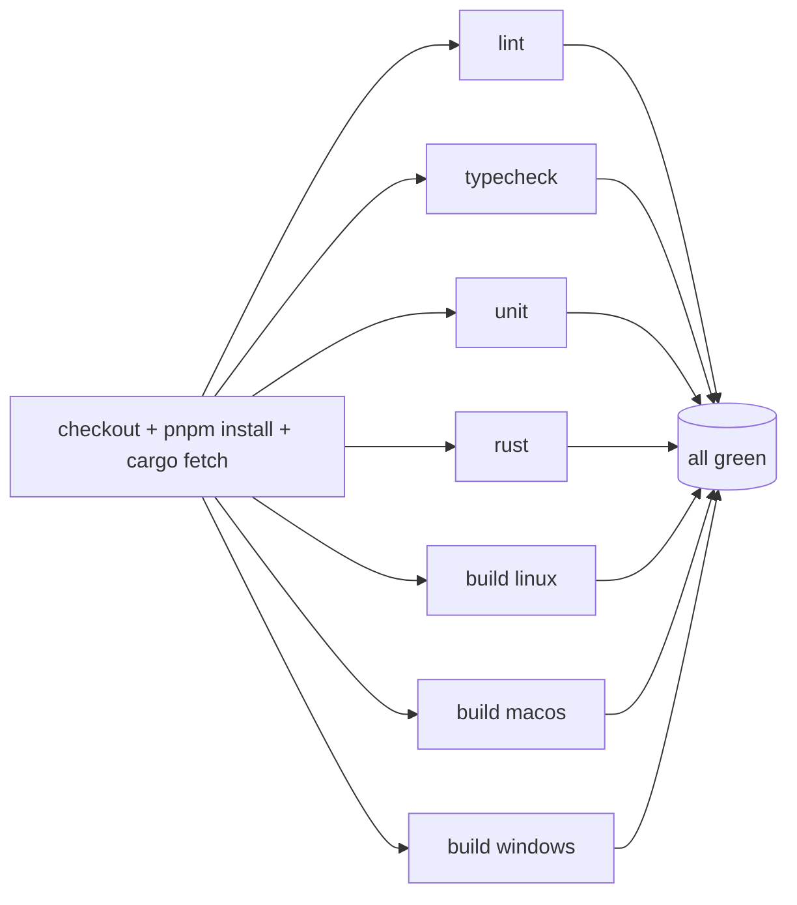
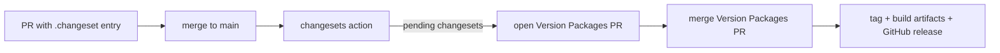

# CI Pipeline

This document specifies the continuous integration and release automation for vsclaude. It defines the GitHub Actions workflows that run on every pull request, the cross platform build matrix for macOS, Windows, and Linux, the caching strategy for pnpm and cargo, the Changesets based release automation, and the required status checks that gate merges into `main`. Every check here exists to keep the frozen [AgentEvent contract](./ARCHITECTURE.md), the Rust core, and the React 19 frontend shippable at all times. CI is the wall that protects the three sacred motion rules from regressions: if a provider adapter stops emitting a real event, a unit test fails; if a caption disappears, a test fails; if a drill down link breaks, an e2e test fails.

## Table of contents

- [Goals and invariants](#goals-and-invariants)
- [Repository shape CI assumes](#repository-shape-ci-assumes)
- [Workflow files the repo ships](#workflow-files-the-repo-ships)
- [The PR workflow: ci.yml](#the-pr-workflow-ciyml)
- [Job matrix](#job-matrix)
- [Caching pnpm and cargo](#caching-pnpm-and-cargo)
- [Playwright e2e](#playwright-e2e)
- [Tauri and Rust builds](#tauri-and-rust-builds)
- [Release automation with Changesets](#release-automation-with-changesets)
- [Required status checks](#required-status-checks)
- [Concurrency, timeouts, and flake control](#concurrency-timeouts-and-flake-control)
- [Secrets and permissions](#secrets-and-permissions)
- [Local parity](#local-parity)
- [Appendix: full workflow listings](#appendix-full-workflow-listings)

## Goals and invariants

| Goal | Mechanism | Gate |
| --- | --- | --- |
| No broken build ever lands | Cross platform `tauri build` on all three OSes | `build (macos/windows/linux)` required |
| Types stay strict | `tsc --noEmit` across the workspace | `typecheck` required |
| Style and lint stay clean | ESLint + Prettier check | `lint` required |
| Logic stays correct | Vitest unit suite with coverage | `unit` required |
| Rust core stays correct | `cargo test`, `cargo clippy`, `cargo fmt --check` | `rust` required |
| User flows keep working | Playwright e2e against the built app | `e2e` required |
| Contract stays frozen | Schema snapshot test in `packages/contracts` | part of `unit` |
| Releases are reproducible | Changesets version PR plus signed Tauri artifacts | `release.yml` |

Two hard rules drive the design:

1. The PR workflow must finish fast enough that contributors stay in flow. We parallelize aggressively and cache everything that is safe to cache. Target wall clock under fifteen minutes for the slowest leg (Windows build).
2. The matrix never lies. We build the real Tauri bundle on each OS rather than only the web frontend, because the Rust core (PTY lifecycle, filesystem watching, OS keychain) only compiles meaningfully per platform.

## Repository shape CI assumes

```text
vsclaude/
  apps/
    desktop/                 # Tauri 2.x app (React 19 frontend + src-tauri Rust)
      src-tauri/
        Cargo.toml
        tauri.conf.json
  packages/
    contracts/               # frozen AgentEvent schema + snapshot test
    adapters/                # claude-code, codex, gemini, ollama adapters
    motion/                  # Pixie state machine bindings, sprite fallback
    ui/                      # design system, Storybook
  pnpm-workspace.yaml
  pnpm-lock.yaml
  package.json               # root scripts: lint, typecheck, test, build, e2e
  Cargo.toml                 # Rust workspace root (members include src-tauri)
  .changeset/
  .github/
    workflows/
      ci.yml
      e2e.yml
      release.yml
      nightly.yml
```

Root `package.json` scripts CI invokes:

```jsonc
{
  "scripts": {
    "lint": "eslint . && prettier --check .",
    "typecheck": "tsc -b --noEmit",
    "test": "vitest run --coverage",
    "build:web": "pnpm -r --filter \"./packages/**\" build",
    "build:app": "pnpm --filter desktop tauri build",
    "e2e": "playwright test"
  }
}
```

## Workflow files the repo ships

| File | Trigger | Purpose |
| --- | --- | --- |
| `.github/workflows/ci.yml` | `pull_request`, `push` to `main` | Lint, typecheck, unit, Rust checks, cross platform build |
| `.github/workflows/e2e.yml` | `pull_request`, `push` to `main` | Playwright e2e against the built desktop app |
| `.github/workflows/release.yml` | `push` to `main` | Changesets version PR and tagged release with Tauri artifacts |
| `.github/workflows/nightly.yml` | `schedule` (cron) | Full matrix plus slow integration and provider smoke tests |

We split e2e into its own workflow so that a flaky browser test does not block the fast feedback lane and so it can be marked required independently. Lint, typecheck, unit, and Rust live in `ci.yml` because they share the same setup and cache surface.

## The PR workflow: ci.yml

`ci.yml` runs four logical groups. The first three (`lint`, `typecheck`, `unit`) run on a single Linux runner because they are platform independent. The `rust` group runs `clippy`, `fmt`, and `cargo test` on Linux. The `build` group fans out across the three operating systems.



Each job re-checks out and re-installs because GitHub Actions jobs do not share a filesystem. The shared cost is amortized by the cache (see [Caching](#caching-pnpm-and-cargo)).

## Job matrix

The cross platform build uses a matrix. Each entry pins an OS image, the Rust target triple, and the platform specific system dependencies Tauri requires.

```yaml
strategy:
  fail-fast: false
  matrix:
    include:
      - os: ubuntu-22.04
        target: x86_64-unknown-linux-gnu
        label: linux
      - os: macos-14            # Apple Silicon runner
        target: aarch64-apple-darwin
        label: macos
      - os: windows-2022
        target: x86_64-pc-windows-msvc
        label: windows
```

`fail-fast: false` is deliberate. If the Windows build breaks we still want to see whether macOS and Linux are healthy in the same run, which speeds up diagnosis.

Platform prerequisites installed per OS:

| OS | Required system packages | Notes |
| --- | --- | --- |
| Linux | `libwebkit2gtk-4.1-dev`, `libgtk-3-dev`, `libayatana-appindicator3-dev`, `librsvg2-dev`, `libsoup-3.0-dev` | Tauri 2.x WebKitGTK stack |
| macOS | Xcode command line tools (preinstalled on the image) | Codesigning handled in release only |
| Windows | MSVC build tools (preinstalled on `windows-2022`) | WebView2 ships with the runner |

The MSVC build tools are the documented setup prerequisite on Windows for the Rust toolchain, and the runner image already provides them.

## Caching pnpm and cargo

Caching is the single biggest lever on CI wall clock. We cache three things: the pnpm content addressable store, the cargo registry plus git index, and the cargo build output (`target/`).

### pnpm

We use the official setup actions and let `setup-node` handle the store cache by pointing it at the pnpm store path.

```yaml
- uses: pnpm/action-setup@v4
  with:
    version: 9
- uses: actions/setup-node@v4
  with:
    node-version: 20
    cache: pnpm
- run: pnpm install --frozen-lockfile
```

`cache: pnpm` keys on `pnpm-lock.yaml`. `--frozen-lockfile` guarantees the lockfile is authoritative: if a dependency was added without updating the lockfile, install fails loudly rather than silently resolving.

### cargo

Rust caching needs three directories. We use `Swatinem/rust-cache`, which keys on the lockfile plus the Rust toolchain version and automatically scopes the cache per job and target. It also cleans stale artifacts so the cache does not grow without bound.

```yaml
- uses: dtolnay/rust-toolchain@stable
  with:
    targets: ${{ matrix.target }}
    components: clippy, rustfmt
- uses: Swatinem/rust-cache@v2
  with:
    workspaces: "apps/desktop/src-tauri -> target"
    key: ${{ matrix.label }}
```

| Cache | Action | Key inputs | Restore scope |
| --- | --- | --- | --- |
| pnpm store | `setup-node` (`cache: pnpm`) | `pnpm-lock.yaml` | per OS |
| cargo registry + git | `Swatinem/rust-cache` | `Cargo.lock` + toolchain | per OS + target |
| cargo `target/` | `Swatinem/rust-cache` | `Cargo.lock` + source hash | per OS + target |

A cold Windows build (no cache) runs around twelve to fifteen minutes. A warm build (cache hit) runs around four to six minutes because only changed crates recompile.

## Playwright e2e

`e2e.yml` builds the desktop app once per OS, then drives it. Because the app is a Tauri shell, we run Playwright against the built binary using the Tauri WebDriver bridge (`tauri-driver`) on Linux and Windows, and against the macOS bundle separately. The e2e suite asserts the motion contract end to end.

What the e2e suite verifies, mapped to the sacred rules:

| Test | Rule it protects |
| --- | --- |
| Trigger a `file_edit` event and assert Pixie enters the `typing` state and the caption names the file | Rule 1: animation bound to a real event |
| Click any Pixie action and assert the drill down panel shows tool name, input, and diff | Rule 2: meaning recoverable |
| Assert every event row renders a plain language caption | Rule 3: non technical readability |
| Spawn a sub-agent via the Task tool and assert the swarm view adds a node | adapter mapping of `subagent_spawned` |

```yaml
e2e:
  needs: build
  strategy:
    matrix:
      os: [ubuntu-22.04, windows-2022, macos-14]
  runs-on: ${{ matrix.os }}
  steps:
    - uses: actions/checkout@v4
    - uses: pnpm/action-setup@v4
      with: { version: 9 }
    - uses: actions/setup-node@v4
      with: { node-version: 20, cache: pnpm }
    - run: pnpm install --frozen-lockfile
    - run: pnpm exec playwright install --with-deps chromium
    - run: pnpm --filter desktop tauri build --debug
    - run: pnpm e2e
      env:
        CI: "true"
    - uses: actions/upload-artifact@v4
      if: failure()
      with:
        name: playwright-report-${{ matrix.os }}
        path: playwright-report/
        retention-days: 7
```

We build with `--debug` for e2e so symbols are available and build time is shorter, and we always upload the Playwright HTML report on failure so contributors can inspect traces, screenshots, and video without rerunning locally.

## Tauri and Rust builds

The build job compiles the full bundle. We do not publish artifacts from the PR build; we only prove it compiles and packages. Release artifacts come from `release.yml`.

```yaml
build:
  needs: [lint, typecheck, unit]
  strategy:
    fail-fast: false
    matrix:
      include:
        - { os: ubuntu-22.04, target: x86_64-unknown-linux-gnu, label: linux }
        - { os: macos-14, target: aarch64-apple-darwin, label: macos }
        - { os: windows-2022, target: x86_64-pc-windows-msvc, label: windows }
  runs-on: ${{ matrix.os }}
  steps:
    - uses: actions/checkout@v4
    - name: Install Linux deps
      if: matrix.label == 'linux'
      run: |
        sudo apt-get update
        sudo apt-get install -y libwebkit2gtk-4.1-dev libgtk-3-dev \
          libayatana-appindicator3-dev librsvg2-dev libsoup-3.0-dev
    - uses: pnpm/action-setup@v4
      with: { version: 9 }
    - uses: actions/setup-node@v4
      with: { node-version: 20, cache: pnpm }
    - uses: dtolnay/rust-toolchain@stable
      with:
        targets: ${{ matrix.target }}
        components: clippy, rustfmt
    - uses: Swatinem/rust-cache@v2
      with:
        workspaces: "apps/desktop/src-tauri -> target"
        key: ${{ matrix.label }}
    - run: pnpm install --frozen-lockfile
    - run: pnpm --filter desktop tauri build --target ${{ matrix.target }}
```

The `rust` job runs the correctness checks separately from packaging so a clippy failure surfaces fast and clearly:

```yaml
rust:
  runs-on: ubuntu-22.04
  steps:
    - uses: actions/checkout@v4
    - run: |
        sudo apt-get update
        sudo apt-get install -y libwebkit2gtk-4.1-dev libgtk-3-dev \
          libayatana-appindicator3-dev librsvg2-dev libsoup-3.0-dev
    - uses: dtolnay/rust-toolchain@stable
      with: { components: clippy, rustfmt }
    - uses: Swatinem/rust-cache@v2
    - run: cargo fmt --all --check
    - run: cargo clippy --all-targets --all-features -- -D warnings
    - run: cargo test --workspace
```

`-D warnings` turns every clippy lint into a failure, which keeps the Rust core clean. The frontend correctness jobs mirror this:

```yaml
lint:
  runs-on: ubuntu-22.04
  steps:
    - uses: actions/checkout@v4
    - uses: pnpm/action-setup@v4
      with: { version: 9 }
    - uses: actions/setup-node@v4
      with: { node-version: 20, cache: pnpm }
    - run: pnpm install --frozen-lockfile
    - run: pnpm lint

typecheck:
  runs-on: ubuntu-22.04
  steps:
    - uses: actions/checkout@v4
    - uses: pnpm/action-setup@v4
      with: { version: 9 }
    - uses: actions/setup-node@v4
      with: { node-version: 20, cache: pnpm }
    - run: pnpm install --frozen-lockfile
    - run: pnpm typecheck

unit:
  runs-on: ubuntu-22.04
  steps:
    - uses: actions/checkout@v4
    - uses: pnpm/action-setup@v4
      with: { version: 9 }
    - uses: actions/setup-node@v4
      with: { node-version: 20, cache: pnpm }
    - run: pnpm install --frozen-lockfile
    - run: pnpm test
    - uses: actions/upload-artifact@v4
      if: always()
      with:
        name: coverage
        path: coverage/
        retention-days: 7
```

The unit job includes the contract snapshot test in `packages/contracts`. That test serializes the `AgentEvent` type surface and the list of `AgentEventType` literals to a snapshot. If anyone changes the frozen contract without bumping `schemaVersion` and updating the snapshot intentionally, the job fails. This is how we keep the unifying schema actually frozen.

## Release automation with Changesets

Releases flow through Changesets. Contributors add a changeset markdown file in `.changeset/` describing the version bump for each affected package. On merge to `main`, `release.yml` runs the Changesets action, which either opens a "Version Packages" PR that aggregates pending changesets and bumps versions, or, when that PR is merged, publishes.



```yaml
# release.yml
name: release
on:
  push:
    branches: [main]
concurrency: ${{ github.workflow }}-${{ github.ref }}
permissions:
  contents: write
  pull-requests: write
jobs:
  release:
    runs-on: ubuntu-22.04
    steps:
      - uses: actions/checkout@v4
        with: { fetch-depth: 0 }
      - uses: pnpm/action-setup@v4
        with: { version: 9 }
      - uses: actions/setup-node@v4
        with: { node-version: 20, cache: pnpm }
      - run: pnpm install --frozen-lockfile
      - uses: changesets/action@v1
        with:
          version: pnpm changeset version
          publish: pnpm changeset tag
        env:
          GITHUB_TOKEN: ${{ secrets.GITHUB_TOKEN }}
```

When a version tag lands, a second job builds the signed desktop bundles across the matrix and attaches them to the GitHub release. Tauri's updater requires a signature, so the signing key and password live in repository secrets.

```yaml
  publish-app:
    needs: release
    if: needs.release.outputs.published == 'true'
    strategy:
      fail-fast: false
      matrix:
        include:
          - { os: ubuntu-22.04, target: x86_64-unknown-linux-gnu }
          - { os: macos-14, target: aarch64-apple-darwin }
          - { os: windows-2022, target: x86_64-pc-windows-msvc }
    runs-on: ${{ matrix.os }}
    steps:
      - uses: actions/checkout@v4
      - uses: pnpm/action-setup@v4
        with: { version: 9 }
      - uses: actions/setup-node@v4
        with: { node-version: 20, cache: pnpm }
      - uses: dtolnay/rust-toolchain@stable
        with: { targets: ${{ matrix.target }} }
      - uses: Swatinem/rust-cache@v2
      - run: pnpm install --frozen-lockfile
      - uses: tauri-apps/tauri-action@v0
        env:
          GITHUB_TOKEN: ${{ secrets.GITHUB_TOKEN }}
          TAURI_SIGNING_PRIVATE_KEY: ${{ secrets.TAURI_SIGNING_PRIVATE_KEY }}
          TAURI_SIGNING_PRIVATE_KEY_PASSWORD: ${{ secrets.TAURI_KEY_PASSWORD }}
          APPLE_CERTIFICATE: ${{ secrets.APPLE_CERTIFICATE }}
          APPLE_CERTIFICATE_PASSWORD: ${{ secrets.APPLE_CERTIFICATE_PASSWORD }}
          APPLE_SIGNING_IDENTITY: ${{ secrets.APPLE_SIGNING_IDENTITY }}
        with:
          tagName: ${{ github.ref_name }}
          releaseName: vsclaude ${{ github.ref_name }}
```

### Changeset entry format

```markdown
---
"@vsclaude/contracts": minor
"@vsclaude/adapters": patch
---

Add web_fetch normalization to the Gemini adapter and bump schemaVersion.
```

A CI check (in `ci.yml`) runs `pnpm changeset status --since=origin/main` and warns when a PR touches `packages/` or `apps/` without adding a changeset. We keep this as a non blocking annotation for docs only PRs and turn it into a hard failure for changes under `packages/contracts`.

## Required status checks

Branch protection on `main` marks the following checks required. A PR cannot merge until all are green. Names must match the job names exactly.

| Required check | Workflow | Why it gates merge |
| --- | --- | --- |
| `lint` | ci.yml | Style and formatting integrity |
| `typecheck` | ci.yml | TypeScript strict mode holds |
| `unit` | ci.yml | Logic and frozen contract snapshot |
| `rust` | ci.yml | clippy, fmt, cargo test |
| `build (linux)` | ci.yml | Linux bundle compiles |
| `build (macos)` | ci.yml | macOS bundle compiles |
| `build (windows)` | ci.yml | Windows bundle compiles |
| `e2e (ubuntu-22.04)` | e2e.yml | User flows and motion rules on Linux |
| `e2e (windows-2022)` | e2e.yml | User flows on Windows |
| `e2e (macos-14)` | e2e.yml | User flows on macOS |

Additional branch protection settings:

- Require branches to be up to date before merging (linear history via merge queue is recommended once contributor volume grows).
- Require at least one approving review.
- Dismiss stale approvals on new commits.
- Require conversation resolution before merge.

## Concurrency, timeouts, and flake control

Every workflow declares a concurrency group keyed on the ref so a new push cancels the in flight run for the same branch, saving runner minutes.

```yaml
concurrency:
  group: ${{ github.workflow }}-${{ github.ref }}
  cancel-in-progress: true
```

Per job guards:

| Control | Value | Reason |
| --- | --- | --- |
| `timeout-minutes` on build jobs | 30 | Catch a hung linker or stuck `cargo build` |
| `timeout-minutes` on e2e jobs | 25 | Catch a frozen WebDriver session |
| Playwright `retries` | 1 in CI, 0 locally | Absorb rare browser flake without masking real failures |
| `fail-fast: false` | on every matrix | Diagnose all platforms in one run |

We do not blanket retry whole jobs. Retrying hides flake. Playwright's single retry is scoped to individual tests and surfaces the retry in the report so flake is visible and tracked.

## Secrets and permissions

CI workflows default to read only permissions and elevate only where needed.

```yaml
permissions:
  contents: read
```

| Secret | Used by | Purpose |
| --- | --- | --- |
| `GITHUB_TOKEN` | release.yml | Open version PR, create release, upload artifacts |
| `TAURI_SIGNING_PRIVATE_KEY` | publish-app | Sign updater artifacts |
| `TAURI_KEY_PASSWORD` | publish-app | Decrypt the signing key |
| `APPLE_CERTIFICATE` | publish-app | macOS codesigning |
| `APPLE_SIGNING_IDENTITY` | publish-app | macOS codesigning identity |

No provider API keys (Claude, Codex, Gemini, Ollama) ever live in CI. The product is bring your own key, and e2e tests use a recorded fixture event stream rather than calling a real model. This keeps CI deterministic, free, and offline.

## Local parity

Contributors reproduce CI with a single command set so failures are debuggable before pushing.

```bash
pnpm install --frozen-lockfile
pnpm lint
pnpm typecheck
pnpm test
cargo clippy --all-targets -- -D warnings
cargo fmt --all --check
cargo test --workspace
pnpm --filter desktop tauri build
pnpm e2e
```

A pre-push git hook (managed by the repo, opt in) runs `lint`, `typecheck`, and `test` to catch the cheap failures before they reach CI. The full matrix and e2e run only in CI because they need three operating systems.

## Appendix: full workflow listings

### ci.yml header

```yaml
name: ci
on:
  pull_request:
  push:
    branches: [main]
concurrency:
  group: ci-${{ github.ref }}
  cancel-in-progress: true
permissions:
  contents: read
```

### Nightly workflow

`nightly.yml` runs the same matrix plus the slower integration tests that are too expensive for every PR: full provider adapter smoke tests against recorded fixtures for all four providers, a Storybook visual regression pass covering every Pixie state, and a dependency audit.

```yaml
name: nightly
on:
  schedule:
    - cron: "0 6 * * *"   # 06:00 UTC daily
  workflow_dispatch:
jobs:
  full-matrix:
    uses: ./.github/workflows/ci.yml
  visual:
    runs-on: ubuntu-22.04
    steps:
      - uses: actions/checkout@v4
      - uses: pnpm/action-setup@v4
        with: { version: 9 }
      - uses: actions/setup-node@v4
        with: { node-version: 20, cache: pnpm }
      - run: pnpm install --frozen-lockfile
      - run: pnpm --filter @vsclaude/ui build-storybook
      - run: pnpm --filter @vsclaude/ui test-storybook
  audit:
    runs-on: ubuntu-22.04
    steps:
      - uses: actions/checkout@v4
      - uses: pnpm/action-setup@v4
        with: { version: 9 }
      - run: pnpm audit --audit-level=high
      - uses: dtolnay/rust-toolchain@stable
      - run: cargo install cargo-audit --locked
      - run: cargo audit
```

The Storybook visual pass is what guarantees every Pixie state (greeting, idle, sleeping, thinking, planning, reading, typing, searching, web, running, debugging, building, git, spawning, waiting, success, confused) renders correctly after any change to the motion package. A diff in any state fails the nightly and pings the owners.

### Putting it together

The flow a contributor experiences:

1. Open a PR. `ci.yml` and `e2e.yml` start immediately, with cancel in progress retiring any stale run.
2. Lint, typecheck, unit, and rust finish in a few minutes against warm caches.
3. The three platform builds and the three e2e legs run in parallel and report individual checks.
4. When all ten required checks are green and a reviewer approves, the PR merges.
5. `release.yml` sees the merge, and Changesets either opens or advances the Version Packages PR.
6. Merging the Version Packages PR tags a release and the `publish-app` matrix attaches signed bundles for all three operating systems.

See also: [Architecture](./ARCHITECTURE.md), [Testing Strategy](./TESTING.md), [Release Process](./RELEASE.md).
