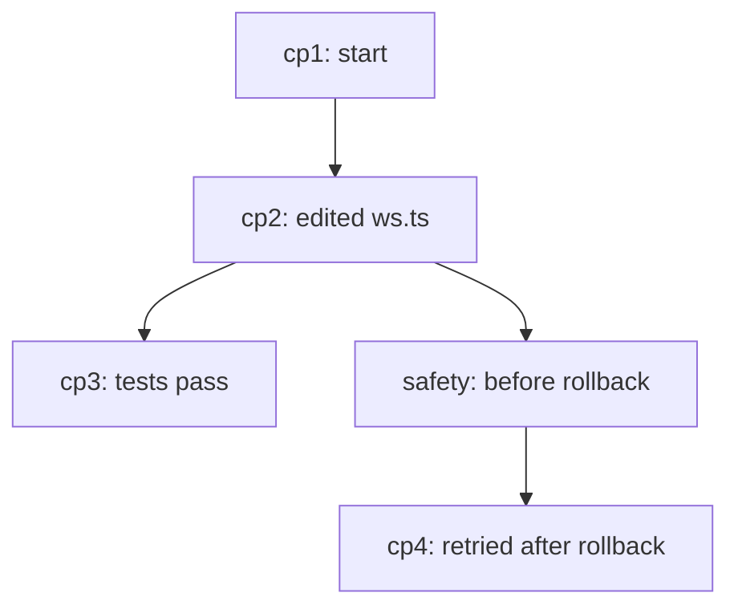

# Context and Checkpoints

This document specifies two tightly related subsystems of vsclaude: the **context manager**, which lets a developer see and curate exactly what is in the agent's context window, and **checkpoints with time travel**, which snapshot both the workspace on disk and the agent session state so a run can be rolled back safely. The two belong together because a checkpoint is, in practice, a context boundary you can return to: rolling back restores both the files and the conversation that produced them. This spec defines the data model for context entries, the storage model for checkpoints (a content-addressed object store plus a per-session ledger), the snapshot and restore algorithms with their safety guarantees, and how `token_usage` and the rest of the [AgentEvent](./AGENT_EVENT_SCHEMA.md) stream feed a live, truthful context view. It is a contract other engineers build against, not an overview.

## Table of contents

- [1. Goals and the three motion rules](#1-goals-and-the-three-motion-rules)
- [2. Definitions](#2-definitions)
- [3. The context manager](#3-the-context-manager)
- [4. How token_usage feeds the context view](#4-how-token_usage-feeds-the-context-view)
- [5. Checkpoints and time travel](#5-checkpoints-and-time-travel)
- [6. The storage model](#6-the-storage-model)
- [7. Snapshot algorithm](#7-snapshot-algorithm)
- [8. Restore algorithm and safety](#8-restore-algorithm-and-safety)
- [9. IPC surface](#9-ipc-surface)
- [10. State ownership in the renderer](#10-state-ownership-in-the-renderer)
- [11. Pixie and timeline binding](#11-pixie-and-timeline-binding)
- [12. Retention, limits, and performance](#12-retention-limits-and-performance)
- [13. Invariants and non-goals](#13-invariants-and-non-goals)

## 1. Goals and the three motion rules

The context manager and checkpoints both exist to make the agent's hidden state visible and reversible. They are constrained by the same three rules that govern the rest of vsclaude:

1. **Bound to reality.** The context view shows what is actually in the model's context window, derived from real `token_usage` events and the real event log. It never estimates a number it can measure and never displays a fabricated breakdown. A checkpoint reflects real bytes on disk and the real session state at a real event boundary.
2. **Meaning is recoverable.** Every context entry drills to the underlying `AgentEvent` that put it there (the file read, the tool result, the message). Every checkpoint drills to the exact files it captured and the exact event index it was taken at, with a diff against the current workspace.
3. **Plain language by construction.** The context view reads as "Pixie is holding 9 files, 3 tool results, and your last 4 messages, using about 62% of its memory," not as a raw token dump. A non-technical person can see when the agent is getting full and when a rollback is safe.

## 2. Definitions

| Term | Meaning |
| --- | --- |
| **Context window** | The provider's input budget for one turn: the system prompt, conversation history, file contents, and tool results the model can currently see. |
| **Context entry** | One curatable unit the context manager tracks: a file, a tool result, a message, a memory note, or a system block. Each maps to one or more events. |
| **Curation** | A user or automatic action that adds, pins, drops, or summarizes a context entry to control what the next turn sends. |
| **Checkpoint** | An immutable snapshot of the workspace files plus the agent session state, taken at a specific event boundary, addressable by id. |
| **Snapshot boundary** | The event index a checkpoint is anchored to. Restoring returns the session to that boundary. |
| **Object store** | A content-addressed store of file blobs and trees, deduplicated by hash, shared across all checkpoints. |
| **Ledger** | The per-session ordered list of checkpoint manifests, the time-travel history. |

## 3. The context manager

The context manager answers one question continuously: **what is the agent holding in its head right now, and what will it send on the next turn?** It maintains a model of the context window as a list of typed entries, derived purely from the event log and the latest `token_usage` accounting. It is a renderer-side projection; the source of truth remains the [event log](./ARCHITECTURE.md#9-state-ownership-zustand-stores).

### 3.1 Context entry model

```ts
// packages/context/src/types.ts
export type ContextEntryKind =
  | 'system'        // system prompt, tool definitions, CLAUDE.md / project rules
  | 'message'       // a user or assistant message
  | 'file'          // file contents read into context
  | 'tool_result'   // output of a tool call held in context
  | 'memory'        // a pinned note or summary the user added
  | 'thinking';     // retained reasoning, if the provider keeps it

export interface ContextEntry {
  id: string;                  // stable, derived from the source event id(s)
  kind: ContextEntryKind;
  label: string;               // plain-language label, e.g. "src/ws.ts"
  sourceEventIds: string[];    // events that produced this entry (drill-down)
  estimatedTokens: number;     // best estimate; see token accounting below
  pinned: boolean;             // survives auto-curation and summarization
  dropped: boolean;            // excluded from the next turn by the user
  staleOnDisk?: boolean;       // file entry whose on-disk content has changed
  ts: number;                  // when this entry entered context
}

export interface ContextModel {
  sessionId: string;
  entries: ContextEntry[];
  windowTokens: number;        // provider context limit for the active model
  usedTokens: number;          // measured from the latest token_usage event
  estimatedTokens: number;     // summed entry estimate (fallback before measurement)
  lastMeasuredAt: number;      // ts of the token_usage event that set usedTokens
}
```

Entries are derived by a reducer over the event log:

| Event type | Effect on the context model |
| --- | --- |
| `session_start` | Seed `system` entries (system prompt, tool defs, project rules) and set `windowTokens` from the model. |
| `message` | Add a `message` entry (user or assistant). |
| `file_read`, `file_create` | Add or refresh a `file` entry keyed by path. A second read of the same path replaces the prior entry rather than stacking. |
| `file_edit` | Mark the matching `file` entry as refreshed; the latest content is what the model holds. |
| `tool_result` | Add a `tool_result` entry, labeled from the tool name and `summary`. |
| `thinking` | Add a `thinking` entry only if the provider retains reasoning across turns; otherwise ignore. |
| `token_usage` | Set `usedTokens` and `lastMeasuredAt`; reconcile estimates (see section 4). |
| `complete`, `session_end` | Freeze the model; it becomes the read-only context of the finished run. |

### 3.2 Curation actions

Curation lets the developer steer the next turn. Each action is recorded as a user intent that the adapter applies on the next request (by trimming or augmenting what it sends), and each is itself reversible.

| Action | Meaning | Applied how |
| --- | --- | --- |
| **Pin** | Keep this entry no matter what auto-curation does. | Sets `pinned`. Excluded from automatic summarization and eviction. |
| **Drop** | Remove this entry from the next turn. | Sets `dropped`. The adapter omits it from the next request payload. |
| **Restore** | Undo a drop. | Clears `dropped`. |
| **Summarize** | Replace a large entry (or a run of entries) with a short summary entry. | Emits a `memory` entry; originals are marked `dropped` but retained for drill-down. |
| **Add note** | Inject a `memory` entry the user types. | New pinned `memory` entry prepended for the next turn. |
| **Refresh** | Re-read a `staleOnDisk` file so context matches disk. | Triggers a `read_file` and replaces the entry. |

```ts
// packages/context/src/actions.ts
export type ContextAction =
  | { type: 'pin'; entryId: string }
  | { type: 'unpin'; entryId: string }
  | { type: 'drop'; entryId: string }
  | { type: 'restore'; entryId: string }
  | { type: 'summarize'; entryIds: string[]; summary: string }
  | { type: 'add_note'; text: string }
  | { type: 'refresh'; entryId: string };
```

Curation never rewrites history. Dropping an entry does not delete the events that produced it; it sets a flag the adapter honors when composing the next request. This keeps the second motion rule intact: the underlying truth is always still there to drill into.

### 3.3 Staleness detection

Because the [filesystem watcher](./ARCHITECTURE.md#8-filesystem-watching) reports on-disk changes, the context manager can flag when a file the agent is holding no longer matches disk. When an `fs-change` arrives for a path that has a `file` entry whose content hash differs from the in-context hash, the entry is marked `staleOnDisk`. The UI surfaces a quiet "changed on disk" badge with a one-click Refresh. This is the difference between an agent reasoning over a stale copy and reasoning over current truth.

## 4. How token_usage feeds the context view

The context view shows a real number, not a guess, by anchoring on `token_usage` events and distributing the measured total across entries.

### 4.1 The token_usage payload

From the [schema](./AGENT_EVENT_SCHEMA.md#token_usage), each event carries:

```ts
interface TokenUsagePayload {
  inputTokens: number;       // tokens the model read this turn (the context)
  outputTokens: number;      // tokens the model generated
  cacheReadTokens?: number;  // input served from prompt cache
  totalTokens?: number;
  costUsd?: number;
}
```

`inputTokens` is the ground truth for "how full is the context." It is exactly what the provider counted as the input to the most recent turn, so the context manager sets `usedTokens = inputTokens` and `lastMeasuredAt = ts` on every `token_usage` event.

### 4.2 The measure-then-attribute loop

Per-entry token counts are not reported by providers, so the manager uses a two-stage approach: estimate locally, then reconcile against the measured total.

1. **Estimate.** Each entry gets an `estimatedTokens` from a fast local estimator (a byte-per-token heuristic per content kind, refined by an optional `js-tiktoken` count for files where precision matters). The sum is `estimatedTokens` on the model.
2. **Attribute.** When a `token_usage` event lands, the measured `inputTokens` is the real total. The manager scales the per-entry estimates so they sum to the measured total, preserving relative proportions. This gives each entry a corrected share without the provider ever breaking it down.

```ts
// packages/context/src/attribute.ts
export function reconcile(model: ContextModel, measured: number): ContextModel {
  const estTotal = model.entries.reduce((s, e) => s + e.estimatedTokens, 0) || 1;
  const scale = measured / estTotal;
  return {
    ...model,
    usedTokens: measured,
    entries: model.entries.map((e) => ({
      ...e,
      // displayed share, not a re-measurement; honest as a proportion
      estimatedTokens: Math.round(e.estimatedTokens * scale),
    })),
  };
}
```

Two honesty rules apply so the view never lies:

- The headline number (`usedTokens` over `windowTokens`) is always the **measured** value when a measurement exists. Before the first `token_usage` event of a session, the view shows the estimated value and labels it "estimate."
- Per-entry numbers are explicitly framed as a share of the measured total, not as independent measurements, because they are attributed, not counted.

### 4.3 Cache awareness

`cacheReadTokens` is shown as a separate, reassuring signal: the portion of context served from the prompt cache costs less and is faster. The cost meter uses `costUsd` directly when present and otherwise derives it from a per-model rate table. The fullness gauge (used over window) drives Pixie intensity indirectly: a near-full context is a cue the UI can surface as "Pixie is getting full, consider a checkpoint and a fresh start."

```text
Context  ┌───────────────────────────────────────────────┐
 62% used │██████████████████████████░░░░░░░░░░░░░░░░░░░░░│ 124k / 200k
          └───────────────────────────────────────────────┘
  files 41k · tool results 22k · messages 38k · system 23k   (cache: 88k read)
```

## 5. Checkpoints and time travel

A checkpoint freezes two things at one moment: the **workspace** (files on disk within the project root) and the **agent session state** (the event log up to a boundary, the context model, and the provider resume handle if any). Time travel is the act of restoring a checkpoint so the next turn continues from that boundary as if the intervening work never happened.

### 5.1 When checkpoints are taken

| Trigger | Mode | Rationale |
| --- | --- | --- |
| Before a `file_edit`, `file_create`, or `file_delete` batch | automatic | A pre-edit checkpoint makes every agent file change reversible. |
| Before a `command_run` flagged risky (matches a deny-ish pattern) | automatic | Reversible safety net around destructive commands. |
| On `permission_request` | automatic | Capture state at the gate so a denied path can be rolled back cleanly. |
| On user click ("Checkpoint now") | manual | Explicit save point. |
| On `complete` | automatic | A clean end-of-task marker to return to. |

Automatic checkpoints are debounced and coalesced: a rapid run of edits to many files produces one checkpoint at the start of the batch, not one per file. The trigger policy is configurable and ships with safe defaults.

### 5.2 The checkpoint manifest

```ts
// packages/checkpoints/src/types.ts
export interface CheckpointManifest {
  id: string;                 // ULID, sortable by creation time
  sessionId: string;
  label: string;              // plain-language, e.g. "before editing 3 files"
  createdAt: number;
  boundaryEventId: string;    // event index this checkpoint anchors to
  trigger: 'auto_edit' | 'auto_command' | 'auto_permission'
         | 'manual' | 'auto_complete';
  workspaceTreeHash: string;  // root tree hash in the object store
  agentStateRef: string;      // object hash of the serialized session state
  parentCheckpointId?: string; // previous checkpoint, forms the time-travel chain
  stats: {
    fileCount: number;
    addedBytes: number;       // new bytes written to the object store
    reusedBytes: number;      // bytes deduplicated from existing objects
  };
}
```

The `boundaryEventId` is the join between checkpoints and the context manager: the context model at restore time is exactly the model reduced over events up to and including that id.

## 6. The storage model

Checkpoints use a content-addressed object store, the same idea Git uses, so that capturing a workspace that is mostly unchanged costs only the bytes that changed. Storage lives under the app data directory, never inside the project (so it is not itself captured).

### 6.1 On-disk layout

```text
<appData>/vsclaude/checkpoints/
  objects/
    ab/
      ab12cd...        # a blob (file content) or tree, named by content hash
    9f/
      9f77ee...
  sessions/
    sess_8f2c/
      ledger.jsonl     # append-only list of CheckpointManifest, one per line
      state/
        <hash>.json    # serialized agent session state objects (also hashed)
  config.json          # retention policy, size caps
```

### 6.2 Object kinds

| Object | Content | Hash over |
| --- | --- | --- |
| **blob** | Exact bytes of one file. | The file bytes. |
| **tree** | A directory listing: name to (mode, kind, hash). | The serialized listing. |
| **state** | Serialized agent session state (boundary, context model, provider resume handle). | The serialized JSON. |

Hashing uses BLAKE3 (fast, collision resistant, and cheap to compute over large trees). A blob written twice is stored once; two checkpoints that share an unchanged `src/ws.ts` reference the same blob hash. This is what makes hundreds of checkpoints affordable.

```rust
// src-tauri/src/checkpoints/store.rs
use blake3::Hasher;

pub fn hash_bytes(bytes: &[u8]) -> String {
    let mut h = Hasher::new();
    h.update(bytes);
    h.finalize().to_hex().to_string()
}

/// Write a blob if absent; return its content hash. Deduplicates by design.
pub fn put_blob(store: &ObjectStore, bytes: &[u8]) -> std::io::Result<String> {
    let hash = hash_bytes(bytes);
    let path = store.object_path(&hash);
    if !path.exists() {
        // write to a temp file then atomically rename, so a crash never
        // leaves a half-written object under its final hash name
        store.write_atomic(&path, bytes)?;
    }
    Ok(hash)
}
```

### 6.3 The agent state object

The serialized session state is what lets restore put the conversation back, not just the files.

```ts
// packages/checkpoints/src/state.ts
export interface AgentStateSnapshot {
  schemaVersion: number;
  sessionId: string;
  boundaryEventId: string;
  // The event log up to the boundary is referenced, not duplicated:
  // events are already persisted as the raw session log on disk.
  eventLogRef: { path: string; throughEventId: string };
  contextModel: ContextModel;        // entries, pins, drops, summaries at boundary
  providerResume?: {                 // optional, provider-specific resume handle
    provider: string;
    resumeToken: string;             // e.g. Claude Code session id for --resume
  };
}
```

The event log is referenced rather than copied because the raw session log is already persisted on disk by the core (see [Architecture non-goals](./ARCHITECTURE.md#13-invariants-and-non-goals)); a checkpoint records the boundary, not a second copy of the stream. Only the curated context model and the resume handle are duplicated into the state object, because those are small and must be exact.

### 6.4 Ledger format

The ledger is append-only newline-delimited JSON, one `CheckpointManifest` per line, ordered by creation. Append-only means a crash mid-write can only ever lose the last line, never corrupt history, and recovery is a forward scan that stops at the first unparsable line.

```text
{"id":"cp_01...","label":"before editing 3 files","boundaryEventId":"evt_e0","workspaceTreeHash":"ab12...","parentCheckpointId":null, ...}
{"id":"cp_02...","label":"after tests pass","boundaryEventId":"evt_r1","workspaceTreeHash":"9f77...","parentCheckpointId":"cp_01...", ...}
```

## 7. Snapshot algorithm

Taking a checkpoint must be fast enough to run automatically before edits without the user feeling it. The algorithm walks the workspace, reuses unchanged objects, and writes only the delta.

```text
snapshot(sessionId, label, boundaryEventId, trigger):
  1. enumerate workspace files honoring ignore rules
     (.gitignore, node_modules, target, build output, .git, the app data dir)
  2. for each file:
       h = hash_bytes(content)
       if objects/h missing: put_blob(content)        # only changed files cost I/O
       record (relpath, mode, h) into the working tree
  3. treeHash = put_tree(working tree)                 # dedup identical directories
  4. state = serialize AgentStateSnapshot at boundaryEventId
     stateRef = put_state(state)
  5. manifest = CheckpointManifest{ ..., treeHash, stateRef, parent = last ledger id }
  6. append manifest to ledger.jsonl (atomic append)
  7. emit checkpoint-created on the IPC bridge
```

Key properties:

- **Incremental cost.** Step 2 only writes blobs whose hash is new, so a checkpoint after editing three files writes three blobs and a handful of trees, regardless of repository size. `stats.reusedBytes` versus `stats.addedBytes` quantifies this for the UI.
- **Ignore correctness.** The same ignore set the FS watcher uses is reused so checkpoints never capture `node_modules` or build artifacts. A workspace that disagrees (for example a tracked file inside an ignored folder) is resolved in favor of the project's own `.gitignore`.
- **Non-blocking.** Hashing and blob writes run on a blocking thread pool in the Rust core, off the normalizer and emit paths, so a snapshot never stalls the event stream. The boundary `id` is captured synchronously up front so the snapshot is consistent even if events keep arriving during the walk.
- **Crash safety.** Blobs are written to temp files and atomically renamed; the manifest is appended last. If the process dies mid-snapshot, orphan blobs are harmless (garbage collected later) and no partial manifest is ever visible.

## 8. Restore algorithm and safety

Restoring is the act that must never lose work silently. The guarantee is: **a restore is itself preceded by an automatic safety checkpoint of the current state**, so any rollback is reversible. There is no destructive cliff.

```text
restore(checkpointId):
  0. take an automatic "safety" checkpoint of the current workspace + state
     (trigger = manual, label = "auto-saved before rollback")
  1. load manifest(checkpointId) and its workspaceTreeHash + agentStateRef
  2. compute the file-level diff between current workspace and the target tree:
       toWrite   = files whose hash differs or are missing in current
       toDelete  = files present now but absent in the target tree
  3. show the diff to the user and require confirmation
     (counts of files to overwrite, create, delete; expandable per-file)
  4. on confirm:
       for each toWrite: materialize blob -> temp -> atomic rename into place
       for each toDelete: move to a restore-trash dir (not unlink) then prune
  5. truncate the in-memory event log view to boundaryEventId
  6. rehydrate the context model from the agent state object
  7. if providerResume present: arm the adapter to resume the provider session
  8. emit checkpoint-restored; Pixie plays the rewind beat
```

Safety guarantees, stated normatively:

1. **No restore without a prior safety checkpoint.** Step 0 is mandatory and runs before any file is touched. Undo of a rollback is always one checkpoint away.
2. **No unconfirmed overwrite.** Step 3 requires explicit confirmation and shows the exact file-level consequence. The diff is computed by hash, so unchanged files are never rewritten and their mtimes are preserved.
3. **Deletes are recoverable.** Step 4 moves files to a restore-trash directory rather than unlinking; trash is pruned on a delay, so a wrong rollback is still recoverable from disk.
4. **Atomic file replacement.** Each file is written to a temp path and atomically renamed, so a crash during restore never leaves a truncated source file in the workspace.
5. **Open buffers reconcile.** After restore, the editor reloads affected open Monaco buffers from disk and flags any with unsaved in-editor edits rather than clobbering them, deferring to the user.
6. **Event log is never rewritten on disk.** Restore truncates the *view* to the boundary and arms a resume; the raw on-disk log is immutable. Continuing after a rollback appends new events with fresh ids, so the recorded history of the whole session, including the abandoned branch, remains fully recoverable.

Time travel therefore forms a tree, not a line: each restore branches from a boundary, and the ledger's `parentCheckpointId` chain plus the safety checkpoints record every branch. The UI presents this as a vertical history with branch markers.



## 9. IPC surface

These commands and channels extend the [IPC bridge](./ARCHITECTURE.md#6-ipc-bridge-design). All payloads are typed in the shared contracts package.

### 9.1 Commands (renderer to core)

| Command | Input | Returns | Purpose |
| --- | --- | --- | --- |
| `checkpoint_create` | `{ sessionId, label?, trigger }` | `{ checkpointId }` | Take a snapshot now. |
| `checkpoint_list` | `{ sessionId }` | `CheckpointManifest[]` | Load the ledger for the history view. |
| `checkpoint_diff` | `{ sessionId, checkpointId }` | `{ toWrite, toDelete, toCreate }` | Preview a restore without applying it. |
| `checkpoint_restore` | `{ sessionId, checkpointId }` | `{ safetyCheckpointId }` | Roll back (auto-creates a safety checkpoint first). |
| `checkpoint_delete` | `{ sessionId, checkpointId }` | `void` | Remove a manifest; objects pruned by GC if unreferenced. |
| `context_get` | `{ sessionId }` | `ContextModel` | Current context model (also pushed live). |
| `context_apply` | `{ sessionId, action }` | `void` | Apply a `ContextAction` (pin, drop, summarize, note, refresh). |

### 9.2 Event channels (core to renderer)

| Channel | Payload | Notes |
| --- | --- | --- |
| `checkpoint-created` | `CheckpointManifest` | Append to the history view. |
| `checkpoint-restored` | `{ checkpointId, boundaryEventId }` | Triggers the rewind beat and view truncation. |
| `context-update` | `ContextModel` | Pushed when token_usage lands or curation changes the model. |

## 10. State ownership in the renderer

Two stores are added to the renderer state set described in [Architecture section 9](./ARCHITECTURE.md#9-state-ownership-zustand-stores).

| Store | Owns | Key state | Updated by |
| --- | --- | --- | --- |
| `contextStore` | The live context model | `model: ContextModel`, pending curation actions | `context-update`, `context_apply` |
| `checkpointStore` | The time-travel history | `manifests: CheckpointManifest[]`, `activeBoundaryEventId` | `checkpoint-created`, `checkpoint-restored` |

The context model is a derived projection: its canonical inputs are the event log plus the latest `token_usage`. `contextStore` caches the reduced model and applies user curation flags on top, but it can always be rebuilt from the log, which keeps it consistent with the single-source-of-truth rule. Curation flags (`pinned`, `dropped`) are persisted with the session so a reopened session restores the user's curation.

```ts
// packages/context/src/reducer.ts (shape)
export function reduceContext(
  events: AgentEvent[],
  curation: Map<string, { pinned: boolean; dropped: boolean }>,
): ContextModel {
  // fold events into entries (section 3.1), then overlay curation flags,
  // then set usedTokens from the last token_usage event seen.
}
```

## 11. Pixie and timeline binding

Checkpoints and context are part of the living narrative, so they bind to motion and the [timeline](./AGENT_EVENT_SCHEMA.md#mapping-events-to-pixie-states) like everything else.

| Moment | Pixie | Timeline | Caption example |
| --- | --- | --- | --- |
| Checkpoint taken | brief `git`-like save beat, no state change | save marker on the rail | "Saved a checkpoint: before editing 3 files." |
| Restore confirmed | rewind beat, then settles to `idle` | rail collapses to the boundary, branch marker added | "Rolled back to: after tests pass." |
| Context near full | mood shifts toward `focused`; a full-meter cue | usage meter turns amber | "Pixie's memory is almost full (92%)." |
| Entry dropped by user | none | context panel updates | "Dropped src/big-log.txt from context." |

These are real-event bindings, not decoration: the save beat fires on an actual `checkpoint-created`, the rewind on an actual `checkpoint-restored`, and the fullness cue on a measured `token_usage`. Clicking any of them drills to the manifest, the diff, or the source events, satisfying recoverability.

## 12. Retention, limits, and performance

| Concern | Policy |
| --- | --- |
| **Per-session checkpoint cap** | Keep the most recent N manual plus M automatic checkpoints (defaults 50 and 200). Oldest automatic checkpoints are pruned first; manual and safety checkpoints are pruned last. |
| **Total store size cap** | A configurable byte cap (default 2 GB). When exceeded, prune oldest prunable manifests, then run object GC. |
| **Object garbage collection** | Mark-and-sweep: walk all live manifests' tree and state hashes, sweep unreferenced objects. Runs on idle and after deletes. Orphan blobs from interrupted snapshots are collected here. |
| **Snapshot latency budget** | A pre-edit auto checkpoint should complete its blob delta within a frame budget for typical edits; large new files are hashed on the blocking pool and never block the event stream. |
| **Restore-trash retention** | Deleted-on-restore files live in trash for a retention window (default 24 hours) before pruning. |

Performance rests on three facts: only changed bytes are written (content addressing), hashing and I/O run off the hot event path (blocking thread pool), and the ledger is append-only (no rewrite, crash-safe). A repository with one hundred checkpoints over a day costs roughly the size of the working set plus the sum of the deltas, not one hundred full copies.

## 13. Invariants and non-goals

**Invariants (must always hold):**

- The context view's headline number is the measured `inputTokens` whenever a `token_usage` measurement exists; estimates are shown only before the first measurement and are labeled as estimates.
- Per-entry token figures are attributed shares of the measured total, never presented as independent measurements.
- Every context entry drills to the `AgentEvent`(s) that produced it; every checkpoint drills to its captured files and its boundary event.
- A restore is always preceded by an automatic safety checkpoint and an explicit, hash-based diff confirmation. Deleted files go to recoverable trash, not `unlink`.
- The object store is content-addressed and deduplicated; identical file content is stored once across all checkpoints.
- The raw on-disk event log is immutable. Restore truncates the live view and arms a provider resume; it never rewrites recorded history, so the abandoned branch stays recoverable.
- Checkpoint storage lives under the app data directory and is excluded from the snapshot walk and from FS watching.

**Non-goals (out of scope here):**

- Cross-machine or cloud sync of checkpoints. Single host, local store.
- Replacing version control. Checkpoints are a fine-grained safety net for agent runs, not a substitute for Git history or commits.
- Provider-side context editing. The context manager controls what the adapter *sends*; it does not reach into a provider's server-side memory beyond the documented resume handle.
- Per-token provider attribution. Providers do not report per-entry token counts; the attribution model is the documented approximation.

For the event contract these subsystems consume see [Agent Event Schema](./AGENT_EVENT_SCHEMA.md), for the pipeline and store ownership see [Architecture](./ARCHITECTURE.md), and for the motion bindings see the Pixie state catalog referenced there.
