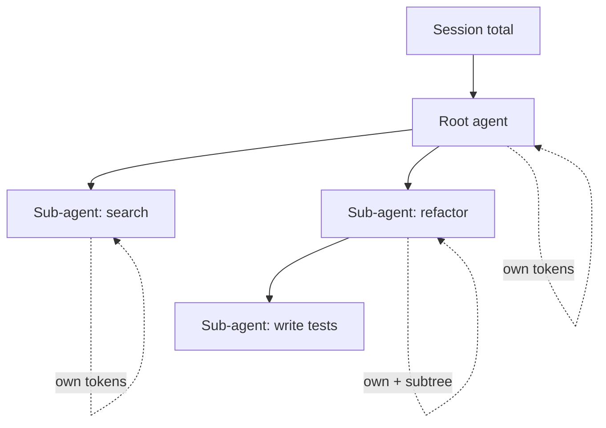

# Cost and Tokens Spec

This document specifies the token and cost dashboard for vsclaude. It defines how `token_usage` AgentEvents are accumulated per agent and per session, how the live visualization is designed and rendered, how per-provider pricing is modeled and configured, and how budgets and alerts behave. The module is truthful by construction: every number on screen traces back to a real `token_usage` event, and one click always drills into the exact provider, model, and raw usage block that produced it. See [Architecture](./ARCHITECTURE.md) and the frozen [AgentEvent contract](../packages/contracts/src/agent-event.ts).

## Table of Contents

1. [Goals and Non-Goals](#1-goals-and-non-goals)
2. [The token_usage Event](#2-the-token_usage-event)
3. [Accumulation Model](#3-accumulation-model)
4. [State Store and Selectors](#4-state-store-and-selectors)
5. [Pricing Model and Configuration](#5-pricing-model-and-configuration)
6. [Cost Computation](#6-cost-computation)
7. [Live Visualization Design](#7-live-visualization-design)
8. [Budgets and Alerts](#8-budgets-and-alerts)
9. [Persistence and Export](#9-persistence-and-export)
10. [Edge Cases and Invariants](#10-edge-cases-and-invariants)
11. [Testing](#11-testing)

---

## 1. Goals and Non-Goals

### Goals

- Accumulate token usage incrementally as `token_usage` events stream in, per agent and per session, with zero double counting.
- Compute cost from a versioned, per-provider, per-model pricing table that the user can view and override.
- Render a live, accessible dashboard that updates smoothly under high event rates without re-rendering the whole tree on every tick.
- Enforce soft and hard budgets at the session level with clear, actionable alerts and an optional hard stop that pauses the agent.
- Preserve full provenance: every aggregate drills down to the contributing events and their `raw` payloads.

### Non-Goals

- We do not bill anyone. vsclaude is bring-your-own-key; cost numbers are estimates for the user's own awareness.
- We do not reconcile against the provider's official invoice. Our estimate is a best effort from streamed usage and a configurable price table.
- We do not implement a global cross-machine budget service. Budgets are local to the desktop app and persisted locally.

---

## 2. The token_usage Event

`token_usage` is one of the frozen `AgentEventType` values. Adapters normalize each provider's usage reporting into this shape. The accounting module consumes only `AgentEvent`, never provider-native payloads.

### Payload contract

The accounting module reads usage from `payload`. Adapters must populate the following normalized fields. All counts are integers and represent the metric for the unit of work described by `mode`.

```ts
// packages/contracts/src/token-usage.ts  (frozen, versioned)
export interface TokenUsagePayload {
  /**
   * 'delta'      => counts are for this step only; add them.
   * 'cumulative' => counts are running totals for the agent; replace, do not add.
   * Adapters MUST set this. Default assumption if absent is 'delta'.
   */
  mode: 'delta' | 'cumulative';

  model: string;            // exact model id used, e.g. 'claude-sonnet-4-6'
  inputTokens: number;      // uncached input tokens
  outputTokens: number;     // generated tokens

  // Prompt caching (Anthropic-style). Zero or absent on providers without caching.
  cacheCreationInputTokens?: number; // tokens written into the cache this step
  cacheReadInputTokens?: number;     // tokens served from cache this step

  // Optional, provider-specific. Kept for fidelity and future pricing.
  reasoningTokens?: number; // e.g. reasoning/thinking tokens billed separately
  totalTokens?: number;     // provider-reported total, used only for reconciliation
}
```

The event itself carries `provider`, `agentId`, `sessionId`, `parentAgentId`, `ts`, and `raw` (the untouched provider block). `model` lives in the payload because a single agent can switch models mid-session.

### Why mode matters

Providers differ. Some emit a usage block per message (delta semantics). Some emit a running total for the turn or the whole session (cumulative semantics). The Claude Code adapter, running `claude -p --output-format stream-json --verbose`, emits a usage block per assistant message; we map those as `delta`. If an adapter reports a running total, it must set `mode: 'cumulative'` so the reducer replaces rather than adds. Getting this wrong is the single most common source of inflated numbers, so the contract makes it explicit and the reducer enforces it.

---

## 3. Accumulation Model

Accumulation is a pure reduction over the ordered `token_usage` stream. Two scopes exist: per agent and per session. The session total is the sum over its agents, including sub-agents spawned by the Task tool.

### Aggregate shape

```ts
export interface TokenAggregate {
  inputTokens: number;
  outputTokens: number;
  cacheCreationInputTokens: number;
  cacheReadInputTokens: number;
  reasoningTokens: number;
}

export interface ModelBucket extends TokenAggregate {
  model: string;
  provider: string;
  costUsd: number;       // derived, recomputed when pricing changes
  events: number;        // count of contributing events, for provenance
  lastEventId: string;   // most recent contributor, for drill-down
}

export interface AgentUsage {
  agentId: string;
  parentAgentId?: string;
  provider: string;
  byModel: Record<string, ModelBucket>; // keyed by `${provider}:${model}`
  totals: TokenAggregate;
  costUsd: number;
  startedAt: number;
  updatedAt: number;
  // Cumulative bookkeeping: last seen cumulative aggregate per model key.
  // Used to convert cumulative reports into deltas safely.
  lastCumulative?: Record<string, TokenAggregate>;
}

export interface SessionUsage {
  sessionId: string;
  agents: Record<string, AgentUsage>;
  totals: TokenAggregate;
  costUsd: number;
  budget?: SessionBudgetState; // see section 8
}
```

We bucket by model inside each agent because cost is per model and an agent may use several models. The dashboard rolls buckets up to agent and session totals.

### Reduction algorithm

The reducer is deterministic and idempotent on event id. It must tolerate out-of-order or duplicated events, because the IPC bridge can replay on reconnect.

```ts
function applyTokenUsage(
  session: SessionUsage,
  ev: AgentEvent,
  pricing: PricingTable,
  seen: Set<string>,
): SessionUsage {
  if (ev.type !== 'token_usage') return session;
  if (seen.has(ev.id)) return session;       // idempotent: ignore duplicates
  seen.add(ev.id);

  const p = ev.payload as unknown as TokenUsagePayload;
  const key = `${ev.provider}:${p.model}`;
  const agent = getOrCreateAgent(session, ev);
  const bucket = getOrCreateBucket(agent, ev.provider, p.model);

  const delta = p.mode === 'cumulative'
    ? cumulativeToDelta(agent, key, p) // diff against last cumulative snapshot
    : toAggregate(p);

  // Guard against negative deltas from a provider that reset its counter.
  const safe = clampNonNegative(delta);

  addInPlace(bucket, safe);
  bucket.events += 1;
  bucket.lastEventId = ev.id;
  bucket.costUsd = priceBucket(bucket, pricing);

  recomputeAgentTotals(agent);   // sum buckets -> agent totals + cost
  recomputeSessionTotals(session); // sum agents -> session totals + cost
  agent.updatedAt = ev.ts;
  return session;
}
```

`cumulativeToDelta` subtracts the previously stored cumulative snapshot for the model key from the new one and stores the new snapshot. If no prior snapshot exists, the new cumulative value is the delta. A negative result (counter reset, model switch, or replay) clamps to zero so totals never decrease from a single event.

### Sub-agents and the swarm

When the Task tool spawns a sub-agent, the adapter emits `subagent_spawned` with a fresh `agentId` and a `parentAgentId`. That sub-agent's `token_usage` events accumulate into its own `AgentUsage`. Session totals already sum across all agents, so the swarm view and the session meter stay consistent automatically. The dashboard can show a tree of agents with each node's own and subtree-rolled totals.



---

## 4. State Store and Selectors

Per [State Management](./STATE_MANAGEMENT_SPEC.md), app state is Zustand with Jotai for fine-grained motion atoms and TanStack Query for cached async data. Token accounting lives in a dedicated Zustand slice. High-frequency numeric readouts that animate (the running cost ticker, the live token rate) use Jotai atoms so they update in isolation without re-rendering the dashboard tree.

```ts
interface CostSlice {
  sessions: Record<string, SessionUsage>;
  seenEventIds: Set<string>;
  ingest(ev: AgentEvent): void;          // calls applyTokenUsage
  setPricing(table: PricingTable): void; // recomputes all costUsd in place
  reset(sessionId: string): void;
}
```

Ingestion is batched. The event bus does not call `ingest` once per event under load. It coalesces events arriving within an animation frame and applies them in a single store transaction, then notifies subscribers once. This keeps the dashboard at sixty frames per second even when a build emits a burst of usage blocks.

Selectors are memoized and scoped so a component subscribes only to what it draws:

```ts
const selectSessionCost = (id: string) => (s: CostSlice) => s.sessions[id]?.costUsd ?? 0;
const selectAgentTree   = (id: string) => (s: CostSlice) => buildAgentTree(s.sessions[id]);
const selectByModel     = (id: string) => (s: CostSlice) => rollupByModel(s.sessions[id]);
```

When pricing changes, `setPricing` recomputes `costUsd` on every bucket, agent, and session from stored token counts. Token counts are the source of truth and are never recomputed; only money is.

---

## 5. Pricing Model and Configuration

Prices are data, not code. They live in a versioned JSON table shipped with the app and overridable by the user. All prices are US dollars per one million tokens, the unit every major provider publishes.

### Price table shape

```ts
export interface ModelPrice {
  provider: string;
  model: string;                 // exact id, must match payload.model
  input: number;                 // USD per 1M input tokens
  output: number;                // USD per 1M output tokens
  cacheWrite?: number;           // USD per 1M cache-creation tokens
  cacheRead?: number;            // USD per 1M cache-read tokens
  reasoning?: number;            // USD per 1M reasoning tokens, if billed apart
  unit: 1_000_000;               // fixed denominator, documents the math
  effectiveFrom?: string;        // ISO date; supports historical pricing
}

export interface PricingTable {
  version: number;               // bump on every shipped change
  updatedAt: string;             // ISO timestamp
  currency: 'USD';
  models: ModelPrice[];
  fallback: ModelPrice;          // used when a model id is unknown
}
```

### Resolution order

For a given `(provider, model)` the resolver picks the first match:

1. User override matching provider and exact model id.
2. Shipped table entry matching provider and exact model id.
3. Shipped table entry matching provider and a prefix rule (for example `claude-sonnet-*`), newest `effectiveFrom` wins.
4. `fallback`, with a visible "estimated, pricing unknown" badge on any cost derived from it.

### Default shipped table (illustrative)

The shipped values are a starting point and are expected to drift. The user can refresh them. Local models cost nothing in dollars, so Ollama entries are zero and the dashboard shows tokens only for them.

| Provider | Model (id) | Input /1M | Output /1M | Cache write /1M | Cache read /1M |
| --- | --- | --- | --- | --- | --- |
| claude-code | claude-opus-* | 15.00 | 75.00 | 18.75 | 1.50 |
| claude-code | claude-sonnet-* | 3.00 | 15.00 | 3.75 | 0.30 |
| claude-code | claude-haiku-* | 0.80 | 4.00 | 1.00 | 0.08 |
| codex | (per OpenAI model) | varies | varies | n/a | varies |
| gemini | (per Google model) | varies | varies | n/a | varies |
| ollama | (any local) | 0.00 | 0.00 | 0.00 | 0.00 |

Values above are illustrative defaults only. Treat the shipped JSON as the source of truth, and never hardcode a price in a component. If a number matters to a decision, the user should confirm it against the provider's current pricing page.

### User configuration

Overrides live in a JSON file in the app config directory and are editable through a settings pane. The pane validates that `model` ids and numbers parse, shows a diff against the shipped table, and writes atomically. Secrets are never stored here; pricing is not sensitive. Storing pricing as plain JSON keeps it inspectable and version controllable by power users.

```jsonc
// ~/.config/vsclaude/pricing.overrides.json
{
  "version": 7,
  "models": [
    { "provider": "claude-code", "model": "claude-sonnet-4-6",
      "input": 3.0, "output": 15.0, "cacheWrite": 3.75, "cacheRead": 0.3, "unit": 1000000 }
  ]
}
```

---

## 6. Cost Computation

Cost is a pure function of a token aggregate and a `ModelPrice`. It is computed in cents internally to avoid floating point drift, then formatted for display.

```ts
function priceBucket(b: ModelBucket, table: PricingTable): number {
  const price = resolvePrice(table, b.provider, b.model);
  const per = (tokens: number, rate?: number) =>
    rate ? (tokens * rate) / price.unit : 0;

  const usd =
    per(b.inputTokens, price.input) +
    per(b.outputTokens, price.output) +
    per(b.cacheCreationInputTokens, price.cacheWrite) +
    per(b.cacheReadInputTokens, price.cacheRead) +
    per(b.reasoningTokens, price.reasoning);

  return round2(usd);
}
```

Notes that the implementation must respect:

- Cache-read tokens are billed at the cache-read rate, not the input rate. If a provider folds cache reads into `inputTokens`, the adapter must split them out, otherwise the estimate overstates cost. The contract requires the split.
- If `cacheWrite` or `cacheRead` is absent in the price entry but tokens exist, those tokens are billed at zero with a warning surfaced in the drill-down, never silently at the input rate.
- Rounding happens once at display time at two decimals. Internal sums keep full precision (or integer cents) to avoid accumulation error across thousands of events.

---

## 7. Live Visualization Design

The dashboard obeys the three motion rules. Every meter is bound to real `token_usage` events, every aggregate drills into its contributing events, and every panel carries a plain-language caption a non-technical person can follow.

### Layout

```
+--------------------------------------------------------------+
|  Session cost  $0.42      Tokens 184,320      Rate 2.1k/s     |  <- header strip
+----------------------------+---------------------------------+
|  Cost over time (sparkline)|  By model (stacked bars)        |
|                            |  sonnet 78%  haiku 14%  ...     |
+----------------------------+---------------------------------+
|  Agent tree (own + subtree token + cost)                     |
|   root            120k   $0.31                               |
|    > search        18k   $0.04                               |
|    > refactor      46k   $0.07 (subtree)                     |
+--------------------------------------------------------------+
|  Budget: $1.00 soft / $2.00 hard   [#######-----] 42%        |
+--------------------------------------------------------------+
```

### Components and binding

| Panel | Bound to | Update mechanism | Drill-down |
| --- | --- | --- | --- |
| Header cost ticker | session `costUsd` | Jotai atom, animated count-up | Opens cost breakdown by model |
| Token counter | session totals | Jotai atom | Opens per-model token table |
| Live rate (tokens/s) | windowed event rate | derived atom, 1s sliding window | Lists events in the window |
| Cost sparkline | time-bucketed cost | Motion path morph, GSAP timeline for the sweep | Hover shows that bucket's events |
| By-model stacked bars | `rollupByModel` | Motion layout animation on change | Click a segment to filter events |
| Agent tree | `buildAgentTree` | virtualized list, memoized rows | Click an agent for its event log |
| Budget meter | `SessionBudgetState` | atom, color shifts by threshold | Opens budget settings |

### Performance rules

- Use PixiJS only if the DOM-based sparkline stalls under burst load; the default renderer is SVG via Motion. The swarm cost overlay (per-agent dots) uses the existing PixiJS swarm canvas.
- The count-up animation interpolates toward the latest true value and snaps to it on settle. It never shows a number the events do not support; it only animates the path to a real number.
- Rows in the agent tree are virtualized; only visible rows mount. Each row subscribes to its own agent slice so a sub-agent update does not re-render siblings.

### Captions

Every panel exposes a caption suitable for a non-technical viewer, for example: "This session has used about 184 thousand words of context and cost around 42 cents so far." Captions update from the same atoms that drive the meters, so the words and the numbers can never disagree.

### Accessibility

- All meters expose `role="meter"` with `aria-valuenow`, `aria-valuemin`, `aria-valuemax`, and a text alternative.
- Color is never the only signal: budget thresholds also change an icon and the caption text.
- The dashboard is fully keyboard navigable; drill-down opens on Enter and closes on Escape.
- Respects `prefers-reduced-motion`: count-ups become instant updates and the sparkline sweep is disabled.

---

## 8. Budgets and Alerts

Budgets are local, per session, and optional. A budget has a soft threshold (warn) and an optional hard threshold (act). Thresholds can be expressed in dollars or in tokens; a session may set either or both.

```ts
export interface SessionBudget {
  softUsd?: number;
  hardUsd?: number;
  softTokens?: number;
  hardTokens?: number;
  onHard: 'warn' | 'pause' | 'block-tools';
  // 'pause'       => emit permission_request that gates further model calls
  // 'block-tools' => deny new tool_call events until user raises the budget
}

export interface SessionBudgetState {
  budget: SessionBudget;
  softTrippedAt?: number;  // ts when soft first crossed
  hardTrippedAt?: number;  // ts when hard first crossed
  status: 'ok' | 'soft' | 'hard';
}
```

### Evaluation

After every ingest transaction, the slice evaluates the session against its budget. Evaluation is monotonic per threshold: each threshold fires its alert exactly once per session, recorded by `softTrippedAt` and `hardTrippedAt`, so a noisy stream cannot spam the user.

```ts
function evaluateBudget(s: SessionUsage): SessionBudgetState {
  const st = s.budget!;
  const overSoft =
    (st.budget.softUsd != null && s.costUsd >= st.budget.softUsd) ||
    (st.budget.softTokens != null && totalTokens(s.totals) >= st.budget.softTokens);
  const overHard =
    (st.budget.hardUsd != null && s.costUsd >= st.budget.hardUsd) ||
    (st.budget.hardTokens != null && totalTokens(s.totals) >= st.budget.hardTokens);

  if (overHard && st.status !== 'hard') fireHard(s);
  else if (overSoft && st.status === 'ok') fireSoft(s);
  return st;
}
```

### Actions and the agent loop

`onHard` integrates with the run lifecycle in the Rust core via the IPC bridge:

| `onHard` | Behavior |
| --- | --- |
| `warn` | Surface a prominent alert and a Pixie `waiting`-flavored cue. The agent keeps running. |
| `pause` | Emit a synthetic `permission_request` AgentEvent. The session pauses until the user approves continuing or raises the budget. Pixie enters the `waiting` state. |
| `block-tools` | The bridge rejects new `tool_call` invocations with a budget reason until the user raises the limit. The model can still finish its current message but starts no new work. |

Because `pause` flows through the existing `permission_request` path, the UI already knows how to render the gate and Pixie already has the matching state. No special-case UI is needed.

### Alert presentation

- Soft trip: a non-blocking toast and a yellow budget meter. Caption: "You have used most of the budget for this session."
- Hard trip: a blocking modal with three buttons: Raise budget, Stop session, Continue once. The meter turns red. Caption: "This session hit its spending limit."
- Alerts are also delivered to the notifications surface so a user who looked away still sees them. Sound is off by default per the product decision; if the user enabled Tone.js sound, a soft cue plays on hard trip only.

---

## 9. Persistence and Export

- Per-session usage persists locally so reopening a past session shows its final cost. Storage is a small local database (SQLite via the Rust core) keyed by `sessionId`.
- Only normalized aggregates and the `token_usage` event ids are persisted by default. The full `raw` blocks are persisted only if the user opts into verbose session capture, to keep storage light.
- Pricing tables are persisted with a `version`, so a historical session can be re-priced with the table that was effective when it ran, or with the latest table, at the user's choice. The UI labels which table priced the displayed cost.
- Export produces a JSON and a CSV. The CSV has one row per `(agent, provider, model)` with token columns and a cost column, plus a session summary row.

```csv
sessionId,agentId,provider,model,input,output,cacheWrite,cacheRead,reasoning,costUsd
sess_01,root,claude-code,claude-sonnet-4-6,98000,22000,4000,60000,0,0.31
sess_01,search,claude-code,claude-haiku-4-x,15000,3000,0,0,0,0.02
```

---

## 10. Edge Cases and Invariants

- **Unknown model id**: priced via `fallback` and badged "estimated". Token counts are still exact.
- **Cumulative reset**: a provider that restarts its counter mid-session yields a negative delta; the reducer clamps to zero and logs the anomaly to the drill-down, so totals never decrease.
- **Duplicate events on reconnect**: idempotent by `ev.id` via `seenEventIds`. Replays are free.
- **Out-of-order events**: aggregates are commutative for deltas, so order does not affect totals. Cumulative-mode usage relies on `ts` ordering; the adapter must deliver cumulative reports in order, and the reducer guards against a stale snapshot producing a negative delta.
- **Model switch mid-agent**: each model has its own bucket, so switching is natural and costs are attributed correctly.
- **Local models**: dollar cost is zero; the dashboard hides money for Ollama-only sessions and shows tokens and rate instead, so the meter is still useful.
- **Provider omits cache split**: the adapter is responsible for splitting; if it cannot, cache-read tokens fall into `inputTokens` and the drill-down warns that the cost may be overstated.
- **Floating point**: never sum dollars across events; sum integer cents or sum tokens and price once. The reducer prices per bucket from token totals to keep money derived, not accumulated.

### Invariants (assert in dev, test in CI)

1. Session `totals` equals the sum of agent `totals` for every metric.
2. Session `costUsd` equals the sum of agent `costUsd`, both derived from the same pricing table.
3. No aggregate metric ever decreases as a result of a single ingested event.
4. Re-ingesting the same event stream twice yields identical aggregates (idempotency).
5. Changing the pricing table changes only `costUsd` fields, never any token count.

---

## 11. Testing

Per the quality tooling decisions, accounting logic is covered by Vitest, the dashboard by Storybook and Playwright, and the Rust persistence layer by cargo test.

- **Reducer unit tests (Vitest)**: delta vs cumulative, duplicate ids, out-of-order delivery, counter reset, model switch, multi-agent rollup. Property-based tests assert the five invariants over random event streams.
- **Pricing tests (Vitest)**: resolution order, prefix rules, fallback badging, cents math, re-pricing on table change.
- **Budget tests (Vitest)**: soft and hard trips fire exactly once, dollar and token thresholds, `pause` emitting a `permission_request`, `block-tools` denying new `tool_call`s.
- **Visualization (Storybook + Playwright)**: every panel has a story with a scripted event stream; Playwright asserts the rendered numbers match the computed aggregates and that drill-down opens the correct event log. A reduced-motion story verifies instant updates.
- **Persistence (cargo test)**: write, reopen, re-price a stored session; verify token counts are stable and cost reflects the chosen table.

A golden fixture lives at `packages/contracts/fixtures/token-usage.stream.json`: a recorded multi-agent session with caching and a model switch. Every layer (reducer, pricing, dashboard) tests against it, so a change anywhere that breaks the agreed totals fails fast.

---

See also: [Architecture](./ARCHITECTURE.md), [State Management](./STATE_MANAGEMENT_SPEC.md), [Providers and Adapters](./PROVIDERS_SPEC.md), [Permissions](./PERMISSIONS_SPEC.md), and the frozen [AgentEvent contract](../packages/contracts/src/agent-event.ts).
