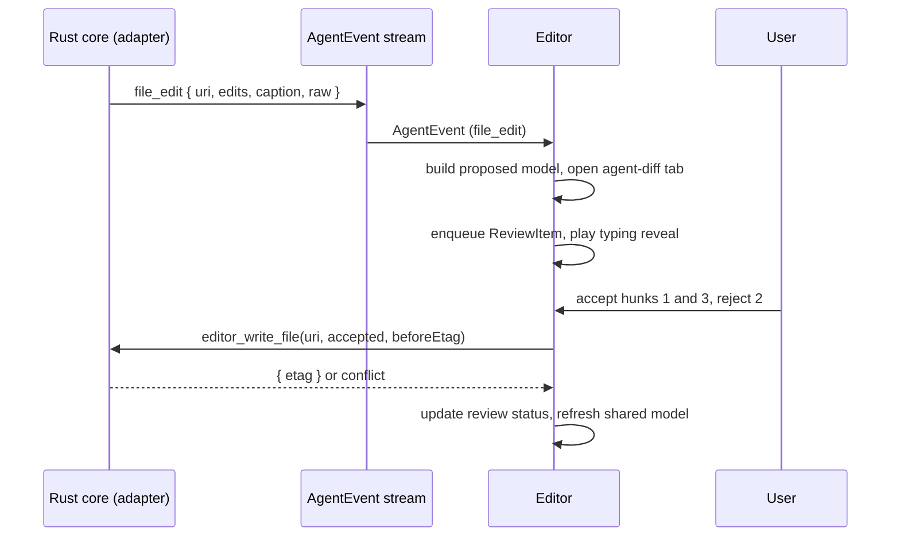

# Editor Spec

This document is the normative contract for the editor surface of vsclaude: the Monaco integration, the file explorer with live filesystem watching and lazy tree loading, the tab and split and dockable panel system, the diff editor (side-by-side and inline), and the full set of language features (multi-cursor, IntelliSense hooks, minimap, breadcrumbs, quick-open, global search and replace, multi-root workspaces, and snippets). Most importantly, it defines how agent `file_edit`, `file_create`, and `file_delete` events surface as live, reviewable diffs so the user always sees exactly which file the agent touched and exactly what changed. The editor is a pure consumer of the [`AgentEvent`](../packages/contracts/src/agent-event.ts) stream for everything the agent does, and a direct consumer of Rust core IPC commands for everything the human does. It never spawns processes, never touches the filesystem directly, and never invents content. This is a contract other engineers build against, not an overview.

## Table of contents

- [1. Goals and non-goals](#1-goals-and-non-goals)
- [2. Package layout](#2-package-layout)
- [3. Monaco integration](#3-monaco-integration)
- [4. File explorer: watch and lazy tree](#4-file-explorer-watch-and-lazy-tree)
- [5. Tabs, splits, and dockable panels](#5-tabs-splits-and-dockable-panels)
- [6. The diff editor](#6-the-diff-editor)
- [7. Language features](#7-language-features)
- [8. Quick-open, search, and replace](#8-quick-open-search-and-replace)
- [9. Multi-root workspaces](#9-multi-root-workspaces)
- [10. Snippets](#10-snippets)
- [11. Agent edits as live diffs](#11-agent-edits-as-live-diffs)
- [12. State ownership](#12-state-ownership)
- [13. Performance budget](#13-performance-budget)
- [14. Accessibility](#14-accessibility)
- [15. Testing](#15-testing)
- [16. Invariants](#16-invariants)

## 1. Goals and non-goals

The editor exists to let a human read, write, and review code beside an AI agent that is also reading, writing, and reviewing code. The two activities share one document model so the human never wonders whether what they see on screen matches what the agent did on disk.

**Goals**

- A fast, familiar Monaco experience with the conventions VS Code users expect.
- Truthful reflection of agent file actions through the three motion rules: every diff is bound to a real `file_edit` event, every change is recoverable down to the exact hunk, and every change carries a plain-language caption.
- Clean separation between read paths (human-initiated, via IPC commands) and event paths (agent-initiated, via the `AgentEvent` stream).

**Non-goals**

- The editor does not implement a language server itself. It hosts Monaco language features and optionally bridges to external LSP servers managed by the Rust core (see [7.4](#74-optional-lsp-bridge)).
- The editor does not run code, format on save by spawning tools, or call git. Those live in the Rust core and are surfaced through commands and events.
- The terminal surface is out of scope here; see [Architecture](./ARCHITECTURE.md) for the PTY and xterm.js wiring.

## 2. Package layout

The editor is one renderer package plus a thin slice of contract types. It depends only on the contracts package and the IPC client, never on a provider adapter.

```
packages/
  editor/
    src/
      monaco/            # Monaco bootstrap, theme, workers, model registry
      explorer/          # lazy tree, watch reconciler, virtualized list
      layout/            # tab manager, split tree, dockview integration
      diff/              # diff editor wrapper, agent-edit overlay, review queue
      language/          # languages, formatters, snippets, optional LSP bridge
      search/            # quick-open, global search and replace
      workspace/         # multi-root roots, settings resolution
      store/             # Zustand slices for editor state
      ipc/               # typed wrappers over Rust commands used by the editor
    index.ts
  contracts/             # AgentEvent and editor IPC types (frozen)
```

Monaco is loaded from `monaco-editor` with Vite workers configured explicitly. No CDN loading; the app must work fully offline.

```ts
// packages/editor/src/monaco/workers.ts
import * as monaco from 'monaco-editor';
import editorWorker from 'monaco-editor/esm/vs/editor/editor.worker?worker';
import jsonWorker from 'monaco-editor/esm/vs/language/json/json.worker?worker';
import tsWorker from 'monaco-editor/esm/vs/language/typescript/ts.worker?worker';

self.MonacoEnvironment = {
  getWorker(_id, label) {
    if (label === 'json') return new jsonWorker();
    if (label === 'typescript' || label === 'javascript') return new tsWorker();
    return new editorWorker();
  },
};
export { monaco };
```

## 3. Monaco integration

### 3.1 Model registry

Monaco is built around models (the document), editors (the view), and view state (cursor, scroll, folds). vsclaude keeps exactly one model per file URI and shares it across every view that opens the same file. This is the single most important rule for agent edits: when the agent writes to `src/foo.ts`, we push that change into the one shared model, and every open tab, split, and diff that references it updates atomically.

```ts
// packages/editor/src/monaco/modelRegistry.ts
import { monaco } from './workers';

const models = new Map<string, monaco.editor.ITextModel>();

export function getModel(uri: string, content: string, languageId: string): monaco.editor.ITextModel {
  const u = monaco.Uri.parse(uri);
  let model = monaco.editor.getModel(u);
  if (!model) {
    model = monaco.editor.createModel(content, languageId, u);
    models.set(uri, model);
  }
  return model;
}

export function disposeModel(uri: string): void {
  models.get(uri)?.dispose();
  models.delete(uri);
}
```

URIs use a `file:` scheme rooted at a workspace root id, for example `file:///root-0/src/foo.ts`, so that multi-root workspaces never collide. The root id maps back to an absolute disk path only inside the Rust core.

### 3.2 Reading content

The editor never reads the filesystem. It asks the Rust core through a typed command and receives content plus the metadata needed to build a model.

```ts
// packages/editor/src/ipc/files.ts
import { invoke } from '@tauri-apps/api/core';

export interface FilePayload {
  uri: string;
  content: string;
  languageId: string;
  encoding: 'utf-8' | 'utf-16le' | 'latin1';
  eol: '\n' | '\r\n';
  etag: string;        // content hash, used for conflict detection
  readonly: boolean;
}

export const readFile = (uri: string) => invoke<FilePayload>('editor_read_file', { uri });
export const writeFile = (uri: string, content: string, etag: string) =>
  invoke<{ etag: string }>('editor_write_file', { uri, content, etag });
```

`etag` is a content hash returned by the core. Writes pass the last known `etag`; the core rejects the write if disk changed underneath, which surfaces as a conflict the UI must resolve (see [11.5](#115-conflict-resolution)).

### 3.3 Theme and tokens

The editor theme is generated from the same CSS variable design tokens as the rest of the app so the cozy palette stays consistent. A build step reads the token file and emits a Monaco theme; the editor never hardcodes hex values.

| Concern | Source | Notes |
| --- | --- | --- |
| Base colors | Tailwind v4 CSS variables | Single source of truth |
| Syntax tokens | Generated Monaco theme | Derived from tokens, dark primary |
| Font | `--font-mono` | Ligatures off by default, user toggle |
| Cursor and selection | Tokens | Selection tint matches Pixie focused mood |

### 3.4 Lifecycle

Editors are created lazily when a tab becomes visible and disposed when the tab closes. View state (cursor, scroll, folds) is saved to the tab record on blur and restored on focus, so reopening a recently closed tab lands the cursor where it was.

## 4. File explorer: watch and lazy tree

### 4.1 Lazy tree loading

The explorer never reads a directory until it is expanded. Each node holds a `loaded` flag. Expanding a collapsed directory issues one `editor_list_dir` command and reconciles the children into the node. This keeps a 100k-file monorepo responsive because only opened paths are materialized.

```ts
// packages/editor/src/explorer/types.ts
export interface TreeNode {
  uri: string;
  name: string;
  kind: 'file' | 'dir';
  rootId: string;
  loaded: boolean;        // dir children fetched
  expanded: boolean;
  childrenUris: string[]; // ordered, dirs first then files, case-insensitive
  gitStatus?: 'M' | 'A' | 'D' | 'U' | '?';
  agentTouched?: boolean; // set when an AgentEvent edited this file this session
}
```

```ts
// packages/editor/src/ipc/explorer.ts
export interface DirEntry { uri: string; name: string; kind: 'file' | 'dir'; }
export const listDir = (uri: string) => invoke<DirEntry[]>('editor_list_dir', { uri });
```

Children arrive sorted by the core (directories first, then files, case-insensitive) so the renderer never sorts large lists on the main thread.

### 4.2 Virtualization

The visible tree is flattened into a linear array of rendered rows and drawn with a virtualized list (`@tanstack/react-virtual`). Only rows in the viewport plus a small overscan mount. Collapsing a directory removes its descendants from the flat array without unloading their fetched data, so re-expanding is instant.

### 4.3 Filesystem watching

The Rust core owns watching via the `notify` crate, debounced and scoped to the workspace roots, and emits filesystem change events that the explorer reconciles. The renderer never polls.

```ts
// packages/editor/src/explorer/watch.ts
export type FsChange =
  | { kind: 'created'; uri: string; isDir: boolean }
  | { kind: 'removed'; uri: string }
  | { kind: 'modified'; uri: string; etag: string }
  | { kind: 'renamed'; from: string; to: string };
```

Reconciliation rules:

| Change | Tree action | Open model action |
| --- | --- | --- |
| created | Insert into parent if parent `loaded`, else ignore | None |
| removed | Drop node and descendants | Mark model stale, prompt if dirty |
| modified | Update `gitStatus`, no fetch | If model open and clean, reload from `etag`; if dirty, show conflict |
| renamed | Move node, preserve expansion | Reparent model URI if open |

Watch events and agent `file_edit` events can describe the same physical change. The explorer treats the agent event as the labeled, captioned source of truth and uses the raw watch event only to keep nodes that no view has open in sync. Deduplication keys on `uri` plus `etag` within a short window.

### 4.4 Gitignore and noise

The explorer requests an ignore-aware listing. The core applies `.gitignore` and a built-in noise list (`.git`, `node_modules`, `target`, `dist`) but exposes a "show ignored" toggle. Ignored nodes render dimmed when shown.

## 5. Tabs, splits, and dockable panels

### 5.1 The layout tree

Layout is a binary split tree whose leaves are tab groups. Each tab group holds an ordered list of tabs and one active tab. This model supports arbitrary nesting of horizontal and vertical splits.

```ts
// packages/editor/src/layout/model.ts
export interface Tab {
  id: string;
  uri: string;
  kind: 'file' | 'diff' | 'agent-diff' | 'welcome';
  pinned: boolean;
  dirty: boolean;
  preview: boolean;       // single-click preview tab, replaced by next preview
  viewState?: unknown;    // Monaco view state snapshot
}

export interface TabGroup { id: string; tabs: Tab[]; activeTabId: string | null; }

export type LayoutNode =
  | { type: 'leaf'; group: TabGroup }
  | { type: 'split'; direction: 'horizontal' | 'vertical'; sizes: number[]; children: LayoutNode[] };
```

### 5.2 Preview tabs

Single-clicking a file in the explorer opens it in a shared preview tab (italic title) that the next preview replaces. Double-clicking, editing, or pinning promotes the tab to a permanent tab. This mirrors VS Code and keeps the tab bar clean while browsing.

### 5.3 Dockable panels

The overall window uses a dockable panel manager (Dockview or an equivalent built on the split tree above) so the editor area, explorer, timeline, chat, swarm, and terminal can be rearranged, floated, and stacked. Panels are addressable by stable ids so layouts persist across sessions and so the Rust core can request focus on a panel (for example, focus the diff review queue when a `permission_request` arrives).

| Panel | Default dock | Movable | Closable |
| --- | --- | --- | --- |
| Explorer | Left | Yes | Yes |
| Editor area | Center | No (always center) | No |
| Timeline | Bottom | Yes | Yes |
| Chat | Right | Yes | Yes |
| Swarm | Right (tab with chat) | Yes | Yes |
| Terminal | Bottom (tab with timeline) | Yes | Yes |
| Review queue | Right | Yes | Yes |

### 5.4 Persistence

The full layout tree, open tabs (URIs and view state), active tab per group, and panel arrangement serialize to the workspace settings on debounce and restore on launch. Tabs whose files no longer exist restore as a tombstone with a one-click dismiss.

## 6. The diff editor

### 6.1 Side-by-side and inline

The diff editor wraps `monaco.editor.createDiffEditor`. It supports both render modes from one component via the `renderSideBySide` option, toggled per tab and remembered.

```ts
// packages/editor/src/diff/DiffView.tsx
const diff = monaco.editor.createDiffEditor(el, {
  renderSideBySide: mode === 'side-by-side',
  readOnly: true,                 // agent diffs are read-only until accepted
  ignoreTrimWhitespace: false,
  renderOverviewRuler: true,
  diffAlgorithm: 'advanced',
});
diff.setModel({ original: originalModel, modified: modifiedModel });
```

| Mode | When used | Notes |
| --- | --- | --- |
| Side-by-side | Default for review on wide layouts | Original left, proposed right |
| Inline | Narrow splits, mobile-ish widths, and quick scans | Single column with add/remove gutters |

### 6.2 Diff sources

A diff tab can be opened from three sources, all producing the same `{ original, modified }` model pair:

1. **Agent edit** (`file_edit` / `file_create` / `file_delete`): original is the on-disk content before the edit, modified is the agent proposal. See [11](#11-agent-edits-as-live-diffs).
2. **Git diff**: original is a git ref version supplied by the core, modified is working tree or another ref.
3. **Manual compare**: the user picks two files or two states.

### 6.3 Navigation and granularity

The diff view exposes next/previous change navigation (`diff.goToDiff('next')`), a change counter in the tab, and per-hunk controls in the gutter. Hunks are the unit of review (see [11.3](#113-hunk-level-review)). The overview ruler marks every changed region so a long file is scannable at a glance.

## 7. Language features

### 7.1 Built-in Monaco features

These ship from Monaco directly and need only configuration:

| Feature | Configuration | Notes |
| --- | --- | --- |
| Syntax highlighting | Language registration | Bundled grammars for TS, JS, JSON, Rust, Python, Markdown, TOML, CSS, HTML |
| Multi-cursor | `multiCursorModifier: 'alt'` | Add cursor above/below, select-all-occurrences |
| IntelliSense (built-in) | TS/JS worker | Completions, hovers, signatures for TS/JS and JSON schema |
| Minimap | `minimap.enabled` | User toggle, hidden under a width threshold |
| Breadcrumbs | Document symbols | Path plus symbol crumbs, clickable |
| Folding | Default | Region and indentation strategies |
| Bracket pair colorization | Default on | |
| Sticky scroll | Default on | Shows enclosing scope header |

### 7.2 Multi-cursor and selection

Multi-cursor is enabled with the Alt modifier. Column selection (middle-drag or Shift+Alt+drag), select-all-occurrences (Ctrl+Shift+L), and add-next-occurrence (Ctrl+D) are wired through Monaco actions and surfaced in the command palette.

### 7.3 IntelliSense hooks

The editor exposes a registration surface so other packages (and an optional LSP bridge) can contribute providers without importing Monaco internals.

```ts
// packages/editor/src/language/registry.ts
export interface LanguageContributions {
  completion?: monaco.languages.CompletionItemProvider;
  hover?: monaco.languages.HoverProvider;
  definition?: monaco.languages.DefinitionProvider;
  references?: monaco.languages.ReferenceProvider;
  documentSymbol?: monaco.languages.DocumentSymbolProvider;
  formatting?: monaco.languages.DocumentFormattingEditProvider;
}

export function registerLanguage(languageId: string, c: LanguageContributions): monaco.IDisposable {
  const subs: monaco.IDisposable[] = [];
  if (c.completion) subs.push(monaco.languages.registerCompletionItemProvider(languageId, c.completion));
  if (c.hover) subs.push(monaco.languages.registerHoverProvider(languageId, c.hover));
  if (c.definition) subs.push(monaco.languages.registerDefinitionProvider(languageId, c.definition));
  if (c.references) subs.push(monaco.languages.registerReferenceProvider(languageId, c.references));
  if (c.documentSymbol) subs.push(monaco.languages.registerDocumentSymbolProvider(languageId, c.documentSymbol));
  if (c.formatting) subs.push(monaco.languages.registerDocumentFormattingEditProvider(languageId, c.formatting));
  return { dispose: () => subs.forEach((s) => s.dispose()) };
}
```

### 7.4 Optional LSP bridge

For richer language support the Rust core can manage external language servers and proxy LSP over IPC. The renderer translates LSP responses into the Monaco provider shapes above. This is optional and lazy: a language with no running server falls back to the built-in worker (TS/JS) or to syntax-only highlighting. The bridge is documented as a follow-up surface; the registration API in [7.3](#73-intellisense-hooks) is the stable seam.

## 8. Quick-open, search, and replace

### 8.1 Quick-open

Quick-open (Ctrl+P) is a fuzzy file picker backed by a core-side indexed file list, not a renderer-side directory walk. The core returns ranked matches for a query; the renderer renders and previews on highlight. Prefixes switch modes: `@` jumps to a symbol in the active file, `:` jumps to a line, `>` runs a command.

```ts
export const quickOpenSearch = (query: string, limit: number) =>
  invoke<{ uri: string; score: number }[]>('editor_quick_open', { query, limit });
```

### 8.2 Global search and replace

Global search runs in the core (ripgrep), streamed back so results render as they arrive. Replace is preview-first: the renderer shows a diff per match, the user selects which matches to apply, and the core applies them transactionally with the same `etag` conflict guard used for writes.

```ts
export interface SearchHit {
  uri: string;
  line: number;
  column: number;
  preview: string;       // line text with match range marked
  matchStart: number;
  matchEnd: number;
}
export const searchStream = (opts: {
  query: string; regex: boolean; caseSensitive: boolean; wholeWord: boolean;
  includeGlobs: string[]; excludeGlobs: string[];
}) => invoke<{ searchId: string }>('editor_search_start', { opts });
// hits arrive on an event channel keyed by searchId
```

Search and replace honors the same ignore rules as the explorer, with a "search ignored files" override.

## 9. Multi-root workspaces

A workspace is an ordered set of named roots. Each root has a stable `rootId`, an absolute path known only to the core, and resolved settings. All URIs are namespaced by `rootId` so two roots may contain `src/index.ts` without collision.

```ts
// packages/editor/src/workspace/types.ts
export interface WorkspaceRoot { rootId: string; name: string; }
export interface Workspace {
  id: string;
  roots: WorkspaceRoot[];
  settings: ResolvedSettings;   // merged: defaults -> user -> workspace -> root
}
```

The explorer renders one top-level node per root. Quick-open, global search, and the agent edit pipeline all span roots. Settings resolve in order: built-in defaults, then user settings, then workspace settings, then per-root settings, with later layers overriding earlier ones.

## 10. Snippets

Snippets use the standard TextMate snippet grammar (tabstops `$1`, placeholders `${1:name}`, choices `${1|a,b|}`, variables `$TM_FILENAME`). Three sources merge, later winning on name collision:

1. Built-in language snippets shipped with the editor package.
2. User snippets stored in user settings.
3. Workspace snippets stored under the workspace settings directory and surfaced by the core.

```ts
export interface SnippetDef { prefix: string; body: string[]; description?: string; scope?: string[]; }
```

Snippets register through the completion provider seam in [7.3](#73-intellisense-hooks) so they appear inline in IntelliSense. Agent-authored edits never go through the snippet engine; they arrive as concrete text in `file_edit` payloads.

## 11. Agent edits as live diffs

This section is the reason the editor exists. When the agent changes a file, the user must see exactly which file, exactly what changed, in motion, and must be able to review and accept or reject the change. This realizes all three motion rules at the editor layer.

### 11.1 Event to diff mapping

The editor subscribes to the `AgentEvent` stream and reacts to the file event types. The relevant payload fields come from the [Agent Event Schema](./AGENT_EVENT_SCHEMA.md).

| Event type | Editor reaction | Pixie state shown |
| --- | --- | --- |
| `file_read` | Reveal file in explorer, mark `agentTouched`, optional focus | reading |
| `file_create` | Open an agent-diff tab: original empty, modified new content | typing |
| `file_edit` | Open or update an agent-diff tab with original vs proposed | typing |
| `file_delete` | Open an agent-diff tab: original content, modified empty, marked delete | typing |

```ts
// packages/editor/src/diff/agentEdits.ts
interface FileEditPayload {
  uri: string;
  beforeEtag: string;          // expected on-disk content hash
  edits: { range: [number, number, number, number]; text: string }[]; // line/col ranges
  fullContent?: string;        // some providers send full file, others send edits
  caption: string;             // plain-language, from the adapter
}
```

A provider adapter may deliver either granular edits or a full proposed file. The editor normalizes both into a proposed modified model. If granular edits are given, it applies them to a clone of the current model to build the proposal, never to the live model directly.

### 11.2 The two surfacing modes

The user chooses, per workspace, how aggressively agent edits land:

1. **Review mode (default).** Edits open as read-only agent-diff tabs and enter the review queue. Nothing touches disk until accepted. This is the safe, truthful default and pairs with `permission_request` flows.
2. **Live-apply mode.** Edits apply to the model and to disk immediately (the agent is trusted for this session), but every applied change still records a reviewable, revertable entry in the review queue with its diff and caption. Meaning stays recoverable even when edits stream fast.

Either way, the diff and caption always exist. The difference is only whether the bytes reached disk before or after human acknowledgment.

### 11.3 Hunk-level review

The proposed change is decomposed into hunks. Each hunk has accept and reject controls in the diff gutter and a keyboard path (next change, accept, reject). Accepting a subset produces a new proposed content that is the original plus only the accepted hunks, which the core writes with the `beforeEtag` guard.

```ts
export interface ReviewItem {
  id: string;
  eventId: string;             // the AgentEvent.id that produced it
  uri: string;
  caption: string;
  hunks: Hunk[];
  status: 'pending' | 'partially-accepted' | 'accepted' | 'rejected';
}
export interface Hunk {
  id: string;
  originalRange: [number, number];   // start line, line count
  modifiedRange: [number, number];
  decision: 'pending' | 'accept' | 'reject';
}
```

### 11.4 The review queue

The review queue panel lists every agent file change this session, newest first, each row showing the caption, the file, the change counter, and accept-all/reject-all. Clicking a row opens its agent-diff tab. This is the recoverability guarantee made physical: from any motion the user saw Pixie perform, they can reach the exact diff and the exact `AgentEvent` that drove it. The row links to the timeline entry and to the raw provider payload through the standard drill-down inspector.

### 11.5 Conflict resolution

If the file changed on disk between the agent reading it and the user accepting (the `beforeEtag` no longer matches), the write is rejected and the diff tab enters a conflict state. The user can re-diff against current disk content, discard the proposal, or force-apply. The editor never silently overwrites newer content.

### 11.6 Live typing animation binding

While a `file_edit` streams, the editor can play a progressive reveal of the proposed text in the modified pane, advancing as edit chunks arrive. This is bound strictly to received chunks, never simulated ahead of data, satisfying motion rule one. The reveal rate is cosmetic only; the final content equals the payload exactly. Pixie shows the `typing` state with intensity scaled to edit volume, consistent with [Mascot System](./MASCOT_SYSTEM.md).

### 11.7 Sequence



## 12. State ownership

Editor state lives in dedicated Zustand slices. Fine-grained motion atoms (the typing reveal cursor) may use Jotai. The slices below are owned by the editor package and read by panels.

| Slice | Holds | Notes |
| --- | --- | --- |
| `layoutStore` | Layout tree, tab groups, active tabs | Persisted |
| `explorerStore` | Tree nodes, expansion, watch reconciliation | Lazy, virtualized |
| `diffStore` | Open diff tabs, modes, change indices | |
| `reviewStore` | Review queue items and hunk decisions | Keyed by `eventId` |
| `searchStore` | Active search, streamed hits, replace preview | |
| `workspaceStore` | Roots and resolved settings | |

The shared Monaco model registry is not in a store; it is a module singleton keyed by URI, since models are reference-stable and not serializable.

## 13. Performance budget

| Operation | Budget | Strategy |
| --- | --- | --- |
| Expand a 5k-entry directory | < 80 ms to first paint | Core-side sort, virtualized rows |
| Open a 1 MB file | < 150 ms | Lazy editor mount, shared model |
| Apply an agent `file_edit` to an open model | < 16 ms | Single `applyEdits`, no full re-tokenize |
| Stream 200 search hits | Incremental, no jank | Event channel, batched into store |
| Switch tabs | < 16 ms | Reuse editor instances per group |
| Watch event burst (1k changes) | Coalesced | Core debounces, renderer batches by frame |

High-frequency agent edits are coalesced per file per animation frame so a rapid sequence of edits to one file produces one model update and one diff refresh, not hundreds.

## 14. Accessibility

- Full keyboard operation: explorer arrow navigation, tab cycling, diff change navigation, accept/reject hunks, quick-open, and search all have bindings and appear in the command palette.
- Monaco's screen reader mode is honored; diff changes announce as additions and removals with line context.
- Every plain-language caption from an agent edit is exposed to assistive tech, so a non-technical or low-vision user can follow what the agent did without reading the diff itself.
- Color is never the only signal: add/remove use gutter glyphs and labels in addition to tint, and contrast meets the app token contract.

## 15. Testing

| Layer | Tool | Coverage |
| --- | --- | --- |
| Pure logic (tree reconcile, hunk split, settings merge) | Vitest | Unit, deterministic |
| Components (explorer row, tab bar, diff toolbar) | Vitest + Testing Library | Render and interaction |
| Visual states (every diff and review state) | Storybook | One story per state |
| Editor flows (open, edit, review, accept) | Playwright | Driven by recorded `AgentEvent` logs |
| Watch reconciliation | Vitest with mocked `FsChange` stream | Created/removed/modified/renamed |

Because the renderer is a deterministic projection of the `AgentEvent` stream, the strongest editor tests replay a recorded event log with no live agent and assert that tabs, diffs, and the review queue reach the expected state. This is the same replay property the [Architecture](./ARCHITECTURE.md) relies on.

## 16. Invariants

1. The editor never reads or writes the filesystem directly; all I/O goes through Rust core IPC commands.
2. Exactly one Monaco model exists per file URI, shared across all views.
3. Every agent file change produces a diff and a captioned review item; nothing the agent does to a file is invisible or unrecoverable.
4. Agent edits never mutate the live model to build a proposal; proposals are built on a clone, then applied only on accept (review mode) or recorded as revertable (live-apply mode).
5. Writes carry a `beforeEtag` and the core rejects stale writes; the editor never silently overwrites newer content.
6. The visual layer consumes only typed `AgentEvent` fields; `raw` is reached only through the drill-down inspector.
7. The renderer is a deterministic projection of the event stream: the same ordered events always reach the same editor state.
