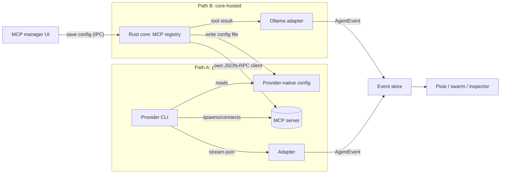

# MCP and Tools Spec

This document specifies how vsclaude discovers, configures, secures, and visualizes Model Context Protocol (MCP) servers and the tools they expose, plus the hooks system that lets users run their own commands at well-defined points in the agent lifecycle. MCP servers are external programs that hand an agent extra tools (search a database, query an issue tracker, hit an internal API). In vsclaude they are managed through a dedicated UI in the Rust core, and every tool the agent invokes (built-in or from an MCP server) flows through the same frozen [AgentEvent](../packages/contracts/src/agent-event.ts) stream as `tool_call` and `tool_result` events, so Pixie acts them out and the inspector drills into them with no special casing. Because MCP servers are arbitrary code with arbitrary capabilities, a large part of this spec is the security model: how we sandbox, scope, audit, and gate them. If you are implementing the MCP manager, the hooks editor, or the tool inspector, build against this document.

## Table of contents

- [Scope and non-goals](#scope-and-non-goals)
- [Concepts and vocabulary](#concepts-and-vocabulary)
- [How MCP fits the architecture](#how-mcp-fits-the-architecture)
- [Configuration model](#configuration-model)
- [MCP server manager UI](#mcp-server-manager-ui)
- [Tool inspection UI](#tool-inspection-ui)
- [Hooks configuration UI](#hooks-configuration-ui)
- [Mapping tool calls to AgentEvents](#mapping-tool-calls-to-agentevents)
- [The tool call in the inspector](#the-tool-call-in-the-inspector)
- [Security model](#security-model)
- [Rust core interfaces](#rust-core-interfaces)
- [Testing requirements](#testing-requirements)

## Scope and non-goals

In scope:

- A manager UI to add, configure, enable, disable, inspect, and remove MCP servers.
- Discovery and display of the tools each server exposes, with their JSON Schema inputs.
- A hooks configuration UI for lifecycle commands.
- The exact mapping from a tool invocation (built-in or MCP) to `tool_call` and `tool_result` events, including which Pixie state fires.
- The security model: trust prompts, permission scoping, sandboxing, secret handling, and audit logging.

Out of scope (covered elsewhere):

- The provider adapter contract and event pipeline: see [Providers Spec](./PROVIDERS_SPEC.md).
- The full `AgentEvent` shape, lifecycle, and versioning: see [Agent Event Schema](./AGENT_EVENT_SCHEMA.md).
- Pixie state machine internals: see [Mascot System](./MASCOT_SYSTEM.md).
- How sub-agents render as a swarm: see [Swarm Spec](./SWARM_SPEC.md).

A deliberate boundary: vsclaude does not reimplement MCP. Each provider CLI (Claude Code, Codex, Gemini) already speaks MCP and owns the actual JSON-RPC transport to servers. vsclaude owns the configuration surface, writes the config the provider reads, observes the resulting tool traffic through the adapter, and enforces its own trust and audit layer on top. For Ollama and any provider lacking native MCP, vsclaude can host an in-core MCP client itself (see [How MCP fits the architecture](#how-mcp-fits-the-architecture)).

## Concepts and vocabulary

| Term | Meaning |
| --- | --- |
| MCP server | An external process or remote endpoint that exposes tools, resources, and prompts over the Model Context Protocol. |
| Transport | How the client talks to the server: `stdio` (spawn a local process), `sse` (Server-Sent Events over HTTP), or `http` (streamable HTTP). |
| Tool | A named, schema-typed callable the server offers (for example `search_issues` with an input schema). |
| Tool namespace | The prefix that disambiguates a tool. vsclaude displays MCP tools as `mcp__<serverId>__<toolName>`. |
| Built-in tool | A tool the provider ships natively (file read, edit, shell, web fetch). Not from MCP, but rendered identically in the timeline. |
| Hook | A user-defined command vsclaude runs at a lifecycle point (for example before a tool call). |
| Trust grant | A persisted, scoped decision that a given server may run for a given project. |

## How MCP fits the architecture

There are two execution paths depending on the active provider.

**Path A: provider-native MCP (Claude Code, Codex, Gemini).** The provider CLI manages the MCP connection. vsclaude writes the server config into the location the provider reads, the agent calls MCP tools as part of its normal turn, and those calls appear in the provider's streaming output. The adapter maps them to `tool_call` and `tool_result` like any other tool. vsclaude never sees the raw JSON-RPC; it sees the provider's rendering of the tool use, which is enough to drive motion and the inspector.

**Path B: core-hosted MCP (Ollama and bring-your-own clients).** Local models have no MCP runtime of their own, so the Rust core runs an MCP client itself, advertises the discovered tools to the model through the provider adapter's tool-calling interface, executes the call against the server, and feeds the result back. Here vsclaude owns the full round trip and therefore emits the `tool_call` and `tool_result` events directly.



Either way the rest of the app only ever sees `AgentEvent`. The MCP registry in the Rust core is the single source of truth for configuration; the provider config files are a derived projection it writes and reconciles.

## Configuration model

The canonical config is owned by vsclaude and stored per scope. Two scopes exist:

- **Global** (`~/.config/vsclaude/mcp.json` or the OS equivalent): servers available to every project.
- **Project** (`<project>/.vsclaude/mcp.json`, committed to version control): servers specific to a repo. Project entries override global entries with the same `id`.

Secrets are never written into these files. Any field that holds a secret references a key in the OS keychain by name; the value is resolved at launch and injected as an environment variable into the server process. The config is a plain, reviewable artifact.

```ts
// packages/contracts/src/mcp.ts (frozen, versioned)
export type McpTransport =
  | { kind: 'stdio'; command: string; args: string[]; cwd?: string }
  | { kind: 'sse'; url: string }
  | { kind: 'http'; url: string };

export interface McpServerConfig {
  id: string;                 // stable slug, used in the mcp__<id>__<tool> namespace
  label: string;              // human name shown in the UI
  transport: McpTransport;
  enabled: boolean;
  scope: 'global' | 'project';
  /** Plain env vars. Never put secrets here. */
  env?: Record<string, string>;
  /** Maps an env var name to a keychain entry resolved at launch. */
  secretRefs?: Record<string, { keychainKey: string }>;
  /** Per-tool default permission policy; see the security model. */
  toolPolicy?: Record<string, 'ask' | 'allow' | 'deny'>;
  /** Default policy for tools not listed above. */
  defaultPolicy: 'ask' | 'allow' | 'deny';
  /** Optional headers for sse/http transports (values may be secretRefs). */
  headers?: Record<string, string>;
  /** Wall-clock timeout for a single tool call, ms. */
  timeoutMs?: number;
  schemaVersion: number;
}
```

A new server starts with `enabled: false`, `defaultPolicy: 'ask'`, and no trust grant, so it can do nothing until the user explicitly turns it on and trusts it.

## MCP server manager UI

Reached from Settings and from the status bar. It is a master/detail layout: a list of configured servers on the left, a detail and inspect pane on the right.

### Server list

Each row shows the label, a scope chip (Global or Project), a live status dot, and an enable toggle.

| Status | Dot | Meaning |
| --- | --- | --- |
| `disabled` | gray | Toggle off. Not started. |
| `connecting` | amber, pulsing | Spawning process or opening the HTTP stream. |
| `ready` | green | Handshake complete, tools discovered. |
| `degraded` | amber | Connected but a recent tool call failed or timed out. |
| `error` | red | Failed to start or lost connection. Hover shows the last error; click opens logs. |

The toggle calls `enableServer(id, enabled)`. Enabling a never-trusted server first triggers the trust prompt (see [Security model](#security-model)); the toggle does not flip to on until trust is granted.

### Add server flow

A two-step wizard.

1. **Source.** Choose a transport: Local command (`stdio`), Server-Sent Events (`sse`), or HTTP (`http`). Power users can paste a JSON config block and skip the form; it is validated against `McpServerConfig` and any unknown field is rejected with a clear message.
2. **Configure.** Fill the transport fields. For `stdio`: command, args, working directory, environment variables. For `sse`/`http`: URL and headers. Secret fields show a key icon; choosing one opens the keychain picker rather than a plain text input, so secrets never land in the config file. The wizard ends on a Test button that performs a dry connect and lists discovered tools before the user commits.

```
+--------------------------------------------------------------+
|  Add MCP server                                  step 2 of 2 |
+--------------------------------------------------------------+
|  Transport:  (*) Local command   ( ) SSE   ( ) HTTP          |
|                                                              |
|  Command   [ npx                                          ]  |
|  Args      [ -y  @acme/issues-mcp                         ]  |
|  Cwd       [ (project root)                               ]  |
|                                                              |
|  Environment                                                 |
|    ISSUES_BASE_URL   [ https://issues.internal           ]  |
|    ISSUES_TOKEN      [ 🔑 keychain: acme/issues-token  v ]  |
|                                                              |
|  Default policy:  (*) Ask each call  ( ) Allow  ( ) Deny    |
|                                                              |
|  [ Test connection ]        discovered: 6 tools  ✓          |
|                                                              |
|                                   [ Cancel ]   [ Save ]      |
+--------------------------------------------------------------+
```

### Detail pane

For a selected server: editable config, a Tools tab (see below), a Logs tab (stdout/stderr for `stdio`, request/response metadata for HTTP, redacted), and a danger zone (clear trust grant, remove server). Edits are staged and applied with a Save action that reconciles the running connection: changing transport or env restarts the server; changing only `toolPolicy` is hot-applied without a restart.

## Tool inspection UI

The Tools tab lists every tool the connected server advertised during the MCP `tools/list` handshake. This is read-only metadata supplied by the server; vsclaude renders it, it does not invent it.

For each tool: its namespaced id (`mcp__<id>__<tool>`), the server-provided description, a per-tool policy selector (`Ask` / `Allow` / `Deny`, defaulting to the server default), and an expandable view of the input JSON Schema rendered as a readable parameter table.

```
Tools for "Acme Issues"  (ready, 6 tools)
+------------------------------------------------------------------+
| mcp__acme-issues__search_issues               policy: [ Ask  v ] |
|   Search the issue tracker by query and filters.                 |
|   ▸ parameters                                                   |
|       query      string   required   full-text query             |
|       status     enum     optional   open | closed | all         |
|       limit      number   optional   default 20, max 100         |
+------------------------------------------------------------------+
| mcp__acme-issues__create_issue                policy: [ Deny v ] |
|   Create a new issue. (write tool)                               |
|   ...                                                            |
+------------------------------------------------------------------+
```

vsclaude flags likely write or destructive tools heuristically (name contains create/update/delete/write/exec, or the schema declares no read-only annotation) and surfaces a small warning badge so the user can set a stricter policy. The heuristic only affects the suggested default; the user's explicit policy always wins.

A Try it action lets the user invoke a tool manually with a form generated from its schema. Manual invocations are clearly labeled as user-initiated in the timeline and the audit log, never attributed to the agent.

## Hooks configuration UI

Hooks are user-defined commands vsclaude runs at fixed lifecycle points. They are the user's escape hatch for automation (run a formatter after every edit, block a dangerous command, log every tool call). Hooks are powerful and run with the user's privileges, so the UI treats them with the same caution as MCP servers.

### Hook points

| Hook point | Fires | Can block? | Typical use |
| --- | --- | --- | --- |
| `session-start` | When an agent session begins | no | Warm caches, print a banner |
| `pre-tool` | Before any `tool_call` is dispatched | yes | Gate or deny risky tools |
| `post-tool` | After a `tool_result` arrives | no | Format files, lint, notify |
| `pre-command` | Before a shell command runs | yes | Block destructive commands |
| `permission-request` | When the agent needs approval | yes | Auto-approve a safe allowlist |
| `session-end` | When a session completes or aborts | no | Cleanup, summary report |

A hook receives a JSON event on stdin describing the triggering `AgentEvent` and returns a small JSON decision on stdout. A blocking hook may return `{ "decision": "deny", "reason": "..." }` to stop the action; the reason becomes the user-facing caption on the resulting `permission_request` or `error` event.

```ts
// packages/contracts/src/hooks.ts (frozen, versioned)
export type HookPoint =
  | 'session-start' | 'pre-tool' | 'post-tool'
  | 'pre-command' | 'permission-request' | 'session-end';

export interface HookConfig {
  id: string;
  point: HookPoint;
  /** Run only when this matches the tool name or command. Glob, optional. */
  matcher?: string;
  command: string;           // executable + args, run in a restricted env
  timeoutMs: number;         // killed and treated as non-blocking if exceeded
  enabled: boolean;
  scope: 'global' | 'project';
}

export interface HookDecision {
  decision?: 'allow' | 'deny';
  reason?: string;
  /** Optional rewritten input for the tool, validated before use. */
  modifiedInput?: unknown;
}
```

### Editor

The hooks editor groups rows by hook point. Each row has a matcher field, the command, a timeout, and an enable toggle. A Test action runs the hook against a synthetic event and shows stdin, stdout, exit code, and the parsed decision, so users can debug without waiting for a live session. Blocking hook points carry a visible "can block the agent" badge. Saving a project-scoped hook writes to `<project>/.vsclaude/hooks.json` and, because committed hooks execute on teammates' machines, the editor warns that the change is shared and should be reviewed.

## Mapping tool calls to AgentEvents

Every tool invocation, whether built-in or MCP, produces exactly one `tool_call` event when dispatched and exactly one `tool_result` event when it resolves (success or failure). MCP is not a distinct event type; the namespace and a payload flag are how a consumer knows a tool came from an MCP server.

| Field | `tool_call` | `tool_result` |
| --- | --- | --- |
| `type` | `'tool_call'` | `'tool_result'` |
| `tool.name` | namespaced id, for example `mcp__acme-issues__search_issues` | same name as the matching call |
| `tool.input` | the arguments object | omitted |
| `payload.source` | `'mcp'` or `'builtin'` | `'mcp'` or `'builtin'` |
| `payload.serverId` | the MCP server id (mcp only) | the MCP server id (mcp only) |
| `payload.callId` | unique id linking call to result | same `callId` as the call |
| `payload.status` | absent | `'ok'` \| `'error'` \| `'denied'` \| `'timeout'` |
| `payload.durationMs` | absent | wall-clock time of the call |
| `payload.preview` | a short, safe summary for the caption | a short, safe summary of the output |
| `caption` | plain language, for example "Searching Acme issues for 'login bug'" | "Found 12 matching issues" |
| `raw` | the exact provider/MCP block | the exact result payload |

Specialized built-in tools also emit their richer typed event in addition to or instead of the generic pair, per the [Agent Event Schema](./AGENT_EVENT_SCHEMA.md): a file edit yields `file_edit`, a shell command yields `command_run` then `command_output`, a web fetch yields `web_fetch`. MCP tools are generic by nature and use the `tool_call` / `tool_result` pair unless an adapter recognizes a known MCP server and lifts it to a richer type. The `callId` always links the pair so the inspector can join them and the timeline can collapse them into one entry.

```ts
// Adapter mapping for an MCP tool use block (TypeScript mirror)
function mapMcpToolUse(block: McpToolUseBlock, ctx: AdapterCtx): AgentEvent {
  const [, serverId, toolName] = block.name.split('__'); // mcp__<server>__<tool>
  return {
    id: ctx.nextId(),
    sessionId: ctx.sessionId,
    agentId: ctx.agentId,
    parentAgentId: ctx.parentAgentId,
    ts: Date.now(),
    type: 'tool_call',
    provider: ctx.provider,
    schemaVersion: 1,
    tool: { name: block.name, input: block.input },
    payload: {
      source: 'mcp',
      serverId,
      callId: block.id,
      preview: summarizeInput(toolName, block.input),
    },
    caption: ctx.captioner.toolCall(block.name, block.input),
    raw: block,
  };
}
```

### Pixie state mapping

The visual layer reads `type` and `tool.name`, never `raw`. A `tool_call` maps to a Pixie state by tool family so motion stays meaningful:

| Tool family (by name or source) | Pixie state | Mood hint |
| --- | --- | --- |
| `search`, `*search*`, `*query*` | `searching` | focused |
| `*fetch*`, `web_*` | `web` | focused |
| MCP tool, unknown family | `running` | focused |
| write/exec MCP tool awaiting approval | `waiting` | calm |
| `tool_result` with `status: 'error'` | `debugging` then `confused` if unresolved | struggling |

A `permission_request` raised because a tool's policy is `ask` always renders `waiting`, freezing Pixie in a clear "needs you" pose until the user answers. Intensity scales with how many tool calls are in flight, which is exactly what makes a parallel sub-agent swarm look busy. See [Mascot System](./MASCOT_SYSTEM.md) and [Swarm Spec](./SWARM_SPEC.md).

## The tool call in the inspector

Clicking a tool entry in the timeline opens the drill-down inspector. This is sacred motion rule two in practice: one click reaches the exact underlying detail. The inspector joins the `tool_call` and its `tool_result` by `callId` and shows:

- **Header:** namespaced tool name, a source badge (MCP server label or Built-in), status, and duration.
- **Input:** the arguments rendered against the tool's JSON Schema, with a raw JSON toggle.
- **Output:** the result, pretty-printed, with a raw toggle. Large outputs are virtualized and truncated with a "show full" affordance.
- **Provenance:** which server produced it, the trust grant in effect, and the policy that allowed the call (`allow`, or `ask` then user-approved).
- **Timeline link:** jump to the preceding and following events from the same agent.

```
+------------------------------------------------------------------+
| mcp__acme-issues__search_issues     [MCP: Acme Issues]  ok  214ms |
+------------------------------------------------------------------+
| Input                                          raw json [ ▢ ]     |
|   query   "login bug"                                            |
|   status  "open"                                                 |
|   limit   20                                                    |
+------------------------------------------------------------------+
| Output                                         raw json [ ▢ ]     |
|   12 issues  ▸ #1842 Login fails on Safari ...                  |
+------------------------------------------------------------------+
| Provenance                                                       |
|   server: Acme Issues (project scope) · policy: allow            |
|   trust granted 2026-06-19 for project vsclaude                 |
+------------------------------------------------------------------+
```

Because the visual surface consumes only typed fields and `raw` lives behind these toggles, the inspector works identically for MCP tools and built-ins, and for any provider, with no special casing.

## Security model

MCP servers and hooks are arbitrary code with arbitrary reach. The security model is the load-bearing part of this spec. The guiding principle is least privilege by default and explicit, scoped, revocable consent.

### Trust before run

A server can be configured but does nothing until trusted. The first time a user enables a server (or the first time a project config introduces one), vsclaude shows a trust prompt that states the transport, the exact command or URL, the env vars it will receive (secret names only, never values), and the tools it advertises. Trust is granted per project and persisted as a `TrustGrant`. A project-scoped config pulled from version control is never auto-trusted; teammates must each grant trust, which stops a malicious commit from silently running code on a pull.

```ts
export interface TrustGrant {
  serverId: string;
  projectPath: string;
  /** Hash of the transport+command so config tampering revokes trust. */
  configHash: string;
  grantedAt: number;
  grantedBy: string;
}
```

If the `configHash` changes (someone edits the command or URL), the grant is invalidated and the user is re-prompted. This is the mechanism that defeats a "trust once, swap the binary later" attack.

### Permission scoping per tool

Every tool call is gated by policy resolution: per-tool policy, then server default, then a hard global default of `ask`. A `deny` short-circuits with a `tool_result` of `status: 'denied'` and never reaches the server. An `ask` raises a `permission_request` event and pauses the agent until the user answers; the user may approve once or approve for the session. Write and destructive tools default to stricter handling via the heuristic described earlier. There is a global panic switch in the status bar that sets every server to `deny` instantly.

### Sandboxing

| Transport | Isolation |
| --- | --- |
| `stdio` | Spawned by the Rust core as a child process with a minimal env (only declared env vars plus resolved secrets), a working directory pinned to the project, no inherited parent secrets, and OS-level limits where available. The process is killed on session end and on disable. |
| `sse` / `http` | Outbound only. URLs are validated; private-network and loopback URLs require an explicit confirmation to prevent SSRF-style reach into local services. Headers may carry secrets resolved from the keychain. |

Hooks run the same way: a child process with a restricted env, a hard timeout, and stdout limited in size. A hook that exceeds its timeout is killed and treated as non-blocking (fail open for non-blocking points, fail closed for blocking points so a hung `pre-command` hook does not silently let a command through). The blocking-versus-non-blocking failure mode is configurable per hook but defaults to the safe choice.

### Secret handling

Secrets live only in the OS keychain (the same store the rest of vsclaude uses; see [Architecture](./ARCHITECTURE.md)). Config files store key names, not values. At launch the core resolves `secretRefs` and injects them as env vars into the child process only. Secrets are never logged, never shown in the inspector, never written to `raw`, and are redacted from any captured stdout/stderr by a pattern filter before display or audit. The Logs tab shows `ISSUES_TOKEN=***` and nothing more.

### Audit log

Every consequential action appends an immutable audit record: server enabled or disabled, trust granted or revoked, tool policy changed, a tool call allowed or denied, a hook decision. Records carry actor, timestamp, server id, tool name, policy applied, and outcome. The audit log is local, append-only, and viewable in the danger zone. It is the forensic record if a server misbehaves.

```ts
export interface AuditRecord {
  ts: number;
  kind: 'enable' | 'disable' | 'trust' | 'revoke'
      | 'policy-change' | 'tool-allow' | 'tool-deny' | 'hook-decision';
  serverId?: string;
  toolName?: string;
  policy?: 'ask' | 'allow' | 'deny';
  outcome: 'ok' | 'denied' | 'error' | 'timeout';
  detail?: string; // redacted, never secrets
}
```

### Threat summary

| Threat | Mitigation |
| --- | --- |
| Malicious project config runs code on clone | No auto-trust; per-user, per-project trust prompt |
| Trust-then-swap-binary | `configHash` in the trust grant; edits revoke trust |
| Secret exfiltration via logs | Keychain-only secrets, env-only injection, redaction filter |
| SSRF into local services via `http`/`sse` | URL validation, explicit confirm for private/loopback targets |
| Runaway or hung server/hook | Hard timeouts, kill on session end, panic switch |
| Silent privilege creep on writes | Write-tool heuristic, stricter default policy, audit log |
| Prompt-injected tool abuse | Per-tool `ask`/`deny`, `pre-tool` blocking hooks, permission events |

## Rust core interfaces

The MCP registry and hook runner live in the Rust core alongside the process lifecycle owner. The TypeScript IPC surface the UI binds to:

```ts
// packages/contracts/src/mcp-ipc.ts
export interface McpManagerIpc {
  listServers(): Promise<McpServerConfig[]>;
  upsertServer(cfg: McpServerConfig): Promise<void>;
  removeServer(id: string): Promise<void>;
  enableServer(id: string, enabled: boolean): Promise<McpServerStatus>;
  /** Dry connect: handshake, return discovered tools, then disconnect. */
  testServer(cfg: McpServerConfig): Promise<{ tools: McpToolInfo[] }>;
  listTools(id: string): Promise<McpToolInfo[]>;
  invokeToolManually(id: string, tool: string, input: unknown): Promise<unknown>;
  grantTrust(id: string, projectPath: string): Promise<void>;
  revokeTrust(id: string, projectPath: string): Promise<void>;
  setToolPolicy(id: string, tool: string, p: 'ask' | 'allow' | 'deny'): Promise<void>;
  panicDenyAll(): Promise<void>;
  // Hooks
  listHooks(): Promise<HookConfig[]>;
  upsertHook(h: HookConfig): Promise<void>;
  testHook(h: HookConfig, sampleEvent: unknown): Promise<HookDecision>;
  // Streamed status (over the IPC event channel, not a Promise)
  // 'mcp:status' -> { id, status, error? }
  // 'mcp:audit'  -> AuditRecord
}

export interface McpToolInfo {
  name: string;          // mcp__<id>__<tool>
  description?: string;
  inputSchema: unknown;  // JSON Schema as provided by the server
  likelyWrite: boolean;  // heuristic flag
}

export type McpServerStatus =
  'disabled' | 'connecting' | 'ready' | 'degraded' | 'error';
```

The registry reconciles config to the running world: on `upsertServer` it diffs against the live connection and restarts only when transport or env changed. It writes the derived provider-native config for Path A providers and owns the JSON-RPC client for Path B. All tool traffic it observes or executes is emitted as `AgentEvent` through the same channel adapters use, so the rest of the app is unaware of the difference.

## Testing requirements

- **Mapping golden tests.** Recorded MCP tool-use and tool-result blocks (Path A from provider streams, Path B from core execution) map to the exact `tool_call` / `tool_result` events, asserted against frozen fixtures in `packages/providers/*`. Both the Rust parser and its TypeScript mirror run the same fixtures.
- **Policy resolution unit tests.** Per-tool, then server default, then global default; `deny` short-circuits before transport; `ask` emits `permission_request`; manual invocation is labeled user-initiated.
- **Trust and tamper tests.** A changed `configHash` revokes trust; a project config never auto-trusts; revoke takes effect immediately.
- **Secret redaction tests.** Secrets never appear in `raw`, captions, logs, or audit records; the redaction filter catches injected env values in stdout.
- **Sandbox tests.** `stdio` servers get a minimal env and pinned cwd; private/loopback `http` URLs require confirmation; timeouts kill the child; the panic switch sets all to `deny`.
- **Hooks tests.** Blocking hooks can deny a `pre-tool` and `pre-command`; timeout on a blocking hook fails closed; `modifiedInput` is validated against the tool schema before use; `testHook` returns the parsed decision.
- **Inspector tests (Playwright).** Clicking a tool entry joins call and result by `callId`, renders input against schema, toggles raw, and shows correct provenance, identically for MCP and built-in tools.
- **Storybook.** Every server status, the add-server wizard steps, the trust prompt, the tool list with write badges, the permission prompt, and the hooks editor are captured as stories.

See [Providers Spec](./PROVIDERS_SPEC.md) for the adapter contract these mappings plug into and [Agent Event Schema](./AGENT_EVENT_SCHEMA.md) for the event shapes referenced throughout.
