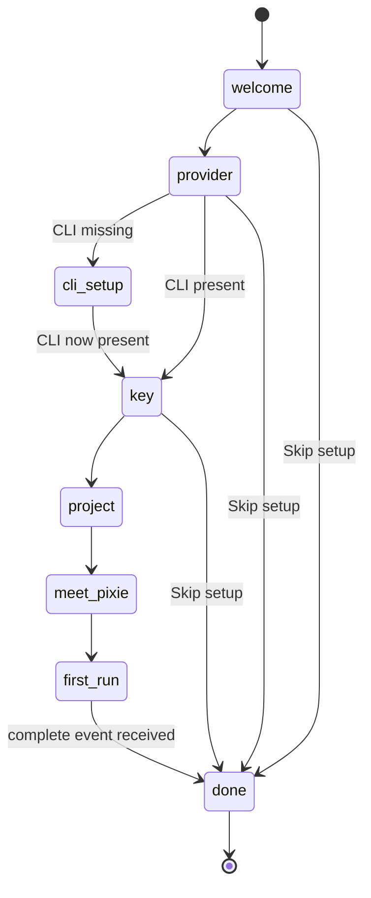

# Onboarding and Delight

This document is the contract for the first-run experience of vsclaude: the wizard that takes a brand-new user from a fresh download to a first animated agent run in under five minutes, plus the small set of honest delight mechanics that follow (milestone moments, gentle break nudges). The goal is a calm, fast, truthful onboarding that respects the user's time and the three sacred motion rules. It covers the wizard's state machine, each step's exact UI and behavior, CLI auto-detection with friendly guided setup when an agent is missing, keychain-backed key storage through the Rust core, the "meet Pixie" moment, the success gate, and the delight subsystem that never crosses into gamified distraction. The Rust core owns all process spawning, filesystem access, and secret storage; the React renderer drives the wizard purely through typed IPC. This is an implementation contract, not a tour.

## Table of contents

- [1. Principles](#1-principles)
- [2. The under-five-minutes budget](#2-the-under-five-minutes-budget)
- [3. Wizard state machine](#3-wizard-state-machine)
- [4. Step: Welcome](#4-step-welcome)
- [5. Step: Pick a provider](#5-step-pick-a-provider)
- [6. CLI auto-detection and guided setup](#6-cli-auto-detection-and-guided-setup)
- [7. Step: Add a key](#7-step-add-a-key)
- [8. Step: Open or create a project](#8-step-open-or-create-a-project)
- [9. Step: Meet Pixie and first run](#9-step-meet-pixie-and-first-run)
- [10. The success gate](#10-the-success-gate)
- [11. IPC surface](#11-ipc-surface)
- [12. Persistence and resumability](#12-persistence-and-resumability)
- [13. The delight subsystem](#13-the-delight-subsystem)
- [14. Milestone moments](#14-milestone-moments)
- [15. Gentle break nudges](#15-gentle-break-nudges)
- [16. Accessibility and reduced motion](#16-accessibility-and-reduced-motion)
- [17. Telemetry and privacy](#17-telemetry-and-privacy)
- [18. Testing requirements](#18-testing-requirements)
- [19. Invariants and non-goals](#19-invariants-and-non-goals)

## 1. Principles

1. **Usability above all.** Onboarding is the first and harshest usability test. Every step is skippable or has a sensible default, nothing blocks the user on a question they cannot answer yet, and the path of least resistance is always the correct one. A confused user at step two never reaches Pixie.
2. **Truthful by construction.** The wizard never fakes progress. A spinner means real work is happening (a CLI probe, a keychain write, a process spawn). The first agent run shows a real agent doing real work bound to real [AgentEvent](../packages/contracts/src/agent-event.ts) data, never a scripted demo. See [Mascot System](./MASCOT_SYSTEM.md) for why decorative animation is forbidden.
3. **Secrets never touch the renderer's disk.** Keys flow once from the input field to the Rust core and into the OS keychain. The wizard stores only a `keyRef`. This mirrors the secret contract in [Settings, Themes, and Persistence](./SETTINGS_THEMES_PERSISTENCE.md).
4. **Resumable and forgiving.** If the user quits mid-wizard, closes the laptop, or the app crashes, the next launch resumes at the exact step they left, with prior answers intact. No step is a point of no return.
5. **Delight is earned, never demanded.** Milestone moments celebrate real accomplishments (first run, first multi-file edit, first swarm). Break nudges are gentle and dismissible. Nothing is a streak, a badge to chase, a point total, or a dark pattern. The user's focus belongs to their work, not to the app.

## 2. The under-five-minutes budget

The five-minute promise is a hard product target measured from first window paint to the first `complete` event of the first agent run. Each step has a time budget that the wizard is built to respect. The numbers below are design budgets, not enforced timeouts.

| Step | Target time | What dominates |
| --- | --- | --- |
| Welcome | 5 s | One read, one click |
| Pick a provider | 15 s | A four-card choice with a recommended default |
| CLI detection | 2 to 30 s | Background probe; only blocks if a guided install is needed |
| Add a key | 30 s | Paste from clipboard, one keychain write |
| Open or create a project | 20 s | Native folder picker or a one-click sample project |
| Meet Pixie and first run | 60 to 180 s | The actual agent run, which is real work |

The wizard overlaps work to protect the budget: the CLI probe for the selected provider starts the instant a provider is picked, so by the time the user finishes pasting a key, detection has usually already resolved. The sample project is pre-staged in a temp directory at app launch so "create a project" is instant.

## 3. Wizard state machine

The wizard is a finite state machine owned by a Zustand store in the renderer, hydrated from a persisted `OnboardingState` (see [section 12](#12-persistence-and-resumability)). Steps are a discriminated union so the UI never renders an impossible combination.

```ts
// packages/onboarding/src/state.ts
export type WizardStep =
  | 'welcome'
  | 'provider'
  | 'cli-setup'      // only entered when the chosen provider's CLI is missing
  | 'key'
  | 'project'
  | 'meet-pixie'
  | 'first-run'
  | 'done';

export interface OnboardingState {
  schemaVersion: number;
  step: WizardStep;
  provider?: ProviderId;          // chosen in 'provider'
  cliStatus?: CliDetectionResult; // from the background probe
  keyConfigured: boolean;         // true once a keyRef exists for provider
  projectPath?: string;           // absolute path, chosen in 'project'
  usedSampleProject: boolean;
  firstRunSessionId?: string;     // the session that satisfies the success gate
  completedAt?: number;           // epoch ms; set when 'done' is reached
  skipped: boolean;               // user chose "skip setup, I'll do it later"
}
```

The legal transitions are a forward path with two well-defined detours (guided CLI setup, and skipping). The diagram is the source of truth for what the renderer may do.



Transition rules:

- **Forward only by default.** A Back button exists on every step except `first-run` (a run is in flight) and `done`. Back restores the prior step's saved answer; it never wipes a configured key or a probed CLI status.
- **Skip is always available** from `welcome`, `provider`, and `key`, and lands the user in the full IDE with onboarding marked `skipped`. A persistent, dismissible "Finish setup" affordance remains in the app shell until onboarding completes.
- **`first-run` is the only step the user cannot freely leave.** They can cancel the run (which returns to `meet-pixie`), but they cannot skip forward past a run that has not produced a terminal event.

## 4. Step: Welcome

A single calm screen. The product name, the tagline ("Claude Code, in motion. For any model."), one sentence of what happens next, and two buttons: **Get started** (primary) and **Skip setup** (text button). Pixie is on screen in her `greeting` state, idle and breathing, bound to a synthetic local `session_start`-style cue so even here the animation is event-driven rather than a looping decoration. See [Mascot System](./MASCOT_SYSTEM.md) section 4 for the `greeting` state.

This screen also resolves the theme before first paint (no flash of the wrong theme, per [Settings, Themes, and Persistence](./SETTINGS_THEMES_PERSISTENCE.md) section 8) and silently kicks off two background tasks: staging the sample project and warming the provider registry so the next screen renders instantly.

## 5. Step: Pick a provider

Four cards, one per built-in provider, plus an "Other" affordance for custom adapters. The recommended default (`claude-code`) is visually marked and pre-focused. Each card states the provider name, a one-line description, and a live status chip that reads from the background CLI probe (see [section 6](#6-cli-auto-detection-and-guided-setup)).

| Provider | Card subtitle | Needs a key | Needs a CLI |
| --- | --- | --- | --- |
| Claude Code | Recommended. The reference experience. | Yes (Anthropic key) | `claude` |
| Codex | OpenAI's coding agent. | Yes (OpenAI key) | `codex` |
| Gemini | Google's coding agent. | Yes (Google key) | `gemini` |
| Ollama | Local models, fully offline, no key. | No | local server |

The card reads its capabilities from the provider registry described in [Providers](./PROVIDERS_SPEC.md), so the UI never branches on the provider id. Selecting a card:

1. Writes `provider` into `OnboardingState`.
2. Immediately starts the CLI probe for that provider (if not already cached).
3. Routes to `cli-setup` if the CLI is missing, otherwise to `key` (or straight to `project` for Ollama, which needs no key).

The status chip has four visual states: `checking` (subtle pulse), `ready` (green check, "Found `claude` 2.x"), `missing` (amber, "Not installed"), and `unknown` (the probe failed for a reason other than absence, for example a permission error). The chip is informational on this screen; it never blocks selection.

## 6. CLI auto-detection and guided setup

Auto-detection is the part of onboarding most likely to fail silently in a naive implementation, so it is specified tightly. Detection runs in the Rust core, never in the renderer, because only the core can spawn processes and read `PATH` reliably across platforms.

### Detection contract

```ts
// packages/contracts/src/onboarding.ts
export interface CliProbe {
  provider: ProviderId;
  binary: string;             // 'claude' | 'codex' | 'gemini' | null for ollama
  versionArgs: string[];      // e.g. ['--version']
  minVersion?: string;        // semver floor, optional
}

export type CliDetectionResult =
  | { kind: 'ready'; binary: string; path: string; version: string }
  | { kind: 'missing'; binary: string; searched: string[] }
  | { kind: 'outdated'; binary: string; version: string; minVersion: string }
  | { kind: 'error'; binary: string; message: string }
  | { kind: 'not-applicable' };   // ollama uses an HTTP probe instead
```

The core resolves a binary by, in order: an explicit override path in settings, the user's login shell `PATH` (resolved by launching the login shell once and capturing its environment, which fixes the common GUI-app-has-a-stunted-PATH problem on macOS and Linux), then a small set of well-known install locations per platform. A found binary is then executed with its `versionArgs` and a 3-second timeout; the version string is parsed and compared against `minVersion` if present.

```rust
// apps/desktop/src-tauri/src/onboarding/probe.rs
pub async fn probe_cli(p: &CliProbe) -> CliDetectionResult {
    let Some(path) = resolve_in_login_path(&p.binary).await else {
        return CliDetectionResult::Missing {
            binary: p.binary.clone(),
            searched: searched_locations(&p.binary),
        };
    };
    match run_versioned(&path, &p.version_args, Duration::from_secs(3)).await {
        Ok(version) if meets_floor(&version, p.min_version.as_deref()) => {
            CliDetectionResult::Ready { binary: p.binary.clone(), path, version }
        }
        Ok(version) => CliDetectionResult::Outdated {
            binary: p.binary.clone(),
            version,
            min_version: p.min_version.clone().unwrap_or_default(),
        },
        Err(e) => CliDetectionResult::Error { binary: p.binary.clone(), message: e.to_string() },
    }
}
```

Ollama is special: there is no CLI to probe for the run path, so detection is an HTTP `GET` to the configured base URL (`http://localhost:11434` by default). A reachable server yields `ready`; a refused connection yields `missing` with a "start the local server" hint rather than an install hint.

### Guided setup screen

When detection returns `missing` or `outdated`, the wizard enters the `cli-setup` step. This screen is friendly and concrete, never a wall of shell commands. It shows:

- A plain-language explanation: "Claude Code needs the `claude` command-line tool. It is not installed yet."
- The exact install command for the detected platform, in a copy-button code block, with the official documentation linked.
- A **Recheck** button that re-runs the probe. The button shows a live result inline so the user gets instant feedback after they install in a terminal.
- A **Use a different path** affordance for users who have the binary in a non-standard location; it opens a file picker and, on selection, stores an override path and re-probes.

```
+--------------------------------------------------------------+
|  Claude Code needs the `claude` CLI                          |
|                                                              |
|  Install it, then click Recheck.                             |
|                                                              |
|  macOS / Linux:                                              |
|    [ npm install -g @anthropic-ai/claude-code        ] [copy]|
|                                                              |
|  Docs: platform.claude.com/.../claude-code                   |
|                                                              |
|  [ Recheck ]   [ Use a different path... ]   [ Skip for now ]|
+--------------------------------------------------------------+
```

The wizard never runs an installer itself. Installing global tooling is a decision the user makes in their own terminal; the wizard's job is to make that decision trivially easy and to detect the result the moment it lands. "Skip for now" is available and routes onward, leaving a banner in the app shell so the user can finish later. The recheck loop is the entire interaction model here: install, recheck, proceed.

The recommended install command per provider is data, not hardcoded UI, so adding a provider (see [Providers](./PROVIDERS_SPEC.md) section on adding a new provider) carries its own setup copy:

```ts
export interface CliSetupGuide {
  provider: ProviderId;
  binary: string;
  installByPlatform: Record<'macos' | 'linux' | 'windows', string>;
  docsUrl: string;
}
```

## 7. Step: Add a key

The key step is a single focused field with a clear label ("Paste your Anthropic API key"), a paste-friendly input, and a one-line note on where to get a key with a link. For Ollama this step does not exist; the wizard skips it.

The crucial property: the key crosses IPC exactly once. The renderer calls `secret:set`, the Rust core stores the raw key in the OS keychain (Windows Credential Manager, macOS Keychain, Linux Secret Service), and returns only a `keyRef`. The renderer discards its in-memory copy of the key the instant the call resolves and never logs it.

```ts
// renderer
async function saveKey(provider: ProviderId, value: string) {
  const { keyRef } = await ipc.invoke('secret:set', { provider, value });
  // value goes out of scope here; never stored, never logged
  await ipc.invoke('onboarding:patch', { keyConfigured: true });
  setField('');   // clear the input immediately
  return keyRef;
}
```

Validation is two-tier and honest:

1. **Shape check (instant, local).** A cheap client-side sanity check on length and prefix gives immediate "this does not look like a key" feedback without a network call. This never blocks submission; it only warns.
2. **Live verification (optional, real).** A **Verify key** button performs a single minimal authenticated probe through the provider adapter (the same auth path a real session uses) and reports `valid`, `invalid` (with the typed `auth` error from [Providers](./PROVIDERS_SPEC.md) section on auth handling), or `unreachable`. Verification is offered, not forced; a user can proceed on an unverified key and the first run will surface any auth problem with Pixie's `confused` state and a clear "Add key" banner.

The field offers a show/hide toggle, never echoes the key into any log or session record, and the keychain entry shape matches the one defined in [Settings, Themes, and Persistence](./SETTINGS_THEMES_PERSISTENCE.md) section 9 so settings and onboarding write the same record.

## 8. Step: Open or create a project

Two equal-weight choices, side by side:

- **Open a folder.** Opens the native folder picker through Tauri's dialog API. The chosen absolute path is validated by the core (exists, is a directory, is readable) and written to `projectPath`. The core also records a workspace trust decision here, matching the trust model in [Settings, Themes, and Persistence](./SETTINGS_THEMES_PERSISTENCE.md) section 2; an untrusted workspace cannot override security-sensitive settings.
- **Try a sample project.** One click. The sample was pre-staged at app launch into a writable temp directory, so this is instant. It is a small, self-contained repository (a tiny TypeScript app with a couple of files and a deliberate, obvious improvement to make) chosen so the first agent run has something real and satisfying to do. `usedSampleProject` is set to true.

The sample project matters more than it looks: it guarantees that even a user with no project on hand reaches an animated agent run inside the budget. It is real code on disk, not a mock, so every event the agent emits during the first run is true.

After a project is chosen, the core opens it as the active workspace (file watcher, Monaco, terminal PTY all wire up per [Architecture](./ARCHITECTURE.md)) and resolves the per-project provider config so the first run uses the provider and model the user just configured.

## 9. Step: Meet Pixie and first run

This is the payoff. The screen splits: Pixie occupies the stage, and a single plain-language caption track sits beneath her. A short, friendly line introduces her ("This is Pixie. She acts out exactly what your agent is doing, in real time.") and a primary button, **Run the agent**, kicks off the first session.

The first run is seeded with a small, safe, high-signal prompt chosen to exercise several Pixie states quickly so the user sees the system come alive:

- For the sample project: a prompt that reads a file, makes one clear edit, and runs a quick command. This walks Pixie through `reading`, `typing`, `running`, and `success`, which is the most convincing possible first impression because every transition is bound to a real [AgentEvent](../packages/contracts/src/agent-event.ts).
- For a user's own folder: a deliberately read-only prompt ("Give me a one-paragraph overview of this project and list the files you looked at."). It never edits or runs anything without asking, so the first run can never surprise the user with a write to their real code. Pixie shows `reading`, `thinking`, and `success`.

As events stream, the caption track narrates in plain language ("Reading `index.ts`", "Editing `index.ts`", "Running `npm test`") so a non-technical observer can follow along, satisfying the third sacred motion rule. One click on Pixie or any caption drills into the underlying tool call, input, diff, command, or raw output, satisfying the second rule. Nothing here is staged; if the agent does X, Pixie does X.

A subtle "what is happening" affordance lets a curious user expand the raw event timeline inline, but it is collapsed by default so the first impression is calm motion, not a firehose of JSON.

## 10. The success gate

Onboarding is considered complete the moment the first session emits a terminal `complete` event (or `session_end` following `complete`). The gate is event-driven, not button-driven, because the whole product thesis is that the animation is the truth of the run.

```ts
// packages/onboarding/src/success-gate.ts
export function isSuccessEvent(e: AgentEvent, firstRunSessionId: string): boolean {
  return e.sessionId === firstRunSessionId && e.type === 'complete';
}

// Wired into the event store: when this fires during 'first-run',
// transition the wizard to 'done', set completedAt, and trigger the
// "first run" milestone moment (section 14).
```

Failure paths are handled honestly and never trap the user:

| First-run outcome | Wizard behavior |
| --- | --- |
| `complete` received | Advance to `done`, fire the first-run milestone. |
| `error` with `auth` kind | Stay on the run screen, Pixie enters `confused`, show a non-blocking "Add key" banner wired back to [section 7](#7-step-add-a-key). |
| `error` with `offline` kind (Ollama) | Pixie `confused`, banner offers "start the local server" and a Recheck. |
| User cancels the run | Return to `meet-pixie`; the run can be retried freely. |
| `complete` never arrives (stall) | After a generous, visible timeout the run is offered a "Stop and retry" without ever silently failing. |

Reaching `done` dismisses the wizard, drops the user into the full IDE with their freshly run session in view, and marks onboarding complete in persisted state so it never shows again unless explicitly reset from settings.

## 11. IPC surface

The renderer drives the entire wizard through these typed commands. Every command is owned by the Rust core; the renderer holds only state, never disk or process handles.

| Command | Direction | Payload | Returns |
| --- | --- | --- | --- |
| `onboarding:get` | UI to core | none | `OnboardingState` |
| `onboarding:patch` | UI to core | `Partial<OnboardingState>` | `OnboardingState` |
| `onboarding:reset` | UI to core | none | `OnboardingState` (fresh) |
| `cli:probe` | UI to core | `{ provider }` | `CliDetectionResult` |
| `cli:setOverridePath` | UI to core | `{ provider, path }` | `CliDetectionResult` (re-probed) |
| `secret:set` | UI to core | `{ provider, value }` | `{ keyRef: string }` |
| `secret:verify` | UI to core | `{ provider }` | `{ status: 'valid' \| 'invalid' \| 'unreachable' }` |
| `project:pickFolder` | UI to core | none | `{ path: string } \| { cancelled: true }` |
| `project:stageSample` | UI to core | none | `{ path: string }` |
| `project:open` | UI to core | `{ path }` | `{ ok: boolean; trusted: boolean }` |
| `session:startFirstRun` | UI to core | `{ provider, projectPath, prompt }` | `{ sessionId: string }` |

The core also emits events the wizard subscribes to:

| Event | Direction | Payload |
| --- | --- | --- |
| `onboarding:changed` | core to UI | `{ state: OnboardingState }` |
| `agent:event` | core to UI | `AgentEvent` (the same stream the rest of the app consumes) |

`secret:set` echoes back only a `keyRef`, never the key. `session:startFirstRun` returns immediately with a `sessionId`; the run itself is observed through the normal `agent:event` stream, which is what feeds Pixie. There is no separate "onboarding run" channel; the first run is an ordinary session, recorded like any other (see [Settings, Themes, and Persistence](./SETTINGS_THEMES_PERSISTENCE.md) section 10).

## 12. Persistence and resumability

`OnboardingState` is persisted by the core in the user state directory, separate from project files and from secrets. It carries a `schemaVersion` and is migrated forward exactly like settings (see [Settings, Themes, and Persistence](./SETTINGS_THEMES_PERSISTENCE.md) section 11). The on-disk location:

```
vsclaude/
  state/
    onboarding.json        # OnboardingState envelope
```

Resumability rules:

- On launch, the core reads `onboarding.json`. If `completedAt` is set or `skipped` is true, the wizard does not show and the app boots straight into the IDE.
- Otherwise the wizard opens at the persisted `step` with every prior answer restored: the chosen provider, the cached CLI probe result, whether a key is configured (read via `secret:has`, never by reading the key), and the chosen project path.
- A configured key survives a wizard reset of the steps; `onboarding:reset` clears the wizard's progress but never deletes keychain entries or project trust decisions. Deleting a key is an explicit, separate action in settings.
- Writes are atomic (temp file, fsync, rename) so a crash mid-write never corrupts the onboarding record, matching the durability guarantee in [Settings, Themes, and Persistence](./SETTINGS_THEMES_PERSISTENCE.md) section 6.

## 13. The delight subsystem

Delight is a small, deliberately constrained subsystem that lives alongside the agent event stream. It listens to `AgentEvent`s and to a few app-level signals, derives a stream of `DelightCue`s, and surfaces them as brief, dismissible, non-modal moments. It is the cozy-and-alive pillar made concrete, with hard guardrails so it never becomes the distracting-and-gamified anti-pattern.

```ts
// packages/delight/src/cues.ts
export type DelightCueType =
  | 'milestone'      // a real first-time accomplishment
  | 'break-nudge'    // a gentle "you have been at this a while"
  | 'recovery';      // Pixie pulled through a struggling stretch

export interface DelightCue {
  id: string;
  type: DelightCueType;
  sourceEventId?: string;   // the AgentEvent that triggered it, if any
  title: string;            // plain language, short
  body?: string;
  pixieState?: PixieState;  // optional state to blend, e.g. 'success'
  dismissible: true;        // always; there is no non-dismissible cue
  ttlMs: number;            // auto-dismiss after this; never sticky
}
```

Design constraints that make delight honest:

- **Every cue traces to a real event.** A milestone carries the `sourceEventId` that earned it, so clicking it drills into the underlying detail, exactly like a Pixie directive. There is no random or scheduled "good job" with nothing behind it.
- **Cues are brief and never block.** They appear as a small toast or a momentary Pixie flourish, auto-dismiss within `ttlMs`, and never interrupt input focus or the agent run.
- **No accumulating mechanics.** There are no points, levels, streaks, leaderboards, daily-login rewards, or "you are on fire" counters. A milestone fires once, ever, the first time a genuine thing happens. After that the same event is just normal work.
- **A global off switch.** Delight respects a single setting (`appearance` and `motion` settings in [Settings, Themes, and Persistence](./SETTINGS_THEMES_PERSISTENCE.md) section 3). Turning it off silences milestone and break-nudge cues entirely; the agent still works identically.

## 14. Milestone moments

Milestones are a fixed, small, curated set of genuine first-times. Each fires at most once per user (tracked in persisted state) and celebrates an actual capability the user just witnessed for the first time. The set is intentionally short; a long list would cheapen each one.

| Milestone | Trigger (real event) | Pixie | Caption |
| --- | --- | --- | --- |
| First run | first `complete` of the onboarding run | `success` | "Your first run is done." |
| First file edit | first `file_edit` or `file_create` ever | `typing` flourish | "Pixie just wrote a real change." |
| First command | first `command_run` to `command_output` | `running` | "First command run and read back." |
| First swarm | first `subagent_spawned` | `spawning` | "Your agent spun up a helper." |
| First recovery | `error` during run followed by a later `complete` | `success` after `debugging` | "Worked through an error and finished." |

Implementation notes:

- Milestone state is a small set of booleans persisted next to onboarding state. The delight reducer reads it, fires a cue, then flips the flag so it can never fire twice.
- The "First swarm" milestone is what makes the swarm view's debut feel intentional rather than confusing; it links to the [Swarm](./SWARM_SPEC.md) view so a curious user can watch the sub-agents live.
- Milestones honor the global off switch and reduced-motion preference: with reduced motion, the cue degrades to a quiet caption with no flourish.

```ts
// packages/delight/src/milestones.ts
const MILESTONES: MilestoneDef[] = [
  { id: 'first-run',   when: (e) => e.type === 'complete' },
  { id: 'first-edit',  when: (e) => e.type === 'file_edit' || e.type === 'file_create' },
  { id: 'first-cmd',   when: (e) => e.type === 'command_output' },
  { id: 'first-swarm', when: (e) => e.type === 'subagent_spawned' },
];
// The reducer fires a cue only if the milestone's flag is still false,
// then sets the flag. Pure function of (event, milestoneFlags).
```

## 15. Gentle break nudges

A break nudge is a single, soft, easily ignored suggestion that the user has been working a long time. It exists because the product is meant to be cozy and humane, not because it wants to manufacture engagement. The design is built to be the opposite of a habit-forming loop.

Rules:

- **Triggered by honest signals only.** A nudge considers continuous active session time and a long unbroken stretch of agent activity. It uses real timestamps, not a fabricated counter.
- **Rare and quiet.** At most one nudge per long working stretch, with a generous floor (a nudge never fires inside the first stretch of work, and never twice close together). It appears as a small, warm caption near Pixie, who may shift to a calmer `idle` pose, and auto-dismisses.
- **Never blocks, never guilt-trips.** The copy is gentle ("You have been going a while. A short break is allowed.") and there is exactly one dismiss action. There is no "snooze for later" upsell, no streak to protect, no penalty for ignoring it.
- **Fully optional.** Break nudges are off by default for users who set `reducedMotion` or who disable delight, and can be turned off independently. Silence is a first-class supported state.

```ts
// packages/delight/src/break-nudge.ts
export interface BreakNudgePolicy {
  minActiveMinutes: number;     // floor before any nudge is eligible
  minGapMinutes: number;        // minimum time between nudges
  enabled: boolean;             // honors the global delight + a11y settings
}
// The scheduler is a thin timer around a pure eligibility function;
// it reads a monotonic clock and the policy, and emits at most one cue.
```

The nudge is intentionally underpowered. If a designer ever wants to make it "more effective at driving breaks," that pressure is the signal that it is drifting toward a dark pattern, and the answer is to make it quieter, not louder.

## 16. Accessibility and reduced motion

Onboarding and delight are fully usable without animation, without a mouse, and with a screen reader.

- **Keyboard first.** Every wizard step is reachable and operable by keyboard alone: Tab order is logical, the primary action is the default focus, Enter advances, and Escape triggers the safe action (Back where it exists, never a destructive one). Provider cards are a radio group; the key field, folder picker, and run button are standard focusable controls.
- **Screen reader.** Each step has a labeled landmark and a live region. The first-run caption track is wired to an `aria-live="polite"` region so the plain-language narration is spoken as it streams, which is the same caption text Pixie shows, fulfilling the non-technical-follow-along rule for assistive tech users too. See [Mascot System](./MASCOT_SYSTEM.md) section 12 for the shared accessibility hooks.
- **Reduced motion.** When `reducedMotion` is true (or system-driven), Pixie holds idle poses and delight cues degrade to quiet captions with no flourish. The wizard still functions identically; motion is presentation, never meaning.
- **Contrast and scaling.** The wizard inherits the design tokens and respects `uiScale` and the high-contrast and color-blind-safe themes from [Settings, Themes, and Persistence](./SETTINGS_THEMES_PERSISTENCE.md) section 8, so no onboarding state encodes meaning by hue alone (the CLI status chip pairs its color with an icon and text label).

## 17. Telemetry and privacy

Telemetry is off by default and opt-in only, matching the privacy posture in [Settings, Themes, and Persistence](./SETTINGS_THEMES_PERSISTENCE.md) section 3. If and only if the user has opted in, onboarding may record coarse, non-identifying funnel signals to help improve the flow:

- Which step the user reached, and whether they completed or skipped.
- Whether the CLI was found, missing, or required guided setup (the fact, never paths or environment).
- Time-to-first-run as a bucketed range, to validate the five-minute target.

What is never recorded, under any setting: the API key, the project path or contents, the first-run prompt or its output, or any `raw` event payload. Secrets and file contents never enter telemetry, exactly as they never enter logs, exports, or session records.

## 18. Testing requirements

- **State machine coverage.** A unit suite drives every legal transition and asserts that illegal transitions are unreachable, including the two detours (guided CLI setup, skip) and Back behavior on each step.
- **Probe matrix.** The CLI probe is tested against fixtures for each result kind (`ready`, `missing`, `outdated`, `error`, `not-applicable`), including the login-shell `PATH` resolution path and the Ollama HTTP probe, on all three platforms via mocked process and network layers.
- **Secret flow.** A test asserts the key crosses IPC exactly once, that only a `keyRef` is returned, that the renderer's copy is cleared, and that no key string appears in any log sink. The keychain layer is mocked but its contract (set returns keyRef, has returns boolean, value never echoed) is verified.
- **Success gate.** A test feeds a recorded onboarding session's `AgentEvent` stream and asserts the wizard transitions to `done` exactly on the `complete` event, and that each documented failure path (auth error, offline, cancel, stall) lands in the specified non-trapping state.
- **Resumability.** Persist at each step, simulate a crash, reload, and assert the wizard resumes at the right step with prior answers intact and no key re-prompt.
- **Delight guardrails.** Tests assert each milestone fires at most once, that every cue carries a `sourceEventId` when event-derived, that all cues are dismissible with a finite `ttlMs`, and that the global off switch and reduced-motion preference silence flourishes. A specific test asserts the absence of any accumulating mechanic (no counter increments across cues).
- **Budget smoke test.** An end-to-end Playwright run against the sample project asserts that a scripted-but-real path from welcome to first `complete` stays within the five-minute budget on reference hardware, guarding the core promise.
- **Storybook.** The wizard renders every step, and the delight subsystem renders every milestone and the break nudge, including their reduced-motion degradations, so the flow is reviewable without spawning a real agent.

## 19. Invariants and non-goals

Invariants:

- The first agent run is a real session bound to real `AgentEvent` data. There is no scripted or faked demo run, ever.
- Keys exist only in the OS keychain. No onboarding code path writes a key to disk, log, telemetry, or session record.
- The renderer never spawns a process, reads `PATH`, or touches the keychain; all of it flows through the typed IPC in [section 11](#11-ipc-surface).
- The wizard is resumable: every step is recoverable after a quit or crash, and no step is a point of no return.
- Every delight cue is dismissible, time-bounded, traceable to a real event, and silenced by the global off switch and reduced-motion preference.
- The under-five-minutes target is a tested, guarded property, not an aspiration.

Non-goals:

- No account creation, sign-in, or cloud sync during onboarding. Bring your own key, locally, is the whole model.
- No automated installation of agent CLIs by the wizard. The wizard detects and guides; the user installs in their own terminal.
- No gamification. No points, levels, streaks, badges, leaderboards, daily rewards, or engagement loops. Delight celebrates real first-times and then gets out of the way.
- No onboarding-specific event channel. The first run is an ordinary session on the one `AgentEvent` stream the rest of the app consumes.

See also: [Vision](./VISION.md), [Architecture](./ARCHITECTURE.md), [Providers](./PROVIDERS_SPEC.md), [Mascot System](./MASCOT_SYSTEM.md), [Swarm](./SWARM_SPEC.md), [Settings, Themes, and Persistence](./SETTINGS_THEMES_PERSISTENCE.md), [Design System](./DESIGN_SYSTEM.md).
