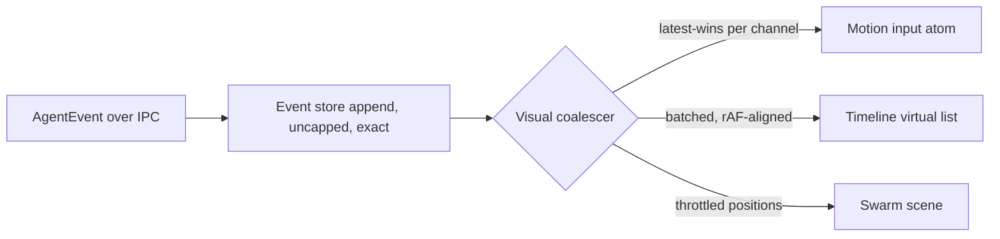

# Performance Budgets

This document defines the hard performance budgets for vsclaude and the engineering strategy that keeps them met. The product promise is a cozy, living IDE where Pixie acts out the agent's work in real time without ever making editing feel heavy. That promise is only credible if the motion layer, the swarm canvas, the timeline, and the editor all stay inside strict, measured limits even under a fast `AgentEvent` stream. This spec sets the numbers (cold start, frame rate, idle CPU, memory, bundle size), the techniques that hit them (debouncing, virtualization, memoization, scene optimization, dispose discipline, code splitting), and exactly how to profile and enforce each one. Every budget here is a contract: it has an owner, a target, a measurement method, and a CI gate where one is feasible. Treat a regression past a budget the same way you treat a failing test.

## Table of contents

- [1. Why budgets exist](#1-why-budgets-exist)
- [2. Reference hardware and conditions](#2-reference-hardware-and-conditions)
- [3. The budget table](#3-the-budget-table)
- [4. Cold start budget](#4-cold-start-budget)
- [5. Animation: a real 60fps](#5-animation-a-real-60fps)
- [6. Idle CPU and battery](#6-idle-cpu-and-battery)
- [7. No jank under a fast event stream](#7-no-jank-under-a-fast-event-stream)
- [8. Bundle size and code splitting](#8-bundle-size-and-code-splitting)
- [9. Memory and dispose discipline](#9-memory-and-dispose-discipline)
- [10. The motion layer must stay cheap](#10-the-motion-layer-must-stay-cheap)
- [11. Strategy reference: every technique](#11-strategy-reference-every-technique)
- [12. How to profile each budget](#12-how-to-profile-each-budget)
- [13. CI gates and regression policy](#13-ci-gates-and-regression-policy)
- [14. Invariants and non-goals](#14-invariants-and-non-goals)

## 1. Why budgets exist

vsclaude competes on feel. A trader-grade trading terminal is judged on latency, and a coding IDE that animates is judged on whether the animation ever steals a frame from the cursor. The single most damaging failure mode for this product is "the pretty pixel mascot makes my editor stutter." Every budget below traces back to one rule: the motion system, the swarm, and the timeline are guests in the editor's house and must never degrade the host.

We hold three load-bearing principles:

1. **The editor is the host.** Monaco input latency and scroll smoothness take priority over every animation. When the two compete for a frame, the editor wins by design (see [section 10](#10-the-motion-layer-must-stay-cheap)).
2. **Budgets are measured, not asserted.** A number with no measurement method is a wish. Every row in [section 3](#3-the-budget-table) names how it is measured.
3. **Backpressure beats best effort.** Under a fast stream we drop and coalesce visual work deterministically rather than letting a queue grow without bound. The data layer never drops; the visual layer always may. This mirrors the threading and backpressure design in [Architecture](./ARCHITECTURE.md).

## 2. Reference hardware and conditions

Budgets are stated against a defined baseline so numbers are comparable across machines and across time. "Pass" means pass on the reference machine; nicer hardware gets headroom, not a lower bar.

| Tier | Machine | Role |
| --- | --- | --- |
| Reference (the bar) | 2020 Apple M1, 8 GB RAM, integrated GPU, or a 4-core x86 laptop with integrated graphics | All budgets must pass here |
| Floor (graceful degradation) | 4-core, 8 GB, no discrete GPU, throttled to 4x CPU slowdown | Must remain usable, not necessarily at full motion |
| Headroom | M3 Pro or better, discrete GPU | Used only to confirm we are GPU bound, never to set the bar |

Standard test conditions for every measurement:

- Production build (`vite build`, release Rust core), never the dev server.
- A 2,000-line TypeScript file open in Monaco as the foreground workload.
- A representative session of 5,000 `AgentEvent` items already in the timeline store.
- The swarm view showing 12 active sub-agents.
- Sound off (default), one window, no external display.
- For CPU and battery numbers: laptop unplugged, display at 80 percent.

## 3. The budget table

This is the authoritative list. Each budget has a hard limit (CI fails or release blocks) and a target (where we want to live). The percentile column states which statistic the limit applies to.

| ID | Budget | Target | Hard limit | Stat | Measured by |
| --- | --- | --- | --- | --- | --- |
| P-START-1 | Cold start to interactive shell | 900 ms | 1,500 ms | median of 10 | Tauri start trace + `performance.now()` marks |
| P-START-2 | Time to first Pixie frame | 1,200 ms | 2,000 ms | median of 10 | Rive instance ready mark |
| P-START-3 | Time to first editable keystroke accepted | 1,400 ms | 2,500 ms | median of 10 | Monaco `onDidtype` after focus |
| P-FPS-1 | Steady-state animation frame rate | 60 fps | never below 58 fps for 3 consecutive s | p95 frame time under 16.6 ms | `requestAnimationFrame` delta sampler |
| P-FPS-2 | Long-task count during 10 s of motion | 0 | 2 tasks over 50 ms | count | Long Task API / Performance panel |
| P-JANK-1 | Dropped frames during a 200 events/s burst | 0 | fewer than 3 frames over 16.6 ms per second | p99 | event burst harness |
| P-INPUT-1 | Keystroke to glyph latency in Monaco | under 16 ms | under 33 ms | p95 | input latency probe |
| P-CPU-1 | Idle CPU, Pixie idle/breathing, no events | under 1.5 percent | 3 percent | 60 s mean | OS sampler + Tauri metrics |
| P-CPU-2 | Idle CPU, Pixie sleeping (long idle) | under 0.5 percent | 1 percent | 60 s mean | OS sampler |
| P-MEM-1 | Resident memory after 1 h session | under 600 MB | 900 MB | max | OS RSS + heap snapshot |
| P-MEM-2 | Heap growth over 1 h idle | under 5 MB | 25 MB | slope | repeated heap snapshots |
| P-BUNDLE-1 | Initial JS (gzipped) for first paint route | 350 KB | 500 KB | size | `vite build` + size report |
| P-BUNDLE-2 | Total lazy chunks for editor route (gzip) | 1.2 MB | 1.8 MB | size | bundle analyzer |
| P-BUNDLE-3 | Largest single async chunk (gzip) | 250 KB | 400 KB | size | bundle analyzer |

Ownership: motion budgets (P-FPS, P-JANK, part of P-CPU) belong to the motion team; start and bundle budgets belong to the app shell team; memory is shared. Every PR that touches `packages/motion`, `packages/swarm`, or `apps/desktop` must keep these green.

## 4. Cold start budget

Cold start is the first impression. The numbers in P-START-1 through P-START-3 are split across three phases, each independently traced so a regression points at one owner.

```
T0  process spawn (Tauri/Rust)
 |  Rust core init: keychain handle, config load, IPC ready
T1  WebView created, HTML served from embedded assets
 |  React mount of the shell route ONLY (no editor, no Rive, no swarm)
T2  interactive shell painted  ............................. P-START-1
 |  lazy: Rive runtime + Pixie .riv fetched and instanced
T3  first Pixie frame  .................................... P-START-2
 |  lazy: Monaco worker + editor chunk
T4  editor focusable, first keystroke accepted  .......... P-START-3
```

Rules that keep cold start inside budget:

- The first paint route imports **nothing** heavy. Monaco, Rive, PixiJS, the swarm, GSAP timelines, and Lottie are all dynamic imports triggered after T2. See [section 8](#8-bundle-size-and-code-splitting).
- The Rust core does no blocking network or disk scan on the start path. Filesystem watching, provider discovery, and session restore all run after the shell paints and stream their results in.
- Session restore is incremental. We paint an empty timeline and editor, then hydrate from the persisted store (see [Context and Checkpoints](./CONTEXT_AND_CHECKPOINTS.md)) in chunks behind `requestIdleCallback`.
- We mark each phase with the User Timing API so traces are real, not guessed:

```ts
// apps/desktop/src/perf/marks.ts
export const mark = (name: string) => performance.mark(name);
export const measure = (name: string, from: string, to: string) =>
  performance.measure(name, from, to);

// at shell paint:
mark('shell:interactive');
measure('cold-start', 'app:spawn', 'shell:interactive'); // P-START-1
```

## 5. Animation: a real 60fps

P-FPS-1 demands a genuine 60fps, defined as p95 frame time under 16.6 ms with no run of dropped frames. "Looks smooth" is not a measurement; the frame sampler is.

What we do to earn it:

- **Rive on its own surface.** Pixie renders through the Rive WebGL/Canvas backend, not through React reconciliation. State machine inputs (`state`, `mood`, `intensity`, `targetX`, `targetY`) are set imperatively. React never re-renders to drive a frame of animation.
- **One animation clock.** UI transitions (Motion), timeline choreography (GSAP), and the Rive advance all read from a single `requestAnimationFrame` loop where possible, so we never stack multiple uncoordinated rafs that each force layout.
- **Inputs are pushed, frames are pulled.** The motion mapper converts `AgentEvent` into target input values and writes them to a mutable atom (Jotai). The render loop reads the latest value each frame. A burst of 50 events between two frames collapses into one input write, not 50 (see [Mascot System](./MASCOT_SYSTEM.md)).
- **No layout thrash.** Anything that animates uses `transform` and `opacity` only. We never animate `width`, `height`, `top`, or `left`. The swarm canvas is a single PixiJS or WebGL surface, not N animated DOM nodes.
- **GPU first, DOM fallback.** xterm.js uses its WebGL renderer. The swarm uses PixiJS when the DOM path shows stalls. We measure, then pick; we do not assume.

A minimal frame sampler used in dev and e2e:

```ts
// packages/motion/src/perf/frameSampler.ts
export function sampleFrames(durationMs: number): Promise<number[]> {
  return new Promise((resolve) => {
    const deltas: number[] = [];
    let last = performance.now();
    const end = last + durationMs;
    const tick = (now: number) => {
      deltas.push(now - last);
      last = now;
      if (now < end) requestAnimationFrame(tick);
      else resolve(deltas);
    };
    requestAnimationFrame(tick);
  });
}
// p95 of deltas must be <= 16.6; max run of deltas > 16.6 must be < 2.
```

## 6. Idle CPU and battery

A trading terminal that drains a laptop at idle gets uninstalled. P-CPU-1 and P-CPU-2 keep the app nearly free when nothing is happening.

- **Idle means idle.** When no `AgentEvent` has arrived for a configured window, Pixie transitions `idle` then `sleeping`. The `sleeping` state uses a low frame-rate loop (or a static pose with an occasional blink) and the swarm canvas pauses its ticker entirely.
- **Stop the clock.** When the window is hidden or the app is backgrounded, we pause the raf loop, pause the PixiJS ticker, and stop the Rive advance. Tauri visibility events drive this. There is no reason to paint a window nobody sees.
- **No polling.** The renderer never polls the Rust core. Events are pushed over IPC. Token usage, file watching, and session state all arrive as events, so the idle renderer has nothing to poll.
- **Throttle background tabs of work.** TanStack Query is configured with sane `staleTime` and no aggressive `refetchInterval`; background refetch is off unless a panel is visible.

```ts
// apps/desktop/src/perf/visibility.ts
appWindow.onFocusChanged(({ payload: focused }) => {
  if (focused) motionClock.resume();
  else motionClock.pause(); // raf, pixi ticker, rive advance all halt
});
```

## 7. No jank under a fast event stream

The hardest case: the agent edits ten files, runs a build, spawns six sub-agents, and streams command output, all within a second. P-JANK-1 says the editor stays smooth through it.

The defense is a two-stage pipeline: the **data stage never drops**, the **visual stage always coalesces**.



Concrete rules:

- **Debounce and coalesce by channel.** Motion takes latest-wins: many `file_edit` events in one frame become one `typing` state with a higher `intensity`, not a queue of state changes. Use a trailing debounce of about 80 ms for caption flips and latest-wins for Rive inputs.
- **Batch React updates to the frame.** Timeline and chat appends are buffered and flushed once per animation frame, not once per event. A 200 events/s burst yields about 60 flushes per second at most.
- **Virtualize every long list.** The timeline, chat transcript, and command output use windowed rendering (TanStack Virtual) so list length does not affect render cost. A 50,000-event session renders the same number of DOM nodes as a 50-event one.
- **Cap the visual, not the truth.** The swarm shows at most N nodes on screen with the rest summarized; the event store still holds every event for drill-down (motion rule 2: meaning is always recoverable).

```ts
// packages/motion/src/coalesce.ts
// Buffer events, flush once per frame; motion reads latest, list gets the batch.
let buffer: AgentEvent[] = [];
let scheduled = false;
export function ingest(e: AgentEvent) {
  buffer.push(e);
  if (scheduled) return;
  scheduled = true;
  requestAnimationFrame(() => {
    const batch = buffer;
    buffer = [];
    scheduled = false;
    motionAtom.set(deriveLatestMotion(batch)); // latest-wins
    timelineStore.appendBatch(batch);          // one React update
  });
}
```

## 8. Bundle size and code splitting

P-BUNDLE budgets keep first paint fast and keep heavy subsystems off the start path. The first paint route is a shell: layout, theme, status bar, and a placeholder for Pixie. Everything expensive is an async chunk.

Mandatory split points:

| Chunk | Loaded when | Approx gzip |
| --- | --- | --- |
| Shell (initial) | Always, first paint | within P-BUNDLE-1 |
| Rive runtime + Pixie `.riv` | After shell paint | counts toward P-BUNDLE-2 |
| Monaco editor + workers | On first editor focus | largest, watch P-BUNDLE-3 |
| Swarm (PixiJS scene) | When swarm panel opens | lazy |
| Charts / cost views | When the cost panel opens | lazy |
| Git graph view | When git panel opens | lazy |
| Lottie accents | With the first accent that needs one | tiny |

```ts
// apps/desktop/src/routes/editor.tsx
const Editor = lazy(() => import('@vsclaude/editor'));      // Monaco
const Swarm = lazy(() => import('@vsclaude/swarm'));        // PixiJS
const CostPanel = lazy(() => import('@vsclaude/cost'));     // charts
// Each behind <Suspense> with a skeleton, never an empty screen.
```

Bundle hygiene rules:

- No barrel file re-exports that pull a whole package onto the start path. Import from the deep path.
- Monaco ships only the languages we use; we configure the language workers explicitly rather than bundling the full distribution.
- Tree-shakeable imports only for Motion, GSAP, and date utilities. No `import * as` of large libraries.
- Every new dependency over 30 KB gzipped requires a note in the PR justifying it against P-BUNDLE-2.

## 9. Memory and dispose discipline

P-MEM-1 and P-MEM-2 catch the slow leaks that make a long session degrade. Three subsystems leak if you let them: GPU resources (Pixi/WebGL/Rive), event listeners, and the unbounded event log.

Dispose discipline, enforced by review and by Storybook unmount tests:

- **Every PixiJS object is destroyed.** Textures, geometries, render textures, and containers call `destroy({ children: true, texture: true })` on unmount. The swarm scene owns a teardown that nulls the app.
- **Rive instances are cleaned up.** Each Rive component calls `rive.cleanup()` on unmount; we do not keep dead state machines advancing.
- **Listeners are paired.** Every `addEventListener`, IPC subscription, and `ResizeObserver` has a matching teardown in the same effect's cleanup. No exceptions.
- **The event log is bounded in memory, complete on disk.** The in-memory timeline keeps a rolling window (for example the last N thousand events) for virtualization; the full history persists through the session store so drill-down still works (see [Sessions](./SESSIONS_SPEC.md) and [Architecture](./ARCHITECTURE.md)).

```ts
// packages/swarm/src/scene.ts
export function disposeScene(app: Application) {
  app.ticker.stop();
  app.stage.destroy({ children: true, texture: true });
  app.destroy(true, { children: true, texture: true, baseTexture: true });
}
```

A leak is detected when P-MEM-2's heap slope over an hour of forced idle exceeds 25 MB. The test drives an idle app, snapshots the heap every five minutes, and fails on a positive slope past threshold.

## 10. The motion layer must stay cheap

This is the spec's center of gravity: **the motion layer must never make editing feel heavy.** Concretely:

- **Editor input has absolute priority.** Keystroke-to-glyph latency (P-INPUT-1) is a release blocker independent of how much is animating. If motion work ever competes with Monaco's input handling, motion yields.
- **Motion runs off the React critical path.** Pixie's frames come from Rive's own loop and an imperative atom write, not from component re-renders. Typing in Monaco triggers zero motion-related React renders.
- **Adaptive degradation, never editor degradation.** When the frame sampler reports sustained frame time over budget, we degrade motion in this order, and we never degrade the editor:

```
1. Drop swarm to a lower node count and pause non-visible sub-agents.
2. Reduce Pixie to a lower intensity / lower frame loop.
3. Disable Lottie accents and GSAP flourishes.
4. Fall back from PixiJS swarm to a static summary.
5. (Never) touch Monaco, terminal I/O, or event-store fidelity.
```

- **A "low motion" mode exists and is honored.** Respect `prefers-reduced-motion` and a user setting (see [Settings, Themes, Persistence](./SETTINGS_THEMES_PERSISTENCE.md)). In this mode Pixie uses discrete state changes with minimal in-between animation, and the swarm stops ticking when idle. The captions and drill-down stay fully intact, so meaning is never lost.

## 11. Strategy reference: every technique

A single table mapping each technique to the budget it protects and where it lives.

| Technique | Protects | Where it lives |
| --- | --- | --- |
| Event debouncing / latest-wins coalescing | P-JANK-1, P-FPS-1 | `packages/motion/src/coalesce.ts` |
| rAF-batched React flushes | P-JANK-1, P-INPUT-1 | motion ingest, timeline store |
| List virtualization (TanStack Virtual) | P-JANK-1, P-MEM-1 | timeline, chat, command output |
| Memoization (`React.memo`, `useMemo`, selector equality) | P-FPS-1, P-INPUT-1 | all panels; Zustand/Jotai selectors |
| Imperative Rive inputs (no re-render to animate) | P-FPS-1, P-INPUT-1 | `packages/motion` mascot driver |
| PixiJS single-surface swarm | P-FPS-1, P-CPU-1 | `packages/swarm` |
| Ticker pause on hidden / idle | P-CPU-1, P-CPU-2 | visibility handler, sleeping state |
| Dispose on unmount (Pixi, Rive, listeners) | P-MEM-1, P-MEM-2 | scene teardown, effect cleanups |
| Dynamic import / lazy panels | P-START-1, P-BUNDLE-1 | route-level `lazy()` + `<Suspense>` |
| Bounded in-memory log, full on disk | P-MEM-1 | session store |
| Adaptive motion degradation ladder | P-FPS-1 under load | motion supervisor |
| `transform`/`opacity` only animations | P-FPS-1, P-FPS-2 | design system motion tokens |

Memoization specifics that matter most:

- Use stable selectors with shallow equality on Zustand stores so a timeline append does not re-render the editor or the status bar.
- Keep Jotai motion atoms fine-grained: one atom per Rive input so a `targetX` change does not invalidate consumers of `mood`.
- Memoize list row components by event `id`; rows are pure functions of one immutable `AgentEvent`.

## 12. How to profile each budget

Every budget is reproducible. The table says how; this section gives the procedure.

| Budget | Tool | Procedure |
| --- | --- | --- |
| Cold start (P-START-*) | User Timing marks + Playwright | Launch production build 10 times, read `cold-start`, `pixie:first-frame`, `editor:first-key` measures, take the median |
| Frame rate (P-FPS-1) | Frame sampler + DevTools Performance | Run `sampleFrames(10000)` during a scripted busy session, assert p95 and the no-drop-run rule |
| Long tasks (P-FPS-2) | Long Task API | Record `PerformanceObserver({ entryTypes: ['longtask'] })` over 10 s of motion |
| Input latency (P-INPUT-1) | Event Timing API | Measure `processingEnd - startTime` on `keydown` while the swarm and Pixie run |
| Jank under load (P-JANK-1) | Event burst harness | Replay a recorded 200 events/s trace into `ingest()`, sample frames simultaneously |
| Idle CPU (P-CPU-*) | OS sampler + Tauri metrics | Leave the app idle 60 s in each state, average process CPU |
| Memory (P-MEM-*) | Heap snapshots + OS RSS | One-hour soak, snapshot every 5 min, compute slope and max RSS |
| Bundle (P-BUNDLE-*) | `vite build` + analyzer | Build, read gzip sizes per chunk from the size report |

Profiling notes:

- Always profile the **production build**. The dev server's unminified, unsplit bundle and React dev overhead make every number meaningless.
- Use a recorded `AgentEvent` trace as the load source so runs are deterministic and diffable across commits. The trace lives in the test fixtures next to the harness.
- When investigating a frame drop, capture a Performance panel recording and look for long tasks, forced reflows (purple "Recalculate Style/Layout" under a script), and GPU upload spikes. A reflow during animation almost always means something animated a layout property; fix the property, not the symptom.
- For GPU memory, watch Pixi/Rive texture counts; a steadily rising texture count is a missing dispose.

```ts
// packages/motion/test/perf.harness.ts
import trace from './fixtures/burst-200ps.json';
test('no jank under 200 events/s', async () => {
  const frames = sampleFrames(10_000);
  await replay(trace, ingest);        // pushes events at recorded timestamps
  const deltas = await frames;
  expect(p99(deltas)).toBeLessThan(16.6 + 0.5);
  expect(longestOverRun(deltas, 16.6)).toBeLessThan(3);
});
```

## 13. CI gates and regression policy

Budgets that can be measured in CI are gated in CI. The rest are checked in a scheduled performance run on the reference machine.

| Gate | Where | Blocks merge |
| --- | --- | --- |
| Bundle sizes (P-BUNDLE-*) | PR build, size report diff | Yes, on regression past hard limit |
| Jank harness (P-JANK-1) | Playwright perf job | Yes |
| Memory soak (short, 5 min) (P-MEM-2 proxy) | Nightly | No, opens an issue |
| Frame rate, input latency (P-FPS, P-INPUT) | Nightly on reference hardware | No, opens an issue and pages the owner |
| Cold start (P-START-*) | Nightly | No, opens an issue |

Regression policy:

- A PR that pushes any **hard limit** over the line is blocked. No exceptions for "we will fix it later."
- A PR that pushes a **target** without crossing the hard limit may merge with a tracking issue and an owner.
- Adding a dependency that grows P-BUNDLE-1 requires explicit sign-off in the PR description with the measured delta.
- The size report and the perf harness output are posted as a PR comment so the delta is visible in review, not buried in logs.

## 14. Invariants and non-goals

Invariants (true in every build):

1. The editor's input latency and scroll never degrade for any animation reason.
2. The data layer (event store, drill-down fidelity) never drops an event for performance; only the visual layer coalesces.
3. Every GPU resource and every listener created is disposed on unmount.
4. Heavy subsystems (Monaco, Rive, PixiJS, charts) are never on the first paint path.
5. Captions and one-click drill-down remain available in every motion mode, including low-motion and degraded states (motion rules 2 and 3).

Non-goals:

- We do not chase a higher-than-60 frame rate on high-refresh displays. 60fps is the contract; beyond that is a bonus, never a budget.
- We do not optimize for the headroom tier. The reference machine sets the bar.
- We do not micro-optimize cold start below the target at the cost of code clarity once we are comfortably inside the hard limit.

Related specs: [Architecture](./ARCHITECTURE.md), [Mascot System](./MASCOT_SYSTEM.md), [Swarm Spec](./SWARM_SPEC.md), [Editor Spec](./EDITOR_SPEC.md), [Terminal Spec](./TERMINAL_SPEC.md), [Design System](./DESIGN_SYSTEM.md), [Tech Stack](./TECH_STACK.md), [Settings, Themes, Persistence](./SETTINGS_THEMES_PERSISTENCE.md).
