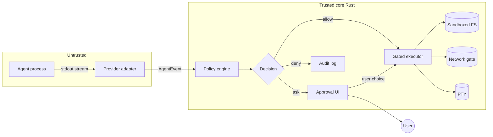

# Permissions and Safety

This spec defines how vsclaude gates what an agent is allowed to do, how it asks the user when an action is risky, and how those decisions persist per project. The core insight: an agent that can run shell commands and edit files is powerful and dangerous in equal measure, so every consequential action passes through a single decision point that maps to a `permission_request` event, surfaces as Pixie's waiting state, and is always recoverable to the exact tool, input, and rationale. Permissions are policy as data, evaluated deterministically, auditable after the fact, and never bypassed by decorative UI.

## Table of contents

- [Goals and non-goals](#goals-and-non-goals)
- [Threat model](#threat-model)
- [The decision pipeline](#the-decision-pipeline)
- [Rule model: allow and deny lists](#rule-model-allow-and-deny-lists)
- [Per-action gating](#per-action-gating)
- [Sandbox model and toggles](#sandbox-model-and-toggles)
- [Sensible defaults](#sensible-defaults)
- [The approval flow UX](#the-approval-flow-ux)
- [Pixie binding: the waiting state](#pixie-binding-the-waiting-state)
- [Persistence per project](#persistence-per-project)
- [Audit log](#audit-log)
- [Provider adapter responsibilities](#provider-adapter-responsibilities)
- [Failure modes and edge cases](#failure-modes-and-edge-cases)
- [Testing strategy](#testing-strategy)

Related: [Architecture](./ARCHITECTURE.md), [Agent Event Schema](./AGENT_EVENT_SCHEMA.md), [Provider Adapters](./PROVIDER_ADAPTERS.md), [Pixie States](./PIXIE_STATES.md).

## Goals and non-goals

**Goals**

- One deterministic decision point that every side-effecting action must pass through.
- Allow lists, deny lists, and per-action prompting expressed as serializable policy.
- Sandbox toggles that constrain filesystem and network reach with safe defaults.
- A truthful approval flow: every prompt drills to the exact tool name, input, diff, command, and the rule that triggered it.
- Per-project persistence in version-control-friendly files, with a clear precedence order.
- A complete audit trail of every decision, granted or denied, automatic or manual.

**Non-goals**

- We do not attempt to make a malicious agent safe. The agent is treated as untrusted; the user is the trust anchor.
- We do not implement OS-level mandatory access control. We use OS sandbox primitives where available and a policy layer everywhere.
- We do not gate read-only, non-sensitive reflection events (`thinking`, `message`, `token_usage`). Those are observational, not actional.

## Threat model

We assume the agent process is **untrusted and possibly adversarial**, whether through prompt injection from fetched web content, a poisoned dependency, a model that hallucinates a destructive command, or an outright malicious provider. The user is the only trusted actor. The Rust core is the enforcement boundary; the agent never touches the filesystem, the network, or a shell except through gated channels the core controls.

| Asset | Threat | Vector | Control |
| --- | --- | --- | --- |
| Source files and uncommitted work | Destruction or corruption | `file_delete`, `file_edit` outside scope, `rm -rf`, `git reset --hard` | Path scoping to project root, deny list for destructive commands, diff preview on edits, write-to-temp-then-confirm |
| Secrets (`.env`, keychains, SSH keys) | Exfiltration | `file_read` of sensitive paths, then `web_fetch` or `command_run` posting the contents | Deny list on sensitive globs, network gating, read-of-secret triggers always-ask |
| Host system outside the project | Lateral damage | Absolute paths, `..` traversal, `cd /`, package managers run globally | Sandbox confines writes to project root and a temp scratch dir; path normalization rejects traversal |
| Network and data exfiltration | Leaking code or secrets to a third party | `web_fetch`, `curl`, `command_run` invoking network tools | Network sandbox modes (off, allowlist, on), `web_fetch` domain allowlist |
| Credentials and API keys held by vsclaude | Theft | Agent reading vsclaude config or process env | Secrets live only in the OS keychain via the Rust core, never injected into the agent env, never written to disk in plaintext |
| The user's attention | Prompt fatigue leading to blind approval | Flooding with low-value prompts | Tight default allow list for safe reads, batched and remembered decisions, clear risk tiers |
| The supply chain | Malicious install scripts | `npm install`, `pip install`, `cargo build` running arbitrary lifecycle scripts | Package-manager commands are an always-ask tier by default, runnable inside the sandbox |

Trust boundary, drawn explicitly:



The agent can **request** anything; only the trusted core can **act**. That asymmetry is the whole game.

## The decision pipeline

Every actionable `AgentEvent` flows through a pure, synchronous evaluation that returns one of three outcomes. Purity matters: the same event plus the same policy always yields the same decision, which makes the system testable and the audit log meaningful.

```ts
// packages/core-policy/src/types.ts
export type Decision = 'allow' | 'deny' | 'ask';

export type RiskTier = 'safe' | 'low' | 'elevated' | 'destructive';

export interface PolicyContext {
  projectRoot: string;       // absolute, normalized
  sandbox: SandboxConfig;
  rules: PolicyRuleSet;
  sessionGrants: SessionGrant[]; // "allow for this session" memory
}

export interface PolicyVerdict {
  decision: Decision;
  tier: RiskTier;
  matchedRule?: PolicyRule;   // the exact rule that fired, for the UI and audit
  reason: string;             // plain-language, shown in the approval card
  normalizedTarget?: string;  // resolved path or parsed command, post-normalization
}

export function evaluate(event: AgentEvent, ctx: PolicyContext): PolicyVerdict;
```

Evaluation order, first match wins, with deny always able to override:

1. **Normalize the target.** Resolve paths against `projectRoot`, reject `..` traversal and symlink escapes, parse commands into argv, lowercase the executable name.
2. **Deny list.** If any deny rule matches, the verdict is `deny` immediately. Deny cannot be overridden by a later allow or a session grant. This is the hard floor.
3. **Session grants.** If the user already chose "allow for this session" for an equivalent action, return `allow`.
4. **Allow list.** If an allow rule matches, return `allow`.
5. **Risk tier default.** Otherwise fall back to the tier's default decision (see [Per-action gating](#per-action-gating)). Most unmatched elevated actions default to `ask`.

```ts
export function evaluate(event: AgentEvent, ctx: PolicyContext): PolicyVerdict {
  const target = normalizeTarget(event, ctx.projectRoot); // throws -> deny on traversal
  const tier = classify(event, target);

  const denied = matchFirst(ctx.rules.deny, event, target);
  if (denied) return verdict('deny', tier, denied, denied.reason ?? 'Matched a deny rule.', target);

  if (hasSessionGrant(ctx.sessionGrants, event, target)) {
    return verdict('allow', tier, undefined, 'Allowed earlier this session.', target);
  }

  const allowed = matchFirst(ctx.rules.allow, event, target);
  if (allowed) return verdict('allow', tier, allowed, allowed.reason ?? 'Matched an allow rule.', target);

  return verdict(defaultForTier(tier), tier, undefined, defaultReason(tier), target);
}
```

If `evaluate` returns `ask`, the core emits a `permission_request` event into the stream, pauses the requesting action, and waits. That event is what wakes Pixie into her waiting state.

## Rule model: allow and deny lists

Rules are declarative and serializable. A rule matches against the event type, an optional tool name, and an optional pattern over the normalized target. Patterns use glob for paths and a small structured matcher for commands so we never rely on fragile substring matching.

```ts
// packages/core-policy/src/rules.ts
export interface PolicyRule {
  id: string;                      // stable, for audit references
  match: {
    events?: AgentEventType[];     // omit = any actionable event
    tool?: string;                 // e.g. "Bash", "Edit", "WebFetch"
    pathGlob?: string;             // e.g. "src/**", "**/.env*"
    command?: CommandMatcher;      // for command_run events
  };
  reason?: string;                 // shown in UI and audit when this rule fires
}

export interface CommandMatcher {
  bin?: string;                    // exact executable, e.g. "rm", "git"
  argsContainAny?: string[];       // e.g. ["-rf", "--force"]
  argsContainAll?: string[];       // e.g. ["reset", "--hard"]
  denyShellExpansion?: boolean;    // if true, reject `$()`, backticks, pipes into sh
}

export interface PolicyRuleSet {
  deny: PolicyRule[];   // evaluated first, wins
  allow: PolicyRule[];  // evaluated after deny and session grants
}
```

Command matching parses the command into `bin` plus `argv` before matching, so `/usr/bin/rm`, `rm`, and `rm  -rf` all resolve to `bin: "rm"`. Shell metacharacters are flagged: a command containing a pipe into `sh`, command substitution, or a chained `&&` that hides a denied binary is treated at the most dangerous tier present in the chain.

Example default deny set (abridged, see [Sensible defaults](#sensible-defaults) for the full list):

```jsonc
{
  "deny": [
    { "id": "deny-rm-rf",     "match": { "tool": "Bash", "command": { "bin": "rm", "argsContainAny": ["-rf", "-r", "-fr"] } }, "reason": "Recursive delete." },
    { "id": "deny-git-hard",  "match": { "tool": "Bash", "command": { "bin": "git", "argsContainAll": ["reset", "--hard"] } }, "reason": "Discards uncommitted work." },
    { "id": "deny-secrets",   "match": { "events": ["file_read", "file_edit", "file_delete"], "pathGlob": "**/{.env,.env.*,*.pem,id_rsa,id_ed25519,*.key}" }, "reason": "Sensitive credential file." },
    { "id": "deny-curl-sh",   "match": { "tool": "Bash", "command": { "denyShellExpansion": true } }, "reason": "Piped or substituted shell." }
  ],
  "allow": [
    { "id": "allow-read-src", "match": { "events": ["file_read"], "pathGlob": "**/*" }, "reason": "Reading project files is safe." },
    { "id": "allow-ls",       "match": { "tool": "Bash", "command": { "bin": "ls" } } }
  ]
}
```

## Per-action gating

Every actionable event type carries a default risk tier. The tier sets the default decision when no allow or deny rule matches. This gives a sane baseline before the user writes a single rule.

| Event type | Default tier | Default decision | Notes |
| --- | --- | --- | --- |
| `file_read` | safe | allow | Unless the path matches the secrets deny glob, which forces deny. |
| `search` | safe | allow | Read-only scan of the workspace. |
| `file_edit` | low | ask (allow if in scope and diff under threshold) | Diff always previewed. In-project, small edits can be allowed by rule. |
| `file_create` | low | ask | Allowed by rule when inside project root. |
| `file_delete` | elevated | ask | Always shows the target. Never silently allowed by tier. |
| `command_run` | elevated | ask | Tier escalates to destructive if the command matches a destructive matcher. |
| `web_fetch` | elevated | ask (allow if domain on allowlist) | Network egress, exfiltration risk. |
| `git_action` | elevated | ask | Read-only git (`status`, `log`, `diff`) can be allow-listed; writes ask. |
| `subagent_spawned` | low | allow | Spawned children inherit the parent's policy context. |
| `permission_request` | n/a | n/a | This is the gating event itself, not a gated action. |

Tier escalation rule: a `command_run` is classified at the **highest** tier among its parsed segments. `npm test && rm -rf dist` is `destructive`, not `elevated`, because of the second segment. We never let a benign prefix launder a dangerous suffix.

```ts
export function classify(event: AgentEvent, target: NormalizedTarget): RiskTier {
  switch (event.type) {
    case 'file_read':
    case 'search':       return target.isSecret ? 'destructive' : 'safe';
    case 'file_edit':
    case 'file_create':  return target.inProjectRoot ? 'low' : 'elevated';
    case 'file_delete':  return 'elevated';
    case 'web_fetch':    return 'elevated';
    case 'git_action':   return isReadOnlyGit(target) ? 'low' : 'elevated';
    case 'command_run':  return maxTier(target.segments.map(tierForCommand));
    default:             return 'low';
  }
}
```

## Sandbox model and toggles

The sandbox constrains what the gated executor can reach, independent of the policy rules. Policy decides "should this run"; the sandbox decides "even if it runs, what can it touch." Defense in depth: both must agree before damage is possible.

```ts
// packages/core-policy/src/sandbox.ts
export interface SandboxConfig {
  filesystem: 'project-only' | 'project-plus-temp' | 'unrestricted';
  network: 'off' | 'allowlist' | 'on';
  networkAllowlist: string[];        // domains, used when network = 'allowlist'
  writeStrategy: 'direct' | 'staged'; // staged writes go to a shadow dir, applied on confirm
  envPassthrough: string[];          // explicit allowlist of env vars exposed to the agent
  maxProcessRuntimeMs: number;       // hard kill for runaway commands
  maxWriteBytes: number;             // per-action cap to catch fork-bomb-style fills
}
```

Enforcement layering, strongest available wins, all in the Rust core:

1. **Path confinement (always on).** Every filesystem operation resolves against `projectRoot` (plus the temp scratch dir when allowed). Resolved paths that escape are rejected before any syscall. Symlinks are resolved and re-checked so a symlink cannot tunnel out.
2. **OS sandbox primitives (best effort, platform dependent).** On macOS we use `sandbox-exec` profiles; on Linux, namespaces and seccomp where the process model allows; on Windows, restricted tokens and job objects. When the OS primitive is unavailable we fall back to the policy layer alone and surface a clear "reduced isolation" badge in the UI so the user is never misled about the protection level.
3. **Network gate.** With `network: 'off'`, the executor runs commands with no network namespace or a blocked egress profile, and `web_fetch` is hard-denied. With `allowlist`, only listed domains resolve. With `on`, network is open but every `web_fetch` and network command still passes policy.
4. **Resource caps.** `maxProcessRuntimeMs` and `maxWriteBytes` are watchdogs against runaway or malicious loops.

The `staged` write strategy is the safest mode for file edits: the agent writes into a shadow copy, vsclaude computes the diff, and the change lands in the real tree only after the user confirms. This makes `file_edit` reversible by construction and is the basis for the diff preview in the approval card.

## Sensible defaults

A fresh project starts in a posture that is safe but not annoying. The defaults assume a developer working in a normal repository who wants reads to be frictionless and anything destructive to stop and ask.

```ts
// packages/core-policy/src/defaults.ts
export const DEFAULT_SANDBOX: SandboxConfig = {
  filesystem: 'project-plus-temp',
  network: 'allowlist',
  networkAllowlist: ['registry.npmjs.org', 'pypi.org', 'crates.io', 'github.com', 'objects.githubusercontent.com'],
  writeStrategy: 'staged',
  envPassthrough: ['PATH', 'HOME', 'LANG', 'TERM'],
  maxProcessRuntimeMs: 5 * 60_000,
  maxWriteBytes: 256 * 1024 * 1024,
};
```

Default decision posture by category:

| Category | Default | Rationale |
| --- | --- | --- |
| Read any non-secret file in project | allow | Reading is how the agent understands the code; gating it would drown the user. |
| Read a secret file (`.env`, keys) | deny | Exfiltration risk outweighs any benefit; user can allow per-file deliberately. |
| Edit or create inside project root | ask, with diff preview | Reversible via staged writes; one click to allow the session for repetitive edits. |
| Delete any file | ask | Deletions are the least reversible filesystem action. |
| Run a read-only command (`ls`, `cat`, `git status`) | allow (via default allow list) | Safe, frequent, low value to prompt on. |
| Run a build, test, or package install | ask | Lifecycle scripts can run arbitrary code; sandbox plus prompt. |
| Run a destructive command (`rm -rf`, `git reset --hard`) | deny | Hard floor; user must edit the deny list to permit. |
| Network fetch to allowlisted domain | allow | Package registries and source hosts are expected traffic. |
| Network fetch elsewhere | ask | Could be exfiltration; show the domain and the reason. |

These defaults ship as a versioned profile (`default@1`). A user can switch to stricter profiles (`paranoid@1` denies all writes and network until allowed) or looser ones (`trusted@1` allows in-project writes without prompting) from a single dropdown, and the choice persists per project.

## The approval flow UX

When the policy engine returns `ask`, the action is suspended and an approval request surfaces. The card is the moment of truth: it must be honest, fast to act on, and never hide what is about to happen. It satisfies the second sacred motion rule directly. Meaning is always recoverable.

Anatomy of the approval card:

```text
┌────────────────────────────────────────────────────────────┐
│  Pixie is waiting for you                          [tier: ⚠] │
│                                                              │
│  The agent wants to RUN A COMMAND                            │
│    $ npm install left-pad                                    │
│                                                              │
│  Why this stopped: package install can run lifecycle         │
│  scripts. Matched no allow rule, tier = elevated.            │
│                                                              │
│  Runs inside: sandbox (project + temp, network allowlist)    │
│                                                              │
│  [ Allow once ]  [ Allow for session ]  [ Add allow rule ]   │
│  [ Deny once  ]  [ Always deny this   ]  [ View raw event ]  │
└────────────────────────────────────────────────────────────┘
```

Required elements on every card:

- **Plain-language headline** so a non-technical person can follow, per the third sacred motion rule.
- **The exact action**: the parsed command, the file path, or a diff for edits. For `file_edit` the card embeds a Monaco diff of the staged change.
- **Why it stopped**: the matched rule id or the tier default, in human words.
- **The sandbox context** the action will run in, so the user knows the blast radius.
- **One-click drill to the raw `AgentEvent`** including `tool.input` and `raw`.

The choice set maps cleanly to policy mutations:

| Button | Effect | Persistence |
| --- | --- | --- |
| Allow once | Run this exact action now. | None. |
| Allow for session | Add a `SessionGrant` for equivalent actions. | In memory, cleared at `session_end`. |
| Add allow rule | Open the rule editor prefilled to match this action. | Written to project policy file. |
| Deny once | Reject this action; agent is told the call was denied. | None. |
| Always deny this | Add a deny rule. | Written to project policy file. |
| View raw event | Drill into the underlying `AgentEvent`. | None. |

Keyboard first: `A` allow once, `S` allow for session, `D` deny once, `Enter` confirms the focused choice, `Esc` denies. The card is fully reachable by keyboard and screen reader, with the tier announced via `aria-live` so non-visual users hear the risk level. Per the accessibility pillar, nothing about the decision is conveyed by color alone; the tier has a label and an icon.

The denied path returns a structured rejection to the agent through the adapter so the model can adapt rather than hang:

```ts
// returned to the provider adapter on deny
export interface PermissionDenied {
  requestId: string;
  decision: 'deny';
  reason: string;        // surfaced back into the agent's context
  ruleId?: string;
}
```

## Pixie binding: the waiting state

A `permission_request` event drives Pixie into `waiting`. This is not decoration; it is the same event the policy engine emitted, so what the user sees is exactly what is happening. Pixie tilts toward the pending action and holds, mood set by tier.

```ts
// packages/motion/src/pixie-bindings.ts
function onPermissionRequest(ev: AgentEvent, rive: RiveInputs) {
  rive.set('state', PixieState.Waiting);
  rive.set('mood', tierToMood(ev.payload?.tier as RiskTier)); // destructive -> 'struggling'
  rive.set('intensity', 0.2);   // calm, attentive, not frantic
  // targetX/targetY nudge Pixie toward the approval card so the gaze connects the prompt to the actor
}
```

| Tier | Pixie mood input | Read |
| --- | --- | --- |
| safe | calm | rarely reached; safe actions auto-allow |
| low | focused | a small, reversible thing wants a nod |
| elevated | focused | a real action paused for review |
| destructive | struggling | Pixie looks worried; the card border is red and labeled |

When the user resolves the prompt, Pixie exits `waiting` and blends back to whatever the next event implies (`running`, `typing`, `idle`). The waiting state never times out on its own; the agent is paused, not abandoned, because silently proceeding would violate the truthful-by-construction pillar.

## Persistence per project

Permissions are project-scoped and stored in version-control-friendly files so a team can review and share their safety posture in code review. The Rust core owns reading and writing these files; the frontend never edits them directly.

```text
<projectRoot>/
  .vsclaude/
    policy.json        # committed: shared team rules (allow, deny, sandbox profile)
    policy.local.json  # gitignored: personal overrides, never shared
```

Precedence, highest authority last so deny can always win:

1. Built-in profile defaults (`default@1`).
2. `policy.json` (team, committed).
3. `policy.local.json` (personal, gitignored).
4. Session grants (memory only, never persisted).

Deny rules from any layer are unioned and always enforced; a lower layer cannot delete a higher layer's deny. Allow rules are likewise unioned, but a deny anywhere beats an allow anywhere. This means a teammate's committed deny on `.env` cannot be silently undone by a personal allow.

```ts
// packages/core-policy/src/load.ts
export function loadProjectPolicy(projectRoot: string): PolicyRuleSet {
  const layers = [
    builtinProfile('default@1'),
    readJsonIfExists(join(projectRoot, '.vsclaude/policy.json')),
    readJsonIfExists(join(projectRoot, '.vsclaude/policy.local.json')),
  ].filter(Boolean);

  return {
    deny:  layers.flatMap((l) => l!.deny),   // union, all enforced
    allow: layers.flatMap((l) => l!.allow),  // union, but any matching deny wins in evaluate()
  };
}
```

The file schema is versioned. A `schemaVersion` field gates migrations, and an unknown future version is treated as read-only with a warning rather than silently downgraded. We never auto-rewrite a file we do not fully understand, since that file is a safety control.

## Audit log

Every verdict is recorded, whether automatic or manual, allow or deny. The log is the answer to "what did the agent actually do, and who let it." It is append-only, written by the Rust core, and never edited by the agent.

```ts
// packages/core-policy/src/audit.ts
export interface AuditEntry {
  ts: number;
  sessionId: string;
  agentId: string;
  eventId: string;          // links to the originating AgentEvent
  type: AgentEventType;
  decision: Decision;
  tier: RiskTier;
  matchedRuleId?: string;
  source: 'rule' | 'tier-default' | 'session-grant' | 'user';
  normalizedTarget?: string;
  userChoice?: 'allow-once' | 'allow-session' | 'deny-once' | 'add-rule';
}
```

Stored at `<projectRoot>/.vsclaude/audit/<sessionId>.jsonl`, one entry per line, gitignored by default. The session timeline view renders these entries inline so a reviewer can replay the safety decisions next to the motion. Because every entry links back to an `eventId`, one click reaches the exact tool input and raw output, closing the recoverability loop.

## Provider adapter responsibilities

Adapters normalize provider-native permission semantics into the shared model so the policy engine stays provider-agnostic. The engine consumes only `AgentEvent`; it never knows which model produced the request.

| Provider | Native mechanism | Adapter mapping |
| --- | --- | --- |
| Claude Code | `stream-json` tool-use blocks, native permission prompts | Each tool-use block becomes the matching actionable event; native prompts are suppressed in favor of vsclaude's engine, or honored when running in passthrough mode |
| Codex | tool calls over its stream | Map tool calls to events by name; commands to `command_run`, edits to `file_edit` |
| Gemini | function-call parts | Same normalization; unknown tools default to `command_run` tier `elevated` |
| Ollama (local) | raw tool plumbing varies by harness | Adapter wraps the local tool loop and emits events before execution |

A critical adapter rule: the adapter must emit the actionable event and **block on the verdict before it lets the agent's tool actually execute**. An adapter that runs the tool and then reports it has defeated the entire system. For SDK-based providers this means intercepting at the tool dispatch boundary; for CLI providers it means running the agent in a mode where vsclaude owns the executor, not the agent.

```ts
// adapter pseudocode, the load-bearing invariant
async function dispatchTool(call: ToolCall): Promise<ToolResult> {
  const event = toAgentEvent(call);          // file_edit, command_run, etc.
  const verdict = await policy.request(event); // emits permission_request, may pause for user
  if (verdict.decision !== 'allow') {
    return deniedResult(verdict);            // tell the agent, do not execute
  }
  return sandbox.execute(call, verdict);     // only now does anything happen
}
```

## Failure modes and edge cases

- **Path traversal and symlink escape.** Normalization resolves symlinks and rejects any resolved path outside the allowed roots. A test fixture plants a symlink to `/etc` and asserts denial.
- **Command chaining laundering.** `safe && destructive` and `safe; destructive` and `safe | destructive` classify at the highest tier in the chain. Substitution (`$(...)`, backticks) triggers the shell-expansion deny rule by default.
- **TOCTOU on staged writes.** The diff shown to the user is computed from the same staged content that gets applied; we apply the exact reviewed bytes, not a re-read, so the file cannot change between preview and apply.
- **Reduced isolation.** When an OS sandbox primitive is unavailable, the UI shows a persistent "reduced isolation" badge and the default profile tightens (network drops to `off`) rather than pretending full protection exists.
- **Agent hangs on deny.** Denials always return a structured `PermissionDenied` to the agent so it can replan; we never leave the agent blocked on a silent rejection.
- **Prompt fatigue.** Session grants and "add allow rule" collapse repetitive prompts. The audit log surfaces if a session is approving a high volume, so the user can spot rubber-stamping.
- **Policy file tampering by the agent.** `.vsclaude/policy.json` is itself covered by the secrets-and-config deny tier for `file_edit`; the agent cannot edit its own permissions without an explicit user grant.

## Testing strategy

| Layer | Tool | What it covers |
| --- | --- | --- |
| Policy evaluation | Vitest | `evaluate` truth table: deny over allow, tier defaults, session grants, escalation in command chains |
| Path normalization | cargo test | Traversal, symlink escape, Windows path quirks, case sensitivity |
| Sandbox enforcement | cargo test | Writes confined to roots, network gate honored, resource caps trip |
| Adapter blocking | Vitest | Tool never executes before an allow verdict, denial returns structured result |
| Approval UX | Playwright | Keyboard flow, diff preview renders, drill-to-raw works, screen-reader labels present |
| Pixie binding | Storybook | `waiting` state for each tier, mood and intensity match the tier table |

The evaluation engine is pure, so its tests are exhaustive truth tables rather than scenario sampling. A single golden-file test pins the `default@1` profile so any change to the shipped safe defaults is a visible, reviewed diff. Safety regressions must be loud.
