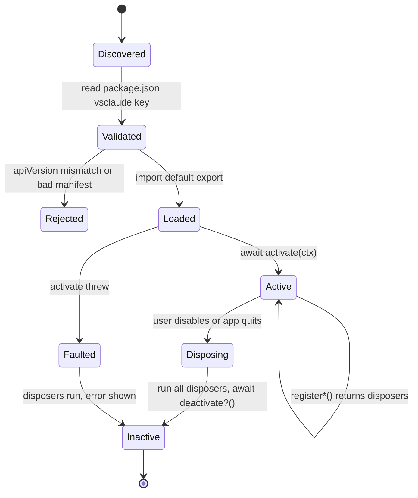
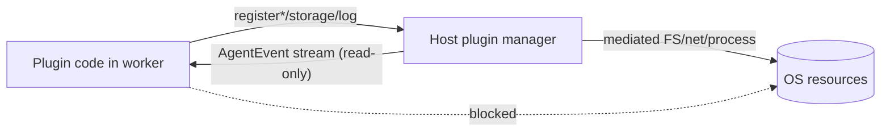

# Plugin SDK

This document specifies the public extensibility API for vsclaude: how a third-party plugin registers new Pixie states or whole companions, ships a theme, adds a custom panel or visualization, or contributes a new model provider. The design goal is a small, honest surface. A plugin depends on exactly one package, [`@vsclaude/contracts`](../packages/contracts/src/index.ts), implements a single default-exported object, and receives a host-provided [`PluginContext`](../packages/contracts/src/plugin-api.ts) whose register calls each return a disposer. Everything visual still consumes only the frozen [AgentEvent](../packages/contracts/src/agent-event.ts) stream, so a plugin can never bypass the three sacred motion rules: every animation stays bound to a real event, the underlying detail stays recoverable, and every caption stays plain-language. See [Architecture](./ARCHITECTURE.md), [Providers](./PROVIDERS_SPEC.md), the [Mascot System](./MASCOT_SYSTEM.md), and the [Design System](./DESIGN_SYSTEM.md) for the subsystems a plugin hooks into.

## Table of contents

- [Design principles](#design-principles)
- [The public surface](#the-public-surface)
- [Plugin shape and manifest](#plugin-shape-and-manifest)
- [Lifecycle](#lifecycle)
- [The PluginContext](#the-plugincontext)
- [Contribution points](#contribution-points)
  - [Themes](#themes)
  - [Pixie states and companions](#pixie-states-and-companions)
  - [Panels](#panels)
  - [Visualizations](#visualizations)
  - [Providers](#providers)
- [Sandboxing and trust](#sandboxing-and-trust)
- [Discovery, install, and load order](#discovery-install-and-load-order)
- [Example plugin: a theme](#example-plugin-a-theme)
- [Example plugin: a companion skin](#example-plugin-a-companion-skin)
- [Versioning and compatibility](#versioning-and-compatibility)
- [Testing requirements](#testing-requirements)

## Design principles

1. **One dependency.** A plugin imports types and helpers only from `@vsclaude/contracts`. It never reaches into `apps/desktop`, `packages/motion`, or any internal package. If a symbol is not re-exported from the contracts barrel, it is not part of the plugin API, full stop.
2. **Declare, then register.** A plugin states what it contributes in its manifest (`contributes`) so the host can show trust prompts, build a registry, and lazy-load assets before any code runs. At activation it makes the matching register calls. The declared set and the registered set must agree; the host warns on drift.
3. **Disposers, not teardown guesswork.** Every `register*` call returns a `() => void` disposer. The host tracks them per plugin and calls all of them on deactivate. A plugin that needs custom cleanup also exports `deactivate`.
4. **Truthful by construction.** A plugin cannot inject fake events. It can add states, themes, panels, visualizations, and providers, but a provider still emits only `AgentEvent`, and a Pixie state still resolves from a real event. The contract makes theater structurally impossible.
5. **Fail soft, never crash the host.** A throwing `activate`, a missing asset, or an incompatible `apiVersion` disables the one plugin and surfaces a clear error in the plugin console. It never takes down the IDE.

## The public surface

The entire plugin API is the set of symbols re-exported from `@vsclaude/contracts`. The relevant module is [`plugin-api.ts`](../packages/contracts/src/plugin-api.ts), which itself re-exports `PLUGIN_API_VERSION` and pulls types from sibling contract modules. The stable, importable surface is:

| Symbol | Kind | Module | Purpose |
| --- | --- | --- | --- |
| `VsclaudePlugin` | interface | plugin-api | The shape every plugin default-exports |
| `PluginManifest` | interface | plugin-api | Manifest under the `vsclaude` key in package.json |
| `PluginContributions` | interface | plugin-api | Declared contribution ids, for discovery and trust |
| `PluginContext` | interface | plugin-api | Host handle passed to `activate` |
| `PixieStateDefinition` | interface | plugin-api | A custom Pixie state |
| `PanelDefinition` | interface | plugin-api | A docked panel |
| `VisualizationDefinition` | interface | plugin-api | An alternate swarm or activity view |
| `isPluginCompatible` | function | plugin-api | Major-version compatibility check |
| `PLUGIN_API_VERSION` | const | version | The API major this host implements |
| `Theme`, `ColorTokens`, `DesignTokens` | interface | design-tokens | Theme shapes a plugin fills in |
| `PixieState`, `PixieMood`, `MotionDirective` | type | motion | The Pixie vocabulary a state blends from |
| `ProviderAdapter`, `ProviderSessionHandle` | interface | provider | The provider contract |
| `AgentEvent`, `AgentEventType` | interface/type | agent-event | The only stream anything visual consumes |

A plugin's `package.json` and tsconfig should pin the contracts version (see [Versioning](#versioning-and-compatibility)). Importing from anywhere else is an ESLint error enforced by the SDK lint preset.

```ts
// Everything a plugin needs, from one package.
import type {
  VsclaudePlugin,
  PluginContext,
  PixieStateDefinition,
  Theme,
  ColorTokens,
} from '@vsclaude/contracts';
import { isPluginCompatible, PLUGIN_API_VERSION } from '@vsclaude/contracts';
```

## Plugin shape and manifest

A plugin is an ES module whose default export satisfies `VsclaudePlugin`:

```ts
export interface VsclaudePlugin {
  manifest: PluginManifest;
  activate(ctx: PluginContext): void | Promise<void>;
  deactivate?(): void | Promise<void>;
}
```

The manifest is duplicated in two places that must stay in sync: it is the default export's `manifest` field at runtime, and it is also declared statically under the `vsclaude` key of the plugin's `package.json` so the host can read it without executing any code.

```jsonc
// package.json of a plugin
{
  "name": "@acme/vsclaude-midnight",
  "version": "1.2.0",
  "type": "module",
  "main": "dist/index.js",
  "peerDependencies": { "@vsclaude/contracts": "^1.0.0" },
  "vsclaude": {
    "id": "acme.midnight",
    "name": "Midnight Bazaar",
    "version": "1.2.0",
    "apiVersion": 1,
    "author": "Acme Co",
    "description": "A deep indigo cozy theme with a moth companion.",
    "icon": "assets/icon.png",
    "contributes": {
      "themes": ["acme.midnight-dark"],
      "pixieStates": ["acme.moth.fluttering"]
    }
  }
}
```

Field rules:

| Field | Required | Constraint |
| --- | --- | --- |
| `id` | yes | Globally unique, reverse-DNS style (`vendor.name`). Namespaces every contribution. |
| `name` | yes | Human-facing, shown in the plugin manager. |
| `version` | yes | Semver of the plugin itself. |
| `apiVersion` | yes | Plugin API major it targets. Must equal the host `PLUGIN_API_VERSION` (see compatibility). |
| `icon` | no | Pixel-art icon, path relative to plugin root, 64x64 recommended. |
| `contributes` | no | The ids this plugin will register. Used for trust prompts and lazy loading. |

Every contributed id (theme id, Pixie state id, panel id) must begin with the plugin's `id` plus a dot, for example `acme.midnight-dark`. The host rejects unnamespaced ids to prevent collisions with built-ins and with other plugins.

## Lifecycle



- **Discovered.** The host scans the plugins directory and the workspace `.vsclaude/plugins` and reads each `package.json` `vsclaude` key. No plugin code runs yet.
- **Validated.** `isPluginCompatible(manifest)` and shape checks run. A mismatch parks the plugin as Rejected with a reason, and it never loads.
- **Loaded.** The module is dynamically imported. The default export is shape-checked against `VsclaudePlugin`.
- **Active.** The host calls `activate(ctx)`. The plugin makes its register calls. The host stores every returned disposer keyed by plugin id. `activate` may be async; the host awaits it with a timeout (default 5000 ms) and faults the plugin if it hangs.
- **Disposing.** On disable or quit, the host runs every tracked disposer in reverse registration order, then awaits the optional `deactivate`. A disposer that throws is logged and skipped so one failure cannot block the rest.

Idempotency rule: `activate` must be safe to call once per load. It must not assume global singletons or leak timers; anything it starts should be cleaned up by a disposer or by `deactivate`.

## The PluginContext

```ts
export interface PluginContext {
  readonly apiVersion: number;
  registerTheme(theme: Theme): () => void;
  registerPixieState(def: PixieStateDefinition): () => void;
  registerPanel(def: PanelDefinition): () => void;
  registerProvider(adapter: ProviderAdapter): () => void;
  registerVisualization(def: VisualizationDefinition): () => void;
  storage: {
    get<T>(key: string): Promise<T | null>;
    set<T>(key: string, value: T): Promise<void>;
  };
  log(level: 'info' | 'warn' | 'error', message: string): void;
}
```

- **`apiVersion`** echoes the host major so a plugin can branch defensively without importing the constant.
- **`register*`** calls validate their argument synchronously and return a disposer. Registering an id that is already taken throws; the plugin should namespace correctly. The disposer is the only supported way to remove a contribution.
- **`storage`** is plugin-scoped, namespaced by plugin id, and persisted by the host (see [Settings, Themes, Persistence](./SETTINGS_THEMES_PERSISTENCE.md)). It is for small JSON-serializable preferences, not bulk data. A plugin never touches the user's filesystem directly.
- **`log`** routes to the in-app plugin console with the plugin id attached. Plugins must use this rather than `console.log`, which is stripped in production builds.

## Contribution points

### Themes

A theme fills the [`Theme`](../packages/contracts/src/design-tokens.ts) shape: an id, a name, an appearance, optional accessibility flags, and a full `ColorTokens` object. Spacing, radius, fonts, motion, and z-index tokens are shared across all themes and are not overridable by a plugin; this keeps layout and motion consistent so a theme can never break the cozy rhythm. The host merges the colors with the shared tokens via `tokensForTheme` and emits CSS variables (`--color-accent`, and so on) through `colorVar`.

```ts
ctx.registerTheme({
  id: 'acme.midnight-dark',
  name: 'Midnight',
  appearance: 'dark',
  color: { /* every ColorTokens slot, see example below */ } as ColorTokens,
});
```

Accessibility: if a theme sets `highContrast` or `colorBlindSafe`, the host lists it under the accessibility group and runs an automated contrast check against the text and accent slots. A theme that fails minimum contrast loads with a warning badge.

### Pixie states and companions

A Pixie state definition adds a new behavior to the mascot without changing the event pipeline. It declares the built-in [`PixieState`](../packages/contracts/src/motion.ts) it blends from while assets load, plus the Rive artboard or sprite-sheet asset to play.

```ts
export interface PixieStateDefinition {
  id: string;            // namespaced, for example 'acme.moth.fluttering'
  basedOn: PixieState;   // a real built-in state to fall back to
  asset: string;         // Rive .riv or sprite-sheet path, relative to plugin root
  caption?: string;      // default plain-language caption template
}
```

The `basedOn` field is load-bearing for sacred rule 1: a custom state must map onto an existing built-in so the event-to-motion mapper always has a real `AgentEventType` to anchor it (see [`EVENT_TO_STATE`](../packages/contracts/src/motion.ts)). A plugin does not get to invent event types; it gets to re-skin or extend the visual response to events that already exist. A full companion (a different character, not just one state) is simply a set of `PixieStateDefinition`s, ideally one per built-in `PixieState`, sharing an asset bundle. See the [companion example](#example-plugin-a-companion-skin) and the [Mascot System](./MASCOT_SYSTEM.md) for the Rive state-machine inputs (`state`, `mood`, `intensity`, `targetX`, `targetY`).

| Built-in state | Triggering event | Mood layer applies |
| --- | --- | --- |
| `thinking` | `thinking` | calm, focused |
| `typing` | `file_edit` / `file_create` | focused, excited |
| `running` | `command_run` | focused |
| `debugging` | `error` during a run | struggling |
| `success` | `complete` | excited |
| `confused` | unresolved `error` | struggling |

A companion that wants to cover every behavior should provide a `basedOn` for each entry in `PIXIE_STATES`. Any state it omits falls back to the built-in Pixie asset, so partial companions degrade gracefully.

### Panels

A panel contributes a docked React surface. The host resolves the component by entry id, so a plugin exposes named entries rather than passing component instances across the boundary.

```ts
export interface PanelDefinition {
  id: string;
  title: string;
  location: 'left' | 'right' | 'bottom' | 'center';
  component: string;     // entry id the host resolves to a lazy React component
}
```

Panels mount inside an error boundary and a Suspense boundary. A panel that throws is replaced by a fallback that offers a reload, and the rest of the IDE keeps running. Panels consume data through host-provided hooks (events, sessions, theme) exposed on the runtime; they do not open their own sockets or spawn processes.

### Visualizations

A visualization is an alternate way to render agent activity, for example a different [swarm](./SWARM_SPEC.md) layout for sub-agents. It has the same resolve-by-id pattern as a panel and reads the same `AgentEvent` stream. This is the seam for community-built activity views without touching the core.

```ts
ctx.registerVisualization({
  id: 'acme.orbit-swarm',
  title: 'Orbit Swarm',
  component: 'OrbitSwarm',
});
```

### Providers

A provider plugin contributes a [`ProviderAdapter`](../packages/contracts/src/provider.ts): a factory for sessions plus static capabilities. This is how a community model backend joins the unified experience. The adapter still emits only `AgentEvent`, so Pixie, the timeline, and the inspector treat it identically to the built-in providers.

```ts
const adapter: ProviderAdapter = {
  id: 'acme.localllm',
  displayName: 'Acme Local LLM',
  capabilities: () => ({
    streaming: true,
    toolCalls: false,
    subagents: false,
    permissions: false,
    vision: false,
    models: ['acme-7b', 'acme-13b'],
  }),
  isAvailable: async () => true,
  start: async (options) => openSession(options),
};
ctx.registerProvider(adapter);
```

Important boundary note: built-in adapters run in the Rust core for crash isolation and process lifecycle (see [Providers](./PROVIDERS_SPEC.md)). A plugin-contributed adapter runs in the sandboxed renderer worker and therefore cannot spawn OS processes directly. It reaches process and PTY operations through host-mediated APIs, which keeps a misbehaving provider plugin from touching the machine outside its grant. A provider that genuinely needs to spawn a CLI ships as a first-party Rust adapter, not a plugin.

## Sandboxing and trust

Plugins are untrusted by default. The host enforces several layers:

- **No host imports.** The SDK lint preset and the bundler externalize only `@vsclaude/contracts`. Any attempt to import an internal package fails at build time, and the loader refuses a bundle that references unknown internal module ids.
- **Worker isolation.** Plugin runtime code (panels, visualizations, provider adapters) executes in a dedicated renderer worker, not on the main UI thread. A plugin cannot block paint or read the main window's globals.
- **Capability-scoped IO.** A plugin has no direct filesystem, network, or process access. It gets `storage` (namespaced, size-capped) and host-mediated hooks. Network egress for a provider plugin is allowed only to endpoints the user approves in the trust prompt.
- **Declared contributions gate the trust prompt.** Before first activation, the host shows the user exactly what the plugin's `contributes` block claims (themes, states, panels, providers). A provider contribution raises a stronger prompt because it implies network and model access.
- **Resource budgets.** `activate` has a time budget; storage has a byte budget; a panel that throws repeatedly is quarantined. Crossing a budget disables the plugin with a clear reason rather than degrading the whole app.



## Discovery, install, and load order

- **Locations.** User plugins live in the app data plugins directory; workspace plugins live in `.vsclaude/plugins` so a repo can ship its own theme or companion. Workspace plugins prompt for trust per workspace.
- **Format.** A plugin is an npm package (a directory or a tarball) with the `vsclaude` manifest key and a `main` ES module. Install is a copy plus a manifest read; the host never runs install scripts.
- **Order.** Plugins activate after the host registers built-ins, in dependency-free, deterministic id order. A later registration of the same id is rejected, so built-ins always win an id clash and the namespacing rule keeps clashes rare.
- **Hot reload (dev).** In development the host watches a linked plugin directory and re-runs the dispose-then-activate cycle on change, so authors iterate without restarting the IDE.

## Example plugin: a theme

A minimal but complete theme plugin. It fills every `ColorTokens` slot, namespaces its id, and registers on activation. The disposer returned by `registerTheme` is captured so `deactivate` is trivial.

```ts
// packages or external: @acme/vsclaude-midnight/src/index.ts
import type { VsclaudePlugin, PluginContext, ColorTokens, Theme } from '@vsclaude/contracts';

const midnightColors: ColorTokens = {
  bg: '#0e1020',
  surface: '#161a2e',
  surfaceElevated: '#1f2440',
  border: '#2c3358',
  text: '#e8eaf6',
  textMuted: '#9aa0c4',
  accent: '#8a7cff',
  accentMuted: '#241f44',
  accentContrast: '#0e1020',
  success: '#74d99f',
  warning: '#e6b34d',
  danger: '#e0697f',
  info: '#6fb3ff',
  glow: 'rgba(138, 124, 255, 0.45)',
};

const midnight: Theme = {
  id: 'acme.midnight-dark',
  name: 'Midnight',
  appearance: 'dark',
  color: midnightColors,
};

let disposeTheme: (() => void) | undefined;

const plugin: VsclaudePlugin = {
  manifest: {
    id: 'acme.midnight',
    name: 'Midnight Bazaar',
    version: '1.2.0',
    apiVersion: 1,
    contributes: { themes: ['acme.midnight-dark'] },
  },
  activate(ctx: PluginContext) {
    disposeTheme = ctx.registerTheme(midnight);
    ctx.log('info', 'Midnight theme registered');
  },
  deactivate() {
    disposeTheme?.();
  },
};

export default plugin;
```

What the host does with it: validates `apiVersion === 1`, imports the module, calls `activate`, stores `disposeTheme`, merges `midnightColors` with the shared spacing, radius, font, motion, and z-index tokens, and emits CSS variables. The theme appears in the picker immediately. Disabling the plugin runs `disposeTheme` and the theme disappears with no restart.

## Example plugin: a companion skin

A companion replaces Pixie's look across behaviors by registering one `PixieStateDefinition` per built-in state it wants to cover. Each definition declares the built-in `basedOn` so the event-to-motion mapper still anchors every animation to a real event. Here a "Moth" companion covers the most common states and lets the rest fall back to default Pixie.

```ts
// @acme/vsclaude-moth/src/index.ts
import type { VsclaudePlugin, PluginContext, PixieStateDefinition, PixieState } from '@vsclaude/contracts';

// One asset bundle, many states. basedOn keeps each bound to a real event.
const mothStates: PixieStateDefinition[] = [
  { id: 'acme.moth.idle',     basedOn: 'idle',     asset: 'assets/moth.riv', caption: 'Resting on a leaf.' },
  { id: 'acme.moth.thinking', basedOn: 'thinking', asset: 'assets/moth.riv', caption: 'Circling an idea.' },
  { id: 'acme.moth.typing',   basedOn: 'typing',   asset: 'assets/moth.riv', caption: 'Editing {file}.' },
  { id: 'acme.moth.running',  basedOn: 'running',  asset: 'assets/moth.riv', caption: 'Running {command}.' },
  { id: 'acme.moth.success',  basedOn: 'success',  asset: 'assets/moth.riv', caption: 'Done. Fluttering happily.' },
  { id: 'acme.moth.confused', basedOn: 'confused', asset: 'assets/moth.riv', caption: 'Bumping into the lamp.' },
];

const disposers: Array<() => void> = [];

const plugin: VsclaudePlugin = {
  manifest: {
    id: 'acme.moth',
    name: 'Moth Companion',
    version: '0.3.0',
    apiVersion: 1,
    icon: 'assets/icon.png',
    contributes: { pixieStates: mothStates.map((s) => s.id) },
  },
  activate(ctx: PluginContext) {
    for (const def of mothStates) {
      disposers.push(ctx.registerPixieState(def));
    }
    ctx.log('info', `Moth companion registered ${mothStates.length} states`);
  },
  deactivate() {
    while (disposers.length) disposers.pop()?.();
  },
};

export default plugin;
```

Notes for implementers:

- The caption templates use `{file}` and `{command}` placeholders that the host fills from the source `AgentEvent.payload`. This preserves sacred rule 3: a non-technical viewer reads "Editing config.ts", not a tool blob.
- Because each definition sets `basedOn`, the Rive runtime can blend to the built-in state instantly while `moth.riv` streams in, so there is never an empty frame.
- States the Moth does not cover (for example `git`, `spawning`) fall back to default Pixie automatically. Partial companions are valid and encouraged for a first release.
- A user picks the active companion in settings; only one companion is active at a time, and the host resolves the namespaced state ids back to its directives.

## Versioning and compatibility

The host exposes a single integer, `PLUGIN_API_VERSION`, currently `1`. A plugin declares the major it targets as `manifest.apiVersion`. The frozen helper is exact:

```ts
export function isPluginCompatible(manifest: PluginManifest): boolean {
  return manifest.apiVersion === PLUGIN_API_VERSION;
}
```

| Change to the API | Version action | Effect on existing plugins |
| --- | --- | --- |
| Add an optional field to a definition interface | No major bump | Compatible, plugins ignore it |
| Add a new `register*` method to `PluginContext` | No major bump | Compatible, older plugins do not call it |
| Add a new built-in `PixieState` | No major bump | Compatible, companions may add a `basedOn` for it |
| Remove or rename a field or method | Major bump of `PLUGIN_API_VERSION` | Old plugins are Rejected at validation |
| Change the meaning of an existing field | Major bump | Old plugins are Rejected at validation |

Rules:

- Compatibility is strict equality on the major, not a range. This is deliberate: a plugin renders Pixie and themes the user sees, so a "probably works" gray zone is unacceptable. A plugin built for major 1 either matches or is parked with a clear message.
- The contracts package is itself semver-versioned (`CONTRACTS_VERSION`), and a plugin pins it as a peer dependency (`"@vsclaude/contracts": "^1.0.0"`). The peer range governs the build; `apiVersion` governs the runtime load. Both must agree.
- When `PLUGIN_API_VERSION` bumps, this spec and the [version module](../packages/contracts/src/version.ts) document the migration, and the plugin manager offers authors a codemod where a mechanical migration is possible.
- New built-in Pixie states are additive within a major, so companions stay forward-compatible: an unhandled state simply falls back to default Pixie rather than breaking.

## Testing requirements

A plugin, and the host's plugin loader, must both be covered:

- **Manifest validation (Vitest).** Reject unnamespaced ids, mismatched `apiVersion`, and a `contributes` block that disagrees with the actual register calls.
- **Lifecycle (Vitest).** `activate` registers, every disposer removes its contribution, `deactivate` runs after disposers, and a throwing `activate` faults only the one plugin.
- **Isolation (Playwright).** A panel that throws shows its fallback and the rest of the IDE stays interactive. A provider plugin cannot reach the filesystem or an unapproved endpoint.
- **Storybook coverage.** A companion plugin renders every state it contributes as a Storybook story, the same bar built-in Pixie states meet, so reviewers can eyeball each `basedOn` blend.
- **Compatibility matrix.** Snapshot `isPluginCompatible` against the current and adjacent majors to catch accidental range loosening.

Author checklist before publishing: namespace every id, fill every `ColorTokens` slot for a theme, set `basedOn` for every contributed Pixie state, capture and return all disposers, route logs through `ctx.log`, and pin `@vsclaude/contracts` to the matching major.
