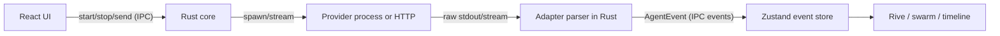

# Providers Spec

This document specifies the provider adapter architecture for vsclaude: the layer that runs an external AI coding agent (Claude Code, Codex, Gemini, or a local Ollama model) and normalizes everything it does into the single frozen [AgentEvent](../packages/contracts/src/agent-event.ts) stream that the rest of the app consumes. The core idea is strict: providers are thin, replaceable, and untrusted translators. They speak a vendor protocol on one side and emit `AgentEvent` on the other. Nothing visual ever sees a provider format. This keeps Pixie, the swarm view, the timeline, and the inspector provider-agnostic, and it makes "add a new model" a small, well-bounded job. See [Architecture](./ARCHITECTURE.md) and [Motion](./MOTION_SPEC.md) for how events become animation.

## Table of contents

- [Design principles](#design-principles)
- [Where adapters run](#where-adapters-run)
- [The ProviderAdapter interface](#the-provideradapter-interface)
- [Capabilities and negotiation](#capabilities-and-negotiation)
- [Lifecycle and the event pipeline](#lifecycle-and-the-event-pipeline)
- [Claude Code adapter](#claude-code-adapter)
- [Codex adapter](#codex-adapter)
- [Gemini adapter](#gemini-adapter)
- [Ollama adapter](#ollama-adapter)
- [Model picker](#model-picker)
- [Auth, rate limits, and offline handling](#auth-rate-limits-and-offline-handling)
- [Per-project provider selection](#per-project-provider-selection)
- [Adding a new provider](#adding-a-new-provider)
- [Testing requirements](#testing-requirements)

## Design principles

1. **One output type.** Every adapter emits only `AgentEvent`. If a provider has a concept that does not map cleanly, the adapter still produces an `AgentEvent` (often `tool_call` or `message`) and stuffs the original block into `raw`. The three sacred motion rules depend on this: every event is bound to a real provider block, the original detail is always recoverable via `raw`, and every event carries a plain-language `caption`.
2. **Adapters are pure translators.** No business logic, no UI, no persistence. An adapter owns one child process or one HTTP stream, parses it, and pushes events. It does not decide what Pixie does. It does not write to disk except through the events it emits.
3. **Crash isolation.** A misbehaving adapter must never take down the app. Adapters run in the Rust core, each tied to a process or stream it can kill. A parse failure becomes an `error` event, not a panic.
4. **Versioned and frozen contract.** Adapters target `schemaVersion`. When the contract bumps, adapters opt in explicitly. The frontend never branches on `provider` for core behavior; it branches on `type` and `capabilities`.
5. **Deterministic IDs.** Every `AgentEvent.id` is stable and unique within a session so the timeline, the inspector, and replay can reference it. Adapters generate IDs; they do not rely on the provider supplying them.

## Where adapters run

Adapters live in the Rust core inside the Tauri shell. The Rust side owns process and PTY lifecycle, so it is the natural home for spawning `claude`, `codex`, or `gemini` CLIs and for holding long-lived HTTP streams to Ollama. The flow:



A thin TypeScript mirror of each adapter's mapping lives under `packages/providers/*` for unit testing the pure parse-and-map functions against recorded fixtures. The authoritative runtime parser is Rust; the TypeScript mirror exists so contributors can iterate on mappings quickly and so Vitest can assert mappings without spawning processes. The two must stay in sync, enforced by shared golden fixtures (see [Testing requirements](#testing-requirements)).

## The ProviderAdapter interface

This is the contract every provider implements. It is intentionally tiny. The Rust trait and the TypeScript interface are mirror images; the TypeScript form is shown here because it is the one most contributors read first.

```ts
// packages/providers/src/adapter.ts
import type { AgentEvent } from '@vsclaude/contracts';

export interface StartOptions {
  sessionId: string;
  agentId: string;
  cwd: string;                 // project root, absolute
  model?: string;             // resolved model id, see ModelPicker
  systemPrompt?: string;
  resumeSessionId?: string;   // provider-native resume token, if supported
  env?: Record<string, string>;
  abortSignal: AbortSignal;
}

export interface SendOptions {
  text: string;               // a user turn appended to the running session
  attachments?: Array<{ path: string; mime: string }>;
}

export type Unsubscribe = () => void;

export interface ProviderAdapter {
  readonly id: string;        // 'claude-code' | 'codex' | 'gemini' | 'ollama' | string
  readonly capabilities: ProviderCapabilities;

  /** Begin a session. Resolves once the process/stream is live and the
   *  first session_start event has been emitted. Rejects on spawn/auth failure. */
  start(opts: StartOptions): Promise<void>;

  /** Append a user turn to a running session. Throws if not started or if
   *  capabilities.streamingInput is false and a turn is already in flight. */
  send(opts: SendOptions): Promise<void>;

  /** Stop the session. Idempotent. Always emits a terminal session_end event.
   *  Must kill the child process / close the stream within stopTimeoutMs. */
  stop(reason?: 'user' | 'error' | 'shutdown'): Promise<void>;

  /** Subscribe to the normalized event stream. Multiple subscribers allowed. */
  onEvent(cb: (e: AgentEvent) => void): Unsubscribe;
}
```

Contract notes that adapters must honor:

| Method | Guarantee |
| --- | --- |
| `start` | Emits exactly one `session_start` before resolving. If spawn fails, rejects and emits no events. |
| `send` | Valid only after `start` resolved and before `stop`. Errors surface as a rejected promise, not a swallowed failure. |
| `stop` | Idempotent. Emits exactly one terminal `session_end` (or `error` then `session_end`). Calling twice is a no-op the second time. |
| `onEvent` | Events arrive in causal order per agent. `ts` is monotonic non-decreasing per `agentId`. |
| all | Never throws synchronously after construction; all failures become rejected promises or `error` events. |

## Capabilities and negotiation

Capabilities let the UI adapt without branching on `provider`. The model picker, the permission prompts, and the swarm view all read capabilities, never the provider id.

```ts
// packages/providers/src/capabilities.ts
export interface ProviderCapabilities {
  models: ModelDescriptor[];        // discovered or static
  streamingInput: boolean;          // can accept a new turn mid-session
  toolUse: boolean;                 // emits tool_call / tool_result
  subagents: boolean;               // can emit subagent_spawned (powers swarm view)
  fileEvents: boolean;              // emits file_read/edit/create/delete distinctly
  commandEvents: boolean;           // emits command_run/command_output
  webFetch: boolean;
  search: boolean;
  permissions: boolean;             // emits permission_request and honors approvals
  tokenUsage: boolean;              // emits token_usage
  resume: boolean;                  // supports resumeSessionId
  vision: boolean;                  // accepts image attachments
  offlineCapable: boolean;          // works with no network (Ollama)
  costPerMTokIn?: number;           // USD per million input tokens, if known
  costPerMTokOut?: number;
}

export interface ModelDescriptor {
  id: string;                       // provider-native model id
  label: string;                    // human label for the picker
  contextWindow?: number;
  default?: boolean;
}
```

Negotiation is a one-time handshake at session start. The Rust core asks the adapter for `capabilities`, merges in dynamically discovered models (for example, `ollama list`), and publishes a resolved `SessionCapabilities` object to the UI. When a capability is missing, the UI degrades gracefully: no subagents means the swarm view collapses to a single Pixie, no `permissions` means the permission gate is hidden, no `fileEvents` means file activity is inferred from `tool_call` payloads and shown with lower fidelity. Degradation is always silent and never a hard error.

## Lifecycle and the event pipeline

Every adapter follows the same shape internally:

```
spawn/connect ──▶ read raw chunks ──▶ frame into blocks ──▶ map block→AgentEvent ──▶ enrich ──▶ emit
                                              │
                                              └─ parse failure ──▶ emit error event (keep stream alive)
```

The enrich step is shared, not per-adapter. After an adapter produces a raw mapping, a common pipeline:

1. Assigns `id` if the adapter did not (`${agentId}:${sequence}`).
2. Sets `schemaVersion` from the contract package.
3. Fills `caption` if the adapter left it blank, using a shared captioner keyed on `type` and `tool.name` so plain-language captions stay consistent across providers.
4. Stamps `ts` with a monotonic clock if the provider timestamp is missing or goes backward.
5. Validates against the `AgentEvent` zod schema in dev builds; an invalid event is downgraded to an `error` event with the offending object in `raw`.

This means adapters can be terse: produce `type`, `tool`, `payload`, and `raw`, and the pipeline handles the rest.

## Claude Code adapter

The Claude Code adapter is the reference implementation and the most capable. It runs the agent in streaming mode and maps each emitted block. Two transports are supported.

### Transport A: CLI stream-json

```bash
claude -p "<prompt>" \
  --output-format stream-json \
  --verbose \
  --model <model-id> \
  --cwd <project-root>
```

`stream-json` emits one JSON object per line (newline-delimited JSON). The adapter frames on newlines, parses each line, and maps by the object's `type`. The shape is a stream of message envelopes; the relevant inner blocks are `text`, `thinking`, `tool_use`, and `tool_result`, plus top-level `system`, `result`, and `error` envelopes.

### Transport B: Agent SDK

When the Claude Agent SDK is available, the adapter prefers it: it yields the same logical blocks as typed objects, avoids line-framing edge cases, and exposes native session resume. The mapping table below is transport-independent; both transports produce the same `AgentEvent` stream.

### Block to AgentEvent mapping

| Claude block | AgentEvent type | Notes |
| --- | --- | --- |
| `system` init envelope | `session_start` | Carries model, cwd, tools list, and resume id into `payload`. |
| `thinking` block | `thinking` | Extended thinking text goes to `payload.text`; never shown raw unless the user drills in. |
| `text` block (assistant) | `message` | `payload.text` is the assistant prose. Drives Pixie out of `thinking`. |
| `tool_use` Read | `file_read` | `payload.path` from `tool.input.file_path`. |
| `tool_use` Edit / MultiEdit | `file_edit` | `payload.path`, `payload.diff` synthesized from old/new strings. |
| `tool_use` Write | `file_create` or `file_edit` | `file_create` if the path did not exist (core checks), else `file_edit`. |
| `tool_use` Bash | `command_run` | `payload.command` from `tool.input.command`. Long builds detected by heuristics, see below. |
| `tool_use` Grep / Glob | `search` | `payload.query`, `payload.kind = 'content' | 'path'`. |
| `tool_use` WebFetch / WebSearch | `web_fetch` / `search` | `payload.url` or `payload.query`. |
| `tool_use` Task | `subagent_spawned` | Creates a child `agentId`; `parentAgentId` set. Powers the swarm view automatically. |
| `tool_use` (other) | `tool_call` | Generic. Full input in `tool.input`, original block in `raw`. |
| `tool_result` (success) | `tool_result` or `command_output` | `command_output` when the matching `tool_use` was Bash. |
| `tool_result` (is_error) | `error` | `payload.message`; if it occurred during a `command_run`, Pixie enters `debugging`. |
| TodoWrite tool_use | `todo_update` | `payload.todos` array drives Pixie `planning`. |
| permission prompt | `permission_request` | Emitted when the CLI requests approval; `stop` of the turn until resolved. |
| `result` envelope | `complete` then `session_end` | `payload.usage` also emitted as a preceding `token_usage` event. |
| usage deltas | `token_usage` | Emitted as they arrive so the cost meter updates live. |
| stderr / spawn error | `error` | Non-fatal stderr is logged; fatal errors precede `session_end`. |

Subagent handling is what makes the swarm come alive. When a `Task` tool spawns a sub-agent, the adapter mints a new `agentId`, emits `subagent_spawned` with `parentAgentId` set, and routes the sub-agent's own blocks (which the CLI nests or tags) under that child id. A matching `subagent_finished` is emitted when the nested result returns. The swarm view subscribes to `subagent_spawned` and needs no provider-specific code.

### Reference mapping snippet

```ts
// packages/providers/src/claude/map.ts (TypeScript mirror)
export function mapClaudeBlock(block: ClaudeStreamBlock, ctx: MapCtx): AgentEvent[] {
  switch (block.type) {
    case 'system':
      return [mk(ctx, 'session_start', {
        payload: { model: block.model, cwd: block.cwd, tools: block.tools },
        caption: `Claude Code started in ${basename(block.cwd)}`,
        raw: block,
      })];
    case 'thinking':
      return [mk(ctx, 'thinking', { payload: { text: block.thinking }, raw: block })];
    case 'content_block' when block.contentType === 'tool_use':
      return [mapToolUse(block, ctx)];
    case 'content_block' when block.contentType === 'text':
      return [mk(ctx, 'message', { payload: { text: block.text }, raw: block })];
    case 'result':
      return [
        mk(ctx, 'token_usage', { payload: { usage: block.usage }, raw: block }),
        mk(ctx, 'complete', { caption: 'Done', raw: block }),
      ];
    default:
      return [mk(ctx, 'tool_call', { raw: block, caption: 'Activity' })];
  }
}
```

Long-build detection: a `command_run` whose command matches a configurable pattern (`build`, `compile`, `cargo build`, `pnpm build`, `tsc`, `webpack`, `vite build`) and whose `command_output` does not arrive within `buildHintMs` (default 4000 ms) sets `payload.longRunning = true`, which moves Pixie into the `building` state instead of generic `running`.

## Codex adapter

Codex (the OpenAI coding agent CLI) streams a comparable block model. The adapter spawns the Codex CLI in its JSON streaming mode and maps its event names onto the same table. Where Codex uses different tool names, the adapter normalizes them.

| Codex concept | AgentEvent | Mapping note |
| --- | --- | --- |
| session/init | `session_start` | Model and workspace from the init payload. |
| reasoning / thinking delta | `thinking` | Accumulated until a non-thinking block flushes it. |
| assistant message | `message` | Prose. |
| `apply_patch` tool | `file_edit` / `file_create` / `file_delete` | Codex patches are unified diffs; the adapter parses the patch header to choose the precise type and to fill `payload.diff`. |
| shell / exec tool | `command_run` + `command_output` | One `command_run` on invocation, one `command_output` on completion. |
| file read tool | `file_read` | |
| function/tool call (other) | `tool_call` | |
| usage chunk | `token_usage` | |
| turn complete | `complete` | |
| stream end | `session_end` | |

Codex capability flags: `toolUse: true`, `commandEvents: true`, `fileEvents: true`, `permissions: true` when running in approval mode, `subagents: false` unless the installed Codex version exposes sub-agent spawning (the adapter sets this from a version probe at start). When `subagents` is false the swarm view shows a single agent, which is correct.

## Gemini adapter

The Gemini adapter targets the Gemini CLI / code assist agent. Gemini streams `candidates` with `parts`; function calls appear as `functionCall` parts and results as `functionResponse` parts.

| Gemini part | AgentEvent | Mapping note |
| --- | --- | --- |
| stream open | `session_start` | |
| `thought` part (when thinking is enabled) | `thinking` | |
| `text` part | `message` | |
| `functionCall` read_file | `file_read` | `payload.path` from args. |
| `functionCall` write_file / edit | `file_create` / `file_edit` | Existence check decides create vs edit. |
| `functionCall` run_shell_command | `command_run` | |
| `functionResponse` for shell | `command_output` | Matched by call id. |
| `functionCall` web_fetch / google_search | `web_fetch` / `search` | |
| `functionCall` (other) | `tool_call` | |
| `usageMetadata` | `token_usage` | `promptTokenCount` and `candidatesTokenCount`. |
| finishReason present | `complete` then `session_end` | A `finishReason` of `SAFETY` or `RECITATION` is mapped to an `error` event first with a clear caption. |

Gemini does not always interleave thinking with text; the adapter buffers `thought` parts and flushes them as a single `thinking` event when the first `text` or `functionCall` part arrives, so Pixie's `thinking` state has a clean entry and exit.

## Ollama adapter

Ollama runs local models over HTTP, fully offline. It is the simplest adapter and the proof that the contract scales down. It connects to the local Ollama server (`http://localhost:11434` by default, configurable) and streams chat completions.

Key differences from cloud agents:

- **No native agent loop.** Base Ollama models do not orchestrate tools by themselves. The adapter therefore runs a lightweight tool loop: it injects a tool schema into the system prompt, parses tool-call JSON the model emits, executes the tool via the Rust core (file read/edit, shell, search), feeds the result back, and loops until the model stops. This loop is the adapter's responsibility, not the UI's.
- **Capabilities depend on the model.** `toolUse`, `subagents`, and `vision` vary per model. The adapter probes `ollama show <model>` and sets flags accordingly. Models without reliable tool support get `toolUse: false`, and the agent runs as a plain chat that still emits `thinking` and `message` events, so Pixie still animates.
- **Offline by construction.** `offlineCapable: true`. No auth, no rate limits, no cost meter (cost fields omitted). Network errors here mean the local server is down, handled as a distinct `error` with a "start Ollama" hint.

| Ollama signal | AgentEvent | Mapping note |
| --- | --- | --- |
| stream start | `session_start` | Model from request. |
| `message.content` delta with no tool intent | `message` | Streamed token deltas coalesced. |
| detected `<thinking>` or model thinking field | `thinking` | For models that expose a thinking channel. |
| parsed tool-call JSON | `tool_call` then a specific type | The adapter re-emits as `file_read`, `command_run`, etc. based on the called tool. |
| adapter-executed tool result | `tool_result` / `command_output` / `file_edit` | Produced by the Rust core, not the model. |
| Ollama `eval_count` / `prompt_eval_count` | `token_usage` | Local token counts; no cost. |
| `done: true` | `complete` then `session_end` | |

```ts
// packages/providers/src/ollama/loop.ts (sketch)
async function runOllamaTurn(ctx: MapCtx, msgs: ChatMsg[], emit: Emit) {
  for (;;) {
    const stream = await ollamaChat({ model: ctx.model, messages: msgs, stream: true });
    const turn = await drain(stream, emit); // emits thinking/message deltas
    const call = parseToolCall(turn.content);
    if (!call) { emit(mk(ctx, 'complete', {})); return; }
    emit(mapToolCallToEvent(call, ctx));        // file_read, command_run, ...
    const result = await ctx.core.executeTool(call); // Rust side runs it safely
    emit(mapToolResult(result, ctx));
    msgs.push(asToolResultMessage(result));     // feed back, loop
  }
}
```

## Model picker

The model picker is a single UI component fed entirely by capabilities, so it works for every provider unchanged.

- On provider selection the core gathers `capabilities.models`. Static lists for cloud providers, dynamic lists for Ollama (`ollama list` parsed at start, refreshed on demand).
- The default model is `ModelDescriptor.default` or the first entry.
- The picker shows `label`, context window, and cost per million tokens when known. Local models show "local, no cost".
- Selecting a model before a session sets `StartOptions.model`. Selecting mid-session restarts the agent turn boundary cleanly for providers without live model swap, or hot-swaps where supported (`capabilities` does not currently expose live swap, so the default is restart-on-next-turn).
- The chosen model is persisted per project (see below).

## Auth, rate limits, and offline handling

All adapters route abnormal conditions into a small set of typed `error` events so the UI can respond consistently. The `payload.kind` discriminates.

| Condition | Detection | `error` payload.kind | UI behavior |
| --- | --- | --- | --- |
| Missing or invalid API key | Spawn/auth failure, 401/403, or CLI "not logged in" | `auth` | Pixie enters `confused`, a non-blocking banner offers "Add key" which opens the keychain-backed settings. Keys are stored via the OS keychain in the Rust core, never in plain files. |
| Rate limited | 429, provider "rate limit" message, or `Retry-After` header | `rate_limit` | The adapter parses `Retry-After` (or backs off exponentially: 1s, 2s, 4s, capped at 60s), emits a `rate_limit` error with `payload.retryAfterMs`, and auto-retries the current turn. Pixie shows `waiting`. After `maxRetries` (default 5) it surfaces a clear failure. |
| Offline / network down | DNS or connect failure, fetch reject | `offline` | For cloud providers, a banner offers to switch to Ollama. For Ollama, the hint is "start the local server". Pixie enters `confused`. The session is not killed; the user can retry. |
| Quota or billing | 402 or provider quota message | `quota` | Banner with provider-specific guidance; no auto-retry. |
| Context overflow | Provider "context length exceeded" | `context_overflow` | The adapter emits a clear caption suggesting a shorter prompt or model with a larger window; no silent truncation. |

Auth secrets never pass through the frontend. The model picker and settings UI ask the Rust core to store a key in the OS keychain; adapters read it from the keychain at `start`. An `AgentEvent` never contains a raw key, and `raw` blocks are scrubbed of obvious secret patterns before they reach the store.

Retry policy is centralized in the shared pipeline so every adapter behaves identically:

```ts
const backoff = { baseMs: 1000, factor: 2, capMs: 60_000, maxRetries: 5 };
// rate_limit and transient 5xx are retried; auth, quota, and context_overflow are not.
```

## Per-project provider selection

Provider and model are project-scoped, persisted, and override a global default.

- Resolution order at session start: explicit `StartOptions` override, then project config, then user global default, then the built-in default (`claude-code`).
- Project config lives in the workspace, readable and diffable:

```jsonc
// <project-root>/.vsclaude/provider.json
{
  "provider": "claude-code",
  "model": "claude-sonnet-4-5",
  "ollamaHost": "http://localhost:11434", // only honored for the ollama provider
  "permissions": "ask"                     // ask | auto-allow-reads | full-auto
}
```

- Switching providers mid-project is allowed between sessions, not within a running session. The UI disables the provider switch while a session is live and re-enables it on `session_end`.
- The global default and stored keys live in the user config directory managed by the Rust core, separate from any project so keys never land in a repo.

## Adding a new provider

Adding a provider is deliberately a small, bounded job. The checklist:

1. **Create the package.** `packages/providers/<name>/` with `index.ts` exporting an object that satisfies `ProviderAdapter`, plus `map.ts` for the pure block-to-event mapping.
2. **Declare capabilities.** Fill `ProviderCapabilities` honestly. Probe at `start` for anything dynamic (installed models, version-gated features). Understating a capability is safe; overstating it breaks the UI.
3. **Implement framing.** Decide the transport (child process stdout, NDJSON, SSE, or HTTP stream) and write the framer that turns bytes into blocks. Reuse `packages/providers/src/framing` (newline, SSE, and length-prefixed framers exist).
4. **Write the mapping.** Map each block to an `AgentEvent` type using the canonical table as your target. Always set `raw`. Leave `caption` blank to use the shared captioner, or set a provider-specific caption when it reads better.
5. **Wire the Rust runner.** Add a variant to the core `AdapterKind` enum and the spawn/connect logic. The Rust adapter and the TypeScript mirror share golden fixtures.
6. **Register.** Add the provider to the registry so the model picker and per-project config can select it.
7. **Add fixtures and tests.** Record at least one real session transcript, store it under `__fixtures__`, and assert the mapping produces the expected `AgentEvent[]`. Add the provider to the Storybook capability matrix.

```ts
// packages/providers/registry.ts
import { claudeCode } from './claude';
import { codex } from './codex';
import { gemini } from './gemini';
import { ollama } from './ollama';

export const PROVIDER_REGISTRY = {
  'claude-code': claudeCode,
  'codex': codex,
  'gemini': gemini,
  'ollama': ollama,
} as const satisfies Record<string, ProviderFactory>;
```

A complete provider is typically one mapping file (about 150 to 250 lines), one capabilities block, one Rust runner variant, and a fixture. If a new provider needs more than that, the extra complexity belongs in the adapter, never in the UI, and never in the `AgentEvent` contract.

## Testing requirements

- **Golden fixtures.** Each provider ships recorded transcripts under `__fixtures__`. A single Vitest suite runs every fixture through the TypeScript mirror and snapshot-asserts the resulting `AgentEvent[]`. The Rust runner replays the same fixtures via `cargo test` and must produce byte-identical normalized events (IDs aside).
- **Schema validation.** Every emitted event in tests is validated against the `AgentEvent` zod schema. A failing validation fails the test, not just dev runtime.
- **Capability matrix in Storybook.** Storybook renders the model picker and permission gate for each provider's capabilities so degradation paths (no subagents, no permissions, no file events) are visible and reviewable.
- **Failure injection.** Each adapter has tests that inject auth failure, a 429 with `Retry-After`, a mid-stream parse error, and an abrupt process exit, asserting the correct typed `error` events and a single terminal `session_end`.
- **Subagent fan-out.** The Claude adapter has a fixture with a `Task` spawn to assert `subagent_spawned` mints a child `agentId` with `parentAgentId` set and that `subagent_finished` closes it, since this directly drives the swarm view.

Adapters are the only place in vsclaude that knows a provider's wire format. Keep them thin, keep them honest about capabilities, and keep every block tied to a real event with a recoverable `raw`. That discipline is what lets Pixie animate any model from one key.
