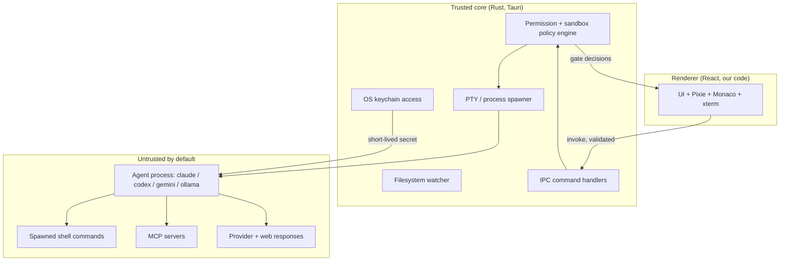

# SECURITY (engineering spec)

> **Status (0.x beta):** this is the design contract the codebase is built toward, not a claim that every control is shipped. Implemented today: OS-keychain secret storage, the strict CSP and Tauri capability posture, and the minimal IPC surface. Still landing: the agent permission engine and decision-resolution order, the per-OS sandbox defaults, signature-verified auto-update, and the automated CI security gates. Sections describing those read as the target design. See the root [SECURITY.md](../SECURITY.md) for the public policy and reporting process.

This document defines the security model for vsclaude. The core posture is simple to state and hard to weaken: provider keys live only in the OS keychain and never touch plaintext disk, the agent runs under explicit user-controlled permissions with conservative sandbox defaults, the desktop shell exposes a minimal and signed IPC surface protected by a strict Content Security Policy and a narrow Tauri capability set, and every command or MCP server the agent reaches for is treated as untrusted code that must pass through a policy gate before it executes. Security here is not a feature bolted on after the demo; it is a property the architecture is built to guarantee by construction, in the same spirit as the platform's "truthful by construction" pillar.

## Table of contents

- [Goals and non-goals](#goals-and-non-goals)
- [Trust boundaries](#trust-boundaries)
- [Secret storage: the OS keychain](#secret-storage-the-os-keychain)
- [Secrets in memory](#secrets-in-memory)
- [Permission model for the agent](#permission-model-for-the-agent)
- [Sandbox defaults](#sandbox-defaults)
- [Tauri capabilities, allowlist, and CSP](#tauri-capabilities-allowlist-and-csp)
- [IPC surface hardening](#ipc-surface-hardening)
- [Threat model: untrusted commands and MCP servers](#threat-model-untrusted-commands-and-mcp-servers)
- [Supply-chain hygiene](#supply-chain-hygiene)
- [Logging, redaction, and telemetry](#logging-redaction-and-telemetry)
- [Auto-update integrity](#auto-update-integrity)
- [Security checklist for reviewers](#security-checklist-for-reviewers)

## Goals and non-goals

| Goal | Description |
| --- | --- |
| Key confidentiality | Provider API keys are readable only by the signed vsclaude binary on the user's machine, via the OS keychain. |
| Least privilege execution | The agent and any tool it invokes run with the narrowest filesystem, network, and process rights that still let the task succeed. |
| Explicit consent | Anything that can mutate the world (write files outside the workspace, run shell, hit the network, spend tokens) is gated by a permission the user can see and revoke. |
| Tamper-evident updates | Updates are signature-verified before install. A compromised update server cannot push code that runs on a user's machine. |
| Recoverable truth | Per [the motion rules](./MOTION.md), every gated action is inspectable: the user can always drill into the exact command, input, or diff before approving. |

Non-goals (documented so reviewers do not assume coverage we do not provide):

- vsclaude does not defend against a fully compromised host OS or a malicious local administrator. If the attacker already owns the machine, the keychain and the process are theirs.
- vsclaude does not sandbox the model provider's servers. We trust the provider endpoint the user configured; we do not trust the content that flows back through it.
- vsclaude is not a substitute for the user reviewing what their agent does. The product makes review fast and legible; it does not make blind approval safe.

## Trust boundaries



The boundary that matters most: the renderer is partly trusted (it is our code, but it loads remote-flavored content like web fetch results and tool output), and everything past the agent process is untrusted. Secrets cross from the keychain into the agent process directly through the Rust core; they never transit the renderer.

## Secret storage: the OS keychain

Keys are stored exclusively in the platform keychain through a single Rust module that wraps the `keyring` crate. There is no plaintext fallback. If the keychain is unavailable, key storage fails loudly rather than degrading to a file.

| Platform | Backend | Notes |
| --- | --- | --- |
| macOS | Keychain Services | Item ACL bound to the signed app's code signature. |
| Windows | Credential Manager (DPAPI-backed) | Per-user credential, encrypted with the user's login secret. |
| Linux | Secret Service (libsecret) via D-Bus | Falls back to a clear error if no Secret Service is running; we do not write a file. |

Storage rules, enforced in code review:

- The service name is constant (`vsclaude`); the account name is `provider:<provider-id>` (for example `provider:claude-code`).
- Keys are written through `set_secret` and read through `get_secret`. No other code path may read a raw key.
- A key is never written to `localStorage`, `sessionStorage`, IndexedDB, a Zustand store, a config file, a log line, or a temp file. This is checked by a CI grep gate (see [Supply-chain hygiene](#supply-chain-hygiene)).
- The renderer never receives a key. It receives only a boolean "configured" flag and a masked hint (last 4 characters) for display.

```rust
// packages/core-secrets/src/lib.rs  (Rust core, the only key gateway)
use keyring::Entry;
use zeroize::Zeroizing;

const SERVICE: &str = "vsclaude";

pub fn set_secret(provider_id: &str, secret: &str) -> Result<(), SecretError> {
    let entry = Entry::new(SERVICE, &account(provider_id))?;
    entry.set_password(secret)?; // OS-encrypted at rest, never our file
    Ok(())
}

/// Returns the secret wrapped so it is zeroized on drop. Callers MUST NOT clone
/// it into a long-lived String. There is intentionally no renderer-facing command
/// that returns this value.
pub fn get_secret(provider_id: &str) -> Result<Zeroizing<String>, SecretError> {
    let entry = Entry::new(SERVICE, &account(provider_id))?;
    Ok(Zeroizing::new(entry.get_password()?))
}

fn account(provider_id: &str) -> String { format!("provider:{provider_id}") }
```

## Secrets in memory

Even in RAM, a key should exist for as short a time as possible and in as few copies as possible.

- **Wrap on read.** `get_secret` returns `Zeroizing<String>`, so the buffer is overwritten when it drops. Do not assign it to a plain `String`.
- **Inject, do not store.** When spawning the agent, the key is passed as an environment variable (for example `ANTHROPIC_API_KEY`) on the child process at spawn time, then the in-process copy is dropped. The Rust core does not keep a cached map of live keys.
- **Prefer env over argv.** Never pass a key as a command-line argument. Argv is visible to other processes via `/proc`, `ps`, and Windows process listings. Environment of a child is far less exposed and we control the child.
- **No renderer exposure.** There is no IPC command that returns a key. The closest the UI gets is `secret_status(provider_id) -> { configured: bool, hint: string }`.
- **Scrub on rotation.** Replacing a key calls `set_secret`, which overwrites the keychain item; the old child process keeps its injected copy only until it exits, and new sessions get the new value.

```rust
// At spawn, inject and immediately let the wrapper drop.
fn spawn_agent(cmd: &mut Command, provider_id: &str, env_var: &str) -> Result<(), SecretError> {
    let secret = get_secret(provider_id)?;          // Zeroizing<String>
    cmd.env(env_var, secret.as_str());              // copied into the child's env block
    Ok(())                                           // `secret` is zeroized here
}
```

The threat we accept: while the agent process runs, its env block holds the key, and a process running as the same user could read it. That is inherent to "bring your own key" and a host-level compromise, which is outside our boundary. We minimize blast radius (one provider key per child, short-lived) but do not pretend to eliminate it.

## Permission model for the agent

Every event in the [AgentEvent](./ARCHITECTURE.md) stream that represents a side effect can be intercepted before it happens. The agent does not get ambient authority; it asks, and the policy engine answers based on rules the user controls.

Permission classes:

| Class | Triggering event types | Default policy |
| --- | --- | --- |
| `fs_read` | `file_read`, `search` | Allow within workspace; ask outside. |
| `fs_write` | `file_edit`, `file_create`, `file_delete` | Ask outside workspace; ask for deletes always (configurable). |
| `command` | `command_run` | Ask, with the exact command shown. Allowlist learnable per session. |
| `network` | `web_fetch`, provider calls | Provider endpoint allowed; arbitrary fetch asks. |
| `git` | `git_action` | Ask for pushes and history rewrites; allow read-only status/diff. |
| `mcp` | `tool_call` to an MCP server | Ask per server on first use; remember the user's choice. |
| `spawn` | `subagent_spawned` | Allowed; inherits the parent's policy and never widens it. |

Decision resolution order, first match wins:

```ts
// packages/contracts/src/permission.ts
export type PermissionDecision = 'allow' | 'deny' | 'ask';

export interface PermissionRequest {
  class: 'fs_read' | 'fs_write' | 'command' | 'network' | 'git' | 'mcp' | 'spawn';
  detail: string;        // exact path, command, URL, or server id (shown verbatim to the user)
  sessionId: string;
  agentId: string;
}

// 1. Explicit session deny  -> deny
// 2. Explicit session allow  -> allow
// 3. Workspace/project policy file (.vsclaude/permissions.json, read-only to the agent) -> its verdict
// 4. User global default for the class -> its verdict
// 5. Otherwise -> ask (renders a `permission_request`, Pixie enters `waiting`)
```

Hard rules:

- A subagent's effective policy is the intersection of its parent's policy and its own. Spawning can only narrow authority, never widen it. This is enforced when the `spawn` request is evaluated.
- "Allow for session" and "allow always" are distinct. Session grants evaporate on session end. Persistent grants are written to the project policy file, which the user owns and the agent cannot edit (it is mounted read-only into the agent's view; writes to it are denied at the `fs_write` gate).
- Approving a `permission_request` requires the detail to be visible. The UI must render `detail` verbatim before the approve button is enabled, satisfying motion rule 2 (always recoverable to the exact underlying action).

## Sandbox defaults

The sandbox constrains the agent process and its children even before the permission engine sees a request. Defaults are conservative and per-OS.

| Constraint | Default | Mechanism |
| --- | --- | --- |
| Working directory | The opened workspace root only | Child `cwd` set; path checks reject `..` escapes. |
| Filesystem write scope | Workspace subtree | Canonicalize then prefix-check; symlink targets are resolved and re-checked. |
| Environment | Curated allowlist (PATH, HOME, the one provider key, locale) | We build the child env explicitly; we do not inherit the full parent env. |
| Network | Provider endpoint plus user allowlist | `network` permission gate; off-allowlist fetch asks. |
| Process tree | Killable as a group | Spawn in a new process group / job object so we can terminate descendants. |

OS-specific hardening applied when available:

- **macOS:** wrap untrusted command execution in a `sandbox-exec` profile that denies writes outside the workspace and denies network unless the `network` class is granted.
- **Linux:** prefer a `bubblewrap` or namespace-based jail with a read-only bind of the system and a read-write bind of the workspace; fall back to path checks if unavailable.
- **Windows:** run the child in a Job Object with `JOB_OBJECT_LIMIT_KILL_ON_JOB_CLOSE`, a restricted token where feasible, and our explicit env block.

Path containment is the load-bearing check and must be implemented carefully:

```rust
fn is_within_workspace(workspace: &Path, target: &Path) -> std::io::Result<bool> {
    // Resolve symlinks and `..` before comparing. A symlink inside the workspace
    // that points outside MUST be treated as outside.
    let ws = std::fs::canonicalize(workspace)?;
    let tgt = std::fs::canonicalize(target)?; // for create, canonicalize the parent dir
    Ok(tgt.starts_with(&ws))
}
```

## Tauri capabilities, allowlist, and CSP

vsclaude uses Tauri 2.x. The renderer gets only the capabilities it provably needs, declared in the capability files; everything else is absent, which means unreachable.

Principles:

- **No `shell:allow-execute` to the renderer.** The renderer cannot spawn processes. All process work goes through our own audited IPC commands that route into the permission engine. This is the single most important allowlist rule.
- **No broad `fs` scope.** The renderer's direct filesystem access (if any) is scoped to specific directories; bulk file work goes through validated IPC commands, not the generic `fs` plugin with a wide scope.
- **No `http` plugin wildcard.** Web fetches the agent performs are gated by the `network` permission class in the core, not handed to the renderer as an open HTTP client.

```jsonc
// apps/desktop/src-tauri/capabilities/main.json (illustrative, narrow on purpose)
{
  "identifier": "main-window",
  "windows": ["main"],
  "permissions": [
    "core:event:default",
    "core:window:allow-set-title",
    { "identifier": "fs:scope", "allow": ["$APPCONFIG/*", "$WORKSPACE/**"] }
    // No shell, no broad fs, no http wildcard. Process + secret work is custom IPC.
  ]
}
```

CSP is strict and self-hosted. No remote script origins, no inline scripts in production.

```text
default-src 'self';
script-src 'self';
style-src 'self' 'unsafe-inline';            /* Tailwind/Monaco runtime styles */
img-src 'self' data: blob:;                  /* sprite sheets, Rive thumbnails */
font-src 'self';
connect-src 'self' ipc: https://asset.localhost; /* IPC bridge + local assets only */
worker-src 'self' blob:;                      /* Monaco + xterm WebGL workers */
frame-src 'none';
object-src 'none';
base-uri 'none';
form-action 'none';
```

Notes:

- `connect-src` deliberately excludes provider domains. The renderer does not call providers directly; the Rust core does. This keeps keys and outbound calls out of the web layer entirely.
- `style-src 'unsafe-inline'` is the one concession, required by Monaco and dynamic Tailwind; we do not allow `unsafe-inline` for scripts.
- Any change loosening this CSP requires a security review sign-off recorded in the PR.

## IPC surface hardening

The IPC commands are the doors into the trusted core. They are few, named, typed, and validated. Treat every argument from the renderer as hostile, because a compromised renderer (for example via a malicious dependency or injected tool output rendered without escaping) would speak to these commands.

Rules for every `#[tauri::command]`:

1. **Validate inputs.** Parse into a strict typed struct; reject unknown fields. No raw path strings flow to the filesystem without canonicalization and a workspace containment check.
2. **No secret-returning commands.** There is no command whose output contains a provider key.
3. **No arbitrary process command.** There is no command like `run(cmd: string)`. The only execution path is "start agent session," which is itself policy-gated.
4. **Idempotent and bounded.** Commands that mutate take an explicit target and cannot be coerced into a path outside the workspace.
5. **Rate and size limits.** Commands accepting payloads (for example writing an edit) bound the payload size and reject oversized inputs.

```rust
#[derive(serde::Deserialize)]
#[serde(deny_unknown_fields)]
struct WriteFileArgs { path: String, contents: String }

#[tauri::command]
fn write_workspace_file(state: tauri::State<Core>, args: WriteFileArgs) -> Result<(), AppError> {
    let target = state.workspace.join(&args.path);
    if !is_within_workspace(&state.workspace, target.parent().unwrap_or(&target))? {
        return Err(AppError::OutsideWorkspace); // containment is non-negotiable
    }
    if args.contents.len() > MAX_WRITE_BYTES { return Err(AppError::TooLarge); }
    state.policy.gate_fs_write(&target)?;       // permission engine has the final say
    std::fs::write(&target, args.contents.as_bytes())?;
    Ok(())
}
```

The event channel from core to renderer (the AgentEvent stream) is one-way for trust purposes: the renderer consumes events but cannot forge a privileged action by emitting one. Privileged actions only happen through the validated command handlers above.

## Threat model: untrusted commands and MCP servers

The agent will run shell commands and call MCP servers. We assume both can be hostile, whether because the model was prompt-injected by content it read, or because an MCP server is malicious or compromised.

| Threat | Vector | Mitigation |
| --- | --- | --- |
| Prompt injection drives a destructive command | Web page or file content tells the model to run `rm -rf` or exfiltrate | `command` gate shows the exact command; deletes/escapes ask by default; sandbox limits write scope; Pixie `waiting` state surfaces the request prominently. |
| Secret exfiltration | Command or MCP tool reads the key from env and POSTs it out | Key is per-child and env-scoped; `network` gate blocks off-allowlist destinations; redaction scrubs the key from any captured output. |
| MCP server runs arbitrary local code | A configured MCP server is itself malicious | First use of each server triggers an `mcp` permission ask; servers run under the same sandbox constraints as commands; server config is user-owned and shown before approval. |
| Tool-output rendering injection | Malicious output contains markup/escape sequences | xterm sanitizes control sequences; Monaco/Markdown views escape content; CSP blocks any injected script execution. |
| Path traversal via tool input | `../../etc/...` or a planted symlink | Canonicalize-then-contain on every path; symlink targets resolved and re-checked. |
| Token spend abuse | A loop or injection burns the user's quota | `token_usage` events are surfaced live; configurable per-session spend ceiling triggers a `permission_request` to continue. |
| Compromised dependency in renderer | Supply-chain attack on an npm package | Hardened IPC (no secret/no-exec commands), strict CSP, and lockfile + audit gates (next section). |

MCP-specific stance: an MCP server is untrusted code with a network or local footprint. It is gated on first use, runs inside the sandbox, and its declared tools are shown to the user. We never auto-approve a newly seen server, even if another server with a similar name was approved before. Server identity for "remember my choice" is the full configured command/URL, not a display name.

## Supply-chain hygiene

The pnpm monorepo and the Rust crates are both attack surface. We keep them tight.

- **Locked installs.** CI runs `pnpm install --frozen-lockfile`; a drifting lockfile fails the build. Cargo uses the committed `Cargo.lock`.
- **Audit gates.** `pnpm audit` and `cargo audit` run in CI. High-severity advisories block merge until triaged.
- **Minimal trust for postinstall.** We prefer dependencies without install scripts; pnpm's script controls are used to deny unexpected postinstall execution, with an explicit allowlist for the few that need it.
- **No grep-able secret leaks.** A CI gate greps the source tree for patterns that look like keys being written to disk, logged, or returned to the renderer, and for the literal env var names appearing outside the spawn module.
- **Pinned toolchain.** The Rust toolchain is pinned via `rust-toolchain.toml`; Node and pnpm versions are pinned via `packageManager` and `.nvmrc`. The MSVC build tools requirement on Windows is documented in [the build guide](./BUILD.md).
- **Reproducible-ish builds.** Release artifacts are built in CI from a clean checkout, not a developer machine, so the signing input is auditable.

```yaml
# CI security gates (illustrative)
- run: pnpm install --frozen-lockfile
- run: pnpm audit --audit-level=high
- run: cargo audit --deny warnings
- run: ./scripts/check-no-secret-leaks.sh   # greps for key-on-disk / key-in-log / env names
- run: pnpm -w lint && pnpm -w typecheck
```

## Logging, redaction, and telemetry

- **Redact before write.** A redaction pass runs over every log line, captured command output, and AgentEvent `raw` field before it is persisted or shown. The active provider key string is the highest-priority pattern; common token shapes (for example `sk-...`) are scrubbed too.
- **No secrets in crash reports.** Crash dumps and error reports strip environment values and any field flagged secret.
- **Telemetry is off by default and never carries content.** If a user opts in, telemetry is counts and timings only: no file contents, no command text, no prompts, no keys. This aligns with the "open and truthful" pillars and the privacy expectations of a bring-your-own-key tool.
- **Local-first.** Session transcripts and event logs stay on the user's disk under the app data directory. Nothing is uploaded unless the user explicitly exports or shares it.

```ts
// packages/core-logging/src/redact.ts
const PATTERNS: RegExp[] = [
  /sk-[A-Za-z0-9_-]{16,}/g,           // generic provider key shape
  /\b(ghp|gho|ghs)_[A-Za-z0-9]{20,}/g // GitHub tokens
];
export function redact(line: string, liveKeys: string[]): string {
  let out = line;
  for (const k of liveKeys) if (k) out = out.split(k).join('[redacted-key]');
  for (const p of PATTERNS) out = out.replace(p, '[redacted-token]');
  return out;
}
```

## Auto-update integrity

Updates flow through Tauri's updater with signature verification mandatory.

- Every release artifact is signed; the public key is compiled into the app. The updater refuses any artifact whose signature does not verify, so a compromised or spoofed update host cannot deliver runnable code.
- Update metadata is fetched over HTTPS, but the security guarantee rests on the signature, not the transport.
- The private signing key lives only in the release CI secret store, never in the repo and never on a developer laptop.
- Update prompts tell the user the version and source; downgrade attacks are rejected by refusing artifacts older than the installed version.

## Security checklist for reviewers

Use this on any PR that touches secrets, IPC, process spawning, the policy engine, capabilities, or CSP.

- [ ] No provider key reaches the renderer, a file, a log, `localStorage`, or any store.
- [ ] New IPC commands use `deny_unknown_fields`, validate inputs, and contain all paths to the workspace.
- [ ] No new command can spawn an arbitrary process or return a secret.
- [ ] Tauri capability changes are minimal; no `shell:allow-execute`, no broad `fs` scope, no `http` wildcard added.
- [ ] CSP changes do not add `unsafe-inline`/`unsafe-eval` for scripts or a remote `script-src`; loosening is signed off.
- [ ] New side-effecting AgentEvent paths route through the permission engine and render `detail` verbatim before approval.
- [ ] Subagent permissions only narrow, never widen, the parent policy.
- [ ] New dependencies are lockfile-pinned, audit-clean, and free of unexpected postinstall scripts.
- [ ] Secrets in memory use the zeroizing wrapper and are injected via env at spawn, not argv.
- [ ] Redaction covers any newly captured output or persisted field.

See also: [Architecture](./ARCHITECTURE.md), [Motion rules](./MOTION.md), [Build guide](./BUILD.md), [Providers and adapters](./PROVIDERS.md).
