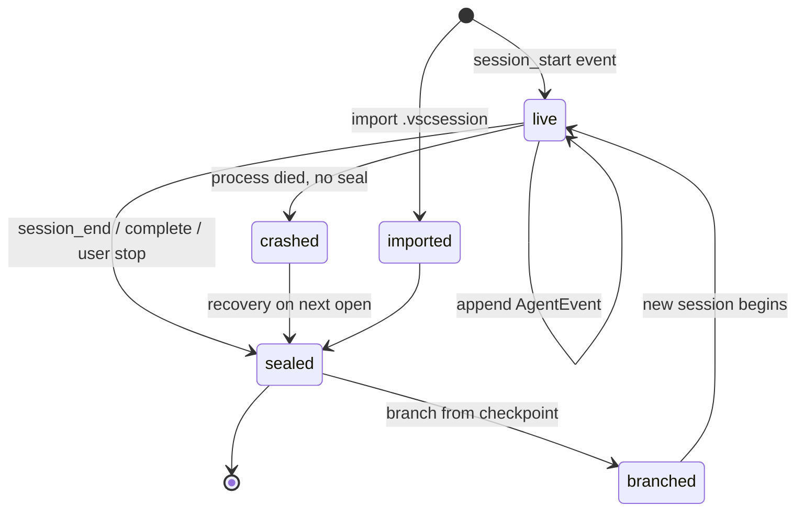
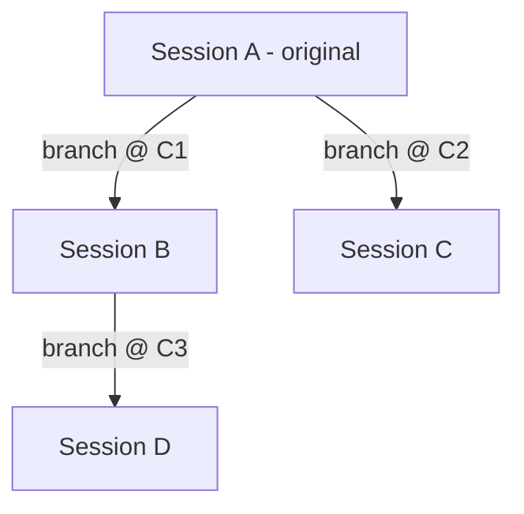

# Sessions Spec

A session in vsclaude is a complete, replayable recording of one agent run: the ordered [`AgentEvent`](../packages/contracts/src/agent-event.ts) log plus the metadata needed to identify, resume, branch, and export it. This document is the normative contract for the session manager: the on-disk data model, the lifecycle (save, name, resume, branch, export), the replay engine that re-drives the entire motion layer from a stored log, and the branching model that forks a new session from a checkpoint without mutating its parent. Because every pixel the user sees is a pure function of the `AgentEvent` stream (see [Architecture](./ARCHITECTURE.md)), a session that captures that stream faithfully can reproduce the experience exactly: same Pixie states, same captions, same swarm, same drill-downs. This is what makes "watch your agent work" something you can pause, scrub, share, and fork.

## Table of contents

- [Design principles](#design-principles)
- [Where sessions live](#where-sessions-live)
- [The session data model](#the-session-data-model)
- [On-disk layout](#on-disk-layout)
- [The event log format](#the-event-log-format)
- [Checkpoints](#checkpoints)
- [Session lifecycle](#session-lifecycle)
- [Saving and naming](#saving-and-naming)
- [Resuming a live session](#resuming-a-live-session)
- [Replay: re-driving the motion layer](#replay-re-driving-the-motion-layer)
- [Branching from a checkpoint](#branching-from-a-checkpoint)
- [Export and import](#export-and-import)
- [The SessionStore (Rust) and session store (Zustand)](#the-sessionstore-rust-and-session-store-zustand)
- [IPC surface](#ipc-surface)
- [Redaction and secret safety](#redaction-and-secret-safety)
- [Versioning, migration, and integrity](#versioning-migration-and-integrity)
- [Testing](#testing)
- [Invariants and non-goals](#invariants-and-non-goals)

## Design principles

The session manager is governed by the three motion rules and three of its own:

1. **A session is the event log.** Everything else (titles, tags, summaries, thumbnails) is derived metadata. If the log and the metadata ever disagree, the log wins. This keeps sessions truthful by construction.
2. **Replay is deterministic.** Feeding a stored log through the same motion mapper and captioner that ran live produces the identical visual sequence. Replay reads only typed fields; it never reaches into `raw`, exactly as the live path does not.
3. **Append-only while live, immutable once sealed.** A live session's log only grows. A sealed (ended) session is never edited in place. Branching produces a new session; it never rewrites the parent. This makes sessions safe to cache, share, and reason about.

## Where sessions live

The Rust core owns all session persistence; the renderer never touches the filesystem directly (see the ownership table in [Architecture](./ARCHITECTURE.md)). Sessions are stored under the OS application data directory, resolved by Tauri's path API.

| Platform | Base path |
| --- | --- |
| Windows | `%APPDATA%/vsclaude/sessions/` |
| macOS | `~/Library/Application Support/vsclaude/sessions/` |
| Linux | `~/.local/share/vsclaude/sessions/` |

Each session occupies one directory named by its immutable `sessionId` (a UUIDv7, so directory listings sort chronologically). A top-level `index.json` (or a small SQLite index for large libraries) holds a denormalized row per session for fast listing without opening every directory.

## The session data model

A session is two parts: a `SessionMeta` record (small, mutable until sealed, what the library UI lists) and an `events.ndjson` log (the source of truth). The meta is a projection over the log plus user-assigned fields.

```ts
// packages/contracts/src/session.ts (frozen, versioned)
import type { AgentEvent } from './agent-event';

export interface SessionMeta {
  sessionId: string;            // UUIDv7, matches the directory name
  schemaVersion: number;        // session schema, independent of AgentEvent schemaVersion
  title: string;                // user-facing name, auto-suggested then editable
  createdAt: number;            // epoch ms, first event ts
  updatedAt: number;            // epoch ms, last write
  endedAt?: number;             // set when sealed; absent while live or crashed
  status: SessionStatus;        // live | sealed | crashed | imported
  provider: string;             // primary provider, e.g. 'claude-code'
  model?: string;               // model id if known
  cwd: string;                  // workspace root the agent ran in
  gitHead?: string;             // commit SHA at session start, if a repo
  tags: string[];               // user labels
  parent?: SessionLineage;      // present only for branched sessions
  stats: SessionStats;          // derived counters, recomputed on seal
  checkpoints: Checkpoint[];    // ordered, see Checkpoints
}

export type SessionStatus = 'live' | 'sealed' | 'crashed' | 'imported';

export interface SessionLineage {
  parentSessionId: string;
  branchedFromEventId: string;  // the checkpoint event this fork started at
  branchedFromIndex: number;    // 0-based index of that event in the parent log
  branchedAt: number;           // epoch ms the branch was created
}

export interface SessionStats {
  eventCount: number;
  durationMs: number;           // last ts - first ts
  filesTouched: number;         // distinct paths across file_* events
  commandCount: number;
  subagentCount: number;
  errorCount: number;
  tokensIn?: number;            // summed from token_usage events
  tokensOut?: number;
}

export interface Checkpoint {
  id: string;                   // stable id, usually the event id
  eventId: string;              // AgentEvent.id this checkpoint marks
  index: number;                // position in the log
  ts: number;
  label: string;                // auto or user-supplied
  kind: CheckpointKind;
}

export type CheckpointKind =
  | 'auto_todo'      // emitted on todo_update
  | 'auto_complete'  // emitted on complete
  | 'auto_permission'// emitted on permission_request
  | 'auto_subagent'  // emitted on subagent_spawned / subagent_finished
  | 'manual';        // user dropped a pin
```

`SessionStats` is always recomputed from the log on seal; it is a cache, never authoritative. A reader that distrusts the meta can rebuild every field except `title`, `tags`, and manual checkpoint labels by scanning `events.ndjson`.

## On-disk layout

```
sessions/
  index.json                         # or index.sqlite for large libraries
  018f3c2a-7b41-7e90-aaaa-.../        # sessionId (UUIDv7) directory
    meta.json                         # SessionMeta, pretty-printed
    events.ndjson                     # the AgentEvent log, one JSON per line
    events.ndjson.idx                 # optional offset index for fast seek
    thumbnail.png                     # optional captured Pixie still
    raw/                              # optional large raw blobs spilled out of the log
      <eventId>.json
```

`meta.json` and `events.ndjson` are the only required files. The `.idx` and `thumbnail.png` are regenerable caches. The `raw/` directory exists only when an event's `raw` payload exceeds the inline size cap (see [Redaction and secret safety](#redaction-and-secret-safety)); in that case the log line stores `{ "rawRef": "raw/<eventId>.json" }` instead of the inline blob.

## The event log format

The log is newline-delimited JSON (NDJSON). One `AgentEvent` per line, in arrival order, never reordered. NDJSON is chosen deliberately:

- **Append is O(1) and crash-safe.** The live writer opens the file once and appends with `O_APPEND`; a partially written trailing line is detected and discarded on next open, so a hard crash loses at most the final event, never the whole log.
- **Streaming read.** Replay and export stream line by line without loading the full log into memory, which matters for long sessions with tens of thousands of events.
- **Diff-friendly and greppable.** A human can inspect a session with standard tools.

```ts
// Each line is exactly one serialized AgentEvent (or a rawRef-stripped variant).
// Example (one physical line, wrapped here for readability):
{"id":"evt_018f...","sessionId":"018f3c2a...","agentId":"root","ts":1718900000123,
 "type":"file_edit","provider":"claude-code","schemaVersion":1,
 "tool":{"name":"Edit","input":{"path":"src/app.ts"}},
 "payload":{"path":"src/app.ts","additions":12,"deletions":3},
 "caption":"Editing src/app.ts"}
```

Writer rules:

- Append fsync is batched (flush on a 250 ms timer or every 64 events, whichever comes first) to bound durability loss without thrashing the disk.
- The writer never rewrites earlier lines. Corrections are new events, never edits, preserving the append-only invariant.
- On seal, the writer flushes, writes a final newline, regenerates `events.ndjson.idx`, recomputes `stats`, sets `status: 'sealed'` and `endedAt`, then atomically replaces `meta.json` via write-temp-and-rename.

## Checkpoints

A checkpoint is a named, addressable position in the log. It is what you branch from and what the scrubber snaps to. Most checkpoints are auto-derived as events stream in; the user can also drop a manual pin at the current head.

| Trigger event | CheckpointKind | Default label |
| --- | --- | --- |
| `todo_update` | `auto_todo` | "Plan updated: N tasks" |
| `complete` | `auto_complete` | "Run complete" |
| `permission_request` | `auto_permission` | "Waiting for approval" |
| `subagent_spawned` | `auto_subagent` | "Spawned sub-agent <name>" |
| `subagent_finished` | `auto_subagent` | "Sub-agent <name> finished" |
| user action | `manual` | user text, defaults to timestamp |

Checkpoints store the event id and its log index, so resolving a checkpoint to a log position is O(1) once the meta is loaded. They are the only positions guaranteed to be safe branch points because each corresponds to a coherent boundary in the agent's work (a plan, a completion, an approval gate, a sub-agent boundary). Branching at an arbitrary mid-tool index is allowed but the UI nudges users toward checkpoints.

## Session lifecycle



A session is created the moment the Rust core spawns an agent process and the adapter emits `session_start`. From then on the writer appends every normalized `AgentEvent`. The session seals on `session_end` (or a terminal `complete` with no follow-up, or an explicit user stop). If the process dies without a seal, the directory is left with `status: 'live'` and no `endedAt`; on next app launch the recovery pass scans for such directories, truncates any partial trailing line, recomputes stats, and marks them `crashed` then `sealed` so they remain replayable.

## Saving and naming

Saving is implicit and continuous: there is no "save" button because the live writer persists every event as it arrives. What the user controls is naming and retention.

- **Auto-title.** On `session_start`, the title defaults to `"<provider> in <basename(cwd)> at <local time>"`. After the first `message` or `todo_update`, a better title is suggested by taking the first user-facing intent caption (truncated to 80 chars). The suggestion is applied only if the user has not already renamed the session.
- **Rename.** `session.rename(sessionId, title)` updates `meta.title` and `updatedAt`. Allowed in any status. Titles are not unique; the `sessionId` is the key.
- **Tags.** `session.setTags(sessionId, tags)` for filtering in the library.
- **Discard.** A session can be deleted (directory removed) only from the library, with confirmation, and never if it is the active live session.

## Resuming a live session

Resuming continues an agent run that ended (or was interrupted) by handing its prior context back to a freshly spawned provider process. This is distinct from replay (which re-drives motion from the log without running an agent) and from branching (which forks at a checkpoint). Resume support depends on the provider; see [Providers](./PROVIDERS_SPEC.md).

| Provider | Resume mechanism |
| --- | --- |
| Claude Code | Native session continuation (`claude --resume <providerSessionId>` or `--continue`), so the model regains full prior context |
| Codex | Provider-native resume where available, else replay-then-prompt reconstruction |
| Gemini | Replay-then-prompt: prior turns are replayed into a new chat context |
| Ollama | Local context window rebuilt from stored `message` and `tool_result` events |

To support native resume, the adapter records the provider's own session identifier as a `payload.providerSessionId` on the `session_start` event (and refreshes it if the provider rotates it). The session manager stores it in `meta` under a provider-scoped field. On resume:

1. The core loads `meta` and the tail of the log to restore UI context (last plan, last messages, swarm state).
2. It spawns a new agent process with the provider's resume flag and `providerSessionId`.
3. The same `sessionId` is reused and the writer reopens `events.ndjson` in append mode, so the resumed run extends the original log. A `session_start` event with `payload.resumed: true` marks the boundary.

If a provider cannot resume natively, the manager falls back to reconstruction: it synthesizes a prompt from the stored `message` history and starts a fresh provider session, then continues appending to the same log. The reconstruction boundary is recorded so replay can render it honestly.

## Replay: re-driving the motion layer

Replay is the feature that makes a stored session feel alive again. It feeds the stored `AgentEvent` log through the exact same downstream pipeline the live path uses, with no agent process running. Because the [motion mapper](./MASCOT_SYSTEM.md), captioner, [swarm](./SWARM_SPEC.md), timeline, and drill-down inspector consume only `AgentEvent`, replay is a pure re-emission of events on a controlled clock.

```
events.ndjson  ->  ReplayDriver  ->  (same channel the live adapter uses)
                       |                       |
                  rate / seek / pause     motion mapper, captioner,
                                          swarm, timeline, inspector
```

### Replay driver

The `ReplayDriver` lives in the renderer (it needs the same clock as the UI) and pulls log lines through an IPC streaming command so it never loads the whole file. It exposes transport controls:

```ts
// packages/sessions/src/replay-driver.ts
export interface ReplayDriver {
  load(sessionId: string): Promise<ReplayHandle>;
}

export interface ReplayHandle {
  readonly total: number;          // event count
  readonly index: number;          // current event index (0-based)
  readonly status: 'idle' | 'playing' | 'paused' | 'ended';

  play(speed?: number): void;      // 0.5x, 1x, 2x, 4x, or 'instant'
  pause(): void;
  seek(target: number): void;      // jump to event index
  seekToCheckpoint(id: string): void;
  step(delta: number): void;       // single-event stepping, +1 / -1
  setSpeed(speed: ReplaySpeed): void;

  on(ev: 'event', cb: (e: AgentEvent, i: number) => void): () => void;
  on(ev: 'state', cb: (s: ReplayHandle['status']) => void): () => void;
}

export type ReplaySpeed = 0.5 | 1 | 2 | 4 | 'instant';
```

### Timing model

Each event carries an absolute `ts`. Replay reconstructs inter-event delays from successive timestamps, scaled by `speed`:

```ts
const baseDelay = next.ts - current.ts;          // real wall-clock gap
const delay = clamp(baseDelay / speed, 0, MAX_GAP_MS); // MAX_GAP_MS = 2000
```

Long idle gaps (the agent thinking for 40 seconds, or the user away) are clamped to `MAX_GAP_MS` so replay never makes the viewer wait minutes for nothing. Sub-second bursts are preserved so typing flurries still feel like typing flurries. `'instant'` speed drains the whole log on the next animation frame, used for jumping to the end or for [branch](#branching-from-a-checkpoint) warm-up where motion is suppressed.

### Seeking and state reconstitution

Seeking is the hard part: jumping to event N must leave the UI in the state it would have been in had events 0..N played live, without animating every intermediate frame. The driver reconstitutes state by replaying 0..N in `'instant'` mode with motion suppressed (the motion mapper is told `replaySilent: true`, so it computes final Pixie state and swarm membership but emits no transitions), then resumes normal animation from N. Because reconstitution is a pure fold over typed fields, it is fast and deterministic.

```ts
// Pure fold: derive UI-relevant state at index N without animating.
function reconstituteAt(events: AgentEvent[], n: number): ReplayState {
  const s = emptyReplayState();
  for (let i = 0; i <= n; i++) applyEvent(s, events[i]); // updates todos,
  // open files, swarm membership, last caption, pixie target state
  return s;
}
```

`applyEvent` is shared verbatim with [Branching](#branching-from-a-checkpoint) warm-up and with crash recovery, so the three paths can never drift. Replay reads only `type`, `tool`, `payload`, and `caption`; it must never read `raw` (drill-down still works because the inspector loads `raw` lazily on click, exactly as in the live UI).

## Branching from a checkpoint

Branching forks a new, independent session whose history is the parent's log up to a chosen checkpoint, after which a fresh agent run continues. The parent is never modified. This is how a user explores "what if the agent had taken a different path from here" without losing the original.

### Branch creation

```
parent:   e0 e1 e2 [C] e3 e4 e5 (sealed)        # C is the branch checkpoint
                     |
                     v  copy e0..e2, then run new agent
child:    e0 e1 e2 [C] e3' e4' ...               # new sessionId, new lineage
```

Steps performed by `session.branch(parentSessionId, checkpointId)`:

1. Resolve the checkpoint to its log index `k`. If a raw event id is passed instead, validate it lies on a coherent boundary; warn (but allow) if not.
2. Allocate a new `sessionId` (UUIDv7) and create its directory.
3. Stream-copy the parent's `events.ndjson` lines `0..k` into the child's log, rewriting each event's `sessionId` to the child id while preserving its original `id`, `ts`, and `agentId`. (Original ids are preserved so drill-downs and lineage remain traceable; the child's events are distinguished by their `sessionId`.)
4. Write child `meta.json` with `status: 'sealed'` initially, `parent: { parentSessionId, branchedFromEventId, branchedFromIndex: k, branchedAt }`, and copied checkpoints up to `k`.
5. Warm up: run `reconstituteAt(childEvents, k)` in `'instant'` silent mode so the UI shows the exact world state at the branch point (open files, plan, swarm).
6. Spawn a new agent process. If the provider supports native resume, resume from the providerSessionId captured at or before `k`; otherwise reconstruct context from the copied `message` history. Flip child `status` to `live` and append new events.

The copied prefix is a genuine copy, not a reference, so deleting the parent never breaks the child. For very long parents this is a streaming file copy, not an in-memory operation.

### Lineage and the session graph

`SessionLineage` lets the library render a branch tree. A session can have many children (multiple branches from different checkpoints) but exactly one parent. The graph is therefore a forest of trees. The library shows lineage as an indented tree or a small node graph, and a child's detail view links back to its parent and the exact checkpoint via `branchedFromEventId`.



## Export and import

Export packages a session into a single portable, shareable artifact. Import is the inverse.

- **Format.** A `.vscession` file is a zip archive containing `meta.json`, `events.ndjson`, and optionally `raw/` and `thumbnail.png`. A `manifest.json` records the session schema version, the `AgentEvent` schema version range present, the producing app version, and a SHA-256 of `events.ndjson`.
- **Redaction on export.** Export runs the redaction pass (see below) over the log so API keys, tokens, and absolute home paths never leave the machine. Export offers two modes: **full** (with `raw` blobs, faithful drill-down) and **slim** (typed fields only, smaller, still fully replayable because replay never needs `raw`).
- **Import.** Importing validates the manifest hash, runs schema migration if the embedded `AgentEvent` or session version is older (see [Agent Event Schema](./AGENT_EVENT_SCHEMA.md) for migration rules), assigns a fresh local `sessionId` to avoid collisions while recording the original id in `meta.importedFrom`, sets `status: 'imported'`, and adds it to the library. Imported sessions are replayable immediately; they are resumable only if the original provider and a matching key are available locally.

```ts
// packages/sessions/src/export.ts
export interface ExportOptions {
  mode: 'full' | 'slim';
  redact: boolean;        // default true; false requires explicit user opt-in
  includeThumbnail: boolean;
}
export function exportSession(id: string, opts: ExportOptions): Promise<Uint8Array>;
export function importSession(bytes: Uint8Array): Promise<SessionMeta>;
```

## The SessionStore (Rust) and session store (Zustand)

Two stores cooperate, split along the [Architecture](./ARCHITECTURE.md) ownership line.

| Concern | Owner |
| --- | --- |
| Reading/writing `events.ndjson` and `meta.json` | Rust `SessionStore` |
| Append on live events, batched fsync, seal, recovery | Rust `SessionStore` |
| Stream-copy on branch, zip on export | Rust `SessionStore` |
| Library index (list, search, filter) | Rust `SessionStore` |
| Active session id, replay transport state | Renderer `sessionStore` (Zustand) |
| Library list cache, selection, branch tree view | Renderer `sessionStore` (Zustand) |

```rust
// apps/desktop/src/session_store.rs (sketch)
pub struct SessionStore { root: PathBuf, index: SessionIndex }

impl SessionStore {
    pub fn create(&self, meta: SessionMeta) -> Result<SessionId>;
    pub fn append(&self, id: &SessionId, ev: &AgentEvent) -> Result<()>; // O_APPEND, batched fsync
    pub fn seal(&self, id: &SessionId) -> Result<SessionMeta>;           // flush, idx, recompute stats
    pub fn recover(&self) -> Result<Vec<SessionId>>;                     // fix crashed sessions on boot
    pub fn read_stream(&self, id: &SessionId) -> impl Iterator<Item = Result<AgentEvent>>;
    pub fn branch(&self, parent: &SessionId, at: usize) -> Result<SessionId>;
    pub fn export(&self, id: &SessionId, opts: ExportOptions) -> Result<Vec<u8>>;
    pub fn import(&self, bytes: &[u8]) -> Result<SessionMeta>;
    pub fn list(&self, q: &ListQuery) -> Result<Vec<SessionMeta>>;
}
```

## IPC surface

All session operations cross the IPC bridge as typed Tauri commands. The renderer never reads session files directly.

| Command | Direction | Purpose |
| --- | --- | --- |
| `session_list` | renderer to core | List/search the library (paged) |
| `session_get_meta` | renderer to core | Load one `SessionMeta` |
| `session_rename` | renderer to core | Set title |
| `session_set_tags` | renderer to core | Set tags |
| `session_add_checkpoint` | renderer to core | Drop a manual pin at the current head |
| `session_read_events` | renderer to core | Stream the log for replay (windowed) |
| `session_resume` | renderer to core | Spawn a resumed agent run |
| `session_branch` | renderer to core | Fork at a checkpoint, returns new id |
| `session_export` | renderer to core | Produce a `.vscession` blob |
| `session_import` | renderer to core | Ingest a `.vscession` blob |
| `session_delete` | renderer to core | Remove a session directory |
| `session_event` | core to renderer | Live append notification (for the active session) |

`session_read_events` is windowed: the renderer requests `{ from, count }` ranges so a multi-thousand-event log streams in without a single huge IPC payload. The `.idx` offset index makes range reads a seek plus a bounded scan.

## Redaction and secret safety

Sessions must be shareable without leaking secrets. The redaction pass runs on export (always by default) and is also applied at write time for known-sensitive fields.

- **Never persisted in plaintext.** API keys live only in the OS keychain (see [Architecture](./ARCHITECTURE.md)). They never enter the event log. The adapter is responsible for stripping auth headers and key arguments before emitting any event.
- **Redaction targets.** On export, the pass scans `payload` and `raw` for: provider key patterns (`sk-...`, `AIza...`, bearer tokens), environment values from `command_run` events, and absolute paths containing the user home directory (rewritten to `~`).
- **Raw spill cap.** Any single event whose serialized `raw` exceeds 256 KB is spilled to `raw/<eventId>.json` with a `rawRef` in the log line, keeping `events.ndjson` lean and seekable. Slim export drops `raw` and the `raw/` directory entirely.
- **Opt-out is explicit.** Disabling redaction on export requires an explicit confirmation and is recorded in the export manifest so a recipient knows the artifact is unredacted.

## Versioning, migration, and integrity

- **Two independent versions.** `SessionMeta.schemaVersion` versions the session envelope; each `AgentEvent.schemaVersion` versions the event contract. They evolve separately. A session can contain events at a single event-schema version (the version live at record time); on read, older events are upgraded by the same migration chain defined in [Agent Event Schema](./AGENT_EVENT_SCHEMA.md).
- **Forward compatibility.** Readers ignore unknown `payload` keys and unknown meta fields rather than failing, so a newer-produced session still loads in an older build for replay where possible.
- **Integrity.** Export records a SHA-256 of `events.ndjson`; import verifies it and refuses tampered or truncated archives. The live writer's trailing-line repair guarantees a crash never yields an unreadable log.
- **Atomic meta writes.** `meta.json` is always written to a temp file and renamed, so a crash mid-write never corrupts the meta; the prior version survives.

## Testing

| Layer | Tool | What it covers |
| --- | --- | --- |
| Log writer | `cargo test` | Append ordering, batched fsync, crash-truncation repair, seal idempotency |
| Branch copy | `cargo test` | Prefix copy correctness, sessionId rewrite, lineage fields, parent immutability |
| Replay determinism | Vitest | Same log produces identical event/caption sequence across runs and speeds |
| Seek reconstitution | Vitest | `reconstituteAt(N)` equals folding 0..N; matches the live state at N |
| Export/import round trip | Vitest + `cargo test` | Hash verification, redaction completeness, slim vs full replayability |
| Migration | Vitest | Old event-schema sessions upgrade and replay without loss |
| End to end | Playwright | Record a run, seal, replay with scrub and speed, branch, export, reimport |

A golden-session fixture (a recorded Claude Code run captured as `events.ndjson`) is committed and used as the canonical replay determinism oracle: any change to the motion mapper or captioner that alters its rendered sequence must update the golden snapshot deliberately.

## Invariants and non-goals

**Invariants**

1. The event log is the source of truth; meta is a derived cache except for `title`, `tags`, and manual checkpoint labels.
2. Live logs are append-only; sealed logs are immutable; branching never mutates the parent.
3. Replay and seek read only typed fields, never `raw`, and are deterministic.
4. Secrets never enter the log; export is redacted by default.
5. Every visual produced during replay is reproducible from the log alone.

**Non-goals**

1. Sessions do not snapshot the working tree or filesystem state; they record the agent's event stream. Reproducing file outcomes is the agent's job on resume or branch, not the session store's. (Git context is captured as `gitHead` for reference only.)
2. The session manager does not run an agent during replay; replay is motion re-emission, not re-execution.
3. Cross-machine resume of an imported session is best-effort and depends on local provider and key availability; it is not guaranteed.
