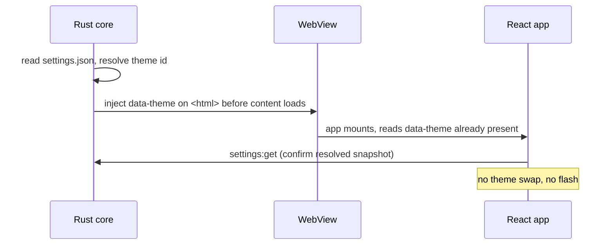

# Settings, Themes, and Persistence

This document is the contract for how vsclaude stores everything that must survive a restart: user settings, the active theme, session history, and checkpoints. It defines the settings schema and its versioned envelope, the layered resolution order (defaults, then user, then workspace, then runtime override), the exact on-disk locations per operating system, how themes are selected and persisted without a flash of the wrong theme on boot, how secrets are kept only in the OS keychain and never in plaintext on disk, and how settings migrate forward across app versions. The Rust core owns all disk and keychain access; the React renderer reads and writes settings only through typed IPC commands. This is an implementation contract, not an overview.

## Table of contents

- [1. Principles](#1-principles)
- [2. Storage layers and resolution order](#2-storage-layers-and-resolution-order)
- [3. Settings schema](#3-settings-schema)
- [4. The persisted envelope](#4-the-persisted-envelope)
- [5. On-disk locations per OS](#5-on-disk-locations-per-os)
- [6. File formats and atomic writes](#6-file-formats-and-atomic-writes)
- [7. IPC surface](#7-ipc-surface)
- [8. Theme selection and persistence](#8-theme-selection-and-persistence)
- [9. Secret storage in the OS keychain](#9-secret-storage-in-the-os-keychain)
- [10. Sessions and checkpoints on disk](#10-sessions-and-checkpoints-on-disk)
- [11. Migration across versions](#11-migration-across-versions)
- [12. Validation, defaults, and error recovery](#12-validation-defaults-and-error-recovery)
- [13. Invariants and non-goals](#13-invariants-and-non-goals)

## 1. Principles

1. **One owner for disk.** Only the Rust core reads or writes the filesystem and the keychain. The renderer holds an in-memory copy of resolved settings and mutates it exclusively through IPC commands. See [Architecture](./ARCHITECTURE.md) for the ownership split.
2. **Secrets never touch plaintext storage.** API keys live only in the OS keychain. They are never written to any settings file, never logged, and never serialized into a session or checkpoint. The settings file stores a reference (a key id), not the secret.
3. **Everything is versioned.** Every persisted document carries a `schemaVersion`. The core refuses to load a document it cannot migrate, and it never silently drops fields it does not understand.
4. **Safe by default, recoverable always.** A corrupt or unreadable file degrades to documented defaults, and the bad file is preserved with a `.corrupt-<timestamp>` suffix rather than overwritten. The user never loses data because of a parse error.
5. **No flash of wrong theme.** The chosen theme is resolved before the first paint, so the window never opens in the default theme and then snaps to the user's choice.

## 2. Storage layers and resolution order

Settings resolve through four layers. Higher layers win on a per-field basis using a deep merge, not a whole-document replace. A workspace can override only the fields it sets; everything else falls through to the user layer.

| Layer | Source | Scope | Writable | Wins over |
| --- | --- | --- | --- | --- |
| 1. Defaults | Compiled into the binary (`DEFAULT_SETTINGS`) | Global | No | nothing |
| 2. User | `settings.json` in the app config dir | Per machine, per user | Yes | Defaults |
| 3. Workspace | `.vsclaude/settings.json` in the open project | Per project | Yes | User, Defaults |
| 4. Runtime override | In-memory only, set by CLI flags or env | Process lifetime | No (not persisted) | all |

```
resolved = deepMerge(DEFAULT_SETTINGS, userSettings, workspaceSettings, runtimeOverride)
```

Resolution rules:

- Objects merge key by key. Scalars and arrays replace wholesale (an array is treated as an atomic value, never element-merged).
- A field set to `null` in a higher layer explicitly resets the field to its default, distinct from being absent.
- The resolved document is recomputed whenever any layer changes (user edit, workspace switch, external file change detected by the watcher) and pushed to the renderer as one snapshot.
- Workspace settings may be marked `trusted` or `untrusted`. An untrusted workspace cannot override security-sensitive fields (see the `restrictedKeys` set in section 12).

## 3. Settings schema

The schema lives in `packages/contracts/src/settings.ts` and is the single source of truth shared by Rust (via a generated JSON Schema) and TypeScript. Fields are grouped by domain. All fields are optional in stored files; the resolved object is fully populated from defaults.

```ts
// packages/contracts/src/settings.ts (versioned)
export const SETTINGS_SCHEMA_VERSION = 3;

export interface Settings {
  appearance: AppearanceSettings;
  editor: EditorSettings;
  terminal: TerminalSettings;
  motion: MotionSettings;
  providers: ProvidersSettings;
  privacy: PrivacySettings;
  advanced: AdvancedSettings;
}

export interface AppearanceSettings {
  theme: ThemeId;                 // see Theme selection
  followSystemTheme: boolean;     // overrides `theme` light/dark pairing with OS
  uiScale: number;               // 0.8 to 1.5, clamped
  reducedMotion: boolean | 'system';
  fontFamily: string;
  pixieEnabled: boolean;          // show the Pixie companion
}

export interface EditorSettings {
  fontSize: number;               // 8 to 32
  tabSize: number;                // 1 to 8
  insertSpaces: boolean;
  wordWrap: 'off' | 'on' | 'bounded';
  minimap: boolean;
  formatOnSave: boolean;
}

export interface TerminalSettings {
  fontSize: number;
  scrollback: number;             // lines retained, capped at 100000
  cursorBlink: boolean;
  shell: string | null;           // null means OS default shell
}

export interface MotionSettings {
  intensityCap: number;           // 0 to 1, clamp on Rive `intensity` input
  soundEnabled: boolean;          // Tone.js accents, default false
  swarmRenderer: 'dom' | 'pixi' | 'auto';
}

export interface ProvidersSettings {
  defaultProvider: 'claude-code' | 'codex' | 'gemini' | 'ollama';
  // keyRef points at a keychain entry, never the secret itself
  keyRefs: Record<string, string>;       // provider -> keychain key id
  ollamaBaseUrl: string;
  permissionMode: 'ask' | 'allow-edits' | 'plan-only';
}

export interface PrivacySettings {
  telemetry: boolean;             // default false, opt in only
  crashReports: boolean;          // default false
  redactPathsInLogs: boolean;     // default true
}

export interface AdvancedSettings {
  logLevel: 'error' | 'warn' | 'info' | 'debug' | 'trace';
  maxSessionsRetained: number;    // pruning threshold
  experimentalFlags: Record<string, boolean>;
}

export type ThemeId =
  | 'cozy-dark' | 'cozy-light'
  | 'high-contrast' | 'colorblind-safe'
  | `custom:${string}`;
```

Note the absence of any secret field. `keyRefs` maps a provider to a keychain entry id (see [section 9](#9-secret-storage-in-the-os-keychain)). The secret value never appears in this interface.

## 4. The persisted envelope

Every settings file on disk is wrapped in an envelope so the core can detect version and integrity before trusting the body.

```ts
export interface SettingsEnvelope {
  schemaVersion: number;     // matches SETTINGS_SCHEMA_VERSION at write time
  writtenBy: string;         // app version string, for diagnostics
  writtenAt: number;         // epoch ms
  checksum: string;          // sha256 of the canonical JSON body
  body: Partial<Settings>;   // only the fields this layer actually sets
}
```

`body` is a `Partial<Settings>` because each layer stores only what it overrides. The defaults layer is never written to disk; it lives in the binary. On read, the core verifies `checksum` against `body`, compares `schemaVersion`, runs migrations if needed, and only then merges the body into the resolved document.

## 5. On-disk locations per OS

The core resolves directories through Tauri's path API, which maps to the platform conventions below. `Goblin` is never used; the app identifier is `dev.vsclaude.app`. Paths use the real folder names users will see.

| Purpose | Windows | macOS | Linux |
| --- | --- | --- | --- |
| User settings dir | `%APPDATA%\vsclaude\` | `~/Library/Application Support/vsclaude/` | `$XDG_CONFIG_HOME/vsclaude/` (falls back to `~/.config/vsclaude/`) |
| Sessions and checkpoints | `%LOCALAPPDATA%\vsclaude\` | `~/Library/Application Support/vsclaude/` | `$XDG_DATA_HOME/vsclaude/` (falls back to `~/.local/share/vsclaude/`) |
| Cache (regenerable) | `%LOCALAPPDATA%\vsclaude\Cache\` | `~/Library/Caches/vsclaude/` | `$XDG_CACHE_HOME/vsclaude/` (falls back to `~/.cache/vsclaude/`) |
| Logs | `%LOCALAPPDATA%\vsclaude\logs\` | `~/Library/Logs/vsclaude/` | `$XDG_STATE_HOME/vsclaude/logs/` (falls back to `~/.local/state/vsclaude/logs/`) |
| Secrets | Windows Credential Manager | macOS Keychain | Secret Service (libsecret, e.g. GNOME Keyring or KWallet) |

The on-disk tree under the user settings dir:

```
vsclaude/
  settings.json            # user layer envelope
  themes/                  # user-authored custom themes
    midnight-terracotta.json
  state/
    window.json            # last window bounds, panel layout
  migrations.log           # append-only record of applied migrations
```

The sessions and checkpoints tree (data dir):

```
vsclaude/
  sessions/
    <sessionId>/
      meta.json            # provider, workspace path, started/ended ts
      events.ndjson        # the recorded AgentEvent stream, one per line
      checkpoints/
        <checkpointId>.json
  index.json               # session index for fast listing
```

Workspace-scoped settings live with the project, not in any global dir:

```
<project>/.vsclaude/
  settings.json            # workspace layer envelope
  trust.json               # records whether the user trusted this workspace
```

## 6. File formats and atomic writes

- All settings and state files are UTF-8 JSON with a trailing newline. Custom themes and sessions are also JSON. The event stream is newline-delimited JSON (`events.ndjson`) so it can be appended without rewriting and replayed line by line.
- Writes are atomic. The core writes to a sibling temp file, calls `fsync`, then renames over the target. A crash mid-write can never leave a half-written settings file.
- A coarse advisory lock (a `.lock` file with the writer pid) guards against two app instances writing the same user settings concurrently. The watcher ignores its own writes via a short echo-suppression window.

```rust
// apps/desktop/src-tauri/src/persist.rs
fn write_atomic(path: &Path, bytes: &[u8]) -> io::Result<()> {
    let tmp = path.with_extension("tmp");
    {
        let mut f = File::create(&tmp)?;
        f.write_all(bytes)?;
        f.sync_all()?;            // fsync before rename
    }
    fs::rename(&tmp, path)?;       // atomic on the same filesystem
    Ok(())
}
```

The Rust core watches `settings.json` with the `notify` crate (debounced, scoped) so an external edit (the user opening the file in another editor) is picked up, re-validated, and pushed to the renderer as a new resolved snapshot.

## 7. IPC surface

The renderer never touches the disk. It calls these typed commands. Each command returns the full resolved snapshot so the renderer state stays in lockstep.

| Command | Direction | Payload | Returns |
| --- | --- | --- | --- |
| `settings:get` | UI to core | `{ scope?: 'resolved' \| 'user' \| 'workspace' }` | `ResolvedSettings` or layer body |
| `settings:patch` | UI to core | `{ scope: 'user' \| 'workspace', patch: Partial<Settings> }` | `ResolvedSettings` |
| `settings:reset` | UI to core | `{ scope, keys?: string[] }` | `ResolvedSettings` |
| `settings:export` | UI to core | `{ includeSecrets: false }` | JSON blob (secrets excluded, always) |
| `settings:import` | UI to core | `{ envelope: SettingsEnvelope }` | `ResolvedSettings` |
| `theme:list` | UI to core | none | `ThemeManifest[]` |
| `secret:set` | UI to core | `{ provider, value }` | `{ keyRef: string }` |
| `secret:has` | UI to core | `{ provider }` | `{ present: boolean }` |
| `secret:delete` | UI to core | `{ provider }` | `{ ok: boolean }` |

The core also emits an event the renderer subscribes to:

| Event | Direction | Payload |
| --- | --- | --- |
| `settings:changed` | core to UI | `{ resolved: ResolvedSettings, reason: 'user' \| 'workspace' \| 'external' \| 'migration' }` |

`secret:set` returns only a `keyRef`. The secret value is consumed by the core and stored in the keychain; it is not echoed back and the renderer must discard its copy immediately after the call resolves.

## 8. Theme selection and persistence

A theme is a named bundle of design tokens. The catalog is defined in the [Design System](./DESIGN_SYSTEM.md); this section covers selection, persistence, and boot ordering.

### Built-in themes

| ThemeId | Name | Notes |
| --- | --- | --- |
| `cozy-dark` | Cozy Dark | Default, terracotta over warm charcoal |
| `cozy-light` | Cozy Light | Light pairing of the cozy palette |
| `high-contrast` | High Contrast | Passes WCAG AAA |
| `colorblind-safe` | Color-blind Safe | Never encodes meaning by hue alone |

### Persistence model

The chosen theme persists in `appearance.theme`. When `appearance.followSystemTheme` is true, the core listens to the OS appearance change signal and selects the light or dark variant of the cozy pair automatically, while still honoring an explicit non-cozy choice (high-contrast and color-blind-safe ignore the system pairing).

### No flash of wrong theme

The theme must be applied before the first paint. The boot sequence:



The core writes the resolved `data-theme` attribute and the matching `:root[data-theme]` CSS variable block into the initial document via Tauri's init script, so the very first frame already carries the correct tokens. The renderer reads, never sets, the theme on boot.

### Custom themes

A custom theme is a JSON token override file in `themes/`. Its id is `custom:<slug>`. Validation rejects a custom theme that omits any required semantic token or fails the AA contrast check for text and UI roles; an invalid custom theme falls back to `cozy-dark` and surfaces a non-blocking warning.

```ts
export interface ThemeManifest {
  id: ThemeId;
  name: string;
  base: 'cozy-dark' | 'cozy-light';   // tokens inherited then overridden
  tokens: Record<string, string>;     // semantic token name -> value
  contrastReport: { passesAA: boolean; passesAAA: boolean };
}
```

## 9. Secret storage in the OS keychain

API keys are the only secrets the app holds, and they are stored exclusively in the OS keychain through the Rust `keyring` crate. They are never written to `settings.json`, never logged, and never included in exports, sessions, or checkpoints.

### Keychain entry shape

| Field | Value |
| --- | --- |
| Service | `dev.vsclaude.app` |
| Account (key id) | `provider:<provider>:<accountHash>` |
| Secret | the raw API key |

`settings.json` stores only `providers.keyRefs[provider] = "provider:claude-code:ab12cd"`, a pointer to the keychain account. Looking up the secret requires the keychain, which is gated by the OS user session.

### Lifecycle

```rust
// apps/desktop/src-tauri/src/secrets.rs
use keyring::Entry;

const SERVICE: &str = "dev.vsclaude.app";

pub fn set_secret(key_id: &str, value: &str) -> keyring::Result<()> {
    Entry::new(SERVICE, key_id)?.set_password(value)
}

pub fn get_secret(key_id: &str) -> keyring::Result<String> {
    Entry::new(SERVICE, key_id)?.get_password()
}

pub fn delete_secret(key_id: &str) -> keyring::Result<()> {
    Entry::new(SERVICE, key_id)?.delete_credential()
}
```

Rules:

- The secret crosses IPC exactly once, from the renderer to the core during `secret:set`. After that, only the core reads it, and only to hand it to a spawned provider process via environment or stdin, never back to the renderer.
- `secret:has` answers presence without revealing the value, so the settings UI can show "key configured" without ever loading the key.
- On Linux without a running Secret Service, the core surfaces a clear setup error and refuses to fall back to plaintext. There is no plaintext fallback on any platform.
- Deleting a provider's key removes both the keychain entry and the `keyRefs` pointer in one transaction; a dangling pointer is treated as "no key" and repaired on next read.

## 10. Sessions and checkpoints on disk

A session records a single agent run as an ordered `AgentEvent` stream (see [Agent Event Schema](./AGENT_EVENT_SCHEMA.md)). Because the renderer is a deterministic projection of that stream, replaying `events.ndjson` reproduces the exact visual timeline with no live process.

### Session record

```ts
export interface SessionMeta {
  sessionId: string;
  provider: string;
  workspacePath: string;
  startedAt: number;
  endedAt: number | null;
  eventCount: number;
  schemaVersion: number;     // AgentEvent schema version at record time
}
```

- `events.ndjson` is append-only. Each line is one serialized `AgentEvent`. The `raw` provider payload is retained so meaning is always recoverable, but any field carrying a secret is redacted at write time by the adapter, not at read time.
- The `index.json` file holds a compact list of `SessionMeta` for fast session browsing without opening every directory.

### Checkpoints

A checkpoint is a named, restorable marker within a session: the event offset plus a snapshot of workspace-relevant state (open files, scroll, the active todo list) so the user can return to a known point.

```ts
export interface Checkpoint {
  checkpointId: string;
  sessionId: string;
  label: string;
  eventOffset: number;        // index into events.ndjson
  createdAt: number;
  uiState: { openFiles: string[]; activeTodoId?: string };
}
```

Checkpoints never store file contents (those come from the workspace or from git), and never store secrets. Pruning removes sessions beyond `advanced.maxSessionsRetained`, oldest first, but a session with at least one checkpoint is retained until its checkpoints are explicitly deleted.

## 11. Migration across versions

Migrations run inside the core at load time, before any document is trusted. Each migration is a pure function from one version to the next. The chain runs in order until the document reaches `SETTINGS_SCHEMA_VERSION`.

```ts
type Migration = (body: Record<string, unknown>) => Record<string, unknown>;

const MIGRATIONS: Record<number, Migration> = {
  // from v1 to v2: split a flat `theme` string into appearance.theme
  1: (b) => ({ ...b, appearance: { theme: b.theme ?? 'cozy-dark' } }),
  // from v2 to v3: move inline `apiKey` out of file; emit keychain task
  2: (b) => {
    const next = structuredClone(b) as Record<string, unknown>;
    delete (next as any).apiKey;     // never persisted again
    return next;
  },
};

function migrate(env: SettingsEnvelope): SettingsEnvelope {
  let { schemaVersion, body } = env;
  while (schemaVersion < SETTINGS_SCHEMA_VERSION) {
    body = MIGRATIONS[schemaVersion](body) as Partial<Settings>;
    schemaVersion += 1;
  }
  return { ...env, schemaVersion, body };
}
```

Migration rules:

- **Forward only.** The core never downgrades a document. A file written by a newer app version (`schemaVersion` greater than the binary's) is not loaded; the layer degrades to defaults and the file is left untouched so a newer install can still read it.
- **Backed up before write.** Before persisting a migrated file, the core copies the original to `settings.v<old>.bak`. The migration is recorded in `migrations.log`.
- **Secret rescue is one-way.** The v2 to v3 migration that removed an inline `apiKey` does not move the secret into the file (it cannot, the field is gone). Instead it queues a one-time prompt asking the user to re-enter the key, which is then stored only in the keychain. An inline key, once seen, is scrubbed and never rewritten.
- **Sessions migrate by schema, not by rewrite.** Old `events.ndjson` files keep their recorded `schemaVersion`. The reader upgrades each event lazily on load; the file on disk is left as written so historical sessions stay faithful.

## 12. Validation, defaults, and error recovery

Every loaded document is validated against the JSON Schema generated from `Settings` before it merges into the resolved object. Validation is total: unknown fields are preserved (forward compatibility) but never merged into typed state, and known fields out of range are clamped to documented bounds rather than rejecting the whole file.

| Failure | Behavior |
| --- | --- |
| File missing | Use defaults for that layer, write nothing until first change |
| JSON parse error | Rename to `settings.json.corrupt-<ts>`, load defaults, emit a recoverable warning |
| Checksum mismatch | Treat as corrupt (same path as parse error) |
| Field out of range | Clamp to bound (for example `uiScale` to `[0.8, 1.5]`), log at `info` |
| Unknown `schemaVersion` (newer) | Skip the layer, keep the file, warn |
| Untrusted workspace setting a restricted key | Ignore that key, keep the rest |

The `restrictedKeys` set that an untrusted workspace may never override:

```ts
const restrictedKeys = [
  'providers.keyRefs',
  'providers.permissionMode',
  'privacy.telemetry',
  'privacy.crashReports',
  'advanced.experimentalFlags',
];
```

Recovery never blocks the UI. A corrupt user settings file opens the app in defaults with a dismissible banner offering "open the preserved file" and "restore from backup," wired to the `settings.v<old>.bak` and `.corrupt-<ts>` artifacts.

## 13. Invariants and non-goals

Invariants:

- Secrets exist only in the OS keychain. No code path writes a secret to any file, log, export, session, or checkpoint.
- The renderer never reads or writes disk or keychain. All persistence flows through the IPC commands in [section 7](#7-ipc-surface).
- Every persisted document carries `schemaVersion` and a `checksum`, and is written atomically.
- Resolution is deterministic: the same four layers always produce the same resolved snapshot.
- The theme is correct on the first painted frame.

Non-goals:

- No cloud sync of settings in this version. Export and import via JSON (secrets excluded) is the only cross-machine path.
- No per-field encryption of the settings file. The file is plaintext JSON by design because it holds no secrets; secrets are delegated to the OS keychain.
- No live two-way editing of `events.ndjson`. Sessions are append-only records, not mutable documents.

See also: [Architecture](./ARCHITECTURE.md), [Design System](./DESIGN_SYSTEM.md), [Agent Event Schema](./AGENT_EVENT_SCHEMA.md), [Providers](./PROVIDERS_SPEC.md).
