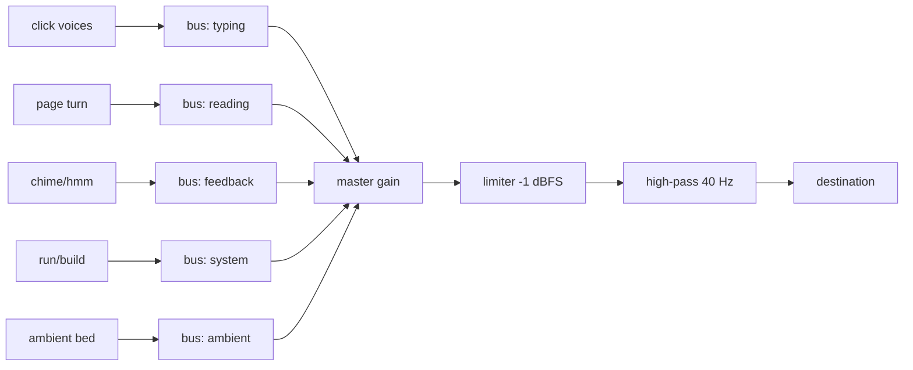
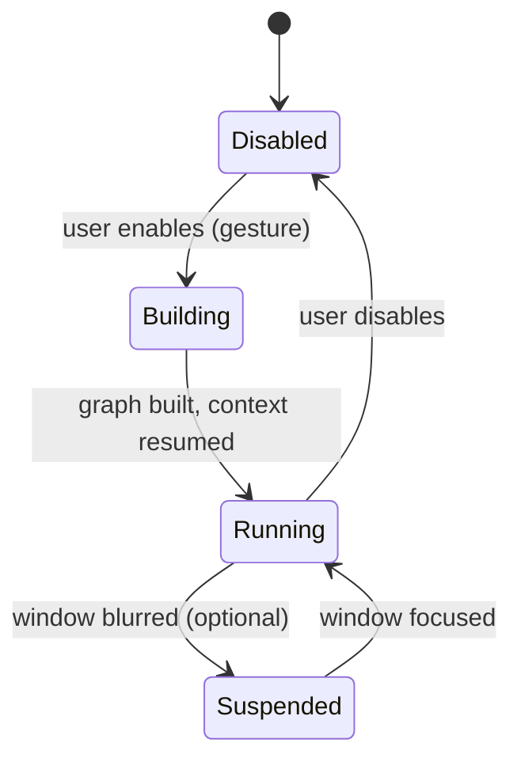

# Sound Design

vsclaude ships with an optional, tasteful sound layer that turns the agent's work into quiet, physical-feeling audio: soft mechanical key clicks while a file is being written, a page-turn when a file is read, a gentle chime on success, a quiet "hmm" when the agent thinks, and an optional lo-fi ambient bed underneath it all. Sound is **off by default**, fully toggleable, and obeys the same three sacred motion rules as [Pixie](./MASCOT_SYSTEM.md): every cue is bound to a real [AgentEvent](./AGENT_EVENT_SCHEMA.md), the meaning behind any cue is one click away in the timeline, and nothing is decorative theater. This document is the implementation contract for the `packages/sound` audio engine: the Tone.js graph, the event-to-cue mapper, per-event volume controls, the settings schema, throttling and voice limits, and the accessibility and performance guarantees.

## Table of contents

- [1. Principles](#1-principles)
- [2. Package layout](#2-package-layout)
- [3. The audio graph](#3-the-audio-graph)
- [4. Cue catalog](#4-cue-catalog)
- [5. AgentEvent to cue mapping](#5-agentevent-to-cue-mapping)
- [6. The cue scheduler](#6-the-cue-scheduler)
- [7. Volume model and settings schema](#7-volume-model-and-settings-schema)
- [8. The ambient bed](#8-the-ambient-bed)
- [9. Synthesis recipes](#9-synthesis-recipes)
- [10. Lifecycle and resource management](#10-lifecycle-and-resource-management)
- [11. Accessibility and policy](#11-accessibility-and-policy)
- [12. Performance budget](#12-performance-budget)
- [13. Testing](#13-testing)
- [14. Invariants and non-goals](#14-invariants-and-non-goals)

## 1. Principles

1. **Off by default.** The engine boots in a suspended state and produces no audio until the user explicitly enables sound. A fresh install is silent. This is a hard product rule.
2. **Bound to real events.** Every cue is triggered by a normalized `AgentEvent`. There is no random ambience, no looping jingle, no cue that fires without an underlying fact. If you hear a key click, a `file_edit` or `file_create` event is flowing.
3. **Recoverable meaning.** Each played cue carries the `sourceEventId` it came from. Clicking the corresponding timeline row reveals the exact tool, input, diff, command, or raw output, exactly as it does for Pixie.
4. **Tasteful, never cartoonish.** Cues are short, soft, low in the mix, and physically plausible (mechanical keys, paper, a struck bell). No comedic boings, no voice samples, no stingers. When in doubt, quieter and shorter.
5. **Audio follows motion, it does not lead.** The sound engine is a sibling consumer of the same event stream that drives the mascot, not a child of it. It never blocks, delays, or depends on the render loop. If audio fails, the rest of the app is unaffected.
6. **Synthesized, not sampled, where practical.** Most cues are generated at runtime with Tone.js so the bundle stays light and timbres can shift with intensity. A small set of optional samples (the lo-fi bed) loads lazily only when enabled.

## 2. Package layout

```
packages/
  sound/
    src/
      engine.ts          # SoundEngine: graph lifecycle, suspend/resume
      graph.ts           # Tone.js node construction and routing
      cues.ts            # cue definitions (synth recipes + envelopes)
      mapper.ts          # pure AgentEvent -> CueDirective[]
      scheduler.ts       # throttling, voice limits, look-ahead timing
      mixer.ts           # bus + per-event gain resolution
      ambient.ts         # lo-fi bed loader and crossfader
      settings.ts        # SoundSettings type + defaults + validation
      index.ts
    assets/
      ambient/
        lofi-bed-a.ogg    # ~60s seamless loop, lazy-loaded
    test/
      mapper.test.ts
      scheduler.test.ts
```

`packages/sound` depends only on `packages/contracts` (for `AgentEvent`) and `tone`. It has no dependency on React, Rust, Monaco, or the terminal, so it is unit-testable in isolation. The renderer wires it up in one place: a subscriber on the `AgentEvent` stream feeds `engine.handle(event)`. See [Architecture](./ARCHITECTURE.md) for where the package sits in the dependency graph, and [Settings, Themes, and Persistence](./SETTINGS_THEMES_PERSISTENCE.md) for how `SoundSettings` is stored.

## 3. The audio graph

All cues route through a fixed bus topology. Per-event gains feed category buses, category buses feed a master chain, and the master chain feeds the destination. This lets a user mute one category (say, typing) without touching the master, and lets the master apply one limiter so no combination of cues can clip.



```ts
// graph.ts
import * as Tone from 'tone';

export interface AudioGraph {
  master: Tone.Gain;
  limiter: Tone.Limiter;
  buses: Record<CueCategory, Tone.Gain>;
  destination: Tone.ToneAudioNode;
}

export type CueCategory = 'typing' | 'reading' | 'feedback' | 'system' | 'ambient';

export function buildGraph(): AudioGraph {
  const limiter = new Tone.Limiter(-1);          // catch any summed clip
  const highpass = new Tone.Filter(40, 'highpass'); // remove sub rumble
  const master = new Tone.Gain(1);

  master.chain(limiter, highpass, Tone.getDestination());

  const buses: Record<CueCategory, Tone.Gain> = {
    typing: new Tone.Gain(1).connect(master),
    reading: new Tone.Gain(1).connect(master),
    feedback: new Tone.Gain(1).connect(master),
    system: new Tone.Gain(1).connect(master),
    ambient: new Tone.Gain(1).connect(master),
  };

  return { master, limiter, buses, destination: Tone.getDestination() };
}
```

The graph is built **once** when sound is first enabled and torn down when sound is disabled (see [section 10](#10-lifecycle-and-resource-management)). The `AudioContext` starts suspended; the first cue can only play after a user gesture has resumed it, which the settings toggle provides.

## 4. Cue catalog

A **cue** is a named, parameterized sound with a category, a default gain, a maximum duration, and a synthesis recipe. Cues are short by contract: nothing exceeds 600 ms except the ambient bed.

| Cue id | Category | Trigger feel | Default gain (dB) | Max dur | Recipe summary |
| --- | --- | --- | --- | --- | --- |
| `keyClick` | typing | soft mechanical keystroke | -18 | 40 ms | filtered noise burst + short pitched click |
| `pageTurn` | reading | paper page flip | -20 | 320 ms | filtered noise sweep with rising cutoff |
| `chime` | feedback | gentle success bell | -14 | 600 ms | two-partial FM bell, major third |
| `hmm` | feedback | quiet contemplative hum | -22 | 280 ms | soft sine with slow vibrato, low pass |
| `tick` | system | command start | -19 | 60 ms | single woodblock-like pitched blip |
| `whir` | system | long build running | -24 | looped | low filtered noise loop, breathes with intensity |
| `gitClack` | system | version control action | -19 | 90 ms | two stacked clicks (a satisfying ratchet) |
| `spawnPing` | feedback | sub-agent appears | -20 | 220 ms | rising two-note arpeggio, soft sine |
| `askBell` | feedback | permission needed | -12 | 500 ms | single mid bell, slightly brighter to draw attention |
| `errorThud` | feedback | error during run | -16 | 240 ms | low muted thud, fast decay, no pitch glide |
| `ambientBed` | ambient | optional background | -30 | loop | lazy-loaded lo-fi loop, see [section 8](#8-the-ambient-bed) |

Notes on taste:

- `keyClick` is **not** played per character. It is played per `file_edit`/`file_create` event, with a small randomized cluster of 1 to 3 clicks so a burst of edits feels like typing without becoming a machine-gun. See the scheduler for throttling.
- `askBell` is the only cue allowed to be slightly louder and brighter, because it maps to `permission_request`, which genuinely needs the user's attention. It is still soft.
- `errorThud` is felt more than heard: low, dull, brief. It must never sound alarming or comedic.
- Every pitched cue is tuned to a shared scale (A minor pentatonic, A = 220 Hz) so cues that overlap never clash.

## 5. AgentEvent to cue mapping

The mapper is a **pure function** from one `AgentEvent` (plus carried state) to zero or more `CueDirective`s, mirroring the design of the Pixie mapper. It performs no audio I/O and reads no clock except a `now` passed in. The scheduler turns directives into actual Tone.js calls.

```ts
// directives
export interface CueDirective {
  cue: CueId;
  category: CueCategory;
  sourceEventId: string;     // recoverable meaning, always set
  gainDb: number;            // resolved per-event gain before bus
  intensity: number;         // 0..1, modulates timbre/cluster size
  loop?: boolean;            // only whir and ambientBed
  stop?: boolean;            // request to stop a looped cue
}
```

Full mapping table. "Cluster" means a short randomized group of repeats (see scheduler). A blank cue means the event is intentionally silent.

| AgentEventType | Cue | Behavior |
| --- | --- | --- |
| `session_start` | `chime` (soft, -20) | one welcoming note, quieter than success |
| `session_end` | `pageTurn` | a closing-the-book feel |
| `thinking` | `hmm` | played once on entry, not repeated while thinking persists |
| `message` | (silent) | text arrival is visual; no cue |
| `tool_call` | (silent) | the specific tool events below carry the sound |
| `tool_result` | (silent) | result is visual; avoid double cues |
| `file_read` | `pageTurn` | one turn per read event |
| `file_edit` | `keyClick` cluster | 1 to 3 clicks, intensity-scaled |
| `file_create` | `keyClick` cluster + soft `tick` tail | a new file gets a tiny punctuation |
| `file_delete` | `errorThud` (soft, -22) | a low, brief acknowledgment, not alarming |
| `command_run` | `tick` | one blip at start of a command |
| `command_output` | (silent) | streaming output stays quiet by design |
| `search` | `pageTurn` (short variant) | a riffle-through-pages feel |
| `web_fetch` | `pageTurn` (short variant) | same family as search |
| `git_action` | `gitClack` | the ratchet click |
| `subagent_spawned` | `spawnPing` | rising arpeggio as the swarm grows |
| `subagent_finished` | `spawnPing` (descending, -22) | a quieter mirror of spawn |
| `todo_update` | (silent) | planning is visual; no cue |
| `permission_request` | `askBell` | the one attention cue |
| `token_usage` | (silent) | never sonified |
| `error` | `errorThud` if during a run, else `hmm` (struggling) | context-sensitive, see below |
| `complete` | `chime` | the signature success bell |

Context rules the mapper applies from carried state:

- **Build awareness.** If a `command_run` has been active longer than `buildThresholdMs` (default 4000) and produces no `complete`, the mapper starts the looped `whir` cue and stops it on the next `command_output` settle, `complete`, or `error`. This is the audible counterpart of Pixie's `building` state.
- **Error context.** An `error` event whose `parentAgentId` chain includes an active `command_run` maps to `errorThud` (something broke while running). A standalone `error` with no active run maps to a soft `hmm` in a struggling timbre, matching Pixie's `confused`/`struggling` mood.
- **Cluster sizing.** `intensity` (carried from the same rolling-window computation Pixie uses) sets cluster size for `keyClick`: `clamp(1 + round(intensity * 2), 1, 3)`.

```ts
// mapper.ts (excerpt)
export function mapEvent(ev: AgentEvent, st: MapperState, now: number): CueDirective[] {
  switch (ev.type) {
    case 'file_edit':
    case 'file_create': {
      const n = clamp(1 + Math.round(st.intensity * 2), 1, 3);
      const dirs = Array.from({ length: n }, () => ({
        cue: 'keyClick' as const, category: 'typing' as const,
        sourceEventId: ev.id, gainDb: 0, intensity: st.intensity,
      }));
      if (ev.type === 'file_create') {
        dirs.push({ cue: 'tick', category: 'system', sourceEventId: ev.id, gainDb: -3, intensity: st.intensity });
      }
      return dirs;
    }
    case 'file_read':
    case 'search':
    case 'web_fetch':
      return [{ cue: 'pageTurn', category: 'reading', sourceEventId: ev.id, gainDb: 0, intensity: st.intensity }];
    case 'complete':
      return [{ cue: 'chime', category: 'feedback', sourceEventId: ev.id, gainDb: 0, intensity: st.intensity }];
    case 'permission_request':
      return [{ cue: 'askBell', category: 'feedback', sourceEventId: ev.id, gainDb: 0, intensity: 1 }];
    // ... remaining cases per the table
    default:
      return [];
  }
}
```

The `gainDb` on a directive is a **relative offset** applied on top of the cue's default and the per-event user setting. The mixer resolves the final value (see [section 7](#7-volume-model-and-settings-schema)).

## 6. The cue scheduler

The scheduler is the only place that touches Tone's clock and timers. It enforces three protections so the audio never becomes noisy or expensive, no matter how fast events arrive.

| Protection | Mechanism | Default |
| --- | --- | --- |
| Per-cue throttle | minimum gap between two plays of the same cue id | `keyClick` 35 ms, `pageTurn` 200 ms, others 120 ms |
| Global voice cap | maximum simultaneously sounding non-looped voices | 8 |
| Cluster spread | clicks in a cluster are spread, not stacked | 18 to 40 ms random spacing |

Logic:

1. Resolve directive gain through the mixer; if the resulting linear gain is effectively zero (event muted), drop the directive before allocating any voice.
2. Apply the per-cue throttle. If the same cue fired within its minimum gap, **coalesce**: drop the new one rather than queueing, because stale audio is worse than missing audio.
3. Schedule with a small look-ahead (`Tone.now() + 0.02`) so the trigger lands on an accurate audio-clock time rather than a jittery rAF time.
4. For clusters, spread members across the look-ahead window with randomized spacing so it sounds human.
5. Track active non-looped voices; if the cap is reached, drop the lowest-priority pending directive (`typing` < `system` < `reading` < `feedback`).

```ts
// scheduler.ts (excerpt)
play(d: CueDirective): void {
  const gain = this.mixer.resolveLinear(d);           // 0..1
  if (gain < 1e-4) return;                              // muted: do nothing
  const last = this.lastPlayed.get(d.cue) ?? -Infinity;
  const gap = THROTTLE_MS[d.cue] ?? 120;
  if (this.clockMs() - last < gap) return;             // coalesce
  if (!d.loop && this.activeVoices >= MAX_VOICES) {
    if (!this.preempt(d.category)) return;             // cap reached, no lower prio to drop
  }
  this.lastPlayed.set(d.cue, this.clockMs());
  const at = Tone.now() + LOOKAHEAD;
  this.cues.trigger(d, at, gain);                      // hands off to Tone
}
```

Looped cues (`whir`, `ambientBed`) bypass the voice cap and are reference-counted: a `stop` directive only silences the loop when the count returns to zero.

## 7. Volume model and settings schema

There are four levels of attenuation, multiplied together: master, category bus, per-event setting, and the directive's relative offset. Every value is stored in decibels in settings and converted to linear gain at the node.

```
finalLinear = dbToGain(master) * dbToGain(bus[category]) * dbToGain(eventDb) * dbToGain(directiveOffset)
```

A muted toggle anywhere short-circuits to silence. The `SoundSettings` block lives under the persisted settings document described in [Settings, Themes, and Persistence](./SETTINGS_THEMES_PERSISTENCE.md) and is versioned with the rest.

```ts
// settings.ts
export interface SoundSettings {
  enabled: boolean;            // master on/off, default false
  masterDb: number;            // -60..0, default -6
  categories: Record<CueCategory, { db: number; muted: boolean }>;
  events: Partial<Record<AgentEventType, { db: number; muted: boolean }>>;
  ambient: {
    enabled: boolean;          // default false, requires enabled === true
    db: number;                // default -30
    track: 'lofi-bed-a';       // extensible enum
  };
  respectSystemReducedMotion: boolean; // default true, see section 11
}

export const DEFAULT_SOUND_SETTINGS: SoundSettings = {
  enabled: false,
  masterDb: -6,
  categories: {
    typing:   { db: 0, muted: false },
    reading:  { db: 0, muted: false },
    feedback: { db: 0, muted: false },
    system:   { db: 0, muted: false },
    ambient:  { db: 0, muted: false },
  },
  events: {},                  // empty means use cue defaults
  ambient: { enabled: false, db: -30, track: 'lofi-bed-a' },
  respectSystemReducedMotion: true,
};
```

The settings panel exposes a slider per category and a finer "advanced" disclosure with a slider and mute per event type. Each control offers a small "test" button that plays its cue once so the user can audition while adjusting. Changing a slider updates the corresponding `Tone.Gain` node in real time with a 20 ms ramp to avoid zipper noise:

```ts
setCategoryDb(cat: CueCategory, db: number): void {
  this.graph.buses[cat].gain.rampTo(dbToGain(db), 0.02);
}
```

`dbToGain(db) = 10 ** (db / 20)`. A `muted` flag forces gain to `0` regardless of the slider, and the stored db is retained so unmuting restores the prior level.

## 8. The ambient bed

The lo-fi ambient bed is the only sampled, looped, long-form sound. It is double-gated: it plays only when both `enabled` and `ambient.enabled` are true. It is loaded **lazily**, so a user who never turns it on never pays its download or decode cost.

- The asset is a roughly 60 second seamless loop in OGG (with an MP3 fallback for platforms lacking OGG decode), kept small and quiet, mixed to sit far under the cues at a default of -30 dB.
- Playback uses `Tone.Player` with `loop = true`. Enabling fades in over 1.2 s; disabling fades out over 0.8 s; both use `volume.rampTo` so there is never a hard cut.
- The bed ducks gently under attention cues: when `askBell` or `chime` fires, the ambient bus dips by 4 dB for 400 ms and recovers, so the important cue is always audible. This is the one place audio reacts to other audio, and it is purely a mix decision, not a fabricated event.

```ts
// ambient.ts (excerpt)
async enable(): Promise<void> {
  if (!this.player) {
    this.player = new Tone.Player({ url: this.url, loop: true, fadeIn: 0, fadeOut: 0 });
    this.player.connect(this.bus);
    await Tone.loaded();                 // wait for decode
  }
  this.bus.gain.value = 0;
  this.player.start();
  this.bus.gain.rampTo(dbToGain(this.db), 1.2);
}
duck(amountDb = 4, ms = 400): void {
  const target = dbToGain(this.db - amountDb);
  this.bus.gain.rampTo(target, 0.08);
  this.scheduleRecover(ms);
}
```

## 9. Synthesis recipes

These recipes are the source of truth for cue timbre. They favor short envelopes, gentle filtering, and low levels. All are constructed once and reused; triggering only restarts an envelope, never reallocates a node (see [section 12](#12-performance-budget)).

```ts
// cues.ts (representative recipes)

// keyClick: a soft mechanical key. Noise transient + a faint pitched body.
function makeKeyClick(out: Tone.ToneAudioNode) {
  const noise = new Tone.NoiseSynth({
    noise: { type: 'pink' },
    envelope: { attack: 0.001, decay: 0.03, sustain: 0, release: 0.01 },
  });
  const lp = new Tone.Filter(2600, 'lowpass');
  noise.chain(lp, out);
  return (time: number, velocity: number) => noise.triggerAttackRelease('16n', time, velocity);
}

// chime: a warm two-partial FM bell, major third, slow release.
function makeChime(out: Tone.ToneAudioNode) {
  const bell = new Tone.FMSynth({
    harmonicity: 2.5,
    modulationIndex: 6,
    oscillator: { type: 'sine' },
    envelope: { attack: 0.004, decay: 0.4, sustain: 0, release: 0.4 },
    modulationEnvelope: { attack: 0.002, decay: 0.2, sustain: 0, release: 0.2 },
  });
  bell.connect(out);
  return (time: number, velocity: number) => bell.triggerAttackRelease('A5', '4n', time, velocity);
}

// hmm: a soft hum with slow vibrato, heavily low-passed so it reads as breath, not a note.
function makeHmm(out: Tone.ToneAudioNode) {
  const synth = new Tone.Synth({
    oscillator: { type: 'sine' },
    envelope: { attack: 0.06, decay: 0.12, sustain: 0.2, release: 0.1 },
  });
  const vib = new Tone.Vibrato(5, 0.04);
  const lp = new Tone.Filter(700, 'lowpass');
  synth.chain(vib, lp, out);
  return (time: number) => synth.triggerAttackRelease('A3', '8n', time, 0.5);
}

// pageTurn: filtered noise with a rising cutoff sweep, like paper.
function makePageTurn(out: Tone.ToneAudioNode) {
  const noise = new Tone.NoiseSynth({
    noise: { type: 'brown' },
    envelope: { attack: 0.02, decay: 0.18, sustain: 0, release: 0.05 },
  });
  const bp = new Tone.Filter({ type: 'bandpass', frequency: 800, Q: 0.7 });
  noise.chain(bp, out);
  return (time: number) => {
    bp.frequency.setValueAtTime(600, time);
    bp.frequency.rampTo(2400, 0.18, time);
    noise.triggerAttackRelease('8n', time, 0.6);
  };
}
```

`intensity` modulates two parameters globally: cluster size for `keyClick` (handled in the mapper) and a small velocity scale (`0.6 + 0.4 * intensity`) applied at trigger time so busier moments are subtly fuller without ever getting loud.

## 10. Lifecycle and resource management

The engine has three states and a strict transition contract.



```ts
// engine.ts (excerpt)
async enable(): Promise<void> {
  if (this.state !== 'disabled') return;
  await Tone.start();                 // resume context (needs user gesture)
  this.graph = buildGraph();
  this.cues = buildCues(this.graph.buses);
  this.applySettings(this.settings);
  this.state = 'running';
}

disable(): void {
  if (this.state === 'disabled') return;
  this.scheduler.stopAll();
  this.ambient.dispose();
  disposeGraph(this.graph);           // dispose every Tone node
  this.state = 'disabled';
}

handle(ev: AgentEvent): void {
  if (this.state !== 'running') return;     // silent unless running
  this.mapperState = reduce(this.mapperState, ev, Date.now());
  for (const d of mapEvent(ev, this.mapperState, Date.now())) {
    this.scheduler.play(d);
  }
}
```

Rules:

- **Single context.** Exactly one `AudioContext` exists, created on enable and closed on disable. The engine never leaks contexts across hot reloads; a module-level guard disposes the prior instance.
- **Dispose everything.** On disable, every `Tone` node is disposed and references are dropped so the GC reclaims them. Looped sources are stopped first.
- **Background behavior.** By default the engine keeps running when the window is blurred so the user can hear progress in another window. A setting (`pauseOnBlur`, default false) can suspend the context on blur to save power on laptops.

## 11. Accessibility and policy

- **Autoplay policy.** Browsers and the Tauri webview require a user gesture before audio. The settings toggle is that gesture; the engine never tries to start audio on its own. If a cue is requested before the context is running, it is silently dropped, not queued.
- **Reduced motion implies reduced sound.** When the OS signals reduced motion and `respectSystemReducedMotion` is true, the engine starts disabled and, if the user enables it anyway, suppresses the ambient bed and all clustered cues, keeping only single discrete cues (`chime`, `askBell`, `errorThud`). Audio is an enhancement layer, never required to use the app.
- **Sound is never the only channel.** Every fact a cue conveys is also visible: Pixie's state, the caption, and the timeline row. A deaf or muted user loses nothing. This satisfies the "non-technical person can follow along" rule without relying on audio.
- **Attention budget.** Only `askBell` is allowed to be assertive, and only for `permission_request`. No cue repeats to nag. If a permission stays unanswered, the bell does **not** ring again; the visual `waiting` state carries the persistence.

## 12. Performance budget

| Constraint | Target |
| --- | --- |
| Added bundle (engine + recipes, excluding ambient asset) | under 12 KB gzipped on top of Tone |
| Ambient asset (lazy) | under 400 KB, loaded only when enabled |
| CPU while idle and enabled (no events) | effectively zero (no running oscillators) |
| Cue trigger cost | no node allocation; only envelope retrigger |
| Max simultaneous non-looped voices | 8 (scheduler-enforced) |

Implementation rules that keep this true:

- Synth nodes are created once at enable and reused. Triggering a cue calls `triggerAttackRelease` on an existing node; it never `new`s a synth in the hot path.
- No `setInterval`-driven audio. Timing uses Tone's audio clock and the scheduler look-ahead.
- The ambient `Tone.Player` is the only decoded buffer; everything else is synthesized, so memory stays flat.
- When disabled, there are zero audio nodes and zero timers. The package adds no runtime cost to a user who never turns sound on.

## 13. Testing

The pure layers are exhaustively unit-tested with Vitest; the audio output itself is smoke-tested with a mocked Tone.

- **Mapper tests** assert exact `CueDirective[]` output for every `AgentEventType`, including the context-sensitive `error` branches and the build-detection state machine, with `now` injected.
- **Scheduler tests** assert throttling (rapid identical cues coalesce), voice-cap preemption (lowest priority dropped), and cluster spreading (members land within the look-ahead window) using a fake clock and a spy `trigger`.
- **Mixer tests** assert the four-factor gain product, mute short-circuit, and that unmute restores the prior db.
- **Settings tests** validate defaults, db clamping to the -60..0 range, and migration of an older `SoundSettings` shape.
- **Storybook** includes a "Sound Lab" story: a grid of buttons, one per cue, plus a fake `AgentEvent` emitter so a reviewer can audition the full mapping by hand. Every cue must be auditioned there before a release.

```ts
// mapper.test.ts (representative)
it('clusters key clicks by intensity for file_edit', () => {
  const st = { ...base, intensity: 1 };
  const out = mapEvent(makeEvent('file_edit'), st, 0);
  expect(out.filter((d) => d.cue === 'keyClick')).toHaveLength(3);
});

it('soft hmm, not thud, for a standalone error', () => {
  const out = mapEvent(makeEvent('error'), { ...base, runActive: false }, 0);
  expect(out[0].cue).toBe('hmm');
});
```

## 14. Invariants and non-goals

**Invariants** (must always hold):

1. A fresh install is silent. `enabled` defaults to `false`.
2. No cue plays without a `sourceEventId` that resolves to a real timeline event.
3. No cue exceeds 600 ms except the ambient bed.
4. The summed output cannot clip: the master limiter sits at -1 dBFS.
5. Disabling sound disposes every audio node and leaves zero timers running.
6. Audio is never the sole carrier of meaning; the visual layer always conveys the same fact.

**Non-goals**:

- No music generation, no melody that tracks the session, no generative score. The ambient bed is a fixed loop, not a composition engine.
- No voice synthesis or spoken captions. Captions are visual and feed the screen reader live region, not a TTS engine.
- No per-character keystroke audio. Cues map to events, not to text.
- No sonification of `token_usage`, `message`, `todo_update`, or streaming `command_output`. These are intentionally silent.
- No cross-session "earcons" or branding stingers. The product is calm, not gamified by sound.

See also: [Mascot System](./MASCOT_SYSTEM.md) for the shared mapper and intensity model, [Agent Event Schema](./AGENT_EVENT_SCHEMA.md) for the event contract this engine consumes, [Design System](./DESIGN_SYSTEM.md) for the settings panel components, and [Settings, Themes, and Persistence](./SETTINGS_THEMES_PERSISTENCE.md) for how `SoundSettings` is stored and migrated.
