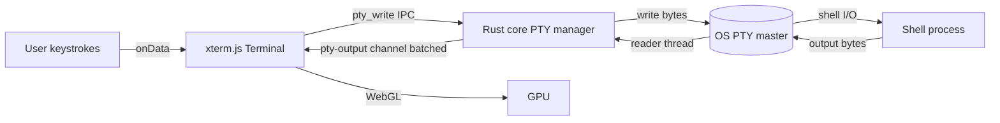
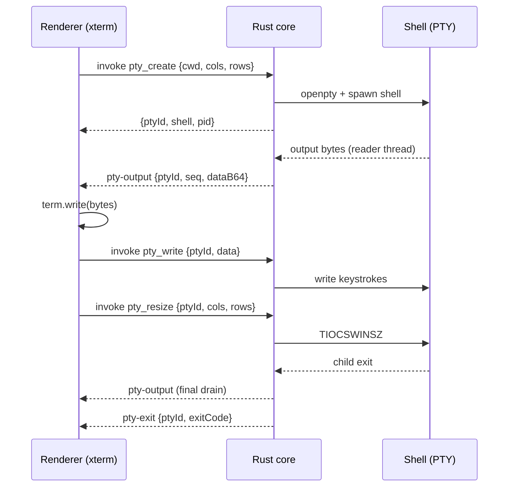

# Terminal Spec

This document specifies the integrated terminal for vsclaude: an [xterm.js](https://xtermjs.org/) surface rendered with the WebGL renderer in the React layer, wired to a real pseudo-terminal (PTY) owned by the Rust core. It defines the IPC protocol for the full PTY lifecycle (create, resize, write, data, exit), the multi-tab model, how terminal sessions relate to the `command_run` and `command_output` [AgentEvent](../packages/contracts/src/agent-event.ts) types, the performance and backpressure strategy for high-throughput output, and how the active shell is detected on Windows, macOS, and Linux. The terminal follows the same ownership split as the rest of the app: the Rust core owns every byte that touches the operating system, and the renderer is a deterministic projection of what the core streams to it. See [Architecture](./ARCHITECTURE.md) for the system-wide process model and [Providers Spec](./PROVIDERS_SPEC.md) for how agent processes (which also drive PTYs) are spawned.

## Table of contents

- [1. Goals and non-goals](#1-goals-and-non-goals)
- [2. Ownership split](#2-ownership-split)
- [3. The xterm.js surface](#3-the-xtermjs-surface)
- [4. PTY lifecycle in the Rust core](#4-pty-lifecycle-in-the-rust-core)
- [5. IPC protocol](#5-ipc-protocol)
- [6. Multi-tab terminals](#6-multi-tab-terminals)
- [7. Terminal sessions and AgentEvents](#7-terminal-sessions-and-agentevents)
- [8. Performance and backpressure](#8-performance-and-backpressure)
- [9. Shell detection](#9-shell-detection)
- [10. Resize, reflow, and scrollback](#10-resize-reflow-and-scrollback)
- [11. Failure handling](#11-failure-handling)
- [12. Security](#12-security)
- [13. Testing requirements](#13-testing-requirements)
- [14. Invariants](#14-invariants)

## 1. Goals and non-goals

**Goals.**

- A fast, correct, GPU-accelerated terminal that feels native and handles high-throughput output (build logs, test runners, `cat` of large files) without stalling the UI thread.
- One PTY per terminal tab, each a real OS pseudo-terminal driven by the Rust core, so interactive programs (vim, top, ssh, REPLs) work exactly as they would in a system terminal.
- A clean separation between two distinct PTY consumers: user-driven terminal tabs (this spec) and agent-driven command execution that produces `command_run` / `command_output` events (this spec plus [Providers Spec](./PROVIDERS_SPEC.md)).
- A typed, versioned IPC protocol that is the only path between the xterm surface and the OS PTY.

**Non-goals.**

- The terminal does not parse shell output for meaning. It renders bytes. Meaning extraction is the job of provider adapters, not the terminal.
- The terminal does not animate Pixie directly. Only `AgentEvent` drives motion (motion rule 1). When the agent runs a command, the *adapter* emits `command_run`; the terminal surface that shows the bytes is a separate, optional view.
- No remote terminals or SSH multiplexing in v1. The PTY is always local to the host machine.

## 2. Ownership split

| Concern | Owner | Notes |
| --- | --- | --- |
| PTY allocation, spawn, kill | Rust core | `portable-pty`, one master/slave pair per tab |
| Shell detection and resolution | Rust core | Per-OS, see section 9 |
| Reading PTY output bytes | Rust core | Dedicated blocking reader thread per PTY |
| Writing user keystrokes to PTY | Rust core | Via `pty_write` IPC command |
| Resize (cols/rows to `TIOCSWINSZ`) | Rust core | Via `pty_resize` IPC command |
| Byte transport to renderer | Rust core | `pty-output` Tauri event channel, batched and base64-framed |
| xterm.js instance and WebGL render | Renderer | One `Terminal` per tab, addons wired |
| Tab management, focus, layout | Renderer | Zustand `terminalStore` |
| Local echo, line editing | The shell (inside the PTY) | The terminal never echoes locally |

The guiding rule mirrors the rest of vsclaude: **given the same ordered stream of PTY output bytes, the renderer always reaches the same visual state.** The renderer holds no authority over the process; it is a screen and a keyboard.



## 3. The xterm.js surface

Each tab owns one `Terminal` instance configured for the WebGL renderer. The addon set is fixed and wired at construction.

```ts
// packages/terminal/src/createTerminal.ts
import { Terminal } from '@xterm/xterm';
import { WebglAddon } from '@xterm/addon-webgl';
import { FitAddon } from '@xterm/addon-fit';
import { WebLinksAddon } from '@xterm/addon-web-links';
import { Unicode11Addon } from '@xterm/addon-unicode11';
import { SerializeAddon } from '@xterm/addon-serialize';

export interface TerminalHandle {
  term: Terminal;
  fit: FitAddon;
  serialize: SerializeAddon;
  dispose: () => void;
}

export function createTerminal(theme: ITheme): TerminalHandle {
  const term = new Terminal({
    fontFamily: 'var(--font-mono)',
    fontSize: 13,
    lineHeight: 1.2,
    cursorBlink: true,
    scrollback: 10_000,
    allowProposedApi: true,    // required by unicode11 and serialize
    theme,
    macOptionIsMeta: true,
    convertEol: false,         // the PTY supplies CRLF; do not rewrite
  });

  const fit = new FitAddon();
  const serialize = new SerializeAddon();
  term.loadAddon(fit);
  term.loadAddon(new Unicode11Addon());
  term.unicode.activeVersion = '11';
  term.loadAddon(new WebLinksAddon());
  term.loadAddon(serialize);

  const webgl = new WebglAddon();
  // WebGL context loss can happen on GPU reset or tab backgrounding.
  webgl.onContextLoss(() => {
    webgl.dispose();           // fall back to the DOM renderer automatically
  });
  term.loadAddon(webgl);

  return {
    term,
    fit,
    serialize,
    dispose: () => { webgl.dispose(); term.dispose(); },
  };
}
```

Notes that matter for correctness:

- **WebGL context loss is expected, not exceptional.** Disposing the `WebglAddon` makes xterm fall back to its DOM renderer with no visible break. The terminal must keep working after loss.
- **`convertEol` is false.** The shell and PTY already emit the correct line endings. Rewriting them double-spaces output.
- **Unicode 11 width tables** are loaded so wide glyphs and emoji align with the column grid the PTY believes is active. A width mismatch between the renderer and the PTY corrupts cursor positioning in full-screen TUIs.
- **Local echo is off.** xterm never echoes keystrokes. Everything the user types is sent to the PTY via `pty_write`, and the shell decides what to echo back. This is the only way line editing, password masking, and raw-mode programs behave correctly.

## 4. PTY lifecycle in the Rust core

The Rust core uses `portable-pty` to allocate a real PTY pair per terminal. Each PTY is owned by a `PtySession` keyed by a `ptyId` (a UUID v4 string). The manager holds a map `ptyId -> PtySession` behind an `RwLock`.

```rust
// apps/desktop/src-tauri/src/pty/session.rs
use portable_pty::{native_pty_system, CommandBuilder, PtySize, PtyPair};

pub struct PtySession {
    pub id: String,
    pub kind: PtyKind,            // UserTab | AgentCommand
    pty_pair: PtyPair,           // master + slave
    writer: Box<dyn Write + Send>,
    child: Box<dyn Child + Send>,
    cols: u16,
    rows: u16,
}

pub enum PtyKind {
    UserTab,                     // a terminal tab the user typed in
    AgentCommand { agent_id: String, command_event_id: String },
}

pub fn spawn(opts: &SpawnOpts) -> Result<PtySession, PtyError> {
    let pty_system = native_pty_system();
    let pair = pty_system.openpty(PtySize {
        rows: opts.rows,
        cols: opts.cols,
        pixel_width: 0,
        pixel_height: 0,
    })?;

    let mut cmd = CommandBuilder::new(&opts.shell);
    for arg in &opts.args { cmd.arg(arg); }
    cmd.cwd(&opts.cwd);
    for (k, v) in &opts.env { cmd.env(k, v); }
    cmd.env("TERM", "xterm-256color");
    cmd.env("COLORTERM", "truecolor");

    let child = pair.slave.spawn_command(cmd)?;
    let writer = pair.master.take_writer()?;
    // The reader is taken once, here, and moved onto a dedicated thread.
    Ok(PtySession { /* ... */ })
}
```

Each session spawns exactly one **blocking reader thread**. That thread owns the master reader, loops on `read`, and forwards chunks to an async task that batches and emits them (section 8). Reading on a dedicated OS thread is deliberate: PTY reads block, and we never want a slow shell to stall the async runtime or the IPC bridge.

Lifecycle states:

| State | Entered when | Exited when |
| --- | --- | --- |
| `Spawning` | `pty_create` received | spawn succeeds or fails |
| `Live` | child spawned, reader running | child exits or kill requested |
| `Draining` | child exited | final buffered bytes flushed to UI |
| `Closed` | drain complete | session removed from map |

The `Draining` state exists so the last bytes a program writes before exit (a build summary, a stack trace) are never dropped. The core flushes the read buffer and emits the final `pty-output` batch *before* it emits `pty-exit`.

## 5. IPC protocol

All terminal traffic uses two directions: **commands** (renderer to core, request/response via Tauri `invoke`) and **events** (core to renderer, fire-and-forget via the Tauri event channel). Every payload is versioned with `v` so the protocol can evolve without breaking older renderers during auto-update.

### 5.1 Commands (renderer to core)

```ts
// packages/terminal/src/ipc.ts
export interface PtyCreateRequest {
  v: 1;
  cwd: string;                 // absolute; defaults to project root
  shell?: string;             // override; otherwise core auto-detects (section 9)
  args?: string[];
  env?: Record<string, string>;
  cols: number;
  rows: number;
  kind: 'user' | 'agent';
  agentId?: string;           // required when kind === 'agent'
}
export interface PtyCreateResponse { v: 1; ptyId: string; shell: string; pid: number }

export interface PtyWriteRequest  { v: 1; ptyId: string; data: string }     // utf-8 keystrokes
export interface PtyResizeRequest { v: 1; ptyId: string; cols: number; rows: number }
export interface PtyKillRequest   { v: 1; ptyId: string; signal?: 'TERM' | 'KILL' }
```

| Command | Direction | Returns | Notes |
| --- | --- | --- | --- |
| `pty_create` | invoke | `PtyCreateResponse` | Allocates PTY, spawns shell, starts reader thread |
| `pty_write` | invoke | `void` | Bytes go straight to the PTY master writer |
| `pty_resize` | invoke | `void` | Updates `PtySize`, sends window-change to the shell |
| `pty_kill` | invoke | `void` | `SIGTERM` then `SIGKILL` after a grace period; on Windows, `TerminateProcess` |
| `pty_list` | invoke | `PtyInfo[]` | Used on renderer reload to re-attach to live PTYs |

### 5.2 Events (core to renderer)

Output is **not** a command response. It arrives asynchronously on a single Tauri event channel, `pty-output`, multiplexed by `ptyId`. Bytes are base64-encoded so arbitrary binary (escape sequences, non-UTF-8 fragments) survives JSON transport intact.

```ts
export interface PtyOutputEvent {
  v: 1;
  ptyId: string;
  seq: number;                 // monotonic per ptyId; gap detection
  dataB64: string;            // base64 of the raw byte batch
}
export interface PtyExitEvent {
  v: 1;
  ptyId: string;
  exitCode: number | null;     // null if killed by signal
  signal?: string;
}
```

The renderer decodes `dataB64` to a `Uint8Array` and calls `term.write(bytes)`. xterm accepts `Uint8Array` directly, which avoids a lossy UTF-8 round-trip and lets xterm's own decoder handle multi-byte sequences split across batches.

```ts
// renderer ingest
listen<PtyOutputEvent>('pty-output', ({ payload }) => {
  const handle = terminals.get(payload.ptyId);
  if (!handle) return;                       // tab closed; drop
  const bytes = base64ToBytes(payload.dataB64);
  handle.term.write(bytes);                   // xterm handles split UTF-8
});
```

### 5.3 Sequence diagram



## 6. Multi-tab terminals

Tabs are a pure renderer concern layered on top of independent PTYs. The Rust core has no notion of tab order or focus; it only knows about `ptyId`s. Tab state lives in a Zustand store.

```ts
// packages/terminal/src/store.ts
interface TerminalTab {
  ptyId: string;
  title: string;               // derived: shell name, or active foreground cmd if known
  cwd: string;
  shell: string;
  status: 'live' | 'exited';
  exitCode: number | null;
  unread: boolean;             // output arrived while tab was not focused
}

interface TerminalStore {
  tabs: TerminalTab[];
  activeId: string | null;
  create: (cwd?: string) => Promise<void>;
  close: (ptyId: string) => Promise<void>;
  focus: (ptyId: string) => void;
  rename: (ptyId: string, title: string) => void;
}
```

Rules:

- **One `Terminal` instance per tab, kept alive while the tab exists.** Background tabs keep receiving and buffering output (xterm holds its own scrollback), so switching back is instant and lossless. We never tear down and re-create xterm on tab switch.
- **Only the focused tab is mounted in the DOM and visible.** Background terminals are detached from the DOM but their `Terminal` object and buffer persist. On focus, the element is re-attached and `fit()` is called.
- **`unread` flips true** when a `pty-output` arrives for a non-focused tab, surfacing a dot on the tab. It clears on focus.
- **Closing a tab** calls `pty_kill`, waits for `pty-exit`, then disposes the xterm handle and removes the tab. A tab whose process already exited stays openable as a read-only scrollback until the user closes it.
- **Renderer reload (HMR or crash recovery)** calls `pty_list` and re-attaches xterm instances to still-live PTYs. The core keeps PTYs alive across renderer reloads because it is a separate process. This is why the protocol carries `seq`: the renderer can detect whether it missed a batch (it cannot recover dropped bytes, but it can show a "reconnected, history may be incomplete" marker).

## 7. Terminal sessions and AgentEvents

This is the subtle part. There are **two kinds of PTY** in vsclaude, and they relate to `command_run` / `command_output` differently.

### 7.1 User terminal tabs

A user-typed terminal tab (`PtyKind::UserTab`) is **not** an agent. It produces no `AgentEvent`. It is a tool for the human. Nothing about a user tab drives Pixie or the timeline. This keeps motion rule 1 honest: Pixie only ever reflects the agent, never the human poking around in a shell.

### 7.2 Agent commands

When the agent decides to run a command, the flow is different and event-bound:

1. The provider adapter sees a tool call (for Claude Code, a `Bash` `tool_use` block). It emits a `command_run` `AgentEvent` carrying the command string in `tool.input` and a plain-language `caption` (for example, "Running the test suite").
2. The Rust core executes that command in a PTY of kind `PtyKind::AgentCommand { agent_id, command_event_id }`. The `command_event_id` is the `id` of the `command_run` event, which is the join key.
3. As output streams from that PTY, the adapter emits `command_output` events. Each `command_output` carries the same `command_event_id` join key in `payload`, plus a chunk of decoded text in `payload.chunk` and the same `agentId`.
4. On exit, the adapter emits a final `command_output` with `payload.exitCode` set.

This dual path means the *same bytes* can serve two consumers: the optional live terminal view (raw, GPU-rendered, via `pty-output`) and the `AgentEvent` stream (normalized, captioned, drives Pixie's `running` state and the timeline). The terminal view shows truth at the byte level; the event stream shows truth at the meaning level. Motion rule 2 (meaning is always recoverable) is satisfied because clicking the `command_run` row in the timeline scrolls the terminal view to exactly that command's output.

```ts
// the join: terminal bytes <-> command_output events
interface CommandRunPayload   { command: string; cwd: string }      // on command_run
interface CommandOutputPayload {
  commandEventId: string;      // === the command_run AgentEvent.id
  chunk?: string;             // decoded text, may be partial
  exitCode?: number;          // present only on the final event
  stream: 'stdout' | 'merged';
}
```

| Aspect | User tab | Agent command |
| --- | --- | --- |
| `PtyKind` | `UserTab` | `AgentCommand` |
| Emits `AgentEvent` | No | Yes (`command_run`, `command_output`) |
| Drives Pixie | No | Yes (`running`, `building`, `debugging`) |
| Shown in terminal view | Always | Optionally (toggle), always recoverable |
| Join key | none | `command_event_id` |

### 7.3 Mapping output to Pixie state

Only the agent path maps to motion, and only through `AgentEvent`:

- `command_run` -> Pixie `running` (mood `focused`).
- A long-running command whose `caption` matches a build heuristic (the adapter, not the terminal, decides) -> `building`.
- An `error` event interleaved during a command -> `debugging`.
- Final `command_output` with non-zero `exitCode` followed by no resolution -> `confused`; with zero exit -> contributes to `success` when the turn completes.

The terminal module never makes these decisions. It surfaces bytes. The adapter owns the meaning. See [Mascot System](./MASCOT_SYSTEM.md) for the full state machine.

## 8. Performance and backpressure

High-throughput output (think `yarn build`, `pytest -v`, or accidentally `cat`-ing a binary) is the stress case. A naive "one IPC event per read" design floods the bridge and locks the UI thread. The design has three layers of defense.

### 8.1 Batching in the core

The reader thread does not emit per chunk. It pushes into a bounded channel; a coalescing task drains that channel and emits at most one `pty-output` per PTY per frame budget.

```rust
// coalescing emitter (per PTY)
const FLUSH_INTERVAL: Duration = Duration::from_millis(8);   // ~120 Hz ceiling
const MAX_BATCH_BYTES: usize = 256 * 1024;                   // hard cap per emit

// Flush when EITHER 8 ms elapsed OR the buffer reaches MAX_BATCH_BYTES,
// whichever comes first. This bounds both latency and per-message size.
```

Coalescing turns a thousand tiny reads into a handful of right-sized batches. The 8 ms interval keeps interactive latency below one frame at 120 Hz while collapsing bursts.

### 8.2 Backpressure via a bounded buffer

The channel between reader thread and emitter is **bounded** (for example, 4 MB). When the renderer cannot keep up and the buffer fills, the core does not grow memory without limit. It applies backpressure in this order:

1. **Coalesce harder.** Larger batches, same interval. Fewer, bigger messages.
2. **Drop with a marker.** If the buffer is still saturated (the renderer is genuinely behind, for example a backgrounded tab streaming megabytes), the core drops the oldest buffered bytes and inserts a synthetic marker batch so the UI can render a visible "[output truncated, N KB dropped]" line. We never silently lose data without telling the user. This honors motion rule 2: truth is preserved, and the truncation itself is truthful.
3. **Never block the PTY reader.** The reader thread must keep draining the OS PTY buffer, because a full PTY buffer applies kernel-level backpressure to the shell and can deadlock interactive programs. Dropping in our own buffer is always preferable to stalling the read.

### 8.3 Renderer write throttling

xterm's `write()` is async and internally buffered, but writing faster than it can render still grows its queue. The renderer uses xterm's `write(data, callback)` flow-control: it does not request the next batch decode until xterm acknowledges the previous write. For the highest-volume tabs the renderer additionally drops to a lower scrollback and disables cursor blink to reduce per-frame cost.

```ts
// flow-controlled write: pause batch processing until xterm catches up
let pending: Uint8Array[] = [];
let draining = false;
function enqueue(bytes: Uint8Array) {
  pending.push(bytes);
  if (!draining) drain();
}
function drain() {
  const next = pending.shift();
  if (!next) { draining = false; return; }
  draining = true;
  handle.term.write(next, () => drain());   // callback fires when rendered
}
```

### 8.4 Budgets

| Metric | Target | Hard limit |
| --- | --- | --- |
| Output latency (keystroke to glyph) | < 16 ms | < 50 ms |
| Per-`pty-output` batch | <= 64 KB typical | 256 KB |
| Emit rate per PTY | <= 120 Hz | 120 Hz |
| Core buffer per PTY | 4 MB | drop oldest beyond this |
| xterm scrollback | 10,000 lines | 50,000 lines (user-set) |

PixiJS is **not** used for the terminal. The swarm canvas may move to PixiJS if the DOM stalls (see [Architecture](./ARCHITECTURE.md)), but the terminal already has a GPU renderer in xterm's WebGL addon and needs no second canvas layer.

## 9. Shell detection

The core resolves a shell at `pty_create` time unless the request overrides it. Detection is OS-specific and ordered by preference. The result is reported back in `PtyCreateResponse.shell` so the tab can label itself.

### 9.1 Resolution order

| OS | Order of preference | Default args |
| --- | --- | --- |
| Windows | `$env:SHELL` override, then PowerShell 7 (`pwsh.exe` on `PATH`), then Windows PowerShell (`powershell.exe`), then `cmd.exe` | PowerShell: `-NoLogo`; cmd: none |
| macOS | user's login shell from `getpwuid` / `dscl`, then `$SHELL`, then `/bin/zsh`, then `/bin/bash`, then `/bin/sh` | interactive login: `-l` |
| Linux | user's login shell from `/etc/passwd` (`getpwuid`), then `$SHELL`, then `/bin/bash`, then `/bin/sh` | interactive login: `-l` |

```rust
// apps/desktop/src-tauri/src/pty/shell.rs
pub fn detect_shell(override_path: Option<&str>) -> ShellSpec {
    if let Some(p) = override_path {
        return ShellSpec::from_path(p);
    }
    #[cfg(windows)]
    {
        if let Some(p) = which("pwsh") { return ShellSpec::powershell(p); }
        if let Some(p) = which("powershell") { return ShellSpec::powershell(p); }
        ShellSpec::cmd()
    }
    #[cfg(unix)]
    {
        if let Some(login) = login_shell_from_passwd() { return ShellSpec::login(login); }
        if let Ok(sh) = std::env::var("SHELL") { return ShellSpec::login(sh); }
        ShellSpec::login("/bin/sh")
    }
}
```

### 9.2 Environment and `TERM`

- `TERM` is always set to `xterm-256color`, and `COLORTERM=truecolor`, so programs emit 24-bit color that xterm's WebGL renderer displays correctly.
- The PTY inherits the app's environment plus any per-request `env`, with secrets stripped. API keys held in the OS keychain (see [Architecture](./ARCHITECTURE.md)) are **never** injected into a user terminal tab. They are passed only to agent provider processes, and only through the adapter, never through the generic terminal path.
- On Windows, ConPTY is used through `portable-pty`'s native backend, which gives correct handling of full-screen console programs and ANSI sequences without a winpty shim.

### 9.3 Working directory

`cwd` defaults to the open project root. If the request omits `cwd`, the core uses the project root from the workspace state, never the app's own process directory. An invalid `cwd` falls back to the user's home directory and the core emits a non-fatal `error` event noting the fallback.

## 10. Resize, reflow, and scrollback

Resize is a three-step dance that must stay ordered to avoid corrupting full-screen TUIs:

1. The renderer's `FitAddon` computes new `cols`/`rows` from the container size (debounced to one call per animation frame).
2. The renderer calls `pty_resize { ptyId, cols, rows }`.
3. The core applies the new `PtySize` to the PTY, which sends a window-change signal (`SIGWINCH` on Unix, the ConPTY resize on Windows) to the shell. The shell redraws.

xterm reflows its own buffer locally on resize for already-printed plain text. Full-screen programs redraw themselves in response to the window-change signal. The renderer must call `fit()` and `pty_resize` together; resizing xterm without telling the PTY (or the reverse) desynchronizes the column grid and scrambles cursor math.

Scrollback lives in xterm (10,000 lines default). The core does not retain a scrollback buffer for user tabs beyond what is in flight; it is a pass-through. For agent commands, the durable record is the `command_output` `AgentEvent` stream, which is persisted with the session, so agent output survives even if the terminal view was never opened.

## 11. Failure handling

| Failure | Detection | Response |
| --- | --- | --- |
| Shell not found | `spawn` returns `ENOENT` | `pty_create` rejects with a typed error; renderer shows "Shell not found" and offers the detection list |
| Shell exits immediately | child exit within 200 ms | Mark tab `exited`, keep scrollback, show exit code |
| WebGL context lost | `WebglAddon.onContextLoss` | Dispose addon, fall back to DOM renderer, no data loss |
| Renderer reload | renderer remount | `pty_list` re-attach; show reconnect marker if `seq` gap |
| Core buffer saturated | bounded channel full | Drop oldest, insert truncation marker (section 8.2) |
| PTY write after exit | writer returns error | Swallow, surface "process has exited" once |
| Kill grace timeout | no exit after `SIGTERM` | Escalate to `SIGKILL` / `TerminateProcess` |

Every failure that loses or alters bytes produces a **visible** marker in the terminal. We never present an output stream as complete when it is not. This is the terminal's expression of motion rule 2.

## 12. Security

- **Secret isolation.** Keychain-held API keys never enter a user terminal's environment. The terminal path and the agent provider path are distinct; only the provider path receives credentials, and only via the adapter.
- **No command injection surface from the UI.** The terminal sends raw keystroke bytes via `pty_write`; it does not build or interpolate shell strings. Agent commands originate from `command_run` events, whose command string comes from the provider, is shown to the user, and is gated by a `permission_request` event when policy requires (see [Providers Spec](./PROVIDERS_SPEC.md)).
- **Path scoping.** `cwd` is validated to be within or under the workspace root (or home on fallback). The core rejects a `cwd` that escapes to a sensitive system path when the request comes from the agent path.
- **No remote transport.** PTYs are local only in v1. There is no network listener in the terminal module.

## 13. Testing requirements

| Layer | Tool | What it covers |
| --- | --- | --- |
| Rust PTY manager | `cargo test` | spawn, resize, kill, drain ordering, backpressure drop marker |
| Shell detection | `cargo test` | per-OS resolution order, override, fallback (mocked `which`/passwd) |
| IPC protocol | `cargo test` + Vitest | round-trip encode/decode of every command and event, `v` versioning |
| xterm wiring | Vitest (jsdom) | addon load order, write flow-control, context-loss fallback |
| Tab store | Vitest | create/close/focus/unread transitions, re-attach on reload |
| Throughput | Playwright | stream 50 MB of output; assert no UI freeze, truncation marker appears |
| Agent join | Vitest | `command_run` id flows to `command_output.commandEventId`; click-to-scroll |
| e2e interactive | Playwright | run `vim`, resize mid-edit, assert no cursor corruption |

Golden fixtures: a recorded byte stream from a known build (`vite build`) and from a full-screen program (`htop` snapshot frames) live under `packages/terminal/fixtures/`. The renderer's rendered grid (via `SerializeAddon`) is asserted against a golden snapshot to catch reflow and unicode-width regressions.

## 14. Invariants

1. **One PTY per tab, owned by the core.** The renderer never touches the OS; it sends keystrokes and renders bytes.
2. **Bytes are sacred and ordered.** `seq` is monotonic per `ptyId`. Any gap or drop is surfaced with a visible marker. We never silently lose output.
3. **User tabs emit no `AgentEvent`.** Only the agent command path produces `command_run` / `command_output` and drives Pixie. The human in a shell never animates the mascot.
4. **The join key is the `command_run` event id.** Terminal bytes and `command_output` events are tied by `commandEventId`, making meaning recoverable with one click (motion rule 2).
5. **The reader thread never blocks.** Backpressure is absorbed in our own bounded buffer, never by stalling the OS PTY read, which would deadlock interactive programs.
6. **Secrets never reach a user terminal.** Keychain credentials flow only through the provider adapter path.
7. **The protocol is versioned.** Every IPC payload carries `v`, so auto-update can evolve the contract without breaking a running renderer mid-upgrade.

See also: [Architecture](./ARCHITECTURE.md), [Providers Spec](./PROVIDERS_SPEC.md), [Agent Event Schema](./AGENT_EVENT_SCHEMA.md), [Mascot System](./MASCOT_SYSTEM.md), [Tech Stack](./TECH_STACK.md).
