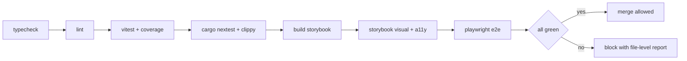

# Testing Strategy

This document defines how vsclaude is tested across every layer, from the smallest pure function to a full user session where a developer opens a project, runs an agent, watches Pixie act, reviews a diff, and commits. The unifying principle mirrors the product itself: everything visual consumes a single normalized `AgentEvent` stream, so the heart of our test suite is proving that real events map to the right motion and that nothing decorative ever sneaks in. We test by construction the same property the product promises by construction: truthfulness. Every layer has a hard quality gate, and CI blocks merges that regress coverage, golden fixtures, visual snapshots, or accessibility.

## Table of contents

- [The testing pyramid](#the-testing-pyramid)
- [Tooling matrix](#tooling-matrix)
- [Vitest unit tests](#vitest-unit-tests)
- [The event-to-motion mapper](#the-event-to-motion-mapper)
- [Provider adapters and golden fixtures](#provider-adapters-and-golden-fixtures)
- [How to write a golden-fixture test for an adapter](#how-to-write-a-golden-fixture-test-for-an-adapter)
- [Playwright end-to-end tests](#playwright-end-to-end-tests)
- [cargo test for the Rust core](#cargo-test-for-the-rust-core)
- [Storybook visual coverage](#storybook-visual-coverage)
- [Coverage targets and CI gates](#coverage-targets-and-ci-gates)
- [Test data, fixtures, and helpers](#test-data-fixtures-and-helpers)
- [Flake policy and determinism](#flake-policy-and-determinism)

Related specs: [Architecture](./ARCHITECTURE.md), [Agent Event Contract](./AGENT_EVENT_CONTRACT.md), [Provider Adapters](./PROVIDER_ADAPTERS.md), [Pixie Motion](./PIXIE_MOTION.md).

## The testing pyramid

We follow a classic pyramid weighted toward fast, deterministic unit tests, with a thin layer of expensive end-to-end coverage at the top. The pyramid is intentionally lopsided: the mapper and adapters carry the most product risk and the least cost to test, so they get the densest coverage.

```
                 ____________
                /  Playwright \        ~20 specs, core flows only
               /   e2e (slow)   \
              /__________________\
             /   Storybook visual  \   every component + every Pixie state
            /  + interaction tests   \
           /__________________________\
          /      cargo test (Rust)      \  process, PTY, fs watch, keychain
         /  integration + unit on core   \
        /_________________________________\
       /          Vitest unit tests         \  mapper, adapters, stores,
      /   (fast, deterministic, the bulk)     \  hooks, pure utilities
     /__________________________________________\
```

| Layer | Runner | What it proves | Target share of suite |
| --- | --- | --- | --- |
| Unit | Vitest | Pure logic: mapper, adapters, reducers, selectors, hooks | ~70 percent |
| Component and visual | Storybook + Playwright CT + Chromatic-style snapshots | Each component and every Pixie state renders and behaves | ~15 percent |
| Rust core | cargo test | Process and PTY lifecycle, fs watching, keychain, IPC framing | ~10 percent |
| End to end | Playwright | Real user flows across the assembled app | ~5 percent |

## Tooling matrix

| Concern | Tool | Config location |
| --- | --- | --- |
| Unit and integration (TS) | Vitest | `vitest.config.ts` per package |
| Coverage | Vitest + v8 provider | `vitest.config.ts` |
| Component interaction | Storybook play functions + `@storybook/test` | `.storybook/` |
| Visual regression | Storybook test runner + snapshot diff | `.storybook/test-runner.ts` |
| End to end | Playwright (Tauri-driven) | `apps/desktop/playwright.config.ts` |
| Rust core | `cargo test`, `cargo nextest` | `apps/desktop/src-tauri/Cargo.toml` |
| Mocking time and randomness | Vitest fake timers, seeded RNG helper | `packages/test-utils` |
| Versioning gate | Changesets | `.changeset/` |

All TypeScript test code runs under `tsc` strict mode. A test that uses `any`, `@ts-ignore`, or a non-null assertion to silence a real type error fails review.

## Vitest unit tests

Unit tests are the floor and the foundation. They are pure, fast, hermetic (no network, no real filesystem, no real PTY), and deterministic. A unit test that reads the wall clock or `Math.random` without seeding is a bug.

Conventions:

- Co-locate tests as `*.test.ts` next to the unit under test, except shared fixtures which live in `packages/test-utils` and `packages/<pkg>/__fixtures__`.
- One behavior per `it`. The description reads as a sentence: `it('emits a typing state when a file_edit arrives')`.
- Prefer table-driven tests with `it.each` for mappers and adapters where the input space is enumerable.
- Never assert on internal implementation detail. Assert on observable output: the returned value, the emitted event, the produced motion command.

```ts
// packages/motion/src/intensity.test.ts
import { describe, it, expect } from 'vitest';
import { computeIntensity } from './intensity';

describe('computeIntensity', () => {
  it.each([
    { eventsPerSec: 0, expected: 0 },
    { eventsPerSec: 2, expected: 0.4 },
    { eventsPerSec: 10, expected: 1 },
  ])('maps $eventsPerSec ev/s to intensity $expected', ({ eventsPerSec, expected }) => {
    expect(computeIntensity(eventsPerSec)).toBeCloseTo(expected, 2);
  });

  it('clamps to the [0, 1] range above the saturation point', () => {
    expect(computeIntensity(10_000)).toBe(1);
  });
});
```

### What must have unit tests

| Module | Why it is high risk |
| --- | --- |
| `packages/motion` event-to-motion mapper | The single most product-critical pure function in the app |
| `packages/adapters/*` | Each provider's stream parsing is brittle and external |
| `packages/state` Zustand stores and selectors | Session reducers, swarm tree, todo state |
| Motion atoms (Jotai) | Fine-grained derived state for Pixie inputs |
| Diff model and accept/reject logic | Correctness of what the user commits |
| Caption generation | The plain-language layer that makes the product accessible |

## The event-to-motion mapper

The mapper is the contract between the truthful event stream and what Pixie does on screen. It is a pure function: given an `AgentEvent` (and a small amount of rolling context such as recent event rate), it returns a `MotionCommand` describing the Rive inputs to set. Because it is pure, it is the easiest thing in the codebase to test exhaustively, and because it is load-bearing for Motion Rule 1 (every animation is bound to a real event), it gets the strictest coverage: 100 percent of branches.

```ts
// packages/motion/src/mapper.ts  (shape, see PIXIE_MOTION.md for full spec)
export interface MotionCommand {
  state: PixieState;            // 'thinking' | 'reading' | 'typing' | ...
  mood: 'calm' | 'focused' | 'excited' | 'struggling';
  intensity: number;           // 0..1
  targetX?: number;
  targetY?: number;
  caption: string;             // never empty: Motion Rule 3
}

export function mapEventToMotion(
  event: AgentEvent,
  ctx: MotionContext,
): MotionCommand;
```

The mapper test enforces three invariants drawn directly from the Three Sacred Motion Rules:

1. Every `AgentEventType` produces a defined `PixieState`. There is no event type that falls through to a default shrug. We assert this with an exhaustive table over the union, so adding a new event type without mapping it fails the suite at compile and at runtime.
2. Every returned `MotionCommand` carries a non-empty `caption`. Meaning is always recoverable in plain language, so an empty caption is a hard failure.
3. The mapper is pure and stable: the same event plus the same context always yields the same command. We assert referential stability across repeated calls.

```ts
// packages/motion/src/mapper.test.ts
import { describe, it, expect } from 'vitest';
import { mapEventToMotion } from './mapper';
import { emptyContext, makeEvent } from '@vsclaude/test-utils';
import type { AgentEventType } from '@vsclaude/contracts';

const ALL_TYPES: AgentEventType[] = [
  'session_start', 'session_end', 'thinking', 'message',
  'tool_call', 'tool_result', 'file_read', 'file_edit',
  'file_create', 'file_delete', 'command_run', 'command_output',
  'search', 'web_fetch', 'git_action', 'subagent_spawned',
  'subagent_finished', 'todo_update', 'permission_request',
  'token_usage', 'error', 'complete',
];

describe('mapEventToMotion', () => {
  it.each(ALL_TYPES)('produces a defined state and caption for %s', (type) => {
    const cmd = mapEventToMotion(makeEvent({ type }), emptyContext());
    expect(cmd.state).toBeDefined();
    expect(cmd.caption.trim().length).toBeGreaterThan(0);
    expect(cmd.intensity).toBeGreaterThanOrEqual(0);
    expect(cmd.intensity).toBeLessThanOrEqual(1);
  });

  it('maps file_edit to typing', () => {
    const cmd = mapEventToMotion(makeEvent({ type: 'file_edit' }), emptyContext());
    expect(cmd.state).toBe('typing');
  });

  it('maps an error during a command_run window to debugging', () => {
    const ctx = { ...emptyContext(), lastRun: makeEvent({ type: 'command_run' }) };
    const cmd = mapEventToMotion(makeEvent({ type: 'error' }), ctx);
    expect(cmd.state).toBe('debugging');
  });

  it('is pure: identical inputs yield identical commands', () => {
    const ev = makeEvent({ type: 'thinking' });
    const ctx = emptyContext();
    expect(mapEventToMotion(ev, ctx)).toEqual(mapEventToMotion(ev, ctx));
  });
});
```

Mapping table the test suite encodes (kept in sync with [PIXIE_MOTION.md](./PIXIE_MOTION.md)):

| Event type | Pixie state | Notes |
| --- | --- | --- |
| `session_start` | greeting | Entry blend plays once |
| `thinking` | thinking | Mood focused |
| `todo_update` | planning | |
| `file_read` | reading | |
| `file_edit`, `file_create` | typing | |
| `search` | searching | |
| `web_fetch` | web | |
| `command_run` | running | Long run promotes to building |
| `error` (during run) | debugging | |
| `git_action` | git | |
| `subagent_spawned` | spawning | Drives swarm view |
| `permission_request` | waiting | |
| `complete` | success | |
| unresolved `error` | confused | Terminal mood struggling |
| no activity / long idle | idle / sleeping | Driven by context timers, not a raw event |

## Provider adapters and golden fixtures

Each provider (Claude Code, Codex, Gemini, Ollama) has a thin adapter that consumes that provider's raw stream and emits normalized `AgentEvent` objects. Adapters are the second highest risk surface because the input is external, format-drifting, and not under our control. We pin behavior with golden fixtures: a recorded raw stream input paired with the exact `AgentEvent[]` we expect out.

A golden fixture is the contract. When a provider changes its wire format, the fixture diff shows exactly what moved, and we update the adapter and the expected output together in one reviewable change.

```
packages/adapters/claude-code/__fixtures__/
  basic-edit-session/
    input.jsonl          # raw provider stream, one block per line
    expected.json        # normalized AgentEvent[] (volatile fields stripped)
  subagent-spawn/
    input.jsonl
    expected.json
  permission-prompt/
    input.jsonl
    expected.json
  error-recovery/
    input.jsonl
    expected.json
```

The Claude Code adapter runs the agent in streaming mode (`claude -p --output-format stream-json --verbose`, or the Claude Agent SDK) and maps each block. We capture real `stream-json` output once, scrub it of any secret or absolute path, and freeze it as `input.jsonl`. The `Task` tool spawning a sub-agent must normalize to a `subagent_spawned` event, and we keep a dedicated `subagent-spawn` fixture proving exactly that, because it is what makes the swarm view come alive.

### Normalization of volatile fields

Some `AgentEvent` fields are non-deterministic: `id`, `ts`, and sometimes `sessionId`. Comparing them directly would make every test flaky. Before comparison we run a normalizer that replaces volatile fields with stable placeholders, so the golden file stays readable and the assertion stays deterministic.

```ts
// packages/test-utils/src/normalize.ts
import type { AgentEvent } from '@vsclaude/contracts';

export function normalizeForGolden(events: AgentEvent[]): AgentEvent[] {
  return events.map((e, i) => ({
    ...e,
    id: `evt_${i}`,
    ts: 0,
    sessionId: 'session_fixture',
    agentId: e.agentId.startsWith('sub_') ? e.agentId : 'agent_root',
    raw: undefined, // raw is provider-specific and huge; assert separately if needed
  }));
}
```

## How to write a golden-fixture test for an adapter

This is the canonical recipe. Every adapter test follows it, so a reviewer can read any one and understand all of them.

**Step 1: Capture a real raw stream once.** Run the provider against a tiny scripted task, capture stdout to `input.jsonl`, and scrub it. Never hand-author raw provider output from memory; capture the truth, because the point of the fixture is fidelity to the real wire format.

```bash
# capture helper, run by a human once when adding a fixture, not in CI
claude -p "edit README to add a title" \
  --output-format stream-json --verbose \
  > packages/adapters/claude-code/__fixtures__/basic-edit-session/input.jsonl
# then scrub: replace home paths with /work, strip any token, redact env
```

**Step 2: Generate the expected output, then read it line by line.** On first run, the test writes `expected.json` if it is missing, but you must read and approve it before committing. A golden file you did not read is not a contract, it is a rubber stamp.

**Step 3: Write the test against the loader.** The test feeds the raw lines through the adapter, normalizes, and compares to the golden file.

```ts
// packages/adapters/claude-code/src/adapter.golden.test.ts
import { describe, it, expect } from 'vitest';
import { readFileSync, readdirSync } from 'node:fs';
import { join } from 'node:path';
import { createClaudeCodeAdapter } from './adapter';
import { normalizeForGolden } from '@vsclaude/test-utils';
import type { AgentEvent } from '@vsclaude/contracts';

const FIXTURE_ROOT = join(__dirname, '../__fixtures__');

async function runAdapter(rawJsonl: string): Promise<AgentEvent[]> {
  const adapter = createClaudeCodeAdapter();
  const out: AgentEvent[] = [];
  for (const line of rawJsonl.split('\n').filter(Boolean)) {
    for (const evt of adapter.ingest(JSON.parse(line))) out.push(evt);
  }
  out.push(...adapter.flush());
  return out;
}

describe('claude-code adapter golden fixtures', () => {
  const cases = readdirSync(FIXTURE_ROOT, { withFileTypes: true })
    .filter((d) => d.isDirectory())
    .map((d) => d.name);

  it.each(cases)('matches golden output for %s', async (name) => {
    const dir = join(FIXTURE_ROOT, name);
    const input = readFileSync(join(dir, 'input.jsonl'), 'utf8');
    const expected = JSON.parse(readFileSync(join(dir, 'expected.json'), 'utf8'));

    const actual = normalizeForGolden(await runAdapter(input));

    expect(actual).toEqual(expected);
  });
});
```

**Step 4: Add cross-adapter invariants.** Beyond the exact match, every adapter must satisfy a shared contract test, so behavior stays uniform across providers. This is the test that protects the unifying idea: everything downstream consumes only `AgentEvent`, so every adapter must produce valid, ordered, schema-correct events.

```ts
// packages/test-utils/src/adapter-contract.ts
import { expect } from 'vitest';
import { AgentEventSchema } from '@vsclaude/contracts';
import type { AgentEvent } from '@vsclaude/contracts';

export function assertAdapterContract(events: AgentEvent[]) {
  for (const e of events) {
    expect(() => AgentEventSchema.parse(e)).not.toThrow();   // schema valid
    expect(e.schemaVersion).toBe(1);                          // versioned
    expect(typeof e.caption === 'string' || e.caption === undefined).toBe(true);
  }
  // monotonic timestamps within a single agent stream
  const byAgent = new Map<string, number>();
  for (const e of events) {
    const last = byAgent.get(e.agentId) ?? -Infinity;
    expect(e.ts).toBeGreaterThanOrEqual(last);
    byAgent.set(e.agentId, e.ts);
  }
  // a session that starts must end (or still be open at flush, not orphaned)
  const starts = events.filter((e) => e.type === 'session_start').length;
  expect(starts).toBeLessThanOrEqual(1);
}
```

**Step 5: Test the failure modes too.** Provider streams break. Add fixtures for a truncated stream, a malformed JSON line, and an unknown block type. The adapter must degrade gracefully: skip the bad line, emit an `error` event with a caption, and keep parsing. Never throw out of `ingest`, because one bad line must not kill a live session.

| Fixture | Asserts |
| --- | --- |
| `basic-edit-session` | Happy path: read, edit, complete |
| `subagent-spawn` | `Task` tool becomes `subagent_spawned` with `parentAgentId` set |
| `permission-prompt` | `permission_request` emitted, stream pauses correctly |
| `error-recovery` | `error` then `complete`, Pixie path debugging then success |
| `malformed-line` | Bad JSON skipped, one `error` event, parsing continues |
| `truncated-stream` | `flush()` closes the session cleanly, no orphaned agents |

## Playwright end-to-end tests

End-to-end tests drive the assembled Tauri application and prove the core promise that a developer can do real work. They are the slowest and most expensive layer, so we keep the set small, high value, and stable. We do not duplicate mapper or adapter coverage here; e2e proves wiring, not logic.

We run Playwright against the built desktop app. In CI we drive the Tauri WebView through the Tauri driver (or the WebView2 driver on Windows), and the agent is stubbed with a fixture provider that replays a recorded `AgentEvent` stream, so e2e tests are deterministic and do not call a real model or burn a real key.

### Core flows (the only flows that gate merges)

| Flow | Steps proven |
| --- | --- |
| Open project | Pick a folder, file tree loads, Monaco opens a file |
| Run agent and watch Pixie | Start a session, Pixie transitions greeting then thinking then typing, captions appear |
| Drill into detail | Click Pixie or a timeline item, the exact tool name, input, and raw output are shown (Motion Rule 2) |
| Review and accept a diff | Agent proposes a `file_edit`, diff renders in Monaco, user accepts, file content updates |
| Commit | Stage the accepted change, enter a message, commit succeeds, git state updates |

```ts
// apps/desktop/e2e/run-agent.spec.ts
import { test, expect } from './fixtures'; // wires the replay provider

test('user runs an agent and Pixie acts out the work', async ({ app }) => {
  await app.openProject('fixtures/sample-repo');
  await app.startAgentSession({ provider: 'replay', stream: 'edit-readme' });

  // Motion Rule 1: Pixie state is bound to real events
  await expect(app.pixie).toHaveState('thinking');
  await expect(app.pixie).toHaveState('typing');

  // Motion Rule 3: a non-technical caption is always present
  await expect(app.caption).toContainText(/editing README/i);

  // Motion Rule 2: one click drills into the exact detail
  await app.pixie.click();
  await expect(app.inspector.toolName).toHaveText('Edit');
  await expect(app.inspector.rawOutput).toBeVisible();
});

test('user reviews and accepts a diff, then commits', async ({ app }) => {
  await app.openProject('fixtures/sample-repo');
  await app.startAgentSession({ provider: 'replay', stream: 'edit-readme' });

  await app.diff.waitForProposal();
  await expect(app.diff.added).toContainText('# Sample');
  await app.diff.accept();
  await expect(app.editor.fileContent('README.md')).toContain('# Sample');

  await app.git.stageAll();
  await app.git.commit('docs: add title');
  await expect(app.git.lastCommitMessage).toHaveText('docs: add title');
});
```

We also keep a small accessibility e2e check: tab through the primary flow with the keyboard only and assert focus order and visible focus rings, because accessibility is a product pillar, not an afterthought.

## cargo test for the Rust core

The Rust core owns process and PTY lifecycle, filesystem watching, OS keychain secret storage, the IPC bridge, and auto-update. These are exactly the parts that touch the operating system and that a TypeScript test cannot reach, so they get real Rust tests via `cargo test` (run with `cargo nextest` in CI for speed and clean per-test isolation).

| Area | What we test | Strategy |
| --- | --- | --- |
| Process lifecycle | Spawn, stream stdout, terminate, reap on drop | Spawn a tiny echo/sleep helper binary, assert lifecycle |
| PTY | Allocate a PTY, write input, read framed output, resize | Use the platform PTY against a deterministic shell script |
| Filesystem watch | Create, modify, delete fire the right debounced events | Temp dir, mutate files, assert event sequence |
| Keychain | Store, read, delete a secret round-trips | Mock keychain trait in CI, real keychain in a gated local job |
| IPC framing | Serialize and deserialize the event bridge messages | Property tests with `proptest` for round-trip stability |
| Auto-update | Version compare and manifest parsing | Pure unit tests, no network |

```rust
// apps/desktop/src-tauri/src/pty/tests.rs
#[cfg(test)]
mod tests {
    use super::*;

    #[test]
    fn pty_echoes_written_input() {
        let mut pty = Pty::spawn(test_shell()).expect("spawn pty");
        pty.write(b"echo hello\n").unwrap();
        let out = pty.read_until("hello", Duration::from_secs(2)).unwrap();
        assert!(out.contains("hello"));
        pty.kill().unwrap();
    }

    #[test]
    fn child_is_reaped_on_drop() {
        let pid = {
            let proc = ManagedProcess::spawn(long_running()).unwrap();
            proc.pid()
        }; // dropped here
        assert!(!process_is_alive(pid), "child must be reaped on drop");
    }
}
```

Secrets must never appear in any test, fixture, log, or snapshot. The keychain test asserts that a stored secret is unreadable from process memory dumps and never logged. CI greps the test output and all fixtures for token-shaped strings and fails if any match.

## Storybook visual coverage

Storybook is our component catalog and our visual regression net. The rule is simple and absolute: every component has at least one story, and every Pixie state has its own story. If you add a Pixie state to the Rive machine, you add a story, or the build fails.

| Coverage requirement | Enforced by |
| --- | --- |
| Every component has a story | Lint rule that scans `packages/ui` for `.tsx` without a sibling `.stories.tsx` |
| Every Pixie state has a story | A generated `Pixie.states.stories.tsx` iterating the state union; a missing state is a type error |
| Every state has idle, entry, exit variants | Story args drive the Rive inputs through all three blends |
| Moods and intensity are exercised | A controls grid story crosses mood with intensity 0, 0.5, 1 |

```tsx
// packages/motion/src/Pixie.states.stories.tsx
import type { Meta, StoryObj } from '@storybook/react';
import { Pixie } from './Pixie';
import { ALL_PIXIE_STATES } from './states'; // exhaustive over the union

const meta: Meta<typeof Pixie> = { title: 'Motion/Pixie', component: Pixie };
export default meta;

// One story per state guarantees visual coverage of the full state machine.
export const States = {
  render: () => (
    <div className="grid grid-cols-4 gap-4">
      {ALL_PIXIE_STATES.map((state) => (
        <figure key={state}>
          <Pixie state={state} mood="focused" intensity={0.6} />
          <figcaption>{state}</figcaption>
        </figure>
      ))}
    </div>
  ),
} satisfies StoryObj<typeof Pixie>;
```

Stories carry `play` functions using `@storybook/test` for interaction coverage (open a menu, accept a diff, expand the inspector), and the Storybook test runner captures a snapshot per story. Snapshot diffs are reviewed visually; an unexpected pixel change blocks the merge until a human approves the new baseline. Rive renders to canvas, so for Pixie snapshots we capture at a fixed seed and a pinned frame to keep the image deterministic.

Storybook also runs the `axe` accessibility addon on every story, and any serious or critical violation fails CI.

## Coverage targets and CI gates

Coverage is measured with the v8 provider and reported per package. Targets are tiered by risk: the mapper and adapters are the load-bearing logic, so they carry the strictest numbers.

| Scope | Statements | Branches | Functions | Notes |
| --- | --- | --- | --- | --- |
| `packages/motion` (mapper) | 100 | 100 | 100 | Non-negotiable, it gates all motion truth |
| `packages/adapters/*` | 95 | 90 | 95 | Plus golden fixtures must match |
| `packages/state`, `packages/contracts` | 90 | 85 | 90 | |
| `packages/ui` | 80 | 75 | 80 | Visual coverage compensates for the rest |
| Rust core | 80 line | n/a | n/a | `cargo llvm-cov`, lifecycle paths required |
| Repo overall | 85 | 80 | 85 | Hard floor, CI fails below it |

### CI gates (every gate blocks merge)

```
pnpm -r typecheck         # tsc strict, zero errors
pnpm -r lint              # ESLint + Prettier, zero warnings
pnpm -r test --coverage   # Vitest, must meet per-package thresholds
pnpm -r build-storybook   # every component + Pixie state story present
pnpm test:storybook       # interaction + visual snapshots + axe a11y
cargo nextest run         # Rust core, all green
cargo clippy -- -D warnings
pnpm test:e2e             # Playwright core flows on the built app
pnpm changeset status     # a user-facing change carries a changeset
```

The pipeline runs in this order so the cheap gates fail fast. Typecheck and lint finish in seconds; e2e runs last because it is the slowest. A coverage regression below threshold, a golden fixture mismatch, a visual snapshot diff, or an axe violation each fails the build with a precise message pointing at the offending file.



## Test data, fixtures, and helpers

Shared test infrastructure lives in `packages/test-utils` so every package builds tests the same way.

| Helper | Purpose |
| --- | --- |
| `makeEvent(partial)` | Build a valid `AgentEvent` with sensible defaults for any test |
| `emptyContext()` | A fresh `MotionContext` with deterministic timers |
| `normalizeForGolden(events)` | Strip volatile fields before golden comparison |
| `replayProvider(streamName)` | A fake provider that emits a recorded `AgentEvent[]` for e2e and stories |
| `assertAdapterContract(events)` | The shared cross-provider invariant check |
| `seededRng(seed)` | Deterministic randomness for anything that would otherwise vary |

`makeEvent` keeps tests short and intention-revealing: a test that cares only about the event type sets only the type.

```ts
// packages/test-utils/src/make-event.ts
import type { AgentEvent } from '@vsclaude/contracts';

export function makeEvent(partial: Partial<AgentEvent>): AgentEvent {
  return {
    id: 'evt_0',
    sessionId: 'session_fixture',
    agentId: 'agent_root',
    ts: 0,
    type: 'message',
    provider: 'claude-code',
    schemaVersion: 1,
    ...partial,
  };
}
```

## Flake policy and determinism

A flaky test is treated as a failing test. We do not retry our way to green.

- No real wall clock. Use Vitest fake timers and `seededRng`. Time-driven Pixie states (idle, sleeping) advance a fake clock explicitly.
- No real network. Providers are replayed from fixtures. Web fetch events come from recorded streams.
- No real PTY in TypeScript tests. PTY behavior is owned by `cargo test` against a deterministic helper script.
- Rive and canvas snapshots are captured at a pinned frame and fixed seed so the image is byte-stable.
- Playwright runs with a fixed viewport, disabled animations where they are non-load-bearing, and the replay provider for deterministic event timing.
- A test that fails once in CI and passes on rerun opens a flake ticket and is quarantined, not ignored. The quarantine list is reviewed every week and must trend to zero.

The throughline: because the whole product is truthful by construction and everything visual consumes one normalized event stream, our tests can be deterministic by construction too. We pin the events, we pin the clock, we pin the frame, and the truth falls out the same way every time.
