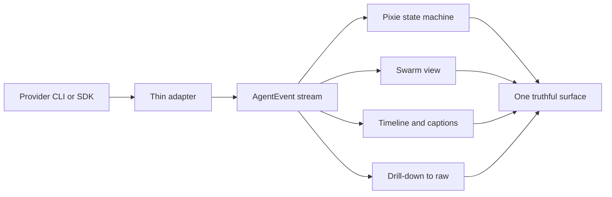

# VISION

vsclaude is a cozy, beautiful, purpose-built IDE where a developer watches their AI coding agent work through living pixel-art animation instead of scrolling walls of text. A pixel-art companion named Pixie acts out exactly what the agent is doing in real time, bound to real events, never decorative theater. vsclaude runs Claude Code as a first-class citizen and treats Codex, Gemini, and local models (Ollama) as equal participants behind one unified experience. Bring your own key. The thesis of this document is simple and load-bearing for every other spec in this repository: an agent that thinks, reads, writes, runs, and spawns helpers is a living process, and a living process deserves a living window, not a transcript. This is the north star. Everything downstream of this file (architecture, schema, motion, design system) exists to serve it.

Tagline: **Claude Code, in motion. For any model.**

## Table of contents

- [The north star](#the-north-star)
- [The problem with text-wall agent UIs](#the-problem-with-text-wall-agent-uis)
- [The "Claude Code in motion" thesis](#the-claude-code-in-motion-thesis)
- [The three sacred motion rules](#the-three-sacred-motion-rules)
- [Right versus wrong, by example](#right-versus-wrong-by-example)
- [Who it is for](#who-it-is-for)
- [What success looks like](#what-success-looks-like)
- [The five-minute first-run promise](#the-five-minute-first-run-promise)
- [Non-goals](#non-goals)
- [Product pillars](#product-pillars)
- [How this vision constrains the build](#how-this-vision-constrains-the-build)

## The north star

> A non-technical person should be able to glance at vsclaude and understand what the AI is doing right now, and a senior engineer should be able to drill from that glance into the exact diff, command, or raw tool output in one click.

That single sentence is the product. Hold both halves at once. If we sacrifice the glance, we are just another terminal. If we sacrifice the drill-down, we are a toy. The entire architecture, captured in the frozen [AgentEvent](../packages/contracts/src/agent-event.ts) contract and detailed in [Architecture](./ARCHITECTURE.md), exists to keep both promises true at the same time.

The north star is not "make the agent prettier." It is "make the agent legible." Legibility is the currency. Pixie is the interface to legibility, not the point of it.

## The problem with text-wall agent UIs

Today's agent experiences, including the default Claude Code CLI, stream a vertical river of text: tool calls, JSON inputs, diffs, command output, thinking tokens, and status lines all interleaved in one scrollback. This works for a power user babysitting a single short task. It fails everywhere else, and it fails in specific, diagnosable ways.

| Failure mode | What the user experiences | Root cause |
| --- | --- | --- |
| Loss of "where are we" | User scrolls back and forth to find current state | The transcript has no persistent present tense, only a past |
| Cognitive overload | Walls of JSON and diff hunks blur together | Everything is rendered at the same visual weight |
| Parallelism is invisible | Sub-agents spawned by the Task tool interleave illegibly | A linear log cannot represent a tree of concurrent work |
| No ambient awareness | User must stare at the screen or miss the moment | Text demands focused reading, not peripheral vision |
| Excludes non-engineers | A founder or designer watching over a shoulder is lost | The medium assumes fluency in tool-call syntax |
| Fear and distrust | "Is it stuck? Is it about to delete my repo?" | State and intent are buried, not surfaced |

The deepest problem is the last one. Agents are trusted with real filesystems, real shells, and real credentials. A medium that hides intent breeds either reckless approval or paralysis. People either rubber-stamp permission prompts they did not read, or they hover anxiously over a log they cannot parse. Neither is acceptable for software that runs `rm`, edits source, and pushes commits.

A transcript is a record. What a person supervising an autonomous process needs is a **dashboard with a heartbeat**. vsclaude provides the heartbeat.

## The "Claude Code in motion" thesis

Claude Code already emits a precise, structured stream of everything it does. Run it with `claude -p --output-format stream-json --verbose` or drive it through the Claude Agent SDK, and every block, tool call, file edit, command, and sub-agent spawn arrives as a discrete, machine-readable event. The raw material for a living interface already exists. Nobody has built the window for it.

The thesis: **the structured event stream is not debug output, it is an animation script.** Each event is a beat. Map each beat to a visible action by a character bound to the real underlying data, and the agent's work becomes something you watch unfold, not something you excavate from a log.

```
 stream-json events            AgentEvent (normalized)         Pixie + views
┌──────────────────┐          ┌──────────────────────┐       ┌──────────────────┐
│ thinking block   │  adapter │ type: 'thinking'     │  bind │ Pixie: thinking  │
│ tool_use: Edit   │ ───────▶ │ type: 'file_edit'    │ ────▶ │ Pixie: typing    │
│ tool_use: Bash   │          │ type: 'command_run'  │       │ Pixie: running   │
│ tool_use: Task   │          │ type: 'subagent_...' │       │ Swarm: new node  │
└──────────────────┘          └──────────────────────┘       └──────────────────┘
```

Crucially, this is not Claude-only. The unifying idea of the whole product is **one event schema**. Every provider, Claude Code, Codex, Gemini, and Ollama, normalizes into a single `AgentEvent` stream through a thin per-provider adapter. The visual layer consumes only `AgentEvent` and never touches a provider directly. That is what makes the tagline literally true: Claude Code in motion, and the exact same motion for any model your key can reach.

```ts
// Everything visual subscribes here and nowhere else.
// Adapters are the only code that knows a provider exists.
function bindToPixie(event: AgentEvent): PixieDirective {
  switch (event.type) {
    case 'thinking':          return { state: 'thinking',  mood: 'focused' };
    case 'file_read':         return { state: 'reading' };
    case 'file_edit':
    case 'file_create':       return { state: 'typing',    intensity: 'high' };
    case 'command_run':       return { state: 'running' };
    case 'search':            return { state: 'searching' };
    case 'web_fetch':         return { state: 'web' };
    case 'subagent_spawned':  return { state: 'spawning',  mood: 'excited' };
    case 'permission_request':return { state: 'waiting' };
    case 'error':             return { state: 'debugging', mood: 'struggling' };
    case 'complete':          return { state: 'success',   mood: 'excited' };
    default:                  return { state: 'idle' };
  }
}
```

The Task tool spawning a sub-agent becomes a `subagent_spawned` event, and the swarm view comes alive automatically. We do not write bespoke "swarm logic." We render the tree the events already describe. This is the leverage of the schema: build the animation system once, and every provider and every future capability flows through it for free.

## The three sacred motion rules

These three rules are inviolable. They appear in every motion and design spec, and a change that breaks any of them is a bug regardless of how good it looks.

### Rule 1: Every animation is bound to a real event

Nothing is decorative theater. If Pixie types, the agent is writing a file, and you can see which one. There is no "ambient busy loop" that plays while nothing happens, no fake progress bar, no animation that fires on a timer rather than on an `AgentEvent`. The idle and sleeping states are themselves bound to a real signal: the absence of events for a measured duration.

```ts
// CORRECT: animation is a pure function of the event stream.
pixie.setState(directiveFor(latestEvent));

// FORBIDDEN: animation invented to look busy.
setInterval(() => pixie.setState('typing'), 800); // lies to the user
```

### Rule 2: Meaning is always preserved and always recoverable

One click always drills into the exact underlying detail: tool name, inputs, diff, command, raw output. Animation is a lossless lens, not a lossy summary. Every Pixie action and every swarm node carries the full `AgentEvent`, including its `raw` payload, so the drill-down is always available and always exact. We never paraphrase away the truth; we present it at a glance and keep the truth one click below.

### Rule 3: A non-technical person must be able to follow along via plain-language captions

Every event carries a `caption`: a short, human sentence describing what just happened, written for someone who has never seen a tool call. "Reading the login page" beats `tool_use: Read { file_path: "src/auth/login.tsx" }`. The caption is the top layer; the raw event is the bottom layer; both are always present.

```
Layer 3  caption        "Pixie is editing the login page."        ← anyone
Layer 2  summary        file_edit · src/auth/login.tsx · +12 -3   ← most users
Layer 1  raw event      full AgentEvent incl. diff and raw JSON   ← engineers
```

## Right versus wrong, by example

| Scenario | Wrong (violates a rule) | Right (honors the rules) |
| --- | --- | --- |
| Agent is editing a file | Pixie types generically with no file named; rule 1 and 2 broken | Pixie enters `typing`, caption reads "Editing `login.tsx`", click reveals the live diff |
| Agent is thinking | A spinner with the word "Loading"; rule 3 broken, no meaning | Pixie enters `thinking` with a `focused` mood, caption "Planning the next steps" |
| Build is running for 40s | A looping sparkle that ignores actual progress; rule 1 broken | Pixie enters `building`, intensity tracks output volume, click shows live command output |
| A sub-agent is spawned | Buried as one more line in a scrolling log; parallelism invisible | A new node appears in the swarm, linked to its parent via `parentAgentId`, with its own Pixie |
| An error occurs mid-command | Red text flashes and scrolls away; rule 2 broken | Pixie shifts to `debugging` then `confused`, caption names the failure, click shows stderr |
| Permission requested | An OK button with no context; rule 3 broken | Pixie enters `waiting`, caption states exactly what is being requested, full input shown |
| Nothing is happening | A constant idle wiggle that implies work; rule 1 broken | Pixie genuinely `idle`, then `sleeping` after a measured quiet period, because no events arrived |
| Token usage updates | Hidden, or shown as raw integers with no framing | A `token_usage` event updates an ambient meter, drillable to exact counts and cost |

The pattern is consistent. Wrong invents motion or hides meaning. Right derives motion from a real event and keeps the meaning one click away.

## Who it is for

vsclaude serves two people at once, and the design must never optimize one into the ground for the other.

**The developer (the driver).** A working engineer running Claude Code, Codex, Gemini, or a local Ollama model on a real repository. They want speed, control, exact diffs, real terminal output, keyboard-first flow, and the ability to drop to raw at any moment. For them, Pixie is ambient peripheral awareness that frees their focus for review and direction. They live in Monaco and xterm.js; Pixie tells them where to look.

**The watcher (over the shoulder).** A founder, designer, product manager, teammate on a call, or a developer's curious partner. They are not reading JSON. They follow the captioned story and the character's mood. For them, Pixie is the entire interface, and the plain-language caption is the contract. When a non-technical person can narrate aloud what the agent is doing, rule 3 is satisfied.

The same screen serves both because the layers are stacked, not segregated. The watcher reads the top layer; the driver drills to the bottom. We do not ship a "simple mode" and a "pro mode" that diverge. One truthful surface, depth on demand.

## What success looks like

Success is measured, not vibed. These are the signals that the north star is being hit.

| Dimension | Success signal |
| --- | --- |
| Legibility | A non-engineer narrates the agent's current action correctly without help |
| Recoverability | Any visible state reaches its exact raw `AgentEvent` in a single click, every time |
| Truthfulness | Zero animations fire without a backing event; audited in tests and Storybook |
| Provider parity | Claude Code, Codex, Gemini, and Ollama all drive identical visuals via adapters |
| Parallelism | A multi-sub-agent run is readable as a tree, not a scrambled log |
| Performance | Pixie and the swarm hold 60fps on a mid-range laptop during a busy run |
| Trust | Permission requests are understood before approval, reducing blind rubber-stamping |
| First-run | A new user reaches a live, animated session in under five minutes (see below) |
| Coziness | Users leave vsclaude open as ambient company, not just as a task tool |

A concrete bar for "truthful by construction": every Rive state and sprite-fallback animation in the system has a Storybook story driven by a real or replayed `AgentEvent`, and a test asserts there is no code path that sets a Pixie state without an originating event.

## The five-minute first-run promise

A new user, starting from a fresh download, reaches a living animated session in under five minutes. This is a hard product commitment, and it shapes onboarding, error handling, and defaults across the app.

```
0:00  Launch vsclaude. A warm, cozy first-run screen. Pixie waves (greeting state).
0:30  Pick a provider (Claude Code default). Paste an API key.
      Key is stored in the OS keychain via the Rust core, never in plaintext config.
1:30  Open a folder. The Rust core starts watching the filesystem.
2:00  Type a first prompt, for example "explain this project and suggest one improvement."
2:15  The adapter launches the agent in streaming mode. Events begin to flow.
2:20  Pixie shifts from greeting to thinking to reading. Captions narrate each step.
4:00  The agent proposes an edit. Pixie types; the diff is one click away.
5:00  The run completes. Pixie hits the success state. The user has watched, not read.
```

What the promise demands of the build:

- **No build step for the user.** vsclaude ships as a signed Tauri binary. The Rust toolchain is a contributor prerequisite, never an end-user one.
- **Keychain-first secrets.** The bring-your-own-key flow writes to the OS keychain through the Rust core on the very first screen. No `.env` editing.
- **Sane defaults.** Claude Code preselected, streaming on, sound off, a sensible safe-by-default permission posture.
- **Graceful failure inside the window.** A bad key, a missing binary, or a refused permission surfaces as a calm Pixie state with a plain caption and a fix, never a raw stack trace dumped to a console.
- **Instant first motion.** The greeting plays before any network call, so the app feels alive within the first second.

If a first run takes longer than five minutes or ever shows a wall of text before it shows a living Pixie, we have failed the promise.

## Non-goals

Being explicit about what vsclaude is not protects the north star from scope creep.

- **Not a general-purpose IDE replacement.** We embed Monaco and a real terminal, but vsclaude is purpose-built around watching agents. It is not trying to out-VS-Code VS Code for hand-editing large codebases.
- **Not a model host or trainer.** We do not run inference ourselves, fine-tune, or serve models. We orchestrate the user's chosen provider with the user's own key. Ollama is a local provider, not something we bundle.
- **Not a hosted cloud service.** vsclaude is a local desktop application. No accounts, no telemetry-by-default, no server-side execution of the user's code. Bring your own key means your key, your machine, your repo.
- **Not a chat app with a mascot bolted on.** Pixie is not a decorative assistant or a personality chatbot. Pixie is a strict visualization of real events. If a feature would make Pixie act without an event, it is out of scope by rule 1.
- **Not a no-code or low-code builder.** The audience includes non-technical watchers, but the product drives real coding agents on real code. The watcher observes; they do not get a simplified app-builder.
- **Not a single-provider tool.** We will never special-case Claude to the point where another provider becomes a second-class citizen. The schema is the equalizer, and that is deliberate.
- **Not sound-first.** Tone.js is optional and off by default. Audio is an accent, never a requirement for understanding.

## Product pillars

Every decision in this repository ladders up to these seven pillars, in priority order.

1. **Usability above all.** If a choice helps the demo but hurts daily use, we do not ship it.
2. **Alive and cozy.** The app should feel like warm company, a place you want to leave open.
3. **Truthful by construction.** The architecture makes lying hard. Animation derives from events; meaning is always recoverable.
4. **Any model, your key.** One experience across Claude Code, Codex, Gemini, and Ollama, with secrets held in the OS keychain.
5. **Fast and light.** 60fps motion, a small footprint, a Rust core for the heavy lifting (process, PTY, filesystem, IPC).
6. **Open and extensible.** A new provider is a new adapter that emits `AgentEvent`. Nothing else changes.
7. **Accessible.** Captions, keyboard navigation, reduced-motion respect, and color contrast are requirements, not polish.

## How this vision constrains the build

This document is a contract, not a mood board. Concretely, it binds the rest of the system as follows.

- The **frozen [AgentEvent](../packages/contracts/src/agent-event.ts) schema** is the only thing the visual layer may consume. Adapters for each provider are the only code aware of provider specifics. See [Architecture](./ARCHITECTURE.md).
- The **Pixie state machine** (Rive primary, sprite-sheet fallback) maps states one-to-one onto event types and moods, with `intensity` reflecting how much is happening. Every state ships with idle, entry, and exit blends and a Storybook story.
- The **drill-down requirement** (rule 2) means every rendered element retains its source `AgentEvent`, including `raw`. No view may discard provenance.
- The **caption requirement** (rule 3) means every event-producing path supplies a plain-language `caption`, validated as part of the adapter contract.
- The **five-minute promise** means onboarding, keychain storage in the Rust core, and in-window error handling are first-class features, not afterthoughts.



When in doubt, return here. The animation must be bound to a real event. The meaning must be recoverable in one click. A non-technical person must be able to follow along. Hold those three, serve both the driver and the watcher, and ship the heartbeat.
